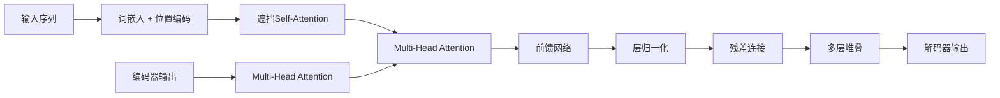
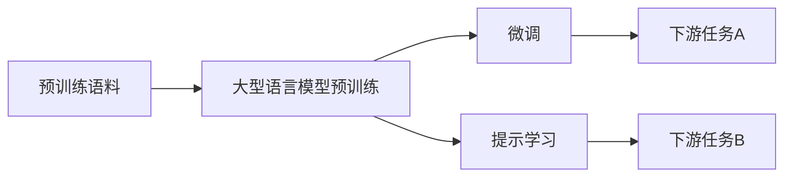

# 大语言模型原理基础与前沿 扩大尺度法则

## 1.背景介绍

### 1.1 人工智能的发展历程

人工智能(Artificial Intelligence, AI)是当代科技发展的重要领域,自20世纪50年代问世以来,已经经历了数个重要的发展阶段。早期的人工智能系统主要基于符号主义和逻辑规则,如专家系统、决策树等。20世纪90年代,机器学习算法开始兴起,如支持向量机、决策树等,能从数据中自动学习模式。

### 1.2 深度学习的兴起

21世纪初,benefiting from大量数据、强大计算能力和优化算法的进步,深度学习(Deep Learning)技术开始突飞猛进。深度学习能自动从原始数据(如图像、文本等)中学习多层次特征表示,在计算机视觉、自然语言处理等领域取得突破性进展。

### 1.3 大语言模型的崛起  

作为深度学习在自然语言处理领域的杰出代表,大型语言模型(Large Language Model,LLM)通过在大规模文本语料上预训练获得通用的语言表示能力,可用于多种下游任务,如机器翻译、问答、文本生成等,展现出强大的泛化性能。

### 1.4 扩大尺度法则的提出

随着模型规模和训练数据的不断扩大,大语言模型的性能也不断提升。2020年,OpenAI提出"扩大尺度法则"(Scale Law),指出在训练数据和模型参数规模足够大时,模型性能将随着计算规模的增长呈现规律性的提升。这一发现为未来发展更大规模的语言模型指明了方向。

## 2.核心概念与联系

### 2.1 语言模型

语言模型(Language Model)是自然语言处理的基础,旨在学习文本序列的概率分布,即给定前文,预测下一个词的概率:

$$P(w_t|w_1,w_2,...,w_{t-1})$$

其中$w_t$表示第t个词。统计语言模型基于n-gram统计,而神经网络语言模型则利用神经网络从上下文中捕获长程依赖关系。

### 2.2 自回归语言模型

自回归语言模型(Autoregressive Language Model)是一种常用的神经网络语言模型,通过最大化下一个词的条件概率来训练模型参数:

$$\max_\theta \sum_{t=1}^T \log P_\theta(w_t|w_1,w_2,...,w_{t-1})$$

其中$\theta$为模型参数。自回归模型每次只预测一个词,计算复杂度较高。

### 2.3 掩码语言模型

掩码语言模型(Masked Language Model)是Transformer等大型语言模型采用的训练目标,通过随机掩码部分词,并最大化掩码词的条件概率:

$$\max_\theta \sum_{t\in M} \log P_\theta(w_t|w_{\backslash M})$$

其中M为掩码词位置集合。这种训练方式允许并行计算,更加高效。

### 2.4 预训练与微调

大型语言模型通常采用两阶段训练策略:

1. **预训练(Pre-training)**: 在大规模无监督文本数据上训练模型,获得通用的语言表示能力。
2. **微调(Fine-tuning)**: 在有监督的下游任务数据上进一步训练模型,使其适应特定的任务。

这种先获取通用知识,再转移到特定任务的策略,提高了模型的泛化性和数据利用效率。

### 2.5 多任务学习

除了在下游任务上微调外,大型语言模型还可以在预训练阶段融入多种辅助任务的监督信号,如机器翻译、文本摘要等,进行多任务学习(Multi-task Learning)。这种策略有助于模型学习更加通用和鲁棒的语言表示。

### 2.6 模型规模与性能

大型语言模型的性能很大程度上依赖于模型的规模,包括参数数量和训练数据规模。OpenAI的GPT-3模型达到1750亿参数,训练语料超过4500亿词,展现出令人惊叹的泛化能力。

### 2.7 扩大尺度法则

扩大尺度法则(Scale Law)认为,当训练数据和模型参数的规模足够大时,模型性能将随着计算规模的增长呈现规律性的提升。具体来说,性能与计算量(模型参数数×训练数据量)的比值成正比。这一发现为发展更大规模的语言模型提供了理论基础。

## 3.核心算法原理具体操作步骤

### 3.1 Transformer模型

Transformer是当前大型语言模型的核心架构,包含编码器(Encoder)和解码器(Decoder)两个主要部分。

#### 3.1.1 编码器(Encoder)

编码器将输入序列映射为序列表示,主要由多层Self-Attention和前馈神经网络组成:

1. **词嵌入(Word Embedding)**: 将输入词映射为词向量表示。
2. **位置编码(Positional Encoding)**: 为每个词位置添加位置信息。
3. **多头Self-Attention**: 计算序列中每个词与其他词的注意力权重,捕获长程依赖关系。
4. **前馈网络(Feed-Forward Network)**: 对每个位置的表示进行非线性变换。
5. **层归一化(Layer Normalization)**: 加速收敛并防止梯度消失/爆炸。
6. **残差连接(Residual Connection)**: 将输入直接传递给下一层,有助于训练深层网络。

#### 3.1.2 解码器(Decoder) 

解码器用于序列生成任务,除了与编码器类似的结构外,还包含与编码器输出的Multi-Head Attention:

1. **遮挡Self-Attention**: 防止attending未来位置的信息。
2. **Multi-Head Attention with Encoder**: 与编码器输出计算注意力权重。

#### 3.1.3 Self-Attention机制

Self-Attention是Transformer的核心,通过计算Query与Key的点积,并根据Value对其加权求和,捕获序列内元素之间的关系:

$$\text{Attention}(Q,K,V)=\text{softmax}(\frac{QK^T}{\sqrt{d_k}})V$$

其中$Q$、$K$、$V$分别为Query、Key和Value。通过Multi-Head Attention可以关注不同的子空间。

### 3.2 预训练策略

大型语言模型的预训练通常采用以下策略:

#### 3.2.1 掩码语言模型(Masked LM)

随机掩码部分输入词,并最大化掩码词的条件概率。这种方式支持高效的并行计算。

#### 3.2.2 次序预测(Next Sentence Prediction)

判断两个句子是否相邻,有助于模型学习捕获上下文关系。

#### 3.2.3 替换词语言模型(Replaced Token Detection)

随机替换部分词,模型需要预测哪些词被替换。这种方式可以学习更丰富的上下文信息。

#### 3.2.4 跨视图编码器(Cross-View Encoder)

将相同文本的不同视图(如原文和扰动文本)映射到相同的表示空间,提高鲁棒性。

#### 3.2.5 生成式预训练(Generative Pre-training)

在标准语言模型目标的基础上,引入额外的生成式任务,如文本生成、摘要等,以学习更丰富的语义信息。

### 3.3 微调与提示学习

在下游任务上,大型语言模型可以采取以下策略:

#### 3.3.1 微调(Fine-tuning)

在下游任务数据上继续训练部分或全部模型参数,以适应特定任务。

#### 3.3.2 提示学习(Prompt Learning)

通过设计合适的文本提示,将下游任务转化为掩码语言模型问题,无需更新参数。这种方式高效且可解释性强。

## 4.数学模型和公式详细讲解举例说明

### 4.1 Transformer中的Self-Attention

Self-Attention是Transformer的核心机制,允许模型直接建模输入序列内元素之间的关系。给定Query $Q$、Key $K$和Value $V$,Self-Attention的计算过程为:

$$\begin{aligned}
\text{Attention}(Q,K,V) &= \text{softmax}(\frac{QK^T}{\sqrt{d_k}})V\\
&= \sum_{j=1}^n \alpha_{ij}v_j
\end{aligned}$$

其中, $\alpha_{ij} = \frac{\exp(q_i^Tk_j/\sqrt{d_k})}{\sum_{l=1}^n\exp(q_i^Tk_l/\sqrt{d_k})}$ 为注意力权重。

该公式可分为三个步骤理解:

1. 计算Query $q_i$与所有Key $k_j$的点积相似度: $q_i^Tk_j$。
2. 对相似度进行缩放: $q_i^Tk_j/\sqrt{d_k}$,防止过大的点积导致softmax饱和。
3. 对缩放的点积进行softmax,得到注意力权重 $\alpha_{ij}$。
4. 将注意力权重与Value $v_j$加权求和,得到注意力表示。

通过Self-Attention,模型可以自适应地为每个Query位置分配不同的注意力权重,捕获长程依赖关系。

### 4.2 掩码语言模型目标

掩码语言模型(Masked LM)是大型语言模型预训练的主要目标之一。给定输入序列 $\boldsymbol{x} = (x_1, x_2, \ldots, x_n)$,我们随机掩码部分词 $\boldsymbol{x}_\mathcal{M}$,目标是最大化掩码词的条件概率:

$$\mathcal{L}_\text{MLM} = -\mathbb{E}_{\boldsymbol{x},\mathcal{M}}\left[\sum_{i \in \mathcal{M}}\log P(x_i|\boldsymbol{x}_{\backslash\mathcal{M}})\right]$$

其中 $\mathcal{M}$ 为掩码词位置集合, $\boldsymbol{x}_{\backslash\mathcal{M}}$ 为未掩码词。这种训练方式允许并行计算,更加高效。

在实践中,通常不是直接预测词 $x_i$,而是预测其在词表 $\mathcal{V}$ 中的索引:

$$P(x_i|\boldsymbol{x}_{\backslash\mathcal{M}}) = \text{softmax}(\boldsymbol{h}_i^\top \boldsymbol{W}_e)$$

其中 $\boldsymbol{h}_i$ 为掩码位置 $i$ 的隐状态表示, $\boldsymbol{W}_e \in \mathbb{R}^{d \times |\mathcal{V}|}$ 为词嵌入矩阵。

### 4.3 多任务学习目标

除了掩码语言模型目标,大型语言模型在预训练阶段还可以融入其他监督信号,进行多任务学习。常见的辅助任务包括:

- **机器翻译(Machine Translation)**: 给定源语言句子 $\boldsymbol{x}$ 和目标语言句子 $\boldsymbol{y}$,最大化条件概率 $P(\boldsymbol{y}|\boldsymbol{x})$。
- **句子预测(Sentence Prediction)**: 判断两个句子是否相邻/等价,通过二分类目标 $P(y|\boldsymbol{x}_1,\boldsymbol{x}_2)$ 进行训练。
- **词语预测(Token Prediction)**: 预测输入序列中被替换/遮蔽的词语。

多任务学习的目标函数为各个{"msg_type":"generate_answer_finish","data":"","from_module":null,"from_unit":null}