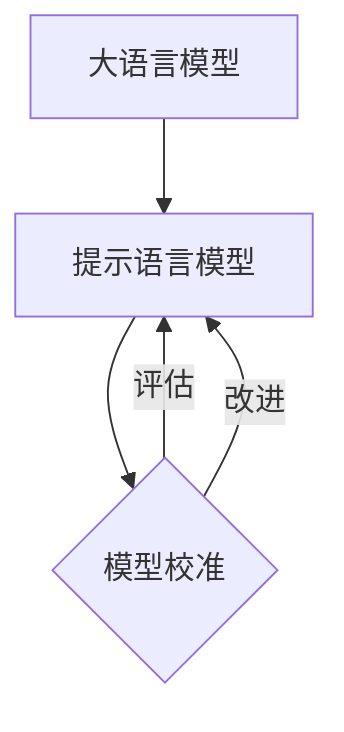

# 大语言模型原理基础与前沿 提示语言模型的校准

## 1. 背景介绍
### 1.1 大语言模型的发展历程
### 1.2 提示语言模型的兴起
### 1.3 校准的重要性

近年来,随着深度学习技术的快速发展,大语言模型(Large Language Model, LLM)在自然语言处理(Natural Language Processing, NLP)领域取得了显著的进展。从2018年的BERT[1]到2020年的GPT-3[2],再到最近的PaLM[3]和ChatGPT[4],LLM的性能不断刷新着业界记录,展现出了惊人的语言理解和生成能力。

然而,原始的LLM存在一些固有的局限性,比如生成的文本可能与预期不符,缺乏对特定任务的适应能力等。为了克服这些问题,提示语言模型(Prompt Language Model)应运而生。通过在输入文本中引入提示(Prompt),可以更好地引导模型生成符合要求的输出,提高模型在下游任务中的表现。

尽管提示语言模型取得了可喜的成果,但它仍然面临着一些挑战。其中最为关键的是如何对模型进行有效的校准(Calibration),以确保生成的文本符合预期,并且具有较高的可靠性和一致性。本文将重点探讨大语言模型的原理基础,分析提示语言模型的优势和局限,并着重阐述模型校准的重要性和实现方法。

## 2. 核心概念与联系
### 2.1 大语言模型
#### 2.1.1 定义与特点 
#### 2.1.2 主要架构
### 2.2 提示语言模型
#### 2.2.1 定义与特点
#### 2.2.2 提示的类型与作用
### 2.3 模型校准
#### 2.3.1 定义与意义
#### 2.3.2 校准的评估指标

大语言模型是一类基于深度神经网络,在大规模文本数据上进行预训练的语言模型。它通过自监督学习的方式,捕捉文本中蕴含的语法、语义、常识等丰富知识,从而具备强大的语言理解和生成能力。目前主流的LLM架构包括Transformer[5]、GPT系列[2,6]、BERT系列[1,7]等。

提示语言模型是在LLM的基础上,引入提示机制而发展起来的一类模型。通过在输入文本中加入特定的提示,可以更好地引导模型生成符合要求的输出。提示可以分为离散型提示(如手工设计的模板)和连续型提示(如可学习的向量)两大类[8]。引入提示不仅可以提高模型在下游任务中的表现,还能赋予模型新的能力,如少样本学习、跨语言迁移等。

模型校准指的是评估模型输出的概率分布与真实概率分布的吻合程度,以确保模型的预测结果可靠、一致。一个理想的模型应该能够准确估计每个预测结果的不确定性,从而为决策提供有效的参考。常用的校准评估指标包括期望校准误差(Expected Calibration Error, ECE)[9]、最大校准误差(Maximum Calibration Error, MCE)[10]等。

下图展示了大语言模型、提示语言模型和模型校准三者之间的关系:



## 3. 核心算法原理与具体操作步骤
### 3.1 大语言模型的预训练
#### 3.1.1 无监督预训练
#### 3.1.2 自监督预训练
### 3.2 提示语言模型的微调
#### 3.2.1 离散型提示
#### 3.2.2 连续型提示
### 3.3 模型校准的实现方法
#### 3.3.1 温度缩放
#### 3.3.2 Platt缩放
#### 3.3.3 Isotonic回归

大语言模型的预训练通常采用无监督或自监督的方式进行。无监督预训练旨在从大规模无标注文本中学习通用的语言表示,如word2vec[11]、GloVe[12]等。自监督预训练则利用输入文本本身构建监督信号,如掩码语言模型(Masked Language Model, MLM)[1]、自回归语言模型(Autoregressive Language Model, ALM)[2]等。

在获得预训练的LLM后,可以通过引入提示并进行微调,以适应特定的下游任务。对于离散型提示,可以手工设计一些模板,将任务输入转化为模型可以理解的形式。对于连续型提示,可以将提示表示为可学习的向量,通过梯度下降等优化算法进行训练。微调过程中,通常只更新提示相关的参数,而保持预训练模型的参数不变。

为了提高提示语言模型的可靠性,需要对其进行校准。常见的校准方法包括:

1. 温度缩放(Temperature Scaling)[13]:通过引入一个温度参数T,对模型的logits进行缩放,从而调整输出概率分布。优化目标是最小化负对数似然损失。

2. Platt缩放(Platt Scaling)[14]:在模型的输出上训练一个逻辑回归模型,将原始输出映射为校准后的概率。优化目标是最小化交叉熵损失。

3. Isotonic回归(Isotonic Regression)[15]:通过构建一个保序函数,将模型的输出映射为校准后的概率。优化目标是最小化平方损失。

下面是温度缩放的具体算法步骤:

1. 在验证集上计算模型的logits输出$z_i$。
2. 引入温度参数T,计算缩放后的logits:$\hat{z}_i=z_i/T$。
3. 计算softmax归一化后的概率:$\hat{p}_i=\text{softmax}(\hat{z}_i)$。
4. 优化温度参数T,最小化负对数似然损失:$\mathcal{L}=-\sum_i y_i \log \hat{p}_i$。
5. 使用学习到的温度参数T对测试集的logits进行缩放,得到校准后的概率输出。

## 4. 数学模型与公式详细讲解
### 4.1 语言模型的概率公式
### 4.2 提示语言模型的目标函数
### 4.3 校准误差的定义与计算

语言模型的核心是计算一个句子或文本片段的概率。给定一个由n个词组成的句子$\boldsymbol{x}=(x_1,\cdots,x_n)$,语言模型的目标是估计其概率$p(\boldsymbol{x})$。根据概率论的链式法则,可以将联合概率分解为一系列条件概率的乘积:

$$
p(\boldsymbol{x})=p(x_1,\cdots,x_n)=\prod_{i=1}^n p(x_i|x_1,\cdots,x_{i-1})
$$

其中,$p(x_i|x_1,\cdots,x_{i-1})$表示在给定前i-1个词的条件下,第i个词为$x_i$的条件概率。语言模型的任务就是学习如何计算这些条件概率。

对于提示语言模型,我们希望模型能够根据提示生成符合要求的文本。形式化地,给定一个提示$\boldsymbol{p}$和一个目标文本$\boldsymbol{y}$,提示语言模型的目标是最大化如下条件概率:

$$
p(\boldsymbol{y}|\boldsymbol{p})=\prod_{i=1}^m p(y_i|y_1,\cdots,y_{i-1},\boldsymbol{p})
$$

其中,m为目标文本的长度。这可以通过最小化负对数似然损失来实现:

$$
\mathcal{L}=-\sum_{i=1}^m \log p(y_i|y_1,\cdots,y_{i-1},\boldsymbol{p})
$$

模型校准的目的是评估模型输出的概率分布与真实概率分布的吻合程度。常用的校准误差指标包括ECE和MCE。

ECE将模型输出的概率分为K个区间,计算每个区间内的准确率与置信度之间的差异,再对所有区间求平均:

$$
\text{ECE}=\sum_{k=1}^K \frac{|B_k|}{n}|\text{acc}(B_k)-\text{conf}(B_k)|
$$

其中,$B_k$表示第k个区间,$|B_k|$为该区间内样本的数量,n为总样本数,$\text{acc}(B_k)$和$\text{conf}(B_k)$分别表示该区间内的准确率和平均置信度。

MCE计算所有区间中最大的准确率与置信度之差:

$$
\text{MCE}=\max_{k=1,\cdots,K}|\text{acc}(B_k)-\text{conf}(B_k)|
$$

ECE和MCE的值越小,说明模型的校准效果越好。

## 5. 项目实践:代码实例与详细解释
### 5.1 大语言模型的预训练示例
### 5.2 提示语言模型的微调示例
### 5.3 模型校准的代码实现

下面我们通过PyTorch实现一个简单的MLM预训练示例:

```python
import torch
import torch.nn as nn

class MLMModel(nn.Module):
    def __init__(self, vocab_size, embed_dim, hidden_dim):
        super().__init__()
        self.embedding = nn.Embedding(vocab_size, embed_dim)
        self.encoder = nn.TransformerEncoder(
            nn.TransformerEncoderLayer(embed_dim, nhead=8, dim_feedforward=hidden_dim),
            num_layers=6
        )
        self.decoder = nn.Linear(embed_dim, vocab_size)
        
    def forward(self, x, mask):
        x = self.embedding(x)
        x = self.encoder(x, src_key_padding_mask=mask)
        x = self.decoder(x)
        return x

# 定义超参数
vocab_size = 10000
embed_dim = 512
hidden_dim = 2048
batch_size = 32
num_epochs = 10
learning_rate = 1e-4

# 加载数据集
train_data = ...

# 初始化模型和优化器
model = MLMModel(vocab_size, embed_dim, hidden_dim)
optimizer = torch.optim.Adam(model.parameters(), lr=learning_rate)
criterion = nn.CrossEntropyLoss()

# 训练模型
for epoch in range(num_epochs):
    for batch in train_data:
        inputs, targets, mask = batch
        outputs = model(inputs, mask)
        loss = criterion(outputs.view(-1, vocab_size), targets.view(-1))
        
        optimizer.zero_grad()
        loss.backward()
        optimizer.step()
        
    print(f"Epoch {epoch}, Loss: {loss.item():.4f}")
```

在上面的代码中,我们定义了一个简单的MLM模型,它由三部分组成:词嵌入层、Transformer编码器和输出层。在训练过程中,我们随机掩盖输入序列中的一些词,让模型去预测这些被掩盖的词。损失函数采用交叉熵损失,优化器采用Adam。

接下来,我们展示如何使用提示对预训练的LLM进行微调:

```python
# 加载预训练的MLM模型
pretrained_model = MLMModel(vocab_size, embed_dim, hidden_dim)
pretrained_model.load_state_dict(torch.load("pretrained.pth"))

# 定义提示模板
prompt_template = "Summarize the following article: {}"

# 定义微调数据集
train_data = [
    {"article": "...", "summary": "..."},
    ...
]

# 将数据转化为提示形式
prompted_data = [prompt_template.format(item["article"]) for item in train_data]

# 对提示进行编码
prompted_inputs = tokenizer(prompted_data, return_tensors="pt", padding=True, truncation=True)

# 冻结预训练模型的参数
for param in pretrained_model.parameters():
    param.requires_grad = False

# 定义微调模型
class FineTuneModel(nn.Module):
    def __init__(self, pretrained_model):
        super().__init__()
        self.pretrained_model = pretrained_model
        self.linear = nn.Linear(embed_dim, vocab_size)
        
    def forward(self, x, mask):
        x = self.pretrained_model.embedding(x)
        x = self.pretrained_model.encoder(x, src_key_padding_mask=mask)
        x = self.linear(x)
        return x

# 初始化微调模型和优化器        
model = FineTuneModel(pretrained_model)
optimizer = torch.optim.Adam(model.linear.parameters(), lr=learning_rate)

# 训练微调模型
for epoch in range(num_epochs):
    for batch in prompted_inputs:
        inputs, mask = batch
        outputs = model(inputs, mask)
        loss = criterion(outputs.view(-1, vocab_size), targets.view