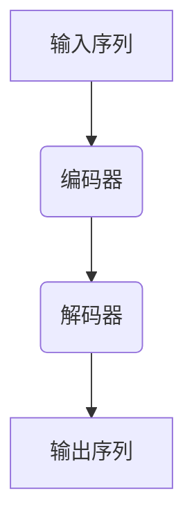

# 大语言模型原理基础与前沿 有害性

## 1.背景介绍

### 1.1 大语言模型的兴起

近年来,随着深度学习技术的不断发展和计算能力的提升,大型语言模型(Large Language Models, LLMs)在自然语言处理领域取得了突破性进展。这些模型通过在海量文本数据上进行预训练,学习到了丰富的语言知识和上下文信息,从而在下游任务中表现出令人惊叹的性能。

代表性的大语言模型包括 GPT (Generative Pre-trained Transformer)、BERT (Bidirectional Encoder Representations from Transformers)、XLNet、RoBERTa、ALBERT 等。其中,GPT 系列模型由 OpenAI 提出,具有强大的文本生成能力;BERT 系列模型则由谷歌提出,擅长于文本理解和表示学习。这些模型通过 Transformer 结构和自注意力机制,能够有效捕捉长距离依赖关系,从而在机器翻译、问答系统、文本摘要等任务中表现卓越。

### 1.2 大语言模型的应用前景

大语言模型的出现为人工智能领域带来了新的机遇和挑战。它们不仅在学术界引起了广泛关注,同时也吸引了众多科技公司和初创企业的投资。以 GPT-3 为代表的大型语言模型,展现出了惊人的语言生成和理解能力,可以用于内容创作、问答系统、代码生成等多个领域。

然而,大语言模型也面临着一些挑战,如训练成本高昂、模型偏差、隐私和安全风险等。此外,它们在某些场景下还可能产生有害的输出,如散布虚假信息、传播仇恨言论等,这对社会造成了潜在威胁。因此,研究大语言模型的原理、优化方法和应用场景,并探讨如何规避其潜在风险,是当前人工智能领域的一个重要课题。

## 2.核心概念与联系

### 2.1 自然语言处理基础

自然语言处理 (Natural Language Processing, NLP) 是人工智能领域的一个重要分支,旨在使计算机能够理解和生成人类语言。它涉及多个子任务,如文本分类、机器翻译、信息抽取、问答系统等。

传统的 NLP 方法通常采用基于规则的方式或统计机器学习模型,需要人工设计大量的特征工程。而近年来,benefiting from 受益于深度学习技术的发展,NLP 领域出现了一种新的范式,即基于神经网络的端到端模型。这些模型能够自动学习文本的分布式表示,并通过大规模预训练来获取丰富的语言知识,从而在下游任务中表现出色。

### 2.2 Transformer 与自注意力机制

Transformer 是一种全新的基于注意力机制的神经网络架构,由谷歌的 Vaswani 等人于 2017 年提出,用于机器翻译任务。它完全摒弃了传统的循环神经网络和卷积神经网络结构,而是通过自注意力 (Self-Attention) 机制来捕捉输入序列中任意两个位置之间的依赖关系。

自注意力机制的核心思想是让每个位置的表示与其他所有位置的表示进行交互,从而获得更加全面的上下文信息。这种结构具有并行计算的优势,能够有效捕捉长距离依赖,且不受序列长度的限制。Transformer 架构在机器翻译任务上取得了卓越的成绩,随后也被广泛应用于其他 NLP 任务中。

### 2.3 预训练与微调

预训练 (Pre-training) 是当前大语言模型的核心技术之一。它的思想是在大量未标注的文本数据上对模型进行初始化训练,使其学习到通用的语言知识和表示能力。之后,可以在特定的下游任务上对预训练模型进行微调 (Fine-tuning),即在有标注的任务数据上继续训练,使模型适应特定任务。

这种预训练与微调的范式能够极大地提高模型的性能和泛化能力。预训练阶段为模型提供了丰富的语言知识,而微调阶段则使模型专注于特定任务。大语言模型如 BERT、GPT 等都采用了这种范式,并取得了卓越的效果。

### 2.4 生成式与判别式模型

根据模型的输出形式,大语言模型可以分为生成式模型 (Generative Models) 和判别式模型 (Discriminative Models)。

生成式模型旨在学习数据的联合概率分布 P(X, Y),并可以根据给定的条件生成新的样本。代表性模型包括 GPT 系列、CTRL 等。这类模型擅长于文本生成任务,可以用于内容创作、对话系统、代码生成等场景。

判别式模型则是学习条件概率分布 P(Y|X),旨在对给定的输入进行预测或分类。代表性模型包括 BERT、RoBERTa、ALBERT 等。这类模型擅长于文本理解和表示学习,可以应用于文本分类、机器阅读理解、信息抽取等任务。

生成式和判别式模型各有优缺点,在实际应用中需要根据具体场景选择合适的模型。此外,也有一些工作尝试将两种模型进行融合,以期获得更好的性能。

## 3.核心算法原理具体操作步骤

### 3.1 Transformer 模型架构

Transformer 是一种全新的基于注意力机制的序列到序列 (Seq2Seq) 模型,其核心组件包括编码器 (Encoder) 和解码器 (Decoder)。编码器将输入序列映射为一系列连续的表示,解码器则根据这些表示生成输出序列。

#### 3.1.1 编码器 (Encoder)

编码器由多个相同的层组成,每层包含两个子层:多头自注意力机制 (Multi-Head Self-Attention) 和前馈神经网络 (Feed-Forward Neural Network)。

1. **多头自注意力机制**

自注意力机制的核心思想是让每个位置的表示与其他所有位置的表示进行交互,从而获得更加全面的上下文信息。具体来说,对于一个长度为 n 的输入序列 $\boldsymbol{X} = (x_1, x_2, \dots, x_n)$,自注意力机制首先将其映射为一系列的查询 (Query)、键 (Key) 和值 (Value)向量:

$$
\begin{aligned}
\boldsymbol{Q} &= \boldsymbol{X} \boldsymbol{W}^Q \\
\boldsymbol{K} &= \boldsymbol{X} \boldsymbol{W}^K \\
\boldsymbol{V} &= \boldsymbol{X} \boldsymbol{W}^V
\end{aligned}
$$

其中 $\boldsymbol{W}^Q$、$\boldsymbol{W}^K$ 和 $\boldsymbol{W}^V$ 分别为查询、键和值的线性映射矩阵。

然后,计算查询与所有键的点积,得到一个注意力分数矩阵 $\boldsymbol{A}$:

$$
\boldsymbol{A} = \operatorname{softmax}\left(\frac{\boldsymbol{Q} \boldsymbol{K}^\top}{\sqrt{d_k}}\right)
$$

其中 $d_k$ 为键向量的维度,用于缩放点积值,避免过大或过小的值导致梯度消失或爆炸。

最后,将注意力分数矩阵与值向量相乘,得到每个位置的加权和表示:

$$
\operatorname{Attention}(\boldsymbol{Q}, \boldsymbol{K}, \boldsymbol{V}) = \boldsymbol{A} \boldsymbol{V}
$$

为了捕捉不同的子空间信息,Transformer 采用了多头 (Multi-Head) 机制,将注意力机制独立运行多次,然后将结果拼接起来。

2. **前馈神经网络**

前馈神经网络是一个简单的全连接层,用于对每个位置的表示进行非线性映射,增强模型的表示能力。它由两个线性变换和一个 ReLU 激活函数组成:

$$
\operatorname{FFN}(x) = \max(0, x \boldsymbol{W}_1 + \boldsymbol{b}_1) \boldsymbol{W}_2 + \boldsymbol{b}_2
$$

其中 $\boldsymbol{W}_1$、$\boldsymbol{W}_2$、$\boldsymbol{b}_1$ 和 $\boldsymbol{b}_2$ 为可学习的参数。

3. **残差连接与层归一化**

为了缓解深度神经网络中的梯度消失问题,Transformer 在每个子层后采用了残差连接 (Residual Connection) 和层归一化 (Layer Normalization) 操作。

残差连接将子层的输出与输入相加,以便梯度可以直接反向传播:

$$
\boldsymbol{x}' = \operatorname{LayerNorm}(\boldsymbol{x} + \operatorname{Sublayer}(\boldsymbol{x}))
$$

层归一化则对每个样本的每个特征进行归一化,使其均值为 0、方差为 1,从而加速收敛并提高模型的泛化能力。

#### 3.1.2 解码器 (Decoder)

解码器的结构与编码器类似,也由多个相同的层组成,每层包含三个子层:

1. **masked 多头自注意力机制**

与编码器不同,解码器的自注意力机制采用了 masked 策略,即每个位置的表示只能与其之前的位置进行交互,以保证自回归属性。这样可以确保模型在生成序列时,每个时刻的预测只依赖于之前的输出,而不会利用到未来的信息。

2. **编码器-解码器注意力机制**

该子层允许每个输出位置的表示与输入序列中的所有位置进行交互,从而获取输入序列的全局信息。

3. **前馈神经网络**

与编码器中的前馈神经网络相同,用于对每个位置的表示进行非线性映射。

同样地,解码器也采用了残差连接和层归一化操作,以加速收敛和提高泛化能力。

#### 3.1.3 位置编码 (Positional Encoding)

由于 Transformer 完全摒弃了循环和卷积结构,因此需要一种方式来为序列中的每个位置提供位置信息。位置编码就是一种将位置信息注入到序列表示中的技术。

最常用的位置编码方式是将预定义的正弦波和余弦波函数值加入到输入的嵌入向量中:

$$
\begin{aligned}
\operatorname{PE}_{(pos, 2i)} &= \sin\left(\frac{pos}{10000^{2i/d_\text{model}}}\right) \\
\operatorname{PE}_{(pos, 2i+1)} &= \cos\left(\frac{pos}{10000^{2i/d_\text{model}}}\right)
\end{aligned}
$$

其中 $pos$ 表示位置索引,  $i$ 表示维度索引,  $d_\text{model}$ 为模型的隐藏层大小。这种编码方式能够很好地捕捉序列中的相对位置信息。

### 3.2 BERT 模型架构

BERT (Bidirectional Encoder Representations from Transformers) 是一种基于 Transformer 的预训练语言模型,由谷歌提出。它的核心思想是在大量未标注文本数据上对模型进行双向预训练,从而学习到丰富的语言知识和上下文信息。

BERT 的预训练过程包括两个任务:

1. **Masked Language Model (MLM)**

该任务将输入序列中的部分词替换为特殊的 `[MASK]` 标记,要求模型根据上下文预测被掩码的词。这种双向预训练方式能够有效捕捉上下文的语义信息。

2. **Next Sentence Prediction (NSP)**

该任务要求模型判断两个句子是否相邻,以捕捉句子之间的关系。

通过上述两个预训练任务,BERT 能够学习到丰富的语言知识和上下文信息,从而在下游任务中表现出色。

在下游任务中,BERT 通常采用微调 (Fine-tuning) 的方式进行迁移学习。具体来说,将预训练好的 BERT 模型作为初始化权重,在特定任务的标注数据上继续训练