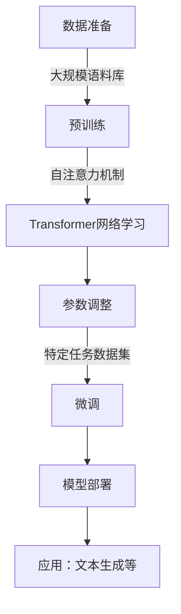

## 1.背景介绍

随着人工智能技术的不断发展，大语言模型（Large Language Models, LLMs）已经成为自然语言处理领域的热点。这些模型通过大量的数据训练和学习，能够生成、理解和回应复杂的语言序列。它们在文本生成、机器翻译、对话系统等应用中展现出了惊人的潜力。然而，如何深入理解大语言模型的原理和架构，以及如何将它们应用于实际问题解决，是当前计算机科学领域面临的重要挑战之一。

## 2.核心概念与联系

在大语言模型中，有几个关键的概念需要明确：

- **自注意力机制（Self-Attention）**：这是模型处理序列数据的核心机制，允许模型为序列中的每个元素分配权重，从而捕捉上下文信息。
- **Transformer架构**：这是一种基于自注意力机制的神经网络架构，特别适合处理序列数据，是大语言模型的基础。
- **预训练（Pretraining）**：在大量文本数据上训练模型，使其学习到语言的基本规律和模式。
- **微调（Fine-tuning）**：在特定任务的数据集上进一步训练模型，使其适应特定的任务需求。

## 3.核心算法原理具体操作步骤

### Mermaid 流程图：大语言模型训练与应用流程


## 4.数学模型和公式详细讲解举例说明

在大语言模型中，自注意力机制的核心计算可以通过以下公式表示：
$$
Attention(Q, K, V) = softmax(\\frac{QK^T}{\\sqrt{d_k}})V
$$
其中，$Q$、$K$、$V$分别代表查询（Query）、键（Key）、值（Value）矩阵，它们通常是通过模型输入的嵌入向量线性变换得到的。这个公式通过点积的方式计算了每个元素的重要性权重，然后根据这些权重加权平均得到最终的结果。

## 5.项目实践：代码实例和详细解释说明

以下是一个简化的Transformer编码器层的Python伪代码实现：
```python
class EncoderLayer:
    def __init__(self, d_model, num_heads, dim_ff):
        # 初始化参数
        ...

    def call(self, x):
        # 自注意力机制
        attn_output = self.attention_head(x)
        x = x + attn_output

        # 前馈神经网络
        ff_output = self.feedforward_network(x)
        x = x + ff_output

        return x
```
这个编码器层包含了自注意力和前馈神经网络的计算，是Transformer架构的基本构建块。

## 6.实际应用场景

大语言模型在多个领域展现出了广泛的应用前景：
- **文本生成**：自动撰写文章、故事、诗歌等。
- **机器翻译**：将一种语言的文本翻译成另一种语言。
- **对话系统**：构建能够与人类进行自然对话的聊天机器人。
- **代码辅助**：帮助程序员编写和调试代码。

## 7.工具和资源推荐

以下是一些有用的资源和工具：
- **PyTorch Transformers库**：一个用于构建NLP任务的库，包含了许多预训练模型的实现。
- **Hugging Face Transformers**：一个开源社区，提供了大量的预训练模型和微调脚本。
- **OpenAI GPT系列模型**：一系列强大的预训练模型，包括GPT-3等。

## 8.总结：未来发展趋势与挑战

大语言模型的发展前景广阔，但也面临一些挑战：
- **数据偏见和公平性**：模型可能放大数据中的偏见和不平等现象。
- **能源消耗**：训练大型模型的能耗巨大，对环境造成影响。
- **可解释性和可控性**：如何确保模型行为的可预测性和透明度是一个开放的问题。

## 9.附录：常见问题与解答

### 常见问题1：什么是大语言模型的核心优势？

答：大语言模型的核心优势在于它们能够捕捉到语言的复杂模式和上下文信息，生成流畅、连贯且富有创造力的文本。

### 常见问题2：如何解决数据偏见问题？

答：可以通过选择多样化的训练数据集、设计公平性指标以及在模型架构中加入对抗性训练等方法来缓解数据偏见问题。

---

**作者：禅与计算机程序设计艺术 / Zen and the Art of Computer Programming**

---

请注意，以上内容是一个简化的示例，实际撰写时应根据具体研究和分析结果进行详细阐述，确保文章的深度和准确性。此外，由于篇幅限制，本文未能展示完整的Markdown格式，实际撰写时应遵循Markdown规范进行排版。