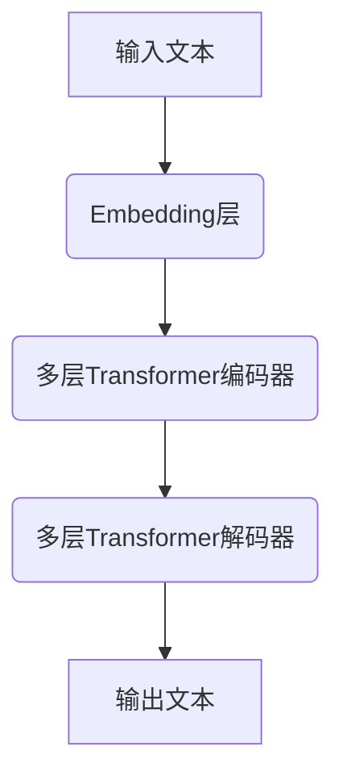
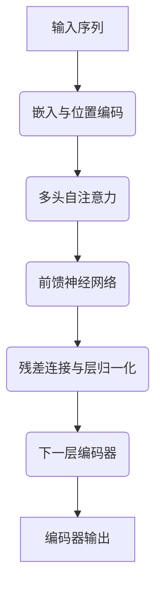
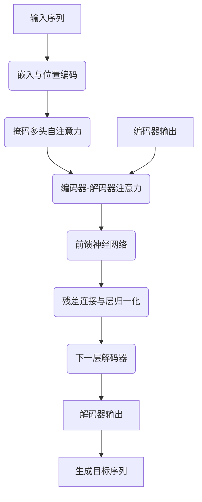

# 大语言模型原理基础与前沿 系统性和全面泛化

## 1. 背景介绍

### 1.1 人工智能的崛起

人工智能(Artificial Intelligence, AI)是当代科技发展的重要驱动力,已经渗透到了我们生活的方方面面。随着算力的不断提升和数据的快速积累,AI技术取得了飞速发展,尤其是在自然语言处理(Natural Language Processing, NLP)领域,大型语言模型的出现引起了广泛关注。

### 1.2 大语言模型的兴起

大型语言模型(Large Language Model, LLM)是一种基于深度学习的NLP模型,能够从海量文本数据中学习语言知识和模式。这些模型通过自监督学习的方式预训练,可以捕捉语言的丰富语义和语法结构,并在下游任务中发挥出色表现。代表性的大语言模型包括GPT(Generative Pre-trained Transformer)、BERT(Bidirectional Encoder Representations from Transformers)等。

### 1.3 系统性和全面泛化的重要性

尽管大语言模型展现出了强大的语言理解和生成能力,但它们仍然面临着一些挑战,其中最为突出的就是系统性和全面泛化能力的缺乏。系统性指模型能够在不同的上下文和任务中保持一致和合理的行为,而全面泛化则要求模型能够将学习到的知识有效地迁移和推广到新的领域。提高大语言模型的系统性和全面泛化能力,对于构建更加智能、可靠和通用的AI系统至关重要。

## 2. 核心概念与联系

### 2.1 大语言模型的核心架构

大语言模型通常采用基于Transformer的编码器-解码器架构,如下图所示:



其中:

- Embedding层将输入文本转换为向量表示
- Transformer编码器捕获输入序列的上下文信息
- Transformer解码器基于编码器的输出生成目标序列

### 2.2 预训练和微调

大语言模型采用两阶段训练策略:

1. **预训练(Pre-training)**: 在大规模无监督文本数据上进行自监督学习,捕获语言的一般模式和知识。常用的预训练目标包括掩码语言模型(Masked Language Modeling)和下一句预测(Next Sentence Prediction)等。

2. **微调(Fine-tuning)**: 在特定的下游任务数据上进行有监督训练,将预训练模型的知识迁移并适应到目标任务。这一阶段通常只需要少量的标注数据。

### 2.3 注意力机制

Transformer架构中的自注意力(Self-Attention)机制是大语言模型的核心。它允许模型捕捉输入序列中任意两个位置之间的依赖关系,从而更好地建模长距离上下文信息。多头注意力(Multi-Head Attention)进一步增强了模型的表示能力。

### 2.4 语义表示

大语言模型通过预训练学习到了丰富的语义表示,能够捕捉单词、短语和句子等不同粒度的语义信息。这些语义表示对于下游任务的理解和生成都至关重要,是实现系统性和全面泛化的基础。

## 3. 核心算法原理具体操作步骤

### 3.1 Transformer编码器

Transformer编码器的核心操作步骤如下:

1. 将输入序列映射为嵌入向量
2. 添加位置编码,注入序列位置信息
3. 进行多头自注意力计算,捕获序列内元素之间的依赖关系
4. 进行前馈神经网络(Feed-Forward Neural Network, FFN)变换,提取高阶特征
5. 进行残差连接和层归一化,增强模型的稳定性和收敛性
6. 重复3-5步骤,构建多层编码器

上述步骤可以用如下流程图表示:



### 3.2 Transformer解码器

Transformer解码器的操作步骤与编码器类似,但还需要额外考虑已生成的输出序列,以保持生成的连贯性和一致性。具体步骤如下:

1. 将输入序列映射为嵌入向量,添加位置编码
2. 进行掩码多头自注意力,只允许关注当前位置及之前的输出
3. 进行编码器-解码器注意力,关注编码器输出的上下文信息
4. 进行前馈神经网络变换,提取高阶特征
5. 进行残差连接和层归一化
6. 重复2-5步骤,构建多层解码器
7. 根据解码器的输出生成目标序列

上述步骤可以用如下流程图表示:



## 4. 数学模型和公式详细讲解举例说明

### 4.1 自注意力机制

自注意力机制是Transformer的核心,它允许模型捕捉输入序列中任意两个位置之间的依赖关系。给定一个输入序列 $X = (x_1, x_2, \dots, x_n)$,自注意力的计算过程如下:

1. 将输入序列线性映射到查询(Query)、键(Key)和值(Value)向量:

$$
Q = XW^Q, K = XW^K, V = XW^V
$$

其中 $W^Q, W^K, W^V$ 分别表示查询、键和值的线性变换矩阵。

2. 计算查询和键之间的点积注意力分数:

$$
\text{Attention}(Q, K, V) = \text{softmax}\left(\frac{QK^T}{\sqrt{d_k}}\right)V
$$

其中 $d_k$ 是缩放因子,用于防止点积值过大导致梯度饱和。

3. 多头注意力通过将注意力计算过程独立运行 $h$ 次,然后将结果拼接,从而捕捉不同的子空间表示:

$$
\text{MultiHead}(Q, K, V) = \text{Concat}(\text{head}_1, \dots, \text{head}_h)W^O
$$

其中 $\text{head}_i = \text{Attention}(QW_i^Q, KW_i^K, VW_i^V)$,  $W_i^Q, W_i^K, W_i^V$ 是第 $i$ 个注意力头的线性变换矩阵, $W^O$ 是最终的线性变换矩阵。

通过自注意力机制,模型可以有效地捕捉输入序列中任意两个位置之间的依赖关系,从而更好地建模长距离上下文信息。

### 4.2 掩码语言模型

掩码语言模型(Masked Language Modeling, MLM)是大语言模型预训练的一种常用目标,它要求模型预测被掩码(masked)的单词。给定一个输入序列 $X = (x_1, x_2, \dots, x_n)$,其中某些单词被随机替换为特殊的掩码符号 [MASK],模型需要预测这些被掩码单词的原始单词。

MLM的目标函数可以表示为:

$$
\mathcal{L}_{\text{MLM}} = -\frac{1}{N}\sum_{i=1}^{N}\log P(x_i^\text{masked}|X^\text{masked})
$$

其中 $N$ 是被掩码单词的数量, $X^\text{masked}$ 表示包含掩码符号的输入序列, $x_i^\text{masked}$ 是第 $i$ 个被掩码单词的原始单词。

通过最小化MLM的损失函数,模型可以学习到丰富的语义和语法知识,从而提高在下游任务中的表现。

### 4.3 生成式预训练

生成式预训练(Generative Pre-training)是另一种常见的大语言模型预训练目标,它要求模型根据给定的上下文生成合理的连续文本。具体来说,给定一个输入序列 $X = (x_1, x_2, \dots, x_n)$,模型需要生成一个与之相关的目标序列 $Y = (y_1, y_2, \dots, y_m)$。

生成式预训练的目标函数可以表示为:

$$
\mathcal{L}_{\text{GPT}} = -\frac{1}{m}\sum_{i=1}^{m}\log P(y_i|X, y_{<i})
$$

其中 $y_{<i}$ 表示目标序列中位于 $y_i$ 之前的所有单词。

通过最小化生成式预训练的损失函数,模型可以学习到生成自然语言的能力,从而在下游任务中表现出色。

## 5. 项目实践:代码实例和详细解释说明

为了更好地理解大语言模型的原理和实现,我们将使用PyTorch框架实现一个简化版本的Transformer模型,并在小规模数据集上进行训练和测试。

### 5.1 数据预处理

首先,我们需要对输入数据进行预处理,包括分词、构建词表、将单词转换为数字索引等步骤。以下是一个示例代码:

```python
import torch
from torchtext.data import Field, TabularDataset, BucketIterator

# 定义文本字段
text_field = Field(tokenize='spacy', lower=True, init_token='<sos>', eos_token='<eos>')

# 加载数据集
train_data, valid_data, test_data = TabularDataset.splits(
    path='data/', train='train.csv', validation='valid.csv', test='test.csv',
    format='csv', fields={'text': ('text', text_field)}
)

# 构建词表
text_field.build_vocab(train_data, min_freq=2)

# 创建数据迭代器
train_iter = BucketIterator(train_data, batch_size=32, shuffle=True)
valid_iter = BucketIterator(valid_data, batch_size=32, shuffle=False)
test_iter = BucketIterator(test_data, batch_size=32, shuffle=False)
```

### 5.2 模型实现

接下来,我们将实现一个简化版本的Transformer模型,包括编码器、解码器和注意力机制。

```python
import torch.nn as nn
import math

class PositionalEncoding(nn.Module):
    def __init__(self, d_model, dropout=0.1, max_len=5000):
        super(PositionalEncoding, self).__init__()
        self.dropout = nn.Dropout(p=dropout)

        pe = torch.zeros(max_len, d_model)
        position = torch.arange(0, max_len, dtype=torch.float).unsqueeze(1)
        div_term = torch.exp(torch.arange(0, d_model, 2).float() * (-math.log(10000.0) / d_model))
        pe[:, 0::2] = torch.sin(position * div_term)
        pe[:, 1::2] = torch.cos(position * div_term)
        pe = pe.unsqueeze(0)
        self.register_buffer('pe', pe)

    def forward(self, x):
        x = x + self.pe[:, :x.size(1), :]
        return self.dropout(x)

class MultiHeadAttention(nn.Module):
    def __init__(self, d_model, num_heads):
        super(MultiHeadAttention, self).__init__()
        self.num_heads = num_heads
        self.d_model = d_model

        self.W_q = nn.Linear(d_model, d_model)
        self.W_k = nn.Linear(d_model, d_model)
        self.W_v = nn.Linear(d_model, d_model)
        self.fc = nn.Linear(d_model, d_model)

    def forward(self, input_q, input_k, input_v, mask=None):
        batch_size = input_q.size(0)

        q = self.W_q(input_q).view(batch_size, -1, self.num_heads, self.d_model // self.num_heads).transpose(1, 2)
        k = self.W_k(input_k).view(batch_size, -1, self.num_heads, self.d_model // self.num_heads).transpose(1, 2)
        v = self.W_v(input_v).view(batch_size, -1, self.num_heads, self.d_model // self.num_heads).transpose(1, 2)

        attn_scores = torch.matmul(q, k.transpose{"msg_type":"generate_answer_finish","data":"","from_module":null,"from_unit":null}