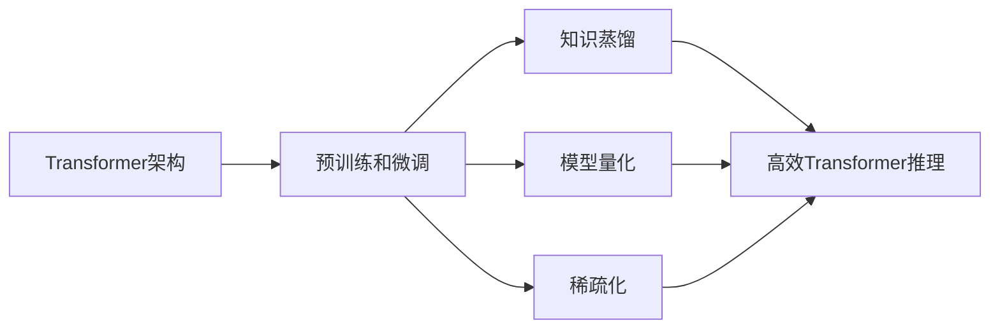

# 大语言模型原理基础与前沿 高效扩展Transformer推理

## 1. 背景介绍
### 1.1 大语言模型的兴起
近年来,随着深度学习技术的飞速发展,大语言模型(Large Language Model,LLM)在自然语言处理(Natural Language Processing,NLP)领域取得了突破性的进展。基于Transformer架构的语言模型,如BERT、GPT系列等,通过在海量文本数据上进行预训练,可以学习到丰富的语言知识和通用语义表示,在各类NLP任务上取得了显著的性能提升。

### 1.2 大语言模型面临的挑战
尽管大语言模型展现出了强大的性能,但它们在实际应用中仍然面临着诸多挑战:
- 模型参数量巨大,训练和推理的计算开销高昂
- 模型体积庞大,部署到资源受限的终端设备困难
- 推理速度较慢,难以满足实时响应的需求

因此,如何在保持模型性能的同时,提高大语言模型推理的效率,成为了当前学术界和工业界的一个重要研究方向。

### 1.3 高效Transformer推理的意义
高效的Transformer推理技术对于大语言模型的实际应用具有重要意义:
- 降低计算资源消耗,节约成本
- 加速推理速度,提升用户体验
- 扩大模型的应用范围,促进NLP技术的普及

本文将围绕大语言模型的原理基础和高效Transformer推理技术展开,深入探讨相关的核心概念、算法原理、数学模型、实践案例等,为读者提供全面而深入的认识。

## 2. 核心概念与联系
### 2.1 Transformer架构
Transformer是一种基于自注意力机制(Self-Attention)的神经网络架构,最早由Google于2017年提出。与传统的循环神经网络(RNN)和卷积神经网络(CNN)不同,Transformer完全依赖于注意力机制来建模序列数据之间的依赖关系,摒弃了循环连接,从而实现了高度并行化的计算。

Transformer的核心组件包括:
- 多头自注意力层(Multi-Head Self-Attention Layer):通过多个注意力头并行计算序列中不同位置之间的关联性,捕捉全局依赖
- 前馈神经网络层(Feed-Forward Network Layer):对自注意力层的输出进行非线性变换,增强模型的表达能力
- 残差连接(Residual Connection)和层归一化(Layer Normalization):稳定网络训练,加速收敛

### 2.2 预训练和微调
大语言模型通常采用两阶段的训练范式:预训练(Pre-training)和微调(Fine-tuning)。

在预训练阶段,模型在大规模无标注文本数据上进行自监督学习,通过掩码语言建模(Masked Language Modeling,MLM)、下一句预测(Next Sentence Prediction,NSP)等任务,学习通用的语言表示。预训练使得模型能够捕捉语言的统计规律和语义信息。

在微调阶段,预训练模型被应用到下游的具体NLP任务中,如文本分类、命名实体识别、问答等。通过在任务相关的标注数据上进行监督学习,模型的参数被调整以适应特定任务。微调阶段显著减少了任务相关数据的需求,提高了模型的泛化能力。

### 2.3 知识蒸馏
知识蒸馏(Knowledge Distillation)是一种将大型复杂模型的知识转移到小型简单模型的技术。其基本思想是使用教师模型(Teacher Model)指导学生模型(Student Model)的训练,通过最小化两个模型输出分布之间的差异,使学生模型能够模仿教师模型的行为。

在大语言模型领域,知识蒸馏常用于模型压缩和加速推理。通过蒸馏,可以得到参数更少、体积更小的学生模型,在性能略有损失的情况下,大幅降低计算开销和内存占用。

### 2.4 模型量化
模型量化(Model Quantization)是一种降低模型数值精度的技术,通过将浮点数参数量化为低位宽的定点数,可以减小模型体积,加速计算。常见的量化方法包括:
- 后训练量化(Post-Training Quantization,PTQ):在训练完成后,直接对模型参数进行量化,不需要重新训练
- 量化感知训练(Quantization-Aware Training,QAT):在训练过程中引入量化操作,使模型适应量化带来的精度损失

量化是一种简单有效的模型压缩方法,可以在保持模型性能的同时,显著降低存储和计算成本。

### 2.5 稀疏化
稀疏化(Sparsification)是一种通过引入稀疏性来压缩模型的技术。常见的稀疏化方法包括:
- 剪枝(Pruning):将重要性低的权重或神经元剪除,得到稀疏的网络结构
- 低秩分解(Low-Rank Decomposition):将权重矩阵分解为若干低秩矩阵的乘积,减少参数量

稀疏化可以有效地压缩模型体积,降低计算复杂度。同时,适度的稀疏性还能起到正则化的作用,提高模型的泛化能力。

### 2.6 核心概念之间的联系
上述核心概念之间存在着紧密的联系,它们共同构成了大语言模型高效推理的技术体系:

Transformer架构是大语言模型的基础,预训练和微调范式使得模型能够学习到通用的语言表示。在此基础上,知识蒸馏、模型量化、稀疏化等技术可以进一步压缩模型,降低计算开销,最终实现高效的Transformer推理。

## 3. 核心算法原理与具体操作步骤
本节将详细介绍几种典型的高效Transformer推理算法的原理和具体操作步骤。

### 3.1 知识蒸馏算法
#### 3.1.1 软化标签蒸馏
软化标签蒸馏(Soft Label Distillation)是最常用的知识蒸馏方法之一。其基本思想是利用教师模型的软化输出作为学生模型的训练目标,使学生模型能够模仿教师模型的行为。

具体操作步骤如下:
1. 训练一个大型的教师模型,在训练数据上进行前向传播,得到软化的输出概率分布
2. 固定教师模型的参数,使用软化的输出概率作为学生模型的训练目标
3. 训练学生模型,最小化学生模型输出与教师模型软化输出之间的交叉熵损失
4. 重复步骤2-3,直到学生模型收敛

软化标签蒸馏可以有效地将教师模型的知识转移到学生模型中,提高学生模型的性能。

#### 3.1.2 注意力蒸馏
注意力蒸馏(Attention Distillation)是一种针对Transformer模型的蒸馏方法,旨在将教师模型的注意力机制知识传递给学生模型。

具体操作步骤如下:
1. 在教师模型的每个自注意力层,计算注意力权重矩阵
2. 将教师模型的注意力权重矩阵作为学生模型的监督信号
3. 训练学生模型,最小化学生模型的注意力权重与教师模型的注意力权重之间的差异
4. 重复步骤2-3,直到学生模型收敛

通过注意力蒸馏,学生模型可以学习到教师模型在自注意力层中捕捉到的关键信息,从而提高自身的表示能力。

### 3.2 模型量化算法
#### 3.2.1 后训练量化
后训练量化(Post-Training Quantization,PTQ)是一种无需重新训练的模型量化方法,可以直接将训练好的浮点模型转换为量化模型。

具体操作步骤如下:
1. 在训练数据上运行浮点模型,收集每一层的激活值
2. 根据激活值的分布,确定量化比特数和量化范围
3. 对模型的权重和激活值进行量化,得到量化后的模型
4. 在测试数据上评估量化模型的性能,必要时调整量化参数

PTQ是一种简单快速的量化方法,但可能导致一定的性能损失。

#### 3.2.2 量化感知训练
量化感知训练(Quantization-Aware Training,QAT)在训练过程中引入量化操作,使模型适应量化带来的精度损失。

具体操作步骤如下:
1. 在前向传播过程中,对模型的权重和激活值进行伪量化(Fake Quantization)操作
2. 在反向传播过程中,对梯度进行反量化(De-quantization),以保证梯度的准确性
3. 重复步骤1-2,训练量化感知模型
4. 将量化感知模型转换为实际的量化模型

通过QAT,模型可以在训练过程中适应量化带来的影响,从而获得更高的量化精度。

### 3.3 稀疏化算法
#### 3.3.1 magnitude-based pruning
基于权重绝对值大小的剪枝(Magnitude-based Pruning)是一种简单有效的结构化剪枝方法。其基本思想是根据权重的绝对值大小来判断其重要性,将绝对值小的权重剪除。

具体操作步骤如下:
1. 训练一个预备的稠密模型
2. 根据权重绝对值大小,设定剪枝阈值,将小于阈值的权重剪除
3. 对剪枝后的稀疏模型进行微调,恢复部分性能损失
4. 重复步骤2-3,直到达到预设的稀疏度

该方法可以有效地减少模型的参数量,降低计算复杂度。但剪枝后的模型结构不规则,可能无法充分利用现有的硬件加速库。

#### 3.3.2 low-rank decomposition
低秩分解(Low-Rank Decomposition)通过将大的权重矩阵分解为若干个小的低秩矩阵,来压缩模型。

以矩阵奇异值分解(Singular Value Decomposition,SVD)为例,具体操作步骤如下:
1. 对预训练模型的权重矩阵进行SVD分解,得到左奇异矩阵、奇异值和右奇异矩阵
2. 根据奇异值的大小,选择合适的秩,截断奇异值矩阵
3. 重构权重矩阵,得到低秩近似
4. 微调低秩模型,恢复部分性能损失

低秩分解可以在保持模型结构规整的同时,显著减少参数量。但其计算开销较大,且可能引入一定的性能损失。

## 4. 数学模型和公式详细讲解举例说明
本节将详细讲解几种高效Transformer推理算法涉及的关键数学模型和公式,并给出具体的例子说明。

### 4.1 知识蒸馏中的软化标签
在软化标签蒸馏中,教师模型的输出概率分布被软化后作为学生模型的训练目标。softmax函数是将神经网络的输出转化为概率分布的常用方法:

$$
p_i = \frac{e^{z_i/T}}{\sum_j e^{z_j/T}}
$$

其中,$z_i$是神经网络输出的第$i$个元素,$T$是温度参数,用于控制概率分布的软化程度。$T=1$时,softmax函数退化为标准形式;$T>1$时,概率分布变得更加平缓。

举例说明:假设教师模型在某个样本上的输出为$[2,0,-1]$,标准softmax函数($T=1$)得到的概率分布为$[0.71,0.24,0.05]$。如果设置$T=10$,软化后的概率分布为$[0.38,0.33,0.29]$,可以看出概率分布变得更加平缓,有利于知识的传递。

### 4.2 模型量化中的伪量化
在量化感知训练中,伪量化操作用于模拟量化过程,使模型在训练过程中适应量化带来的影响。以对称均匀量化为例,伪