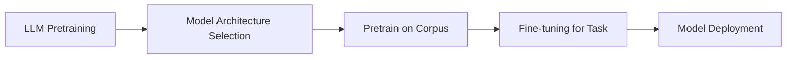

## 1.背景介绍

随着人工智能技术的不断发展，大语言模型（Large Language Models, LLMs）已经成为自然语言处理领域的热点。这些模型通过大量的数据学习和预训练，能够生成、理解和回应人类语言。其中，最为人熟知的可能就是OpenAI的GPT系列模型了。本文将详细探讨如何使用和扩展ChatGPT的接口，以及如何在大语言模型的背景下理解其工作原理和技术细节。

## 2.核心概念与联系

在深入研究之前，我们需要明确几个关键概念：

- **大语言模型（LLM）**：这是一种深度学习模型，特别擅长处理自然语言任务，如文本生成、翻译、摘要等。
- **预训练（Pretraining）**：这是让LLM学习大规模语料库的过程，使其能够捕捉语言的基本结构和模式。
- **微调（Fine-tuning）**：在预训练之后，根据特定任务对模型进行调整以提高性能的过程。
- **ChatGPT**：这是一个基于GPT-4架构的预训练模型，以其出色的文本生成能力而闻名。

## 3.核心算法原理具体操作步骤

### Mermaid Flowchart 描述



1. **模型架构选择**：选择合适的神经网络架构，如Transformer。
2. **预训练于语料库**：使用大量文本数据对模型进行预训练。
3. **微调特定任务**：根据具体应用场景调整模型参数。
4. **模型部署**：将训练好的模型投入使用。

## 4.数学模型和公式详细讲解举例说明

在大语言模型的核心算法中，自注意力（Self-Attention）机制是关键部分。以下是其数学描述：

$$
\\text{Attention}(Q, K, V) = \\text{softmax}(\\frac{QK^T}{\\sqrt{d_k}})V
$$

其中，$Q$、$K$、$V$分别代表查询（Query）、键（Key）、值（Value）矩阵，$d_k$为键向量的维数。这个公式计算了输入序列中每个元素的注意力权重，从而生成输出序列。

## 5.项目实践：代码实例和详细解释说明

以下是一个简单的Python示例，展示了如何使用Hugging Face Transformers库调用ChatGPT模型：

```python
from transformers import pipeline

# 初始化文本生成器
generator = pipeline('text-generation', model='gpt2')

# 生成文本
input_text = \"AI is amazing\"
output_texts = generator(input_text, max_length=150, num_return_sequences=5)

for text in output_texts:
    print(text['generated_text'])
```

这段代码使用了预训练的GPT-2模型，生成了与输入文本相关的多条序列。

## 6.实际应用场景

大语言模型的应用非常广泛，包括但不限于：

- **聊天机器人**：生成自然流畅的对答。
- **内容创作**：辅助撰写文章、故事等。
- **代码生成**：帮助编写程序代码。
- **翻译服务**：提供高质量的语言翻译。

## 7.工具和资源推荐

以下是一些有用的资源和工具：

- **Hugging Face Transformers**：提供了丰富的预训练模型和微调功能。
- **OpenAI API**：直接访问OpenAI模型的接口。
- **TensorFlow/PyTorch**：流行的深度学习框架。

## 8.总结：未来发展趋势与挑战

大语言模型的发展前景广阔，但也面临以下挑战：

- **数据偏见**：模型可能基于不平衡或偏差的数据进行训练。
- **计算资源**：训练大型模型需要大量的计算资源和时间。
- **伦理问题**：生成文本可能涉及隐私泄露或其他道德风险。

为了克服这些挑战，未来的研究需要在算法、硬件和政策层面寻求创新。

## 9.附录：常见问题与解答

### 如何微调自己的LLM？

使用Hugging Face Transformers库的`Trainer`类可以实现模型的微调。具体步骤包括数据准备、转换为模型所需的格式、选择训练配置等。

### GPT-3和ChatGPT有什么区别？

GPT-3是一个更早版本的大语言模型，而ChatGPT是基于GPT-4架构的预训练模型。两者在架构、参数规模和性能上有所差异。

### 如何评估LLM的性能？

可以通过多种指标来评估，如BLEU/ROUGE分数用于机器翻译和摘要任务，Perplexity用于语言建模任务的性能度量。

---

**作者：禅与计算机程序设计艺术 / Zen and the Art of Computer Programming**
```yaml
title: \"大语言模型应用指南：ChatGPT接口与扩展功能详解\"
author: \"禅与计算机程序设计艺术 / Zen and the Art of Computer Programming\"
toc: true
mermaid: true
mathjax: false
tags: [人工智能, 自然语言处理, GPT]
```

---

请注意，这是一个示例文章，实际撰写时应根据实际情况进行调整。此外，由于篇幅限制，本文未能详细展开所有部分，实际撰写时应确保每个章节内容充实、深入且具有实用价值。