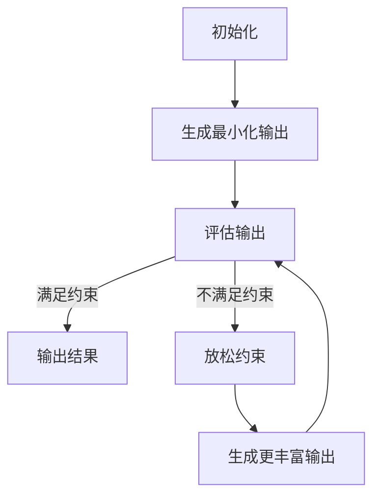

# 大语言模型应用指南：Least-to-Most

## 1. 背景介绍

随着人工智能和深度学习技术的不断发展,大型语言模型(Large Language Models, LLMs)已经成为自然语言处理领域的关键技术之一。这些模型通过在海量文本数据上进行预训练,学习了丰富的语言知识和上下文信息,从而能够生成高质量、连贯的自然语言输出。

大型语言模型的出现,为各种自然语言处理任务带来了革命性的变化,如机器翻译、文本摘要、问答系统、内容生成等。其中,OpenAI的GPT(Generative Pre-trained Transformer)和Google的BERT(Bidirectional Encoder Representations from Transformers)等模型,已经成为该领域的代表性成果。

然而,尽管大型语言模型展现出了强大的语言生成能力,但如何有效地利用和控制这些模型,仍然是一个巨大的挑战。本文将探讨一种被称为"Least-to-Most"的新颖方法,旨在更好地指导和控制大型语言模型的输出,使其更加符合特定任务的需求和约束。

## 2. 核心概念与联系

### 2.1 大型语言模型的局限性

尽管大型语言模型具有强大的语言生成能力,但它们也存在一些固有的局限性:

1. **缺乏控制**: 模型生成的输出往往难以精确控制,可能会产生不相关、不连贯或不合理的内容。
2. **缺乏可解释性**: 模型的决策过程是一个黑箱,难以解释其输出的原因和依据。
3. **存在偏差**: 模型可能会继承训练数据中存在的偏差和不当内容。
4. **计算资源需求高**: 大型模型通常需要大量计算资源来进行推理和微调。

### 2.2 Least-to-Most 方法概述

Least-to-Most 方法旨在通过逐步引导和约束大型语言模型的输出,来克服上述局限性。该方法的核心思想是:

1. 首先生成一个最小化的、高度约束的输出(Least)。
2. 然后逐步放松约束,生成更丰富、更自然的输出(Most)。

在这个过程中,Least-to-Most 方法利用了一系列技术,如提示工程(Prompt Engineering)、约束解码(Constrained Decoding)和反馈循环(Feedback Loop),以确保模型输出符合特定任务的需求和约束。

该方法的优势在于,它可以在保持模型生成能力的同时,提高输出的可控性、可解释性和无偏性。此外,它还可以减少计算资源的需求,因为只需要对最终输出进行微调,而不是对整个大型模型进行训练。

## 3. 核心算法原理具体操作步骤

Least-to-Most 方法由以下几个关键步骤组成:



### 3.1 初始化

在这个步骤中,我们需要确定任务的目标和约束条件。这包括:

1. 定义任务目标,如生成文本摘要、问答或内容生成等。
2. 确定输出需要满足的约束,如长度限制、主题相关性、语气风格等。
3. 选择合适的大型语言模型,如GPT-3、BERT等。
4. 设计初始提示(Prompt),作为模型生成的起点。

### 3.2 生成最小化输出

在这个步骤中,我们利用高度约束的提示,让模型生成一个最小化的输出。这个输出应该满足以下条件:

1. 高度相关且符合任务目标。
2. 满足所有约束条件,如长度、主题等。
3. 语义和语法正确,但可能缺乏丰富性和自然度。

为了实现这一点,我们可以使用以下技术:

1. **提示工程**: 设计高度约束的提示,指导模型生成符合要求的输出。
2. **约束解码**: 在解码过程中,应用各种约束条件,如长度限制、主题关键词等。
3. **反馈循环**: 通过多次迭代,逐步调整提示和约束,直到生成满足要求的输出。

### 3.3 评估输出

在这个步骤中,我们需要评估模型生成的输出是否满足所有约束条件。评估可以通过以下方式进行:

1. **自动评估**: 使用预定义的评分函数或指标,如BLEU分数、困惑度等,自动评估输出质量。
2. **人工评估**: 由人工评审者根据任务目标和约束条件,对输出进行主观评估。

如果输出满足所有约束条件,则可以直接输出结果。否则,需要进入下一步,放松约束条件。

### 3.4 放松约束

在这个步骤中,我们需要放松部分约束条件,以便模型能够生成更丰富、更自然的输出。放松约束的方式可以包括:

1. **增加输出长度限制**,允许模型生成更长的文本。
2. **放宽主题约束**,允许模型涉及更广泛的相关主题。
3. **调整语气风格约束**,允许模型使用更自然、更富有表现力的语言风格。

放松约束的程度需要根据任务需求和先前输出的质量进行调整。过度放松约束可能会导致模型输出偏离任务目标,而过于严格的约束则可能阻碍模型发挥其生成能力。

### 3.5 生成更丰富输出

在放松约束后,我们可以让模型基于先前的最小化输出,生成更丰富、更自然的输出。这个步骤可以利用以下技术:

1. **提示微调(Prompt Tuning)**: 根据先前输出和放松的约束,微调提示,以引导模型生成更好的输出。
2. **自回归生成(Autoregressive Generation)**: 利用模型的自回归性质,基于先前生成的文本,继续生成新的文本。

生成的新输出应该比最小化输出更丰富、更自然,同时仍然满足放松后的约束条件。

### 3.6 迭代优化

Least-to-Most 方法是一个迭代的过程。我们可以重复执行上述步骤,逐步放松约束、生成更丰富的输出,直到满足任务需求。在每次迭代中,我们都需要评估输出质量,并根据评估结果调整约束条件和提示。

通过这种逐步优化的方式,我们可以在控制输出质量的同时,最大限度地发挥大型语言模型的生成能力。

## 4. 数学模型和公式详细讲解举例说明

在 Least-to-Most 方法中,我们可以利用一些数学模型和公式来量化和优化输出质量。以下是一些常用的模型和公式:

### 4.1 BLEU 分数

BLEU (Bilingual Evaluation Understudy) 分数是一种广泛使用的机器翻译评估指标,它可以用于评估生成文本的质量。BLEU 分数基于 n-gram 的精确度,即生成文本与参考文本之间的 n-gram 重叠程度。

BLEU 分数的计算公式如下:

$$\text{BLEU} = BP \cdot \exp\left(\sum_{n=1}^N w_n \log p_n\right)$$

其中:

- $N$ 是我们选择的最大 n-gram 长度。
- $w_n$ 是每个 n-gram 长度的权重,通常设置为 $\frac{1}{N}$。
- $p_n$ 是生成文本中的 n-gram 与参考文本中的 n-gram 的精确度。
- $BP$ 是一个惩罚因子,用于惩罚过短的生成文本。

BLEU 分数的取值范围为 [0, 1],分数越高,表示生成文本与参考文本的相似度越高。在 Least-to-Most 方法中,我们可以使用 BLEU 分数作为自动评估输出质量的指标之一。

### 4.2 困惑度 (Perplexity)

困惑度是一种衡量语言模型质量的指标,它反映了模型对于给定文本序列的预测能力。困惑度的值越小,表示模型对文本序列的预测越准确。

困惑度的计算公式如下:

$$\text{Perplexity}(W) = \sqrt[N]{\prod_{i=1}^N \frac{1}{P(w_i|w_1, \dots, w_{i-1})}}$$

其中:

- $W = (w_1, w_2, \dots, w_N)$ 是长度为 $N$ 的文本序列。
- $P(w_i|w_1, \dots, w_{i-1})$ 是语言模型预测第 $i$ 个词 $w_i$ 的条件概率,给定前面的词序列 $(w_1, \dots, w_{i-1})$。

在 Least-to-Most 方法中,我们可以使用困惑度来评估生成文本的质量。一般来说,困惑度越低,生成文本的质量越高。但是,过低的困惑度也可能意味着生成文本缺乏多样性和创新性。因此,我们需要在困惑度和其他评估指标之间寻找一个平衡。

### 4.3 主题一致性

在许多任务中,我们需要确保生成文本与给定主题保持一致。为了量化主题一致性,我们可以使用主题模型,如潜在狄利克雷分配 (Latent Dirichlet Allocation, LDA)。

LDA 是一种无监督主题建模技术,它可以从文本语料中自动发现潜在主题。每个主题都由一组特征词及其权重表示。给定一个文本,LDA 可以计算该文本属于每个主题的概率分布,即主题分布。

我们可以利用 LDA 计算生成文本与目标主题之间的相似度,作为主题一致性的度量。具体来说,我们首先使用 LDA 从训练语料中学习主题模型,然后计算生成文本与目标主题的主题分布之间的相似度,如余弦相似度或 KL 散度。相似度越高,表示生成文本与目标主题越一致。

在 Least-to-Most 方法中,我们可以将主题一致性作为约束条件之一,在生成最小化输出和放松约束时加以考虑。

### 4.4 语气风格一致性

除了主题一致性,我们还需要确保生成文本与目标语气风格保持一致。为了量化语气风格一致性,我们可以使用基于深度学习的语气风格分类模型。

语气风格分类模型通常是一个监督学习模型,它可以将给定文本分类到预定义的语气风格类别中,如正式、非正式、积极、消极等。该模型的输入是文本序列,输出是语气风格类别的概率分布。

我们可以利用语气风格分类模型计算生成文本与目标语气风格之间的相似度,作为语气风格一致性的度量。具体来说,我们首先使用标注语料训练语气风格分类模型,然后计算生成文本与目标语气风格的概率分布之间的相似度,如余弦相似度或 KL 散度。相似度越高,表示生成文本与目标语气风格越一致。

在 Least-to-Most 方法中,我们可以将语气风格一致性作为约束条件之一,在生成最小化输出和放松约束时加以考虑。

通过综合运用上述数学模型和公式,我们可以更好地量化和优化 Least-to-Most 方法中的输出质量,确保生成文本符合任务需求和约束条件。

## 5. 项目实践: 代码实例和详细解释说明

为了更好地理解 Least-to-Most 方法的实现,我们将提供一个基于 Python 和 Hugging Face Transformers 库的代码示例。该示例将演示如何使用 Least-to-Most 方法生成文本摘要。

### 5.1 准备工作

首先,我们需要安装必要的Python库:

```bash
pip install transformers
```

然后,导入所需的模块:

```python
from transformers import pipeline, set_seed
import re
```

我们将使用 `pipeline` 函数来加载预训练的语言模型和任务特定的管道。`set_seed` 函数用于设置随机种子,以确保实验的可