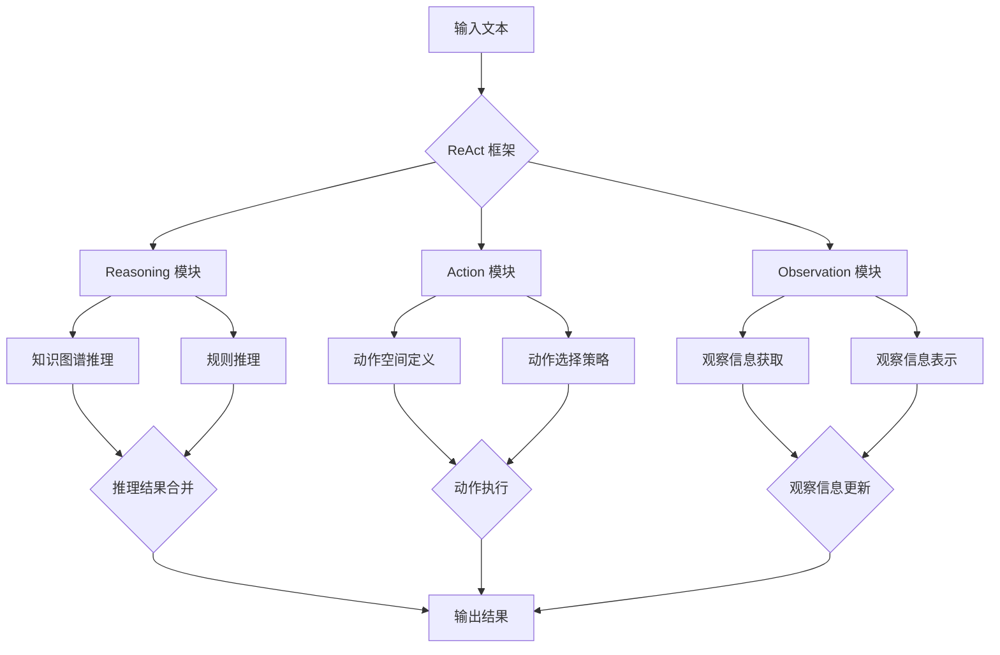

# 大语言模型应用指南：ReAct 框架

## 1. 背景介绍
### 1.1 大语言模型的发展历程
#### 1.1.1 早期的语言模型
#### 1.1.2 Transformer 的出现
#### 1.1.3 预训练语言模型的崛起

### 1.2 大语言模型面临的挑战
#### 1.2.1 语境理解与推理能力
#### 1.2.2 知识的获取与应用
#### 1.2.3 安全性与伦理考量

### 1.3 ReAct 框架的提出
#### 1.3.1 ReAct 的核心理念
#### 1.3.2 ReAct 的优势与创新点
#### 1.3.3 ReAct 在大语言模型应用中的意义

## 2. 核心概念与联系
### 2.1 大语言模型
#### 2.1.1 定义与特点
#### 2.1.2 常见的大语言模型
#### 2.1.3 大语言模型的应用场景

### 2.2 ReAct 框架
#### 2.2.1 ReAct 的组成部分
#### 2.2.2 ReAct 的工作原理
#### 2.2.3 ReAct 与传统语言模型的区别

### 2.3 知识图谱
#### 2.3.1 知识图谱的定义与作用
#### 2.3.2 知识图谱在 ReAct 中的应用
#### 2.3.3 知识图谱的构建与维护

### 2.4 强化学习
#### 2.4.1 强化学习的基本概念
#### 2.4.2 强化学习在 ReAct 中的应用
#### 2.4.3 强化学习算法的选择与优化

## 3. 核心算法原理具体操作步骤
### 3.1 ReAct 的整体架构
#### 3.1.1 Reasoning 模块
#### 3.1.2 Action 模块 
#### 3.1.3 Observation 模块

### 3.2 Reasoning 模块的实现
#### 3.2.1 基于知识图谱的推理
#### 3.2.2 基于规则的推理
#### 3.2.3 推理结果的合并与优化

### 3.3 Action 模块的实现 
#### 3.3.1 动作空间的定义
#### 3.3.2 动作选择策略
#### 3.3.3 动作执行与反馈

### 3.4 Observation 模块的实现
#### 3.4.1 观察信息的获取
#### 3.4.2 观察信息的表示与编码
#### 3.4.3 观察信息的融合与更新

### 3.5 ReAct 的训练过程
#### 3.5.1 预训练阶段
#### 3.5.2 强化学习阶段
#### 3.5.3 模型评估与调优

## 4. 数学模型和公式详细讲解举例说明
### 4.1 Transformer 模型
#### 4.1.1 自注意力机制
#### 4.1.2 多头注意力
#### 4.1.3 前馈神经网络

### 4.2 知识图谱嵌入
#### 4.2.1 TransE 模型
#### 4.2.2 TransR 模型
#### 4.2.3 ConvE 模型

### 4.3 强化学习算法
#### 4.3.1 Q-learning
#### 4.3.2 SARSA
#### 4.3.3 PPO

### 4.4 损失函数与优化器
#### 4.4.1 交叉熵损失
#### 4.4.2 Adam 优化器
#### 4.4.3 自适应学习率调整

## 5. 项目实践：代码实例和详细解释说明
### 5.1 环境配置与依赖安装
#### 5.1.1 Python 环境搭建
#### 5.1.2 PyTorch 安装与配置
#### 5.1.3 其他依赖库的安装

### 5.2 数据准备与预处理
#### 5.2.1 数据集的选择与下载
#### 5.2.2 数据清洗与格式转换
#### 5.2.3 数据增强与特征工程

### 5.3 模型构建与训练
#### 5.3.1 ReAct 模型的搭建
#### 5.3.2 模型参数的初始化
#### 5.3.3 模型训练与验证

### 5.4 模型评估与优化
#### 5.4.1 评估指标的选择
#### 5.4.2 超参数调优
#### 5.4.3 模型压缩与加速

### 5.5 模型部署与应用
#### 5.5.1 模型的保存与加载
#### 5.5.2 模型的 Web 服务化
#### 5.5.3 模型的移动端部署

## 6. 实际应用场景
### 6.1 智能客服
#### 6.1.1 客户意图识别
#### 6.1.2 问题解答与知识推荐
#### 6.1.3 多轮对话管理

### 6.2 个性化推荐
#### 6.2.1 用户画像构建
#### 6.2.2 推荐候选生成
#### 6.2.3 排序与重排

### 6.3 智能写作助手
#### 6.3.1 写作素材推荐
#### 6.3.2 文本生成与优化
#### 6.3.3 文章质量评估

### 6.4 智能搜索
#### 6.4.1 查询理解与扩展
#### 6.4.2 相关性排序
#### 6.4.3 搜索结果多样化

## 7. 工具和资源推荐
### 7.1 开源框架与库
#### 7.1.1 Hugging Face Transformers
#### 7.1.2 OpenAI GPT-3
#### 7.1.3 Google BERT

### 7.2 数据集资源
#### 7.2.1 维基百科
#### 7.2.2 CommonCrawl
#### 7.2.3 Amazon Reviews

### 7.3 学习资料与教程
#### 7.3.1 《Dive into Deep Learning》
#### 7.3.2 《Natural Language Processing with PyTorch》
#### 7.3.3 《Reinforcement Learning: An Introduction》

## 8. 总结：未来发展趋势与挑战
### 8.1 大语言模型的发展趋势
#### 8.1.1 模型规模的持续增长
#### 8.1.2 多模态融合与交互
#### 8.1.3 领域适应与个性化

### 8.2 ReAct 框架的未来方向
#### 8.2.1 知识图谱的自动构建
#### 8.2.2 强化学习算法的改进
#### 8.2.3 人机协同与交互优化

### 8.3 面临的挑战与机遇
#### 8.3.1 数据隐私与安全
#### 8.3.2 模型的可解释性
#### 8.3.3 应用场景的拓展与创新

## 9. 附录：常见问题与解答
### 9.1 ReAct 框架与传统语言模型的区别是什么？
### 9.2 ReAct 框架中的知识图谱是如何构建的？
### 9.3 ReAct 框架的训练需要哪些计算资源？
### 9.4 如何评估 ReAct 框架的性能？
### 9.5 ReAct 框架能否应用于其他语言？

大语言模型的发展为自然语言处理领域带来了革命性的变革，ReAct 框架的提出进一步推动了大语言模型在实际应用中的落地。ReAct 通过引入知识图谱与强化学习，赋予了大语言模型更强的推理能力和决策能力，使其能够更好地理解语境、获取知识并采取合适的行动。

ReAct 框架的核心在于 Reasoning、Action 和 Observation 三个模块的协同工作。Reasoning 模块利用知识图谱和规则进行推理，生成高质量的答案；Action 模块根据当前状态选择最优的行动策略；Observation 模块负责获取和更新环境信息。三个模块的有机结合，使得 ReAct 能够在复杂的应用场景中表现出色。

在实践中，ReAct 框架已经在智能客服、个性化推荐、智能写作助手等领域取得了显著成果。通过构建领域知识图谱，ReAct 可以更准确地理解用户意图并提供个性化的服务；结合强化学习算法，ReAct 能够不断优化对话策略，提升用户体验；在写作助手场景下，ReAct 可以根据上下文推荐合适的写作素材，并对生成的文本进行优化。

然而，ReAct 框架的发展仍然面临着诸多挑战。知识图谱的自动构建、强化学习算法的改进、人机交互的优化等都是亟待解决的问题。此外，数据隐私与安全、模型的可解释性等伦理问题也不容忽视。未来，ReAct 框架需要在扩大模型规模、融合多模态信息、适应不同领域等方面进行进一步探索，以满足日益增长的应用需求。

总之，ReAct 框架为大语言模型的应用开辟了新的途径，展现了自然语言处理技术的巨大潜力。随着 ReAct 的不断发展和完善，我们有理由相信，它将为人工智能的发展带来更多惊喜，为人类社会的进步贡献更大力量。

作者：禅与计算机程序设计艺术 / Zen and the Art of Computer Programming