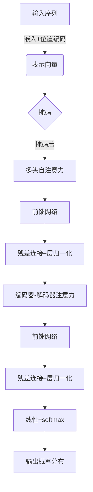

# 大语言模型应用指南：Transformer解码器详解

## 1.背景介绍

随着深度学习技术的不断发展,自然语言处理(NLP)领域取得了令人瞩目的进步。传统的序列模型如RNN(循环神经网络)和LSTM(长短期记忆网络)由于存在梯度消失、计算效率低下等问题,难以有效处理长序列数据。2017年,Transformer模型应运而生,其全注意力机制和并行计算能力使其在机器翻译、文本生成等任务中取得了卓越的表现,成为NLP领域的里程碑式创新。

Transformer是一种基于注意力机制的序列到序列(Seq2Seq)模型,主要由编码器(Encoder)和解码器(Decoder)两部分组成。编码器将输入序列编码为高维向量表示,解码器则根据编码器的输出和前一时间步的预测结果,生成下一个token。Transformer模型的核心创新在于完全放弃了RNN的递归结构,利用多头注意力机制直接对序列中任意两个位置之间的元素进行计算,从而有效解决了长期依赖问题。

## 2.核心概念与联系

### 2.1 自注意力机制(Self-Attention)

自注意力机制是Transformer模型的核心,它允许输入序列中的每个位置都可以关注到其他位置的信息。具体来说,对于序列中的任意一个位置,通过计算其与序列中所有其他位置的相似性得分(注意力权重),然后对所有位置的向量表示进行加权求和,得到该位置的新表示。这种全局关注的方式使得模型能够更好地捕捉长距离依赖关系。

自注意力机制可以形式化表示为:

$$\mathrm{Attention}(Q, K, V) = \mathrm{softmax}(\frac{QK^T}{\sqrt{d_k}})V$$

其中$Q$为查询(Query)向量,$K$为键(Key)向量,$V$为值(Value)向量,它们通常是输入序列经过不同的线性变换得到的。$d_k$是缩放因子,用于防止内积过大导致softmax函数的梯度较小。

### 2.2 多头注意力机制(Multi-Head Attention)

为了捕捉不同的子空间表示,Transformer引入了多头注意力机制。具体来说,将查询、键和值分别线性映射为$h$个子空间,分别计算注意力,然后将所有注意力的结果拼接起来作为最终的注意力表示:

$$\begin{aligned}
\mathrm{MultiHead}(Q, K, V) &= \mathrm{Concat}(\mathrm{head}_1, \dots, \mathrm{head}_h)W^O\\
\mathrm{head}_i &= \mathrm{Attention}(QW_i^Q, KW_i^K, VW_i^V)
\end{aligned}$$

其中$W_i^Q\in\mathbb{R}^{d_\text{model}\times d_k}, W_i^K\in\mathbb{R}^{d_\text{model}\times d_k}, W_i^V\in\mathbb{R}^{d_\text{model}\times d_v}$是可学习的线性变换参数,$W^O\in\mathbb{R}^{hd_v\times d_\text{model}}$是最终的线性变换。

### 2.3 位置编码(Positional Encoding)

由于Transformer没有捕捉序列顺序的递归结构,因此需要一些额外的位置信息来赋予序列元素位置属性。位置编码是将元素在序列中的相对或绝对位置编码为向量,并将其加入到输入的嵌入向量中。

常用的位置编码方式是正弦位置编码,对于序列中第$i$个位置,其编码向量的第$j$个元素为:

$$\begin{aligned}
\mathrm{PE}_{(pos,2i)} &= \sin(pos/10000^{2i/d_\text{model}})\\
\mathrm{PE}_{(pos,2i+1)} &= \cos(pos/10000^{2i/d_\text{model}})
\end{aligned}$$

其中$pos$是位置索引,从0开始;$i$是维度索引,从0开始遍历到$d_\text{model}/2-1$。

## 3.核心算法原理具体操作步骤

Transformer解码器的核心算法步骤如下:

1. **输入表示**:将输入序列(如前一时间步的预测结果)映射为嵌入向量表示,并加上位置编码。
2. **掩码(Mask)**:对输入序列进行掩码,使得每个位置只能关注到之前的位置,而不能关注到之后的位置,以保证自回归特性。
3. **多头自注意力**:将掩码后的输入序列输入到多头自注意力层,捕捉序列内元素之间的依赖关系。
4. **前馈网络**:自注意力的输出通过前馈网络进行进一步的非线性变换。
5. **残差连接和层归一化**:将前馈网络的输出与输入相加(残差连接),再进行层归一化,作为下一层的输入。
6. **编码器-解码器注意力**:将编码器的输出作为键(Key)和值(Value),解码器的输出作为查询(Query),通过注意力机制融合编码器的信息。
7. **前馈网络和归一化**:重复步骤4和5。
8. **线性和softmax**:将上一步的输出通过线性层映射为词汇表大小的向量,再通过softmax得到下一个token的概率分布。
9. **迭代**:重复步骤1到8,生成整个输出序列。

以上步骤在Transformer解码器的每一层中重复进行,通过层与层之间的残差连接和归一化操作,实现了高效的信息传递。

## 4.数学模型和公式详细讲解举例说明

在Transformer解码器中,自注意力机制和编码器-解码器注意力机制是两个核心部分,我们将详细介绍它们的数学模型。

### 4.1 自注意力机制

自注意力机制的计算过程可以分为以下几个步骤:

1. **线性映射**:将输入序列$X$分别映射为查询(Query)、键(Key)和值(Value)向量:

$$\begin{aligned}
Q &= XW^Q\\
K &= XW^K\\
V &= XW^V
\end{aligned}$$

其中$W^Q\in\mathbb{R}^{d_\text{model}\times d_k}$,$W^K\in\mathbb{R}^{d_\text{model}\times d_k}$,$W^V\in\mathbb{R}^{d_\text{model}\times d_v}$是可学习的线性变换参数。

2. **计算注意力分数**:计算查询向量$Q$与所有键向量$K$的点积,并除以缩放因子$\sqrt{d_k}$:

$$\mathrm{score}(Q, K) = \frac{QK^T}{\sqrt{d_k}}$$

3. **掩码(Mask)**:对于解码器的自注意力,需要对注意力分数进行掩码,使得每个位置只能关注到之前的位置。设$M$为掩码张量,其中$M_{ij}=0$表示位置$j$可以关注位置$i$,$M_{ij}=-\infty$表示位置$j$不能关注位置$i$。则有:

$$\mathrm{score}_\text{masked} = \mathrm{score}(Q, K) + M$$

4. **softmax**:对掩码后的注意力分数进行softmax操作,得到注意力权重:

$$\mathrm{Attention}(Q, K, V) = \mathrm{softmax}(\mathrm{score}_\text{masked})V$$

5. **多头注意力**:将上述过程重复$h$次(即多头注意力机制),最后将所有注意力的结果拼接:

$$\begin{aligned}
\mathrm{head}_i &= \mathrm{Attention}(QW_i^Q, KW_i^K, VW_i^V)\\
\mathrm{MultiHead}(Q, K, V) &= \mathrm{Concat}(\mathrm{head}_1, \dots, \mathrm{head}_h)W^O
\end{aligned}$$

其中$W_i^Q,W_i^K,W_i^V$是每个头的线性变换参数,$W^O$是最终的线性变换。

以上就是自注意力机制的完整数学模型。下面我们通过一个简单的例子来说明自注意力的计算过程。

**例子**:假设输入序列为$X=\begin{bmatrix}x_1\\x_2\\x_3\end{bmatrix}$,查询向量$Q$、键向量$K$和值向量$V$分别为:

$$\begin{aligned}
Q &= \begin{bmatrix}q_1\\q_2\\q_3\end{bmatrix}, &
K &= \begin{bmatrix}k_1\\k_2\\k_3\end{bmatrix}, &
V &= \begin{bmatrix}v_1\\v_2\\v_3\end{bmatrix}
\end{aligned}$$

计算注意力分数:

$$\mathrm{score}(Q, K) = \begin{bmatrix}
q_1\cdot k_1 & q_1\cdot k_2 & q_1\cdot k_3\\
q_2\cdot k_1 & q_2\cdot k_2 & q_2\cdot k_3\\
q_3\cdot k_1 & q_3\cdot k_2 & q_3\cdot k_3
\end{bmatrix}$$

假设掩码张量为:

$$M = \begin{bmatrix}
0 & -\infty & -\infty\\
0 & 0 & -\infty\\
0 & 0 & 0
\end{bmatrix}$$

则掩码后的注意力分数为:

$$\mathrm{score}_\text{masked} = \mathrm{score}(Q, K) + M$$

对$\mathrm{score}_\text{masked}$的每一行做softmax,得到注意力权重矩阵$\alpha$:

$$\alpha = \begin{bmatrix}
\alpha_{11} & \alpha_{12} & \alpha_{13}\\
\beta_{21} & \beta_{22} & \beta_{23}\\
\gamma_{31} & \gamma_{32} & \gamma_{33}
\end{bmatrix}$$

其中$\alpha_{ij}$表示位置$i$对位置$j$的注意力权重。最终的自注意力输出为:

$$\mathrm{Attention}(Q, K, V) = \begin{bmatrix}
\alpha_{11}v_1 + \alpha_{12}v_2 + \alpha_{13}v_3\\
\beta_{21}v_1 + \beta_{22}v_2 + \beta_{23}v_3\\
\gamma_{31}v_1 + \gamma_{32}v_2 + \gamma_{33}v_3
\end{bmatrix}$$

可以看出,每个位置的输出向量是其他所有位置的值向量的加权和,权重由注意力分数决定。这种全局关注的方式使得模型能够更好地捕捉长距离依赖关系。

### 4.2 编码器-解码器注意力机制

编码器-解码器注意力机制的计算过程与自注意力机制类似,不同之处在于查询向量来自解码器,而键和值向量来自编码器的输出。具体步骤如下:

1. **线性映射**:将解码器的输出$S$映射为查询向量$Q$,将编码器的输出$H$分别映射为键向量$K$和值向量$V$:

$$\begin{aligned}
Q &= SW^Q\\
K &= HW^K\\
V &= HW^V
\end{aligned}$$

其中$W^Q\in\mathbb{R}^{d_\text{model}\times d_k}$,$W^K\in\mathbb{R}^{d_\text{model}\times d_k}$,$W^V\in\mathbb{R}^{d_\text{model}\times d_v}$是可学习的线性变换参数。

2. **计算注意力分数**:计算查询向量$Q$与所有键向量$K$的点积,并除以缩放因子$\sqrt{d_k}$:

$$\mathrm{score}(Q, K) = \frac{QK^T}{\sqrt{d_k}}$$

3. **softmax**:对注意力分数进行softmax操作,得到注意力权重:

$$\mathrm{Attention}(Q, K, V) = \mathrm{softmax}(\mathrm{score}(Q, K))V$$

4. **多头注意力**:将上述过程重复$h$次