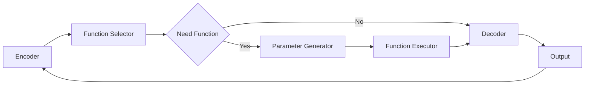

# 大语言模型应用指南：function calling

## 1. 背景介绍

### 1.1 大语言模型概述
大语言模型(Large Language Model, LLM)是近年来自然语言处理(NLP)领域最重要的突破之一。它们是在海量文本数据上训练的神经网络模型,能够学习语言的统计规律和语义知识,具有强大的语言理解和生成能力。代表模型有GPT系列、BERT、T5等。

### 1.2 大语言模型的应用
大语言模型凭借其出色的zero-shot和few-shot学习能力,在问答、对话、文本生成、知识推理等诸多NLP任务上取得了显著成果。但目前大模型主要还是以API调用的方式提供服务,难以灵活适配和优化,限制了它们在更多垂直领域的应用。

### 1.3 Function Calling的提出
为了进一步提升大模型的可用性和适用性,学界和业界都在积极探索创新的应用范式。Function Calling就是其中很有前景的一个方向。它允许将外部函数和知识库与语言模型无缝结合,通过函数调用的方式来补充和增强大模型的能力,从而实现更加智能和个性化的应用。本文将重点介绍Function Calling的核心概念、原理和实践。

## 2. 核心概念与联系

### 2.1 Function Calling的定义
Function Calling是指在大语言模型的生成过程中,通过一定的机制来调用外部函数,访问额外的知识和执行特定的操作,并将函数的返回结果再反馈给语言模型,引导后续文本的生成。可以将其理解为语言模型与函数之间的交互对话。

### 2.2 涉及的关键概念
- 语言模型(Language Model):以自回归或编码器-解码器等架构,在大规模语料上训练的神经网络模型,用于建模自然语言。
- 外部函数(External Function):独立于语言模型的程序或API,提供特定领域的知识查询和任务处理能力。
- 函数签名(Function Signature):描述函数的元信息,包括函数名、输入参数、返回值类型等。
- 函数注册(Function Registration):将外部函数的签名信息注册到语言模型中,使其可被模型识别和调用。
- 模型微调(Model Fine-tuning):在特定垂直领域数据上对预训练语言模型进行二次训练,以适应该领域的function calling任务。

### 2.3 与传统API调用的区别
传统的API调用通常是面向开发者的,调用者需要明确指定API的参数和调用逻辑。而Function Calling是将API与语言模型深度融合,让模型自主学习何时调用哪些函数,并根据函数结果动态生成后续内容。这使得最终用户可以用自然语言与系统交互,而无需了解API细节。

### 2.4 与提示工程的关系
Function Calling可以视为提示工程(Prompt Engineering)的一种扩展。传统的提示工程是在输入中加入一些示例、指令等先验知识,引导模型生成期望的输出。而Function Calling进一步允许在生成过程中动态引入外部函数,使得先验知识不再局限于静态的文本形式。二者可以协同使用,互相补充。

## 3. 核心算法原理与操作步骤

### 3.1 模型架构
Function Calling需要对传统的语言模型架构进行一定改造,主要分为以下几个模块:

- 编码器(Encoder):将输入文本转换为语义向量表示。
- 函数选择器(Function Selector):根据当前的语义向量和对话历史,决定是否需要调用外部函数,如果需要则选择要调用的函数。
- 参数生成器(Parameter Generator):为选定的外部函数生成输入参数。
- 函数执行器(Function Executor):调用外部函数并获取返回结果。
- 解码器(Decoder):根据函数返回结果和当前语义状态,生成下一个单词或句子。

这些模块以交替迭代的方式工作,逐步生成完整的输出文本。下面是用Mermaid流程图表示的核心架构:



### 3.2 训练过程
Function Calling模型的训练过程可分为两个阶段:预训练和微调。

#### 3.2.1 预训练阶段
在大规模通用语料上对模型进行自监督预训练,学习语言的基本语法、语义和常识。预训练的目标是最大化下一个单词或句子的概率。常见的预训练任务有:

- 语言模型:给定前面的文本,预测下一个单词。
- 去噪自编码:随机遮挡部分输入,预测被遮挡的内容。
- 对比学习:最大化正例文本对的相似度,最小化负例文本对的相似度。

预训练阶段一般不涉及具体的外部函数,主要是为后续的微调打好基础。

#### 3.2.2 微调阶段
在垂直领域数据上对预训练模型进行微调,引入领域特定的外部函数。微调的数据格式为(context, function signature, input arguments, output, response),即给定对话上下文、函数签名和输入参数,要求模型生成函数输出和最终回复。微调的损失函数包括:

- 函数选择损失:最大化选择正确函数的概率。
- 参数生成损失:最大化生成正确输入参数的概率。
- 语言建模损失:最大化生成函数输出和最终回复的概率。

通过联合优化这些损失函数,使模型学会在合适的时机调用合适的函数,并根据函数结果生成连贯的回复。

### 3.3 推理过程
模型训练完成后,就可以用于实际的推理任务。给定用户输入的query,模型的推理过程如下:

1. 将query编码为语义向量。
2. 根据语义向量和对话历史决定是否需要调用函数:
   - 如果不需要,则直接进入解码器生成回复。
   - 如果需要,则进入下一步。
3. 选择要调用的函数,并生成输入参数。
4. 执行函数调用,并将函数返回结果作为解码器的附加输入。
5. 解码器根据语义向量、函数结果和对话历史,生成最终回复。
6. 将生成的回复返回给用户,同时更新对话历史。
7. 重复步骤1-6,直到对话结束。

## 4. 数学建模与公式推导

### 4.1 符号定义
为了便于理解,我们先定义一些符号:

- $x$:输入文本序列,表示为单词的one-hot向量。
- $h$:输入文本序列的语义向量表示。
- $f$:外部函数签名,包括函数名和参数类型。
- $a$:函数的输入参数。
- $o$:函数的输出结果。
- $y$:最终生成的回复文本。
- $\theta$:模型的参数,包括编码器、解码器、函数选择器和参数生成器的权重。

### 4.2 函数选择
函数选择器根据当前的语义向量$h$和候选函数集合$F$,计算每个函数被调用的概率:

$$
P(f|h) = \frac{\exp(e_f^T W_f h)}{\sum_{f'\in F} \exp(e_{f'}^T W_f h)}
$$

其中$e_f$是函数$f$的嵌入向量,$W_f$是学习矩阵。函数选择器的目标是最大化正确函数的概率:

$$
L_{select} = -\log P(f^*|h)
$$

其中$f^*$是真实调用的函数。

### 4.3 参数生成
参数生成器为选定的函数$f$生成输入参数$a$。假设函数有$k$个参数,每个参数由$n$个单词组成,则参数生成器的输出是一个$k\times n$的矩阵$A$。生成第$i$个参数的第$j$个单词的概率为:

$$
P(a_{ij}|h,f,a_{<ij}) = \text{softmax}(W_a[h;e_f;e_{a<ij}])
$$

其中$e_{a<ij}$是已生成参数单词的嵌入向量。参数生成器的目标是最大化所有参数单词的概率:

$$
L_{param} = -\sum_{i=1}^k \sum_{j=1}^n \log P(a_{ij}^*|h,f,a_{<ij}^*)
$$

其中$a^*$是真实的参数值。

### 4.4 语言建模
解码器根据语义向量$h$、函数签名$f$、函数输出$o$和已生成回复$y_{<t}$,预测下一个单词$y_t$的概率:

$$
P(y_t|h,f,o,y_{<t}) = \text{softmax}(W_y[h;e_f;e_o;e_{y<t}]) 
$$

其中$e_o$和$e_{y<t}$分别是函数输出和已生成回复的嵌入向量。解码器的目标是最大化整个回复序列的概率:

$$
L_{lm} = -\sum_{t=1}^T \log P(y_t^*|h,f,o,y_{<t}^*)
$$

其中$y^*$是真实的回复序列。

### 4.5 联合优化
Function Calling模型的最终训练目标是最小化函数选择、参数生成和语言建模的联合损失:

$$
L = L_{select} + L_{param} + L_{lm}
$$

通过反向传播算法来更新模型参数$\theta$,使损失函数最小化:

$$
\theta^* = \arg\min_\theta L
$$

## 5. 代码实践

下面我们用PyTorch实现一个简单的Function Calling模型。为了聚焦核心逻辑,代码进行了适当简化。

```python
import torch
import torch.nn as nn

class FunctionCallingModel(nn.Module):
    def __init__(self, vocab_size, hidden_size, num_functions):
        super().__init__()
        self.encoder = nn.LSTM(vocab_size, hidden_size, batch_first=True)
        self.func_selector = nn.Linear(hidden_size, num_functions)
        self.param_generator = nn.LSTM(hidden_size, hidden_size, batch_first=True)
        self.decoder = nn.LSTM(vocab_size+hidden_size, hidden_size, batch_first=True)
        self.output_layer = nn.Linear(hidden_size, vocab_size)
        
    def forward(self, input_ids, func_ids, arg_ids, output_ids):
        # 编码输入文本
        _, (h, _) = self.encoder(input_ids)
        
        # 选择要调用的函数
        func_logits = self.func_selector(h)
        func_loss = nn.CrossEntropyLoss()(func_logits, func_ids)
        
        # 生成函数参数
        _, (arg_h, _) = self.param_generator(h)
        arg_logits = self.output_layer(arg_h)
        arg_loss = nn.CrossEntropyLoss()(arg_logits.view(-1, arg_logits.size(-1)), arg_ids.view(-1))
        
        # 执行函数调用(这里用随机向量模拟)
        func_output = torch.randn(h.size())
        
        # 解码生成回复
        decoder_input = torch.cat((input_ids, func_output.unsqueeze(1).repeat(1, input_ids.size(1), 1)), dim=-1)
        decoder_output, _ = self.decoder(decoder_input, (h, h))
        output_logits = self.output_layer(decoder_output)
        output_loss = nn.CrossEntropyLoss()(output_logits.view(-1, output_logits.size(-1)), output_ids.view(-1))
        
        return func_loss, arg_loss, output_loss
        
model = FunctionCallingModel(vocab_size=10000, hidden_size=512, num_functions=100)
optimizer = torch.optim.Adam(model.parameters(), lr=1e-4)

for epoch in range(num_epochs):
    for batch in data_loader:
        input_ids, func_ids, arg_ids, output_ids = batch
        func_loss, arg_loss, output_loss = model(input_ids, func_ids, arg_ids, output_ids)
        loss = func_loss + arg_loss + output_loss
        
        optimizer.zero_grad()
        loss.backward()
        optimizer.step()
```

上面的代码定义了一个基于LSTM的Function Calling模型,包括编码器、函数选择器、参数生成器和解码器四个部分。模型的输入是input_ids(用户query)、func_ids(真实调用的函数)、arg_ids(真实的参数值)和output_ids(真实的回复),输出是这些目标的预测概率。训练时通过最小化