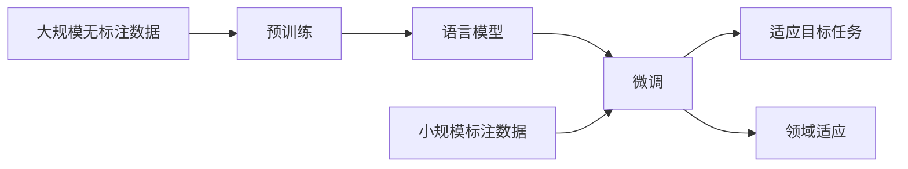

# 大语言模型应用指南：基于微调的工具

## 1. 背景介绍

### 1.1 大语言模型的兴起

近年来,随着深度学习技术的飞速发展,大型语言模型(Large Language Models, LLMs)开始崭露头角。这些模型通过在海量文本数据上进行预训练,能够学习到丰富的语言知识和通用的语言理解能力。代表性的大语言模型包括GPT系列、BERT、T5等。

### 1.2 大语言模型的局限性

尽管大语言模型展现出了强大的性能,但它们在实际应用中仍然存在一些局限性:

1. 通用性不足:预训练的大语言模型对下游任务的适应性有限,难以直接应用于特定领域。
2. 资源消耗大:训练和推理大语言模型需要消耗大量的计算资源和存储空间。
3. 可解释性差:大语言模型的内部机制较为复杂,缺乏可解释性,难以分析其决策过程。

### 1.3 基于微调的解决方案

为了克服大语言模型的局限性,业界提出了基于微调(Fine-tuning)的解决方案。通过在特定任务的小规模数据集上对预训练模型进行微调,可以使模型更好地适应目标任务,提高性能和效率。本文将重点探讨基于微调的大语言模型应用指南。

## 2. 核心概念与联系

### 2.1 预训练(Pre-training)

预训练是指在大规模无标注数据上训练语言模型的过程。通过自监督学习的方式,模型可以学习到语言的通用表征和知识。常见的预训练任务包括语言模型、掩码语言模型等。预训练使得模型具备了一定的语言理解能力,为后续的微调奠定基础。

### 2.2 微调(Fine-tuning) 

微调是指在预训练模型的基础上,使用特定任务的小规模标注数据对模型进行进一步训练的过程。通过微调,模型可以学习到任务特定的知识和技能,更好地适应目标任务。微调通常只需要较少的计算资源和训练时间,是一种高效的模型适应方法。

### 2.3 迁移学习(Transfer Learning)

迁移学习是指将在源任务上学习到的知识迁移到目标任务中,以提高目标任务的性能。大语言模型的预训练可以看作是一种迁移学习,将在大规模语料上学习到的通用语言知识迁移到下游任务中。微调则是在迁移学习的基础上,进一步适应目标任务的一种方法。

### 2.4 领域适应(Domain Adaptation)

领域适应是指将模型从源领域迁移到目标领域的过程。不同领域的文本数据在语言风格、词汇分布等方面存在差异,直接将源领域训练的模型应用于目标领域可能会导致性能下降。通过微调,可以使模型适应目标领域的特点,提高领域内的性能。

以下是核心概念之间的关系示意图:



## 3. 核心算法原理与具体操作步骤

### 3.1 预训练算法

#### 3.1.1 语言模型(Language Modeling)

语言模型的目标是根据上文预测下一个词的概率分布。给定一个文本序列 $x=(x_1,x_2,...,x_T)$,语言模型的概率可以表示为:

$$P(x)=\prod_{t=1}^T P(x_t|x_<t)$$

其中,$x_<t$ 表示 $x_t$ 之前的所有词。训练语言模型通常使用最大似然估计,最小化负对数似然损失:

$$L_{LM}=-\sum_{t=1}^T \log P(x_t|x_<t)$$

#### 3.1.2 掩码语言模型(Masked Language Modeling)

掩码语言模型是BERT提出的一种预训练任务。其基本思想是随机掩盖一部分输入词,然后让模型根据上下文预测被掩盖的词。具体步骤如下:

1. 随机选择输入序列中15%的词进行掩码
2. 将选中的词替换为[MASK]标记、保持不变或随机替换为其他词,比例为80%、10%和10%
3. 使用掩码后的序列作为输入,让模型预测被掩盖位置的原始词
4. 计算预测词的交叉熵损失,并进行梯度反向传播

掩码语言模型的损失函数可以表示为:

$$L_{MLM}=-\sum_{i\in masked} \log P(x_i|x_{\setminus masked})$$

其中,$masked$表示被掩盖的位置集合,$x_{\setminus masked}$表示去掉掩码位置后的输入序列。

### 3.2 微调算法

#### 3.2.1 常见微调方法

1. 特定任务微调:在预训练模型的基础上,根据目标任务的训练数据进行微调。通常只需要修改模型的输出层,适应任务的类别数或格式要求。

2. 多任务微调:同时在多个任务上对模型进行微调,共享底层的语言表征。多任务学习可以提高模型的泛化能力和鲁棒性。

3. 持续学习:在已微调的模型基础上,持续使用新的数据对模型进行增量训练。持续学习可以使模型不断适应新的数据分布和任务要求。

#### 3.2.2 微调流程

1. 准备目标任务的训练数据,包括输入文本和对应的标签。
2. 加载预训练的语言模型,根据任务要求修改输出层。
3. 使用训练数据对模型进行微调,通常使用较小的学习率。
4. 在验证集上评估微调后的模型性能,根据需要调整超参数。
5. 使用微调后的模型对测试集或实际应用数据进行推理。

微调的核心思想可以用下面的公式表示:

$$\theta^*=\arg\min_\theta L_{finetune}(D_{train};\theta)$$

其中,$\theta$表示模型参数,$D_{train}$表示目标任务的训练数据集,$L_{finetune}$表示微调阶段的损失函数。通过最小化损失函数,可以使模型适应目标任务。

## 4. 数学模型与公式详解

### 4.1 Transformer 模型

Transformer是大语言模型的主流架构,其核心是自注意力机制和前馈神经网络。Transformer的编码器可以表示为:

$$\begin{aligned}
Q,K,V &= XW_Q,XW_K,XW_V \\
Attention(Q,K,V) &= softmax(\frac{QK^T}{\sqrt{d_k}})V \\
Z &= Attention(Q,K,V) \\
H &= LayerNorm(Z+X) \\
O &= ReLU(HW_1+b_1)W_2+b_2 \\
Output &= LayerNorm(O+H)
\end{aligned}$$

其中,$X$表示输入序列的嵌入表示,$W_Q,W_K,W_V$分别是查询、键、值的线性变换矩阵,$d_k$是键向量的维度。$LayerNorm$表示层归一化,$ReLU$是激活函数。

Transformer的解码器与编码器类似,但在计算自注意力时引入了掩码机制,防止模型利用未来的信息。解码器的自注意力可以表示为:

$$Attention(Q,K,V)=softmax(\frac{QK^T+M}{\sqrt{d_k}})V$$

其中,$M$是掩码矩阵,对于位置$i$,掩码矩阵的元素$M_{ij}=\begin{cases} 0, & i\leq j \\ -\infty, & i>j \end{cases}$。

### 4.2 微调的损失函数

对于分类任务,微调阶段常用的损失函数是交叉熵损失:

$$L_{CE}=-\sum_{i=1}^N \sum_{c=1}^C y_{ic}\log p_{ic}$$

其中,$N$是训练样本数,$C$是类别数,$y_{ic}$是样本$i$属于类别$c$的真实标签,$p_{ic}$是模型预测样本$i$属于类别$c$的概率。

对于序列标注任务,微调阶段常用的损失函数是条件随机场(CRF)损失:

$$L_{CRF}=-\sum_{i=1}^N \log P(y_i|x_i)$$

其中,$x_i$是输入序列,$y_i$是对应的标签序列。CRF损失考虑了标签之间的转移概率,可以更好地建模序列标注问题。

## 5. 项目实践：代码实例与详解

下面是一个使用PyTorch和Hugging Face Transformers库进行文本分类微调的代码示例:

```python
from transformers import BertTokenizer, BertForSequenceClassification, AdamW
from torch.utils.data import DataLoader

# 加载预训练的BERT模型和分词器
model = BertForSequenceClassification.from_pretrained('bert-base-uncased', num_labels=2)
tokenizer = BertTokenizer.from_pretrained('bert-base-uncased')

# 准备训练数据
train_texts = [...]  # 训练文本列表
train_labels = [...]  # 训练标签列表

# 将文本转换为模型输入
train_encodings = tokenizer(train_texts, truncation=True, padding=True)
train_dataset = Dataset(train_encodings, train_labels)
train_loader = DataLoader(train_dataset, batch_size=16, shuffle=True)

# 定义优化器和学习率调度器
optimizer = AdamW(model.parameters(), lr=2e-5)
scheduler = get_linear_schedule_with_warmup(optimizer, num_warmup_steps=0, num_training_steps=len(train_loader))

# 微调模型
model.train()
for epoch in range(3):
    for batch in train_loader:
        input_ids = batch['input_ids'].to(device)
        attention_mask = batch['attention_mask'].to(device)
        labels = batch['labels'].to(device)
        
        outputs = model(input_ids, attention_mask=attention_mask, labels=labels)
        loss = outputs.loss
        
        loss.backward()
        optimizer.step()
        scheduler.step()
        optimizer.zero_grad()

# 在测试集上评估微调后的模型
model.eval()
...
```

以上代码的主要步骤如下:

1. 加载预训练的BERT模型和分词器,并根据任务的类别数修改输出层。
2. 准备训练数据,将文本转换为模型可接受的输入格式。
3. 定义优化器和学习率调度器,用于控制微调过程中的参数更新。
4. 对模型进行微调,遍历训练数据进行多个epoch的训练。
5. 在测试集上评估微调后的模型性能。

通过合适的微调策略和超参数设置,可以使预训练的语言模型在特定任务上取得优异的性能。

## 6. 实际应用场景

基于微调的大语言模型在各个领域都有广泛的应用,下面列举几个典型的应用场景:

### 6.1 情感分析

情感分析旨在判断文本表达的情感倾向,如正面、负面或中性。将大语言模型微调用于情感分析任务,可以自动识别用户评论、社交媒体帖子等文本的情感倾向,为企业提供舆情监测和用户反馈分析的支持。

### 6.2 命名实体识别

命名实体识别的目标是从文本中识别出人名、地名、机构名等命名实体。基于微调的大语言模型可以学习不同领域的命名实体知识,提高识别的准确性和覆盖度。这在智能问答、信息抽取等应用中有重要作用。

### 6.3 文本摘要

文本摘要是从长文本中提取关键信息,生成简洁明了的摘要。将微调后的大语言模型应用于文本摘要任务,可以自动生成新闻、论文、专利等文档的摘要,提高信息获取和处理的效率。

### 6.4 机器翻译

机器翻译旨在将源语言文本自动转换为目标语言文本。基于微调的大语言模型可以在海量双语语料上进行训练,学习不同语言之间的映射关系。微调后的模型可以提供高质量的翻译结果,助力跨语言交流和信息传播。

### 6.5 对话系统

对话系统是实现人机交互的重要手段。通过在对话数据上微调大语言模型,可以构建出自