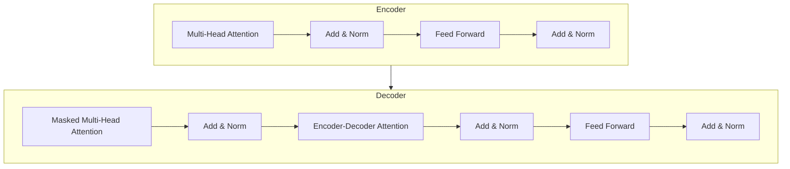

# 大语言模型应用指南：机器学习的过程

## 1. 背景介绍

### 1.1 人工智能的发展历程

人工智能(Artificial Intelligence, AI)是当代科技发展的热点领域之一。自20世纪50年代AI概念被正式提出以来,经历了几个重要的发展阶段。早期的AI系统主要基于符号主义和专家系统,通过编写规则和知识库来模拟人类的推理过程。随后,机器学习(Machine Learning, ML)的兴起使AI系统能够从数据中自动学习模式和规律,极大提高了系统的智能水平。

近年来,benefiting from大数据、强大计算能力和新型算法的发展,AI取得了令人瞩目的进步,尤其是在深度学习(Deep Learning)领域。深度神经网络能够从海量数据中自主学习特征表示,在计算机视觉、自然语言处理等领域展现出超人类的能力。

### 1.2 大语言模型的兴起

作为深度学习在自然语言处理领域的杰出应用,大语言模型(Large Language Model, LLM)凭借其强大的语言理解和生成能力,成为AI发展的重要驱动力。大语言模型通过在海量文本数据上进行预训练,学习到丰富的语义和上下文知识,从而能够胜任广泛的自然语言处理任务,如文本生成、问答系统、机器翻译等。

典型的大语言模型包括GPT(Generative Pre-trained Transformer)系列、BERT(Bidirectional Encoder Representations from Transformers)、XLNet、T5等。这些模型通过transformer结构和自注意力机制捕捉长距离依赖关系,使得模型能够更好地理解和生成长序列文本。大语言模型的出现为AI系统赋予了更强的语言理解和生成能力,推动了自然语言处理技术的飞速发展。

### 1.3 大语言模型应用的机遇与挑战

大语言模型凭借其通用性和强大性,在诸多领域展现出广阔的应用前景,如智能写作辅助、对话系统、知识问答、内容创作等。然而,大语言模型也面临着一些挑战和局限性,例如:

1. **数据质量和偏差**: 预训练数据的质量和代表性直接影响模型的性能和公正性。训练数据中存在的偏差可能导致模型产生不当的输出。
2. **计算资源需求**: 训练大型语言模型需要海量数据和巨大的计算资源,给硬件和能源消耗带来了挑战。
3. **可解释性和可控性**: 大语言模型的内在机理往往是一个黑箱,缺乏可解释性,难以控制模型的输出行为。
4. **隐私和安全性**: 模型可能会泄露或生成敏感信息,存在潜在的隐私和安全风险。
5. **鲁棒性和可靠性**: 模型容易受到对抗性攻击和噪声数据的影响,需要提高鲁棒性和可靠性。

因此,如何充分发挥大语言模型的潜力,同时规避其局限性和风险,是当前研究和应用的重点课题。本文将围绕大语言模型的核心技术、应用场景和实践经验,为读者提供全面的指导和见解。

## 2. 核心概念与联系

### 2.1 机器学习的基本概念

在深入探讨大语言模型之前,我们先回顾一下机器学习的基本概念。机器学习是一门研究如何从数据中自动学习模式和规律的科学,它赋予了计算机在特定任务上的智能。机器学习算法根据任务的不同,可分为以下几种主要类型:

1. **监督学习(Supervised Learning)**: 算法从带有标签的训练数据中学习,目标是找到输入和期望输出之间的映射关系。常见的监督学习任务包括分类、回归等。
2. **无监督学习(Unsupervised Learning)**: 算法从未标注的数据中自动发现内在模式和结构。常见的无监督学习任务包括聚类、降维等。
3. **强化学习(Reinforcement Learning)**: 算法通过与环境交互并获得奖励信号来学习最优策略,常用于决策和控制任务。
4. **半监督学习(Semi-Supervised Learning)**: 算法结合了少量标注数据和大量未标注数据进行学习,旨在利用未标注数据提高模型性能。

机器学习算法通常包括以下几个关键步骤:数据预处理、特征工程、模型选择和训练、模型评估和优化。根据任务的不同,可以选择合适的算法和模型架构。

### 2.2 深度学习和神经网络

深度学习(Deep Learning)是机器学习的一个重要分支,它基于人工神经网络(Artificial Neural Network, ANN)模拟人脑的信息处理过程。神经网络由多层节点(神经元)组成,每层通过权重连接进行信息传递和转换。通过反向传播算法,神经网络可以自动从数据中学习特征表示和模式。

深度神经网络由多个隐藏层构成,能够学习到更加抽象和复杂的特征表示,从而在计算机视觉、自然语言处理等领域展现出卓越的性能。常见的深度学习模型包括卷积神经网络(CNN)、循环神经网络(RNN)、长短期记忆网络(LSTM)等。

### 2.3 自然语言处理和语言模型

自然语言处理(Natural Language Processing, NLP)是人工智能的一个重要分支,旨在使计算机能够理解和生成人类语言。语言模型(Language Model, LM)是NLP中的一种基础模型,用于捕捉语言的统计规律和上下文信息。

传统的语言模型通常基于n-gram或神经网络,用于估计一个词序列的概率分布。近年来,benefiting from深度学习技术的发展,出现了一系列基于transformer结构的大型语言模型,如GPT、BERT等。这些模型通过自注意力机制有效地捕捉长距离依赖关系,在语言理解和生成任务上取得了突破性进展。

### 2.4 大语言模型的核心技术

大语言模型的核心技术主要包括以下几个方面:

1. **Transformer结构**: Transformer是一种全新的基于注意力机制的序列到序列模型,能够有效捕捉长距离依赖关系,成为大语言模型的基础架构。
2. **自注意力机制**: 自注意力机制允许每个位置的输出与输入序列的所有位置相关联,捕捉全局依赖关系,是Transformer的关键创新。
3. **预训练和微调**: 大语言模型通过在海量文本数据上进行无监督预训练,学习到丰富的语义和上下文知识。然后可以在特定任务上进行微调(fine-tuning),快速适应新任务。
4. **模型压缩和蒸馏**: 为了降低大型模型的计算和存储开销,可以采用模型压缩(如量化、剪枝)和知识蒸馏等技术,在保持性能的同时减小模型大小。

通过上述核心技术,大语言模型能够在广泛的自然语言处理任务上展现出卓越的性能,推动了人工智能在语言理解和生成方面的重大进展。

## 3. 核心算法原理具体操作步骤

### 3.1 Transformer架构

Transformer是大语言模型的核心架构,它完全基于注意力机制,摒弃了传统序列模型中的循环和卷积结构。Transformer的主要组成部分包括编码器(Encoder)和解码器(Decoder)。

#### 3.1.1 编码器(Encoder)

编码器的主要作用是将输入序列映射为高维向量表示,捕捉输入序列的上下文信息。编码器由多个相同的层组成,每层包括两个子层:

1. **多头自注意力子层(Multi-Head Attention)**: 通过自注意力机制,捕捉输入序列中每个位置与其他位置之间的依赖关系。
2. **前馈神经网络子层(Feed-Forward Neural Network)**: 对每个位置的向量表示进行非线性转换,提取更高层次的特征。

每个子层后面还有一个残差连接(Residual Connection)和层归一化(Layer Normalization)操作,以提高模型的训练稳定性和收敛速度。

#### 3.1.2 解码器(Decoder)

解码器的作用是根据编码器的输出和自身的输入,生成目标序列。解码器也由多个相同的层组成,每层包括三个子层:

1. **掩码多头自注意力子层(Masked Multi-Head Attention)**: 捕捉已生成序列中每个位置与其他位置之间的依赖关系,但屏蔽掉未来位置的信息。
2. **编码器-解码器注意力子层(Encoder-Decoder Attention)**: 将解码器的输出与编码器的输出进行关联,捕捉输入和输出序列之间的依赖关系。
3. **前馈神经网络子层(Feed-Forward Neural Network)**: 对每个位置的向量表示进行非线性转换,提取更高层次的特征。

同样,每个子层后面也有残差连接和层归一化操作。

通过编码器捕捉输入序列的上下文信息,再由解码器生成目标序列,Transformer能够高效地建模长距离依赖关系,成为大语言模型的核心架构。

### 3.2 自注意力机制

自注意力机制(Self-Attention)是Transformer的核心创新,它允许每个位置的输出与输入序列的所有位置相关联,捕捉全局依赖关系。

对于一个长度为 $n$ 的序列 $X = (x_1, x_2, \dots, x_n)$,自注意力机制首先计算每个位置 $i$ 与所有位置 $j$ 的注意力分数 $e_{ij}$:

$$e_{ij} = \frac{(x_iW^Q)(x_jW^K)^T}{\sqrt{d_k}}$$

其中 $W^Q$ 和 $W^K$ 分别是查询(Query)和键(Key)的线性变换矩阵,用于将输入映射到注意力空间。$d_k$ 是缩放因子,用于防止点积过大导致梯度饱和。

然后,通过 Softmax 函数将注意力分数归一化为概率分布 $\alpha_{ij}$:

$$\alpha_{ij} = \frac{e^{e_{ij}}}{\sum_{k=1}^n e^{e_{ik}}}$$

最后,将注意力概率与值(Value)向量 $x_jW^V$ 相乘并求和,得到注意力输出 $y_i$:

$$y_i = \sum_{j=1}^n \alpha_{ij}(x_jW^V)$$

其中 $W^V$ 是值(Value)的线性变换矩阵。

通过自注意力机制,每个位置的输出 $y_i$ 都是输入序列所有位置的加权和,权重由注意力分数决定。这种全局依赖关系的建模能力是自注意力机制的关键优势。

为了进一步捕捉不同子空间的依赖关系,Transformer采用了多头注意力(Multi-Head Attention)机制。具体来说,将查询、键和值分别线性变换为 $h$ 个子空间,在每个子空间中计算自注意力,最后将所有子空间的注意力输出拼接起来:

$$\text{MultiHead}(Q, K, V) = \text{Concat}(head_1, \dots, head_h)W^O$$
$$\text{where } head_i = \text{Attention}(QW_i^Q, KW_i^K, VW_i^V)$$

通过多头注意力机制,Transformer能够从不同的表示子空间捕捉不同的依赖关系,提高了模型的表达能力。

### 3.3 预训练和微调

大语言模型通常采用预训练(Pre-training)和微调(Fine-tuning)的范式,以提高模型的泛化能力和适应性。

#### 3