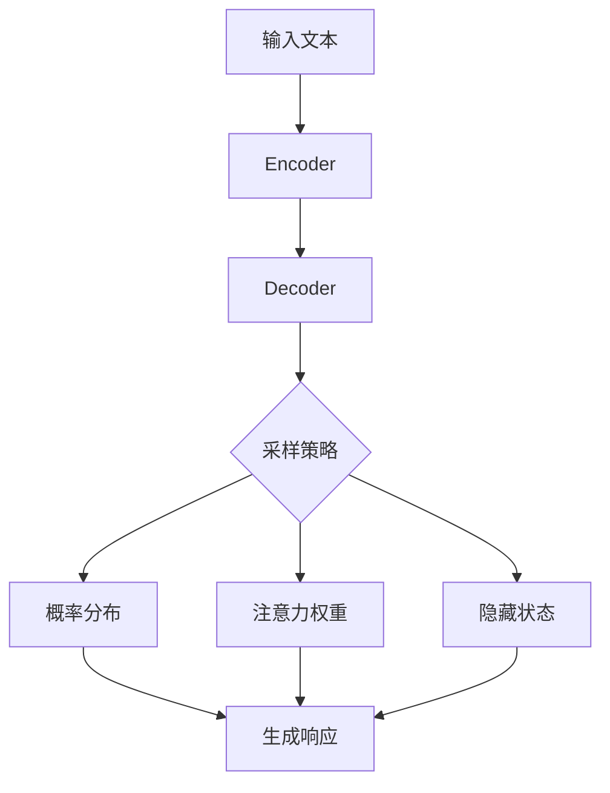

# 大语言模型应用指南：模型响应返回的参数

## 1. 背景介绍
### 1.1 大语言模型的发展历程
#### 1.1.1 早期的语言模型
#### 1.1.2 Transformer的出现
#### 1.1.3 预训练语言模型的崛起

### 1.2 大语言模型的应用现状
#### 1.2.1 自然语言处理领域的广泛应用
#### 1.2.2 跨领域应用的拓展
#### 1.2.3 商业化应用的兴起

### 1.3 模型响应返回参数的重要性
#### 1.3.1 影响用户交互体验
#### 1.3.2 决定下游任务的性能
#### 1.3.3 与模型的可解释性相关

## 2. 核心概念与联系
### 2.1 大语言模型的基本架构
#### 2.1.1 Encoder-Decoder结构
#### 2.1.2 Self-Attention机制
#### 2.1.3 残差连接与Layer Normalization

### 2.2 模型响应生成过程
#### 2.2.1 输入编码
#### 2.2.2 解码器生成
#### 2.2.3 采样策略选择

### 2.3 返回参数的类型与作用
#### 2.3.1 概率分布
#### 2.3.2 注意力权重
#### 2.3.3 隐藏状态



## 3. 核心算法原理与具体操作步骤
### 3.1 Top-k采样
#### 3.1.1 算法原理
#### 3.1.2 伪代码实现
#### 3.1.3 参数选择建议

### 3.2 Top-p(Nucleus)采样
#### 3.2.1 算法原理 
#### 3.2.2 伪代码实现
#### 3.2.3 参数选择建议

### 3.3 Beam Search
#### 3.3.1 算法原理
#### 3.3.2 伪代码实现 
#### 3.3.3 参数选择建议

## 4. 数学模型与公式详解
### 4.1 语言模型的概率公式
$$P(w_1, w_2, ..., w_n) = \prod_{i=1}^{n} P(w_i | w_1, w_2, ..., w_{i-1})$$
其中，$w_i$表示第$i$个单词，$P(w_i | w_1, w_2, ..., w_{i-1})$表示在给定前$i-1$个单词的条件下，第$i$个单词的条件概率。

### 4.2 Softmax函数
$$\text{Softmax}(x_i) = \frac{e^{x_i}}{\sum_{j=1}^{n} e^{x_j}}$$
Softmax函数将一组实数转化为一组概率分布，常用于多分类任务的输出层。

### 4.3 注意力机制的计算
$$\text{Attention}(Q, K, V) = \text{softmax}(\frac{QK^T}{\sqrt{d_k}})V$$
其中，$Q$、$K$、$V$分别表示查询、键、值向量，$d_k$为键向量的维度。注意力机制通过计算查询与键的相似度，对值进行加权求和。

## 5. 项目实践：代码实例与详解
### 5.1 使用PyTorch实现Top-k采样
```python
import torch
import torch.nn.functional as F

def top_k_sampling(logits, k):
    """
    对模型输出的logits进行Top-k采样
    
    Args:
        logits: 模型输出的logits，shape为[batch_size, vocab_size]
        k: 取前k个最大概率的token
        
    Returns:
        indices: 采样得到的token索引，shape为[batch_size, k]
    """
    values, indices = torch.topk(logits, k, dim=-1)
    indices = indices.reshape(-1)
    return indices
```

### 5.2 使用TensorFlow实现Beam Search
```python
import tensorflow as tf

def beam_search(model, input_seq, max_len, beam_width):
    """
    使用Beam Search对模型生成结果进行解码
    
    Args:
        model: 训练好的语言模型
        input_seq: 输入的文本序列
        max_len: 生成结果的最大长度
        beam_width: Beam Search的宽度
        
    Returns:
        best_seq: 解码得到的最优序列
    """
    # 编码输入序列
    encoder_output = model.encoder(input_seq)
    
    # 初始化解码器输入和隐藏状态
    decoder_input = tf.expand_dims([model.bos_id], 0)
    hidden = model.decoder.initialize_hidden_state(encoder_output)
    
    # 初始化候选序列和得分
    candidates = [(decoder_input, hidden, 0)]
    
    # 循环直到达到最大长度或者所有候选序列都以EOS结尾
    for _ in range(max_len):
        all_candidates = []
        for c in candidates:
            decoder_input, hidden, score = c
            logits, hidden = model.decoder(decoder_input, hidden, encoder_output)
            log_probs = tf.math.log(tf.nn.softmax(logits, axis=-1))
            top_k_log_probs, top_k_indices = tf.math.top_k(log_probs, beam_width)
            
            for i in range(beam_width):
                log_prob = top_k_log_probs[0][i]
                index = top_k_indices[0][i]
                new_decoder_input = tf.concat([decoder_input, [[index]]], axis=-1)
                new_score = score + log_prob
                all_candidates.append((new_decoder_input, hidden, new_score))
                
        # 选取得分最高的前beam_width个候选序列
        ordered = sorted(all_candidates, key=lambda tup: tup[2], reverse=True)
        candidates = ordered[:beam_width]
        
    return candidates[0][0]
```

## 6. 实际应用场景
### 6.1 智能客服
#### 6.1.1 客户意图识别与分类
#### 6.1.2 个性化回复生成
#### 6.1.3 多轮对话管理

### 6.2 内容创作
#### 6.2.1 文章写作辅助
#### 6.2.2 广告文案生成
#### 6.2.3 剧本创作灵感

### 6.3 代码生成
#### 6.3.1 代码补全
#### 6.3.2 代码解释
#### 6.3.3 bug修复建议

## 7. 工具与资源推荐
### 7.1 开源实现
- GPT-2/3 (https://github.com/openai/gpt-2) 
- BERT (https://github.com/google-research/bert)
- T5 (https://github.com/google-research/text-to-text-transfer-transformer)

### 7.2 开发框架
- PyTorch (https://pytorch.org/)
- TensorFlow (https://www.tensorflow.org/)
- Hugging Face Transformers (https://huggingface.co/transformers/)

### 7.3 预训练模型
- GPT-3 API (https://beta.openai.com/)
- ERNIE (https://wenxin.baidu.com/)
- BERT Service (https://github.com/hanxiao/bert-as-service)

## 8. 总结：未来发展趋势与挑战
### 8.1 模型的轻量化与移动端部署
### 8.2 个性化与定制化需求不断提高
### 8.3 多模态交互的深度融合
### 8.4 数据隐私与模型安全

## 9. 附录：常见问题与解答
### 9.1 为什么要在采样时添加温度参数？
- 温度参数可以控制生成结果的多样性和确定性，温度越高，生成结果越随机；温度越低，生成结果越趋向于高概率词。通过调节温度，可以在创新性和相关性之间进行平衡。

### 9.2 Beam Search会导致怎样的问题？
- Beam Search倾向于选择概率较高的词，可能会导致生成结果缺乏多样性，出现重复或者通用的回复。此外，Beam Search的计算开销较大，在实时应用中需要权衡效率与效果。

### 9.3 如何权衡模型的泛化能力和个性化程度？
- 泛化能力强的模型可以适应更多的场景，但个性化程度不足；而过于个性化的模型可能难以迁移到新的领域。可以通过在大规模语料上预训练，在特定领域语料上微调，同时控制采样参数，来平衡模型的泛化能力和个性化表现。

作者：禅与计算机程序设计艺术 / Zen and the Art of Computer Programming