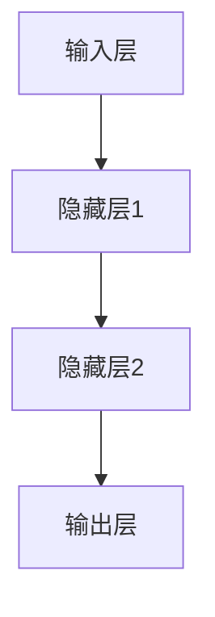
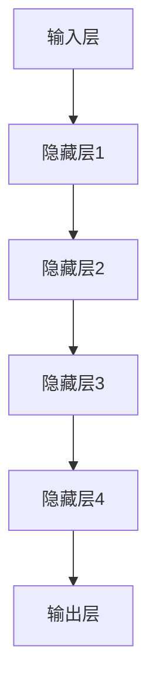
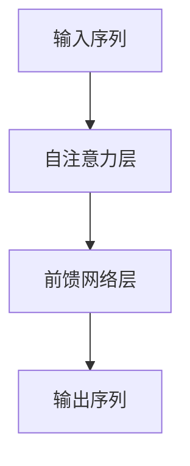
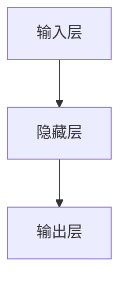
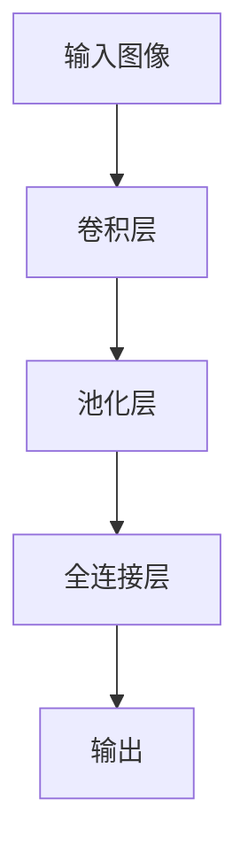
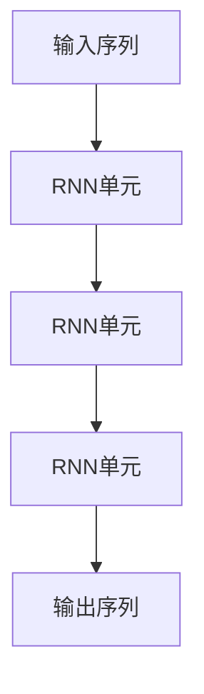

# 大语言模型应用指南：神经网络的发展历史

## 1. 背景介绍

### 1.1 人工智能的兴起

人工智能(Artificial Intelligence, AI)是当代科技发展的前沿领域,近年来受到了前所未有的关注和投资。作为人工智能的核心技术之一,神经网络在语音识别、图像处理、自然语言处理等诸多领域发挥着关键作用。

### 1.2 神经网络简介

神经网络是一种模拟生物神经网络的数学模型,由大量互连的节点(神经元)组成。这些节点接收输入数据,经过加权求和和非线性激活函数的处理,产生输出结果。神经网络具有自适应学习能力,可以从大量数据中自动提取特征模式,用于分类、预测和决策等任务。

### 1.3 大语言模型的重要性

随着数据量的激增和计算能力的提高,大型神经网络模型在自然语言处理领域取得了突破性进展。大语言模型(Large Language Model, LLM)通过在海量文本数据上进行预训练,学习到丰富的语言知识和上下文信息,可以生成高质量、连贯的自然语言文本,为众多应用场景提供强大支持。

## 2. 核心概念与联系

### 2.1 人工神经网络

人工神经网络(Artificial Neural Network, ANN)是一种受生物神经系统启发而设计的计算模型。它由大量互连的节点(神经元)组成,每个节点接收来自其他节点的加权输入,经过激活函数处理后产生输出,并传递给下一层节点。

#### 2.1.1 神经元

神经元是神经网络的基本计算单元,它接收多个输入信号,对这些输入信号进行加权求和,然后通过激活函数产生输出信号。

$$
y = f(\sum_{i=1}^{n}w_ix_i + b)
$$

其中,$y$是神经元的输出,$x_i$是第$i$个输入,$w_i$是对应的权重,$b$是偏置项,而$f$则是激活函数。

#### 2.1.2 网络结构

神经网络通常由多层神经元组成,包括输入层、隐藏层和输出层。输入层接收原始数据,隐藏层对数据进行特征提取和转换,输出层则产生最终的预测或决策结果。

### 2.2 深度学习

深度学习(Deep Learning)是机器学习的一个子领域,它利用具有多个隐藏层的深度神经网络来模拟人类大脑的学习过程,从大量数据中自动提取特征并进行模式识别。

#### 2.2.1 特征学习

传统的机器学习算法需要人工设计特征,而深度学习则可以自动从原始数据中学习到高层次的抽象特征表示。这种端到端的特征学习能力使得深度学习在图像、语音和自然语言处理等领域取得了卓越的成绩。

#### 2.2.2 深度神经网络

深度神经网络通常包含多个隐藏层,每一层对输入数据进行非线性转换,从而学习到更加抽象和复杂的特征表示。随着网络层数的增加,神经网络可以捕捉到更高层次的模式和结构。

### 2.3 大语言模型

大语言模型是一种基于深度神经网络的自然语言处理模型,通过在大规模文本数据上进行预训练,学习到丰富的语言知识和上下文信息。这些模型可以生成高质量、连贯的自然语言文本,并在各种下游任务中表现出色,如文本生成、机器翻译、问答系统等。

#### 2.3.1 预训练与微调

大语言模型通常采用两阶段训练策略:首先在海量文本数据上进行无监督预训练,学习到通用的语言表示;然后在特定任务的标注数据上进行微调,使模型适应具体的应用场景。

#### 2.3.2 自注意力机制

自注意力机制是大语言模型中的关键技术,它允许模型捕捉输入序列中任意两个位置之间的依赖关系,有效地建模长期依赖,提高了模型的表现能力。

## 3. 核心算法原理具体操作步骤

### 3.1 前馈神经网络

前馈神经网络(Feedforward Neural Network, FNN)是最基本的神经网络结构,信息只在单一方向传播,从输入层经过隐藏层到达输出层。

#### 3.1.1 网络结构

前馈神经网络由输入层、隐藏层和输出层组成。每个神经元接收来自上一层的所有输入,经过加权求和和激活函数处理后,将输出传递给下一层的所有神经元。

#### 3.1.2 训练算法

前馈神经网络通常采用反向传播算法(Backpropagation)进行训练。该算法基于梯度下降策略,通过计算损失函数相对于网络权重的梯度,并沿着梯度的反方向更新权重,从而最小化损失函数。

1. 前向传播:输入数据经过网络层层传递,计算输出结果。
2. 计算损失:将输出结果与期望目标进行比较,计算损失函数值。
3. 反向传播:从输出层开始,计算损失函数相对于每一层权重的梯度。
4. 权重更新:根据梯度值,沿着梯度的反方向更新网络权重。
5. 重复上述步骤,直至收敛或达到最大迭代次数。

### 3.2 卷积神经网络

卷积神经网络(Convolutional Neural Network, CNN)是一种专门用于处理网格结构数据(如图像)的神经网络,通过局部连接和权重共享的方式,有效地提取图像的空间特征。

#### 3.2.1 卷积层

卷积层是CNN的核心部分,它由多个小型滤波器(卷积核)组成。每个卷积核在输入数据上滑动,执行卷积操作,提取局部特征。

#### 3.2.2 池化层

池化层通常在卷积层之后,对卷积特征图进行下采样,减小特征图的空间维度。常用的池化操作包括最大池化和平均池化。

#### 3.2.3 训练算法

CNN通常采用反向传播算法进行训练,但由于卷积层和池化层的特殊结构,需要对梯度计算进行相应的修改。

1. 前向传播:输入数据经过卷积层、池化层和全连接层,计算输出结果。
2. 计算损失:将输出结果与期望目标进行比较,计算损失函数值。
3. 反向传播:从输出层开始,计算损失函数相对于每一层权重的梯度,对于卷积层和池化层需要进行特殊处理。
4. 权重更新:根据梯度值,沿着梯度的反方向更新网络权重。
5. 重复上述步骤,直至收敛或达到最大迭代次数。

### 3.3 循环神经网络

循环神经网络(Recurrent Neural Network, RNN)是一种专门用于处理序列数据(如文本、语音)的神经网络,它能够捕捉序列中的长期依赖关系。

#### 3.3.1 RNN单元

RNN的基本单元是一个具有循环连接的神经元,它不仅接收当前时刻的输入,还接收上一时刻的隐藏状态,从而能够建模序列数据的动态变化。

#### 3.3.2 长短期记忆网络

长短期记忆网络(Long Short-Term Memory, LSTM)是RNN的一种改进版本,它引入了门控机制,可以有效地解决传统RNN在长序列上的梯度消失或爆炸问题。

#### 3.3.3 训练算法

RNN通常采用反向传播算法进行训练,但由于存在循环连接,需要使用反向传播通过时间(Backpropagation Through Time, BPTT)算法来计算梯度。

1. 前向传播:输入序列依次经过RNN单元,计算每个时刻的输出。
2. 计算损失:将最后一个时刻的输出与期望目标进行比较,计算损失函数值。
3. 反向传播:从最后一个时刻开始,沿着时间反向传播,计算每个时刻的梯度。
4. 权重更新:根据累积的梯度值,沿着梯度的反方向更新网络权重。
5. 重复上述步骤,直至收敛或达到最大迭代次数。

## 4. 数学模型和公式详细讲解举例说明

### 4.1 前馈神经网络

前馈神经网络的数学模型可以表示为:

$$
y = f(W^{(L)}a^{(L-1)} + b^{(L)})
$$

其中:
- $y$是输出层的输出向量
- $L$是网络的层数
- $W^{(L)}$是第$L$层的权重矩阵
- $a^{(L-1)}$是第$L-1$层的激活输出向量
- $b^{(L)}$是第$L$层的偏置向量
- $f$是激活函数,如sigmoid、ReLU等

在训练过程中,我们需要最小化损失函数$J(W, b)$,其中$W$和$b$分别表示网络中所有的权重和偏置。常用的损失函数包括均方误差(Mean Squared Error, MSE)和交叉熵(Cross-Entropy)等。

通过反向传播算法,我们可以计算损失函数相对于权重和偏置的梯度:

$$
\frac{\partial J}{\partial W^{(l)}} = \frac{\partial J}{\partial a^{(l)}} \cdot \frac{\partial a^{(l)}}{\partial z^{(l)}} \cdot \frac{\partial z^{(l)}}{\partial W^{(l)}}
$$

$$
\frac{\partial J}{\partial b^{(l)}} = \frac{\partial J}{\partial a^{(l)}} \cdot \frac{\partial a^{(l)}}{\partial z^{(l)}} \cdot \frac{\partial z^{(l)}}{\partial b^{(l)}}
$$

其中,$z^{(l)}$是第$l$层的加权输入。根据梯度值,我们可以使用梯度下降法更新权重和偏置:

$$
W^{(l)} \leftarrow W^{(l)} - \alpha \frac{\partial J}{\partial W^{(l)}}
$$

$$
b^{(l)} \leftarrow b^{(l)} - \alpha \frac{\partial J}{\partial b^{(l)}}
$$

其中,$\alpha$是学习率,控制更新步长的大小。

### 4.2 卷积神经网络

卷积神经网络中,卷积层的操作可以表示为:

$$
a^{(l)}_{i,j,k} = f\left(\sum_{m,n,p}W^{(l)}_{m,n,p,k} \cdot a^{(l-1)}_{i+m,j+n,p} + b^{(l)}_k\right)
$$

其中:
- $a^{(l)}_{i,j,k}$是第$l$层第$k$个特征图在$(i,j)$位置的输出
- $W^{(l)}_{m,n,p,k}$是第$l$层第$k$个卷积核的权重
- $a^{(l-1)}_{i+m,j+n,p}$是第$l-1$层第$p$个特征图在$(i+m,j+n)$位置的输入
- $b^{(l)}_k$是第$l$层第$k$个特征图的偏置

池化层通常采用最大池化或平均池化操作,将特征