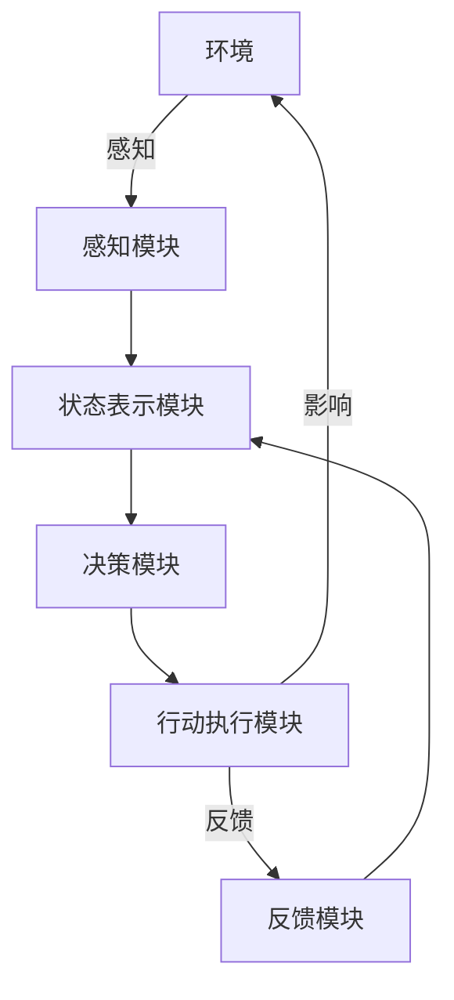

# 大语言模型应用指南：自主Agent系统案例分析（一）

## 1. 背景介绍

### 1.1 人工智能的发展历程

人工智能(Artificial Intelligence, AI)是当代科技发展的重要领域,旨在使机器能够模仿人类的认知功能,如学习、推理、感知和行为能力。自20世纪50年代AI概念被正式提出以来,经历了几个重要的发展阶段。

#### 1.1.1 早期探索时期(1950-1970年代)

在这一时期,研究者们主要集中在构建专家系统、机器学习算法和逻辑推理系统等基础理论和技术上。这一阶段的代表性成果包括专家系统DENDRAL、逻辑推理程序逻辑理论家(Logician)等。

#### 1.1.2 知识驱动时期(1980-1990年代)

这一时期的研究重点转向知识表示和推理,旨在构建大规模知识库系统。代表性系统有CYC知识库、Wolfram Alpha等。然而,这些系统在知识获取和推理效率上存在局限性。

#### 1.1.3 统计学习时期(1990年代至今)

随着数据的快速积累和计算能力的飞速提高,统计机器学习方法成为AI研究的主流范式,包括支持向量机、决策树、贝叶斯网络等。深度学习的兴起进一步推动了AI的发展。

#### 1.1.4 大模型时期(2010年代至今)

近年来,大规模预训练语言模型(Large Pre-trained Language Models, LLMs)成为AI发展的新热点。这些模型通过自监督学习在海量文本数据上预训练,获得了强大的自然语言理解和生成能力,为各种AI应用提供了通用的基础模型。

### 1.2 大语言模型的兴起

大语言模型是一种全新的人工智能范式,具有以下几个关键特征:

1. **规模巨大**: 模型参数量高达数十亿到数万亿,训练数据规模达数十TB到数百TB。
2. **通用能力**: 模型在自然语言处理的多个任务上表现出色,具有广泛的通用能力。
3. **少有监督**: 模型主要通过自监督学习方式在海量文本数据上预训练。
4. **可解释性差**: 模型内部机理复杂,缺乏透明度和可解释性。
5. **存在偏差**: 由于训练数据的局限性,模型可能存在各种偏差和不当行为。

大语言模型的兴起引发了AI发展的新热潮,同时也带来了诸多机遇和挑战。本文将重点探讨如何基于大语言模型构建自主智能Agent系统。

## 2. 核心概念与联系

### 2.1 自主Agent系统

自主Agent系统是指能够在特定环境中感知、决策和行动的智能系统。一个完整的自主Agent系统通常包括以下几个核心组件:

1. **感知模块**: 从环境中获取信息,如视觉、语音等传感器数据。
2. **状态表示模块**: 对感知到的信息进行处理和表示,形成对环境的内部状态表示。
3. **决策模块**: 根据当前状态和目标,规划和选择行动策略。
4. **行动执行模块**: 将决策的行动策略在环境中执行。
5. **反馈模块**: 根据行动的结果,更新Agent的内部状态和决策策略。



### 2.2 大语言模型在Agent系统中的作用

大语言模型可以为自主Agent系统提供强大的自然语言理解和生成能力,在以下几个方面发挥重要作用:

1. **语义理解**: 准确理解自然语言输入的语义,为状态表示模块提供支持。
2. **知识库**: 模型内部蕴含了大量的知识,可作为Agent的知识库使用。
3. **推理决策**: 利用模型的推理和生成能力,为决策模块提供支持。
4. **自然语言交互**: 通过自然语言与人类用户进行交互,实现人机协作。
5. **行动生成**: 根据决策,生成自然语言形式的行动指令。

通过将大语言模型集成到自主Agent系统中,可以显著提高系统的智能水平和交互能力。然而,也存在一些需要解决的关键挑战,例如可解释性、安全性和可控性等。

## 3. 核心算法原理具体操作步骤

### 3.1 自监督预训练

大语言模型的核心算法是自监督预训练(Self-Supervised Pre-training)。该算法的主要思想是:在大规模无标注文本数据上,通过设计合理的自监督任务和目标函数,让模型自主学习文本中蕴含的语义和知识信息。

自监督预训练的具体操作步骤如下:

1. **数据预处理**: 收集和清洗大规模文本数据,构建训练语料库。
2. **模型初始化**: 初始化一个基于Transformer或其变体的大型神经网络模型。
3. **自监督任务构建**: 设计自监督任务,常见的有掩码语言模型(Masked Language Modeling)和下一句预测(Next Sentence Prediction)等。
4. **损失函数设计**: 根据自监督任务,设计合理的损失函数,用于优化模型参数。
5. **模型预训练**: 在训练语料库上,使用自监督任务和损失函数,对模型进行大规模的预训练。
6. **模型评估**: 在下游任务上评估预训练模型的性能,根据需要进行模型微调。

通过自监督预训练,大语言模型能够从海量文本数据中自主学习语义和知识信息,获得强大的自然语言理解和生成能力。

### 3.2 微调和生成

在将大语言模型应用于特定任务时,通常需要对预训练模型进行微调(Fine-tuning)和生成(Generation)操作。

#### 3.2.1 微调

微调是在特定任务的标注数据上,对预训练模型进行进一步训练的过程。具体操作步骤如下:

1. **数据准备**: 收集和标注特定任务的训练数据集。
2. **模型初始化**: 使用预训练模型作为初始化模型。
3. **损失函数设计**: 根据任务目标,设计合理的监督损失函数。
4. **模型微调**: 在任务数据集上,使用监督损失函数对预训练模型进行微调。
5. **模型评估**: 在任务测试集上评估微调后模型的性能。

通过微调,预训练模型可以适应特定任务的数据分布和目标,进一步提高任务性能。

#### 3.2.2 生成

对于自然语言生成任务,可以利用大语言模型的生成能力,根据输入上下文生成连贯的文本输出。生成的具体操作步骤如下:

1. **输入编码**: 将输入文本编码为模型可以理解的表示形式。
2. **上下文构建**: 根据任务需求,构建合理的生成上下文。
3. **解码策略选择**: 选择合适的解码策略,如贪婪搜索、束搜索或其他采样方法。
4. **生成输出**: 使用选定的解码策略,基于输入上下文生成目标输出序列。
5. **输出后处理**: 对生成的输出进行必要的后处理,如去重、过滤等。

通过生成操作,大语言模型可以产生自然、连贯的文本输出,为自主Agent系统提供自然语言交互和行动生成能力。

## 4. 数学模型和公式详细讲解举例说明

### 4.1 Transformer模型

Transformer是大语言模型的核心模型架构,由Attention机制和前馈网络组成。其数学模型可以表示为:

$$\begin{aligned}
&\text{MultiHead}(Q, K, V) = \text{Concat}(\text{head}_1, \ldots, \text{head}_h)W^O\\
&\text{where} \; \text{head}_i = \text{Attention}(QW_i^Q, KW_i^K, VW_i^V)
\end{aligned}$$

其中:
- $Q$、$K$、$V$分别表示查询(Query)、键(Key)和值(Value)的输入表示
- $W_i^Q$、$W_i^K$、$W_i^V$和$W^O$是可学习的投影矩阵
- $\text{Attention}(Q, K, V) = \text{softmax}(\frac{QK^T}{\sqrt{d_k}})V$是标准的Attention计算

### 4.2 掩码语言模型(Masked Language Modeling)

掩码语言模型是大语言模型预训练中的一种常用自监督任务,其目标是根据上下文预测被掩码的词元。数学上可以表示为:

$$\begin{aligned}
&\mathcal{L}_\text{MLM} = -\mathbb{E}_{x \sim X} \left[ \sum_{i \in \mathcal{M}} \log P(x_i | x_{\backslash i}) \right]\\
&\text{where} \begin{cases}
x &\text{is the input sequence}\\
\mathcal{M} &\text{is the set of masked positions}\\
x_{\backslash i} &\text{is the input with $x_i$ masked out}
\end{cases}
\end{aligned}$$

在实践中,通常会在输入序列中随机采样一部分位置进行掩码,然后最小化上式中的损失函数,使模型学会基于上下文预测被掩码的词元。

### 4.3 生成任务的解码策略

对于自然语言生成任务,常用的解码策略包括:

1. **贪婪搜索(Greedy Search)**: 在每一步选择当前概率最大的词元。
    $$y_t = \arg\max_w P(w | y_{<t}, x)$$

2. **束搜索(Beam Search)**: 在每一步保留概率最大的$k$个候选序列,避免搜索空间过于狭窄。
    $$\text{candidates} = \arg\max_{k} \sum_{t=1}^T \log P(y_t | y_{<t}, x)$$

3. **Top-k采样(Top-k Sampling)**: 从当前概率分布的前$k$个高概率词元中随机采样生成下一个词元,增加生成的多样性。

4. **温度采样(Temperature Sampling)**: 使用一个温度超参数$\tau$来控制概率分布的平坦程度。
    $$P'(w) = \frac{P(w)^{1/\tau}}{\sum_v P(v)^{1/\tau}}$$

不同的解码策略在生成质量和效率之间存在权衡,需要根据具体任务进行选择和调优。

## 5. 项目实践:代码实例和详细解释说明

以下是一个使用Hugging Face的Transformers库对GPT-2进行微调和生成的Python代码示例:

```python
from transformers import GPT2LMHeadModel, GPT2Tokenizer

# 加载预训练模型和分词器
model = GPT2LMHeadModel.from_pretrained('gpt2')
tokenizer = GPT2Tokenizer.from_pretrained('gpt2')

# 定义微调函数
def finetune(train_data, eval_data, epochs=3, batch_size=8):
    from transformers import TrainingArguments, Trainer

    training_args = TrainingArguments(
        output_dir='./results',
        num_train_epochs=epochs,
        per_device_train_batch_size=batch_size,
        per_device_eval_batch_size=batch_size,
        eval_accumulation_steps=10,
    )

    trainer = Trainer(
        model=model,
        args=training_args,
        train_dataset=train_data,
        eval_dataset=eval_data,
    )

    trainer.train()

# 定义生成函数
def generate(prompt, max_length=100, top_k=50, top_p=0.95, num_return_sequences=1):
    input_ids = tokenizer.encode(prompt, return_tensors='pt')

    output = model.generate(
        input_ids,
        max_length=max_length,
        do_sample=True,
        top_k=top_k,
        top_p=top_p,
        num_return_sequences=num_return_sequences,
    )

    return [tokenizer.decode(out, skip_special_tokens=True) for out in output]
```

这个示例包含了两个主要函数:

1. `finetune`函数用于在特定任务的数据集上对预训练的GPT-2模型进行微调。它使用Hugging Face的`Trainer`类来处理训练和评估过程。

2. `generate`函数用于基于给定的