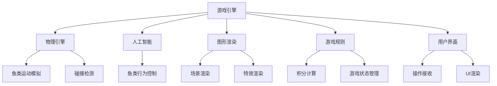
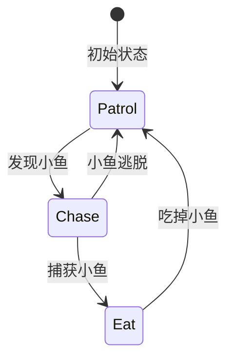
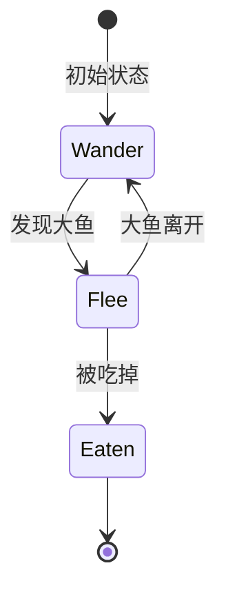
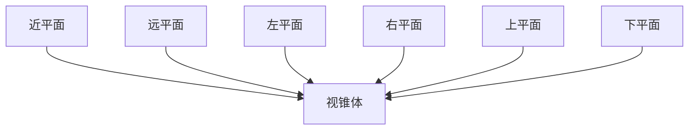

# 大鱼吃小鱼的设计与实现

## 1.背景介绍

### 1.1 游戏概述

大鱼吃小鱼是一款经典的益智游戏,玩家控制一条小鱼在水中游动,通过吃掉比自己小的鱼来不断长大,同时还要避免被大鱼吃掉。游戏的目标是成长为最大的鱼,在有限的时间内获得最高分数。

### 1.2 游戏的挑战

设计和实现一款引人入胜的大鱼吃小鱼游戏需要解决以下几个主要挑战:

1. **物理模拟**: 模拟真实的水下环境,包括鱼类运动、碰撞检测等。
2. **人工智能**: 为不同大小的鱼设计合理的行为模式,使游戏具有一定的挑战性。
3. **图形渲染**: 实现流畅、生动的游戏画面。
4. **游戏规则**: 设计公平、有趣的游戏规则和积分机制。
5. **用户体验**: 提供直观的用户界面和操作方式,增强游戏的互动性。

## 2.核心概念与联系 

### 2.1 游戏引擎

游戏引擎是整个游戏系统的核心,负责协调和管理游戏中的各个模块,如图形渲染、物理模拟、人工智能等。常见的游戏引擎有Unity、Unreal等。

### 2.2 物理引擎

物理引擎用于模拟真实世界的物理现象,如刚体运动、碰撞检测等。在大鱼吃小鱼游戏中,物理引擎主要用于模拟鱼类在水中的运动和碰撞行为。常见的物理引擎有Bullet、Havok等。

### 2.3 人工智能

人工智能模块负责控制非玩家角色(NPC)的行为,使游戏具有一定的挑战性和智能性。在大鱼吃小鱼游戏中,人工智能主要用于控制不同大小鱼的行为策略,如寻找食物、逃避天敌等。

### 2.4 图形渲染

图形渲染模块负责将游戏世界中的物体以及相关特效渲染到屏幕上,为玩家提供流畅、生动的视觉体验。常见的图形渲染技术有OpenGL、DirectX等。

### 2.5 游戏规则

游戏规则模块定义了游戏的目标、限制条件、积分机制等,确保游戏的公平性和趣味性。在大鱼吃小鱼游戏中,规则模块需要处理鱼类的大小变化、碰撞后果、计分等逻辑。

### 2.6 用户界面

用户界面模块提供了玩家与游戏交互的入口,包括游戏主菜单、操作按键、计分板等元素。良好的用户界面设计能够增强游戏的可用性和吸引力。

### 2.7 核心模块关系

上述核心模块相互协作,共同构建了完整的大鱼吃小鱼游戏系统。其中,游戏引擎扮演着协调者的角色,负责调度各个模块的工作;物理引擎和人工智能模块共同模拟游戏世界中的物理现象和生物行为;图形渲染模块将模拟结果呈现给玩家;游戏规则模块约束游戏的进行,确保公平性;用户界面模块则为玩家提供了与游戏交互的渠道。

## 3.核心算法原理具体操作步骤

### 3.1 鱼类运动模拟

#### 3.1.1 运动方程

鱼类在水中的运动可以使用牛顿运动方程来模拟:

$$
\vec{F} = m\vec{a}
$$

其中,$\vec{F}$表示作用在鱼身上的合力,$m$表示鱼的质量,$\vec{a}$表示鱼的加速度。

根据作用力的不同,可以将合力$\vec{F}$分解为以下几个部分:

$$
\vec{F} = \vec{F}_\text{thrust} + \vec{F}_\text{drag} + \vec{F}_\text{gravity} + \vec{F}_\text{other}
$$

- $\vec{F}_\text{thrust}$: 鱼尾摆动产生的推力
- $\vec{F}_\text{drag}$: 水流对鱼体的阻力
- $\vec{F}_\text{gravity}$: 重力
- $\vec{F}_\text{other}$: 其他外力(如玩家控制力)

通过计算合力,可以获得鱼的加速度$\vec{a}$,进而更新鱼的速度和位置。

#### 3.1.2 推力模型

鱼尾摆动产生的推力$\vec{F}_\text{thrust}$可以使用下面的模型来近似:

$$
\vec{F}_\text{thrust} = C_\text{thrust} \cdot \omega^2 \cdot \vec{n}
$$

其中,$C_\text{thrust}$是一个与鱼的大小相关的常数,$\omega$是鱼尾摆动的角速度,$\vec{n}$是鱼体朝向的单位向量。

#### 3.1.3 阻力模型

水流对鱼体的阻力$\vec{F}_\text{drag}$可以使用以下公式计算:

$$
\vec{F}_\text{drag} = -C_\text{drag} \cdot \rho \cdot A \cdot \vec{v}^2 \cdot \vec{n}
$$

其中,$C_\text{drag}$是阻力系数,$\rho$是水的密度,$A$是鱼体的迎风面积,$\vec{v}$是鱼的速度,$\vec{n}$是速度方向的单位向量。

#### 3.1.4 算法步骤

1. 获取鱼的当前状态(位置、速度、朝向等)
2. 计算作用在鱼身上的各种力:
   - 推力$\vec{F}_\text{thrust}$
   - 阻力$\vec{F}_\text{drag}$
   - 重力$\vec{F}_\text{gravity}$
   - 其他外力$\vec{F}_\text{other}$
3. 将各种力相加,获得合力$\vec{F}$
4. 根据牛顿运动方程,$\vec{F} = m\vec{a}$,计算出鱼的加速度$\vec{a}$
5. 更新鱼的速度和位置
6. 处理边界条件(如碰撞)

该算法的复杂度为$O(1)$,可以高效地模拟鱼类在水中的运动。

### 3.2 碰撞检测

#### 3.2.1 基本原理

碰撞检测是确定两个物体是否发生碰撞的过程。在大鱼吃小鱼游戏中,需要检测鱼与鱼之间、鱼与边界之间的碰撞。

最常用的碰撞检测算法是**离散碰撞检测**,它将物体简化为简单的几何形状(如球体、胶囊体等),然后检测这些简化形状之间是否发生重叠。

#### 3.2.2 球体-球体碰撞检测

由于鱼的形状较为简单,可以将其近似为球体或胶囊体。对于两个球体$A$和$B$,它们是否发生碰撞可以通过计算它们的距离$d$与和半径$r_A + r_B$的大小关系来判断:

$$
d = \sqrt{(x_A - x_B)^2 + (y_A - y_B)^2 + (z_A - z_B)^2}
$$

如果$d \leq r_A + r_B$,则两个球体发生碰撞;否则,它们没有碰撞。

#### 3.2.3 算法步骤

1. 遍历所有鱼对$(A, B)$
2. 计算$A$和$B$的距离$d$
3. 判断$d$与$r_A + r_B$的大小关系
4. 如果$d \leq r_A + r_B$,则$A$和$B$发生碰撞,进行后续处理(如吃掉、死亡等)
5. 如果$d > r_A + r_B$,则$A$和$B$没有发生碰撞,继续检测下一个鱼对

该算法的时间复杂度为$O(n^2)$,其中$n$是鱼的数量。在实际情况下,可以使用空间划分等优化技术来降低算法的时间复杂度。

### 3.3 人工智能行为控制

#### 3.3.1 有限状态机

有限状态机(Finite State Machine, FSM)是一种常用的行为控制模型,它将一个系统的行为划分为有限个状态,并定义状态之间的转移条件。

在大鱼吃小鱼游戏中,可以为不同大小的鱼设计不同的FSM,每个FSM包含若干个状态,如"巡逻"、"追击"、"逃跑"等,并定义状态之间的转移条件。

#### 3.3.2 大鱼FSM

大鱼的FSM可以设计为:

- **Patrol**:大鱼在一定范围内随机游动,寻找食物
- **Chase**:当发现小鱼时,大鱼开始追击
- **Eat**:如果追击成功,大鱼吃掉小鱼,长大一些
- 转移条件:
  - Patrol -> Chase:发现小鱼
  - Chase -> Eat:捕获小鱼
  - Eat -> Patrol:吃掉小鱼后,回到巡逻状态
  - Chase -> Patrol:小鱼逃脱,回到巡逻状态

#### 3.3.3 小鱼FSM

小鱼的FSM可以设计为:

- **Wander**:小鱼在一定范围内随机游动,寻找食物
- **Flee**:当发现大鱼时,小鱼逃跑
- **Eaten**:如果逃跑失败,小鱼被大鱼吃掉,游戏结束
- 转移条件:
  - Wander -> Flee:发现大鱼
  - Flee -> Wander:大鱼离开
  - Flee -> Eaten:被大鱼吃掉

通过有限状态机,可以模拟出大鱼和小鱼的基本行为,增加游戏的智能性和挑战性。

## 4.数学模型和公式详细讲解举例说明

### 4.1 视锥体剔除

为了提高游戏的性能,需要剔除玩家视野之外的物体,避免对它们进行不必要的渲染。常用的剔除技术是**视锥体剔除**(View Frustum Culling)。

#### 4.1.1 视锥体

视锥体是一个几何形体,它包含了从摄像机可见的所有点。在3D空间中,视锥体是一个六面体,由六个平面围成。

#### 4.1.2 视锥体剔除算法

1. 获取摄像机的视锥体平面方程
2. 对于每个物体的包围盒:
   - 如果包围盒完全在视锥体内,保留该物体
   - 如果包围盒完全在视锥体外,剔除该物体
   - 如果包围盒与视锥体相交,保留该物体
3. 只对保留的物体进行渲染

#### 4.1.3 包围盒与平面关系判断