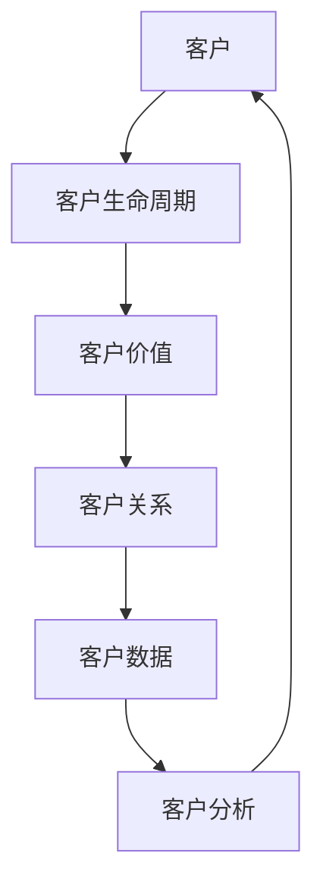

# 客户关系管理系统详细设计与具体代码实现

## 1. 背景介绍

在当今竞争激烈的商业环境中，建立良好的客户关系对于企业的成功至关重要。客户关系管理系统(Customer Relationship Management, CRM)旨在帮助企业有效地管理与客户的互动,提高客户满意度,从而提升企业的盈利能力和市场竞争力。

CRM系统集成了多种功能,包括销售自动化、营销自动化、服务自动化和分析功能等。它可以帮助企业跟踪客户信息、管理销售线索、优化营销活动、提供优质客户服务,并深入分析客户数据,为企业制定更有效的业务策略提供依据。

### 1.1 CRM系统的重要性

实施CRM系统可以为企业带来诸多好处:

- **提高客户满意度和忠诚度**: 通过及时响应客户需求,提供个性化服务,增强客户对企业的信任和忠诚度。
- **优化业务流程**: CRM系统可以自动化和简化许多业务流程,提高工作效率,降低运营成本。
- **增强销售和营销能力**: 通过分析客户数据,企业可以更好地了解客户需求,制定有针对性的销售和营销策略。
- **提升决策能力**: CRM系统可以收集和分析大量客户数据,为企业制定业务决策提供依据。

### 1.2 CRM系统的发展历程

CRM系统的概念最早可以追溯到20世纪90年代初期。随着信息技术的快速发展,CRM系统也不断演进和完善。目前,CRM系统已经成为企业管理的重要工具之一,被广泛应用于各个行业。

## 2. 核心概念与联系

### 2.1 CRM系统的核心概念

CRM系统涉及多个核心概念,包括:

1. **客户**: 指企业的目标群体,可以是个人或组织。
2. **客户生命周期**: 描述客户与企业之间关系的不同阶段,包括潜在客户、新客户、现有客户和失去的客户等。
3. **客户价值**: 指客户对企业的价值,通常根据客户的购买力、忠诚度和潜在价值等因素来评估。
4. **客户关系**: 指企业与客户之间的互动关系,包括沟通、交易和服务等多个方面。
5. **客户数据**: 指与客户相关的各种信息,如个人资料、购买记录、偏好等。
6. **客户分析**: 对客户数据进行分析,以了解客户需求、行为模式和趋势。

### 2.2 核心概念之间的联系

这些核心概念之间存在紧密的联系,构成了CRM系统的基础框架:



1. 企业的目标是**客户**,需要了解客户的需求和行为。
2. 客户会经历不同的**客户生命周期**阶段,企业需要采取相应的策略来维护和发展客户关系。
3. 企业会根据客户的**客户价值**来制定差异化的营销和服务策略。
4. 企业需要通过有效的**客户关系**管理来提高客户满意度和忠诚度。
5. 企业需要收集和分析**客户数据**,以更好地了解客户需求和行为模式。
6. 通过**客户分析**,企业可以制定更有针对性的营销和服务策略,从而吸引新客户并保留现有客户。

## 3. 核心算法原理具体操作步骤

CRM系统通常包含多种算法和模型,用于实现各种功能,如客户分类、客户价值评估、营销活动优化等。以下是一些常见算法的原理和具体操作步骤。

### 3.1 RFM模型

RFM模型是一种常用的客户价值评估模型,它根据客户的最近一次购买时间(Recency)、购买频率(Frequency)和购买金额(Monetary)来评估客户的价值。具体操作步骤如下:

1. 收集客户的购买记录数据,包括购买时间、购买频率和购买金额。
2. 对每个客户的R、F、M值进行打分,通常采用5分制或10分制。
3. 将R、F、M三个分数相加,得到客户的RFM综合分数。
4. 根据RFM综合分数,将客户划分为不同的价值等级。

### 3.2 协同过滤算法

协同过滤算法是一种常用的推荐系统算法,它根据用户之间的相似度来预测用户对商品的兴趣程度。具体操作步骤如下:

1. 收集用户对商品的评分数据,构建用户-商品评分矩阵。
2. 计算用户之间的相似度,通常采用皮尔逊相关系数或余弦相似度等方法。
3. 对于目标用户,找到与其最相似的K个邻居用户。
4. 根据邻居用户对商品的评分,预测目标用户对未评分商品的兴趣程度。
5. 将预测兴趣度较高的商品推荐给目标用户。

### 3.3 决策树算法

决策树算法是一种常用的分类和预测算法,它可以用于客户分类、销售预测等场景。具体操作步骤如下:

1. 收集相关的训练数据,包括特征变量和目标变量。
2. 根据信息增益或信息增益比等指标,选择最优特征作为决策树的根节点。
3. 对于每个子节点,重复步骤2,递归构建决策树。
4. 设置停止条件,如最大深度、最小样本数等,以防止过拟合。
5. 对构建的决策树进行剪枝,以提高泛化能力。
6. 使用构建的决策树对新数据进行分类或预测。

## 4. 数学模型和公式详细讲解举例说明

在CRM系统中,常常需要使用数学模型和公式来量化和分析客户数据。以下是一些常见的数学模型和公式,以及它们的详细讲解和举例说明。

### 4.1 RFM模型公式

RFM模型中,R、F、M三个指标的计算公式如下:

$$
R = \frac{\text{最近一次购买时间}}{\text{当前时间}}
$$

$$
F = \frac{\text{购买次数}}{\text{客户生命周期天数}}
$$

$$
M = \log(\text{总购买金额} + 1)
$$

其中,R值越小,表示客户最近一次购买时间越近;F值越大,表示客户购买频率越高;M值越大,表示客户购买金额越高。

**举例**:

假设一位客户的最近一次购买时间是30天前,购买次数是5次,总购买金额是1000元,客户生命周期为365天。那么,该客户的RFM值为:

$$
R = \frac{30}{365} = 0.082
$$

$$
F = \frac{5}{365} = 0.014
$$

$$
M = \log(1000 + 1) = 6.91
$$

### 4.2 皮尔逊相关系数

皮尔逊相关系数是一种常用的相似度计算方法,它用于度量两个变量之间的线性相关程度。在协同过滤算法中,可以使用皮尔逊相关系数来计算用户之间的相似度。公式如下:

$$
r_{xy} = \frac{\sum_{i=1}^{n}(x_i - \overline{x})(y_i - \overline{y})}{\sqrt{\sum_{i=1}^{n}(x_i - \overline{x})^2}\sqrt{\sum_{i=1}^{n}(y_i - \overline{y})^2}}
$$

其中,$$r_{xy}$$表示x和y之间的皮尔逊相关系数,$$x_i$$和$$y_i$$分别表示x和y的第i个观测值,$$\overline{x}$$和$$\overline{y}$$分别表示x和y的均值,n表示观测值的个数。

相关系数的取值范围为[-1, 1],绝对值越大,表示两个变量之间的线性相关程度越高。

**举例**:

假设有两个用户A和B,他们对5部电影的评分如下:

| 电影 | 用户A | 用户B |
|------|-------|-------|
| 1    | 5     | 4     |
| 2    | 3     | 2     |
| 3    | 4     | 5     |
| 4    | 2     | 1     |
| 5    | 4     | 3     |

计算A和B之间的皮尔逊相关系数:

$$
r_{AB} = \frac{(5-3.6)(4-3) + (3-3.6)(2-3) + (4-3.6)(5-3) + (2-3.6)(1-3) + (4-3.6)(3-3)}{\sqrt{2.56}\sqrt{4}} = 0.67
$$

可以看出,A和B之间的相似度较高,相关系数为0.67。

### 4.3 信息增益与信息增益比

信息增益和信息增益比是决策树算法中常用的特征选择指标,用于评估特征对目标变量的预测能力。

**信息增益**:

信息增益度量了使用特征变量进行分类后,数据的无序度降低的程度。公式如下:

$$
\text{Gain}(D, A) = \text{Ent}(D) - \sum_{v=1}^{V}\frac{|D^v|}{|D|}\text{Ent}(D^v)
$$

其中,$$D$$表示数据集,$$A$$表示特征变量,$$V$$表示特征变量的取值个数,$$D^v$$表示特征变量取值为$$v$$的子集,$$\text{Ent}(D)$$表示数据集$$D$$的信息熵。

**信息增益比**:

信息增益比是对信息增益的一种改进,它考虑了特征值的数量对信息增益的影响。公式如下:

$$
\text{Gain\_ratio}(D, A) = \frac{\text{Gain}(D, A)}{\text{IV}(A)}
$$

其中,$$\text{IV}(A)$$表示特征变量$$A$$的固有值,用于度量特征值的分散程度,公式如下:

$$
\text{IV}(A) = -\sum_{v=1}^{V}\frac{|D^v|}{|D|}\log_2\frac{|D^v|}{|D|}
$$

通常,在决策树算法中,会选择信息增益比较大的特征作为节点进行分裂。

## 5. 项目实践: 代码实例和详细解释说明

为了更好地理解CRM系统的实现,我们将通过一个简单的Python项目来演示如何构建一个基本的CRM系统。该项目包括以下几个部分:

1. 数据准备
2. RFM模型实现
3. 协同过滤算法实现
4. 决策树算法实现

### 5.1 数据准备

在这个项目中,我们将使用一个虚构的客户购买记录数据集。该数据集包含以下几列:

- `customer_id`: 客户ID
- `purchase_date`: 购买日期
- `product_id`: 产品ID
- `amount`: 购买金额

我们首先导入所需的Python库,并加载数据集:

```python
import pandas as pd
from datetime import datetime

# 加载数据集
data = pd.read_csv('customer_purchases.csv')

# 将购买日期转换为datetime格式
data['purchase_date'] = pd.to_datetime(data['purchase_date'])
```

### 5.2 RFM模型实现

接下来,我们将实现RFM模型,计算每个客户的RFM分数,并根据分数对客户进行分层。

```python
import numpy as np

# 计算最近一次购买时间
data['recency'] = (data['purchase_date'].max() - data['purchase_date']).dt.days

# 计算购买频率
data['frequency'] = data.groupby('customer_id')['purchase_date'].transform('count')

# 计算总购买金额
data['monetary'] = data.groupby('customer_id')['amount'].transform('sum')

# 对R、F、M值进行分数化
r_quantiles = data['recency'].quantile([0.25, 0.5, 0.75])
f_quantiles = data['frequency'].quantile([0.25, 0.5, 0.75])
m_quantiles = data['monetary'].quantile([0.25, 0.5, 0.75])

data['r_score'] = np.where(data['recency'] <= r_quantiles[0.25], 5,
                   np.where(data['recency'] <= r_quantiles[0.5], 4,
                            np.where(data['