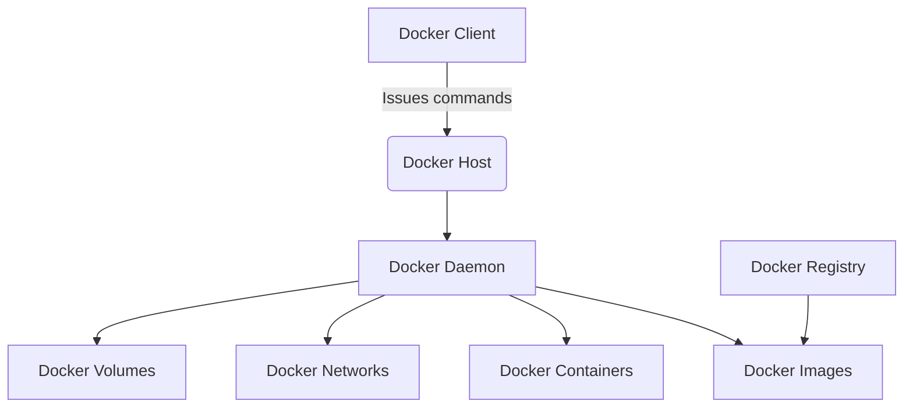
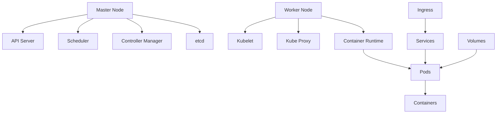

# 容器 原理与代码实例讲解

## 1.背景介绍

### 1.1 什么是容器?

容器是一种轻量级、可移植的虚拟化技术,可以将应用程序及其依赖项打包在一个隔离的环境中,使其可以在任何Linux操作系统上一致地运行。与传统虚拟机不同,容器不需要包含整个操作系统,而是直接共享宿主机的操作系统内核,因此更加高效和轻量级。

### 1.2 容器的优势

容器技术具有以下主要优势:

1. **轻量级**: 与传统虚拟机相比,容器占用更少的系统资源,可以在同一台主机上运行更多的应用程序。

2. **可移植性**: 容器打包了应用程序及其所有依赖项,可以在任何支持容器的环境中一致地运行,解决了"在我的机器上运行没问题"的困扰。

3. **隔离性**: 容器提供了进程、网络和文件系统等资源的隔离,确保应用程序之间互不干扰。

4. **快速部署**: 容器启动速度快,可以快速扩展和缩减应用程序实例。

5. **版本控制**: 容器镜像可以被版本化,方便回滚和升级。

### 1.3 容器生态系统

目前,容器生态系统中最流行的技术是Docker和Kubernetes。Docker提供了构建、分发和运行容器的工具,而Kubernetes则是一个用于自动化容器部署、扩展和管理的开源平台。

## 2.核心概念与联系

### 2.1 Docker架构

Docker采用客户端-服务器架构,包括以下主要组件:

1. **Docker Client**: 用户使用Docker客户端与Docker守护进程进行交互,发出构建、运行和分发容器的命令。

2. **Docker Host**: Docker主机是运行Docker守护进程的物理或虚拟机。它包含了Docker镜像、容器、网络和存储卷等组件。

3. **Docker Daemon**: Docker守护进程是一个长期运行的程序,负责构建、运行和分发Docker容器。

4. **Docker Image**: Docker镜像是一个只读模板,用于创建Docker容器。它包含了运行应用程序所需的所有文件和依赖项。

5. **Docker Container**: 容器是Docker镜像的可运行实例。它在隔离的环境中运行,并与主机操作系统共享内核。

6. **Docker Registry**: Docker注册表是集中存储和分发Docker镜像的地方,如Docker Hub。



### 2.2 Kubernetes架构

Kubernetes是一个用于自动化容器部署、扩展和管理的开源平台,它采用主从架构,包括以下主要组件:

1. **Master节点**: 负责整个集群的管理和控制,包括调度、监控、复制等。

2. **Worker节点**: 运行容器化的应用程序,由Master节点管理和调度。

3. **Pods**: Kubernetes中最小的可部署单元,包含一个或多个容器。

4. **Services**: 定义了一组Pods的逻辑集合和访问策略。

5. **Deployments**: 用于管理无状态应用的部署和滚动升级。

6. **StatefulSets**: 用于管理有状态应用的部署和滚动升级。

7. **Ingress**: 为服务提供外部访问入口。

8. **Volumes**: 存储卷,用于持久化数据。



Docker和Kubernetes是容器生态系统中的核心技术,它们协同工作,为应用程序提供构建、部署、扩展和管理的完整解决方案。

## 3.核心算法原理具体操作步骤

### 3.1 Docker核心原理

Docker的核心原理基于Linux内核的命名空间(Namespace)和控制组(Control Groups)技术。

#### 3.1.1 命名空间(Namespace)

命名空间用于实现资源隔离,包括以下几种:

1. **PID Namespace**: 进程隔离,每个容器有自己的进程视图。

2. **Network Namespace**: 网络隔离,每个容器有自己的网络栈。

3. **IPC Namespace**: 信号量、消息队列和共享内存的隔离。

4. **Mount Namespace**: 文件系统挂载点的隔离。

5. **UTS Namespace**: 主机名和域名的隔离。

6. **User Namespace**: 用户和组的隔离。

Docker通过在容器内创建不同的命名空间,实现了对进程、网络、文件系统等资源的隔离。

#### 3.1.2 控制组(Control Groups)

控制组用于限制和监控容器对系统资源的使用,包括CPU、内存、磁盘I/O等。Docker通过cgroups实现了对资源的限制和分配。

#### 3.1.3 联合文件系统(Union File System)

Docker使用联合文件系统(Union FS)管理镜像和容器的文件系统,包括OverlayFS、AUFS等。联合文件系统将多个目录"联合"在一起,形成一个逻辑上的文件系统视图。

#### 3.1.4 Docker镜像构建过程

Docker镜像由多个只读层组成,每个层对应于Dockerfile中的一条指令。Docker通过以下步骤构建镜像:

1. 从基础镜像(Base Image)开始。

2. 执行Dockerfile中的每条指令,对文件系统进行修改。

3. 对修改后的文件系统进行快照,形成一个新的只读层。

4. 重复上述步骤,直到所有指令执行完毕。

5. 最终生成一个包含多个只读层的镜像。

Docker容器在启动时,会在只读镜像层之上创建一个可写层,所有对文件系统的修改都发生在可写层中。

### 3.2 Kubernetes核心原理

Kubernetes的核心原理是基于声明式API和控制循环。

#### 3.2.1 声明式API

Kubernetes使用声明式API来描述集群的期望状态,而不是具体的操作步骤。用户通过编写YAML或JSON格式的配置文件,描述所需的资源对象(如Pod、Service、Deployment等),然后提交给Kubernetes API Server。

#### 3.2.2 控制循环

Kubernetes通过一系列控制器实现了控制循环,持续监控集群的当前状态,并与期望状态进行对比。如果发现偏差,控制器会采取行动,使当前状态向期望状态靠拢。

主要的控制器包括:

1. **Replication Controller**: 确保指定数量的Pod副本正常运行。

2. **Deployment Controller**: 管理无状态应用的部署和滚动升级。

3. **StatefulSet Controller**: 管理有状态应用的部署和滚动升级。

4. **Node Controller**: 监控节点的状态,响应节点的上线和下线。

5. **Service Controller**: 监控Service对象,确保关联的Pod可以被正确访问。

6. **Job Controller**: 监控Job对象,确保批处理任务正确执行。

通过这种声明式API和控制循环的设计,Kubernetes实现了自动化的应用部署、扩展和管理。

## 4.数学模型和公式详细讲解举例说明

在容器资源调度和管理领域,常用的数学模型和公式包括:

### 4.1 bin-packing问题

bin-packing问题是一种经典的组合优化问题,旨在将一组项目尽可能紧凑地打包到最少数量的箱子(bin)中,同时满足每个箱子的容量约束。在容器调度中,可以将容器视为项目,将节点视为箱子,目标是将容器尽可能紧凑地部署到最少数量的节点上。

bin-packing问题可以用以下公式表示:

$$
\begin{align}
\min \quad & \sum_{j=1}^{m} y_j \\
\text{s.t.} \quad & \sum_{j=1}^{m} x_{ij} = 1, \quad \forall i \in \{1, \ldots, n\} \\
& \sum_{i=1}^{n} r_i x_{ij} \leq C_j y_j, \quad \forall j \in \{1, \ldots, m\} \\
& x_{ij} \in \{0, 1\}, \quad \forall i \in \{1, \ldots, n\}, j \in \{1, \ldots, m\} \\
& y_j \in \{0, 1\}, \quad \forall j \in \{1, \ldots, m\}
\end{align}
$$

其中:

- $n$ 是项目(容器)的数量
- $m$ 是箱子(节点)的数量
- $r_i$ 是第 $i$ 个项目(容器)的资源需求
- $C_j$ 是第 $j$ 个箱子(节点)的容量
- $x_{ij}$ 是决策变量,表示第 $i$ 个项目是否被分配到第 $j$ 个箱子
- $y_j$ 是决策变量,表示第 $j$ 个箱子是否被使用

目标函数是最小化使用的箱子(节点)数量,约束条件包括每个项目(容器)必须被分配到一个箱子(节点),以及每个箱子(节点)的总资源使用量不能超过其容量。

### 4.2 多维bin-packing问题

在实际场景中,容器资源通常包括CPU、内存等多种维度,因此需要考虑多维bin-packing问题。多维bin-packing问题的公式如下:

$$
\begin{align}
\min \quad & \sum_{j=1}^{m} y_j \\
\text{s.t.} \quad & \sum_{j=1}^{m} x_{ij} = 1, \quad \forall i \in \{1, \ldots, n\} \\
& \sum_{i=1}^{n} r_{ik} x_{ij} \leq C_{jk} y_j, \quad \forall j \in \{1, \ldots, m\}, k \in \{1, \ldots, d\} \\
& x_{ij} \in \{0, 1\}, \quad \forall i \in \{1, \ldots, n\}, j \in \{1, \ldots, m\} \\
& y_j \in \{0, 1\}, \quad \forall j \in \{1, \ldots, m\}
\end{align}
$$

其中:

- $d$ 是资源维度的数量
- $r_{ik}$ 是第 $i$ 个项目(容器)在第 $k$ 个维度上的资源需求
- $C_{jk}$ 是第 $j$ 个箱子(节点)在第 $k$ 个维度上的容量

约束条件包括每个项目(容器)必须被分配到一个箱子(节点),以及每个箱子(节点)在每个维度上的总资源使用量不能超过其容量。

### 4.3 其他相关模型

除了bin-packing问题,容器调度还可能涉及到其他数学模型,如:

- **负载均衡模型**: 确保集群中各节点的资源利用率平衡。
- **故障容错模型**: 考虑节点故障时容器的迁移和重新调度。
- **网络优化模型**: 优化容器之间的网络通信和流量路由。
- **成本优化模型**: 在公有云环境中,优化资源成本和使用效率。

这些模型通常需要结合实际场景和约束条件进行建模和求解。

## 5.项目实践:代码实例和详细解释说明

### 5.1 Docker实践

以下是一个简单的Docker实践示例,包括构建镜像、运行容器和推送镜像到远程仓库。

#### 5.1.1 编写Dockerfile

首先,创建一个名为`Dockerfile`的文件,内容如下:

```dockerfile
# 基础镜像
FROM node:14-alpine

# 创建工作目录
WORKDIR /app

# 复制项目文件
COPY package*.json ./

# 安装依赖
RUN npm install

# 复制源代码
COPY . .

# 构建应用
RUN npm run build

# 暴露端口
EXPOSE 3000

# 启动命令
CMD ["npm", "start"]
```

这个Dockerfile基于Node.js 14的Alpine Linux镜像,安装项目依赖,复制源代码,构建应用,并在容器启动时运行`npm start`命令。

#### 5.1.2 构建镜像

在包含Dockerfile的目录下,运行