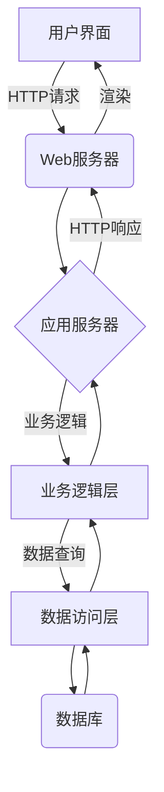
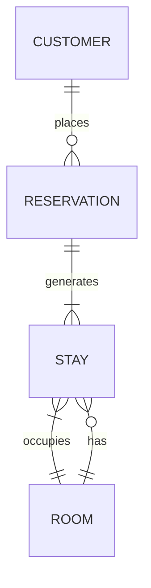
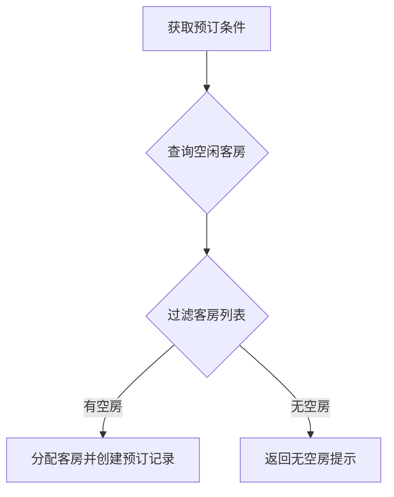
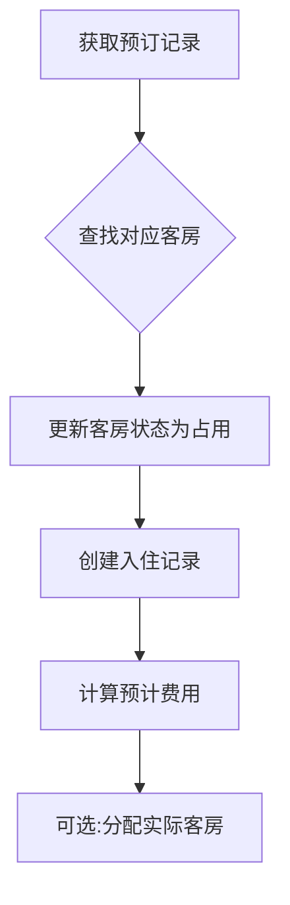
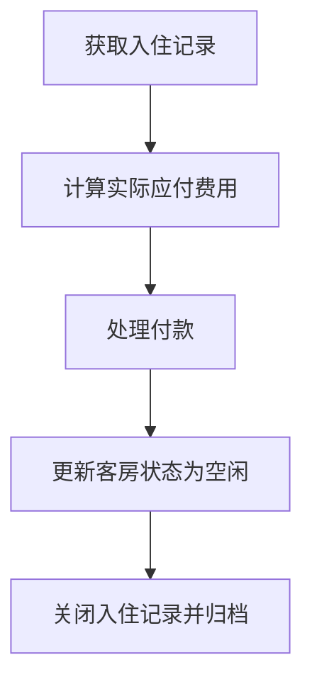

# 宾馆客房管理系统详细设计与具体代码实现

## 1.背景介绍

在当今旅游业蓬勃发展的时代，宾馆业务已经成为一个不可或缺的重要组成部分。为了提高运营效率、优化客户体验并实现利润最大化,构建一个高效、安全、可扩展的宾馆客房管理系统(Hotel Room Management System,HRMS)变得至关重要。

宾馆客房管理系统是整个酒店管理信息系统(Hotel Management Information System,HMIS)的核心模块之一,负责管理和分配客房资源、处理客房预订、入住和退房等关键业务流程。一个优秀的HRMS不仅能够简化前台工作人员的工作流程,还能为客户提供无缝的入住体验。

### 1.1 系统目标

设计一个高效、安全、可扩展的宾馆客房管理系统,具有以下主要目标:

- 实时管理和分配客房资源
- 处理客房预订、入住和退房流程 
- 整合第三方在线预订渠道
- 生成详细的统计报表以支持决策
- 提供移动端应用以增强用户体验
- 确保系统安全,防止未经授权的访问

### 1.2 系统架构概览

宾馆客房管理系统通常采用三层架构,包括:

1. **表示层(Presentation Layer)**: 提供用户界面,允许用户与系统交互。可以是基于Web或移动应用程序。
2. **业务逻辑层(Business Logic Layer)**: 处理系统的核心业务逻辑,如客房预订、分配和计费等。
3. **数据访问层(Data Access Layer)**: 负责与数据库进行交互,执行数据持久化和检索操作。

该系统还需要与其他系统模块(如PMS、POS等)进行集成,以实现无缝的数据交换和业务流程协作。



## 2.核心概念与联系

在深入探讨宾馆客房管理系统的设计和实现之前,有必要先了解一些核心概念及它们之间的关系。

### 2.1 客房(Room)

客房是整个系统的核心实体,每个客房都有唯一的房间号、房型、床型、价格等属性。系统需要实时跟踪每个客房的状态(空闲、占用或维修等)。

### 2.2 客户(Customer)

客户是预订和入住客房的主体。系统需要存储客户的个人信息、联系方式以及过往入住记录等数据。

### 2.3 预订(Reservation)

预订是指客户提前预定客房的行为。预订记录包括入住和离店日期、所预订的客房类型、付款方式等信息。

### 2.4 入住记录(Stay)

入住记录对应客户实际入住的情况,包括实际入住的客房、入住时间、离店时间以及相关费用等详细信息。

### 2.5 核心关系

上述核心概念之间存在以下关系:

- 一个客户可以有多个预订记录
- 一个预订记录对应一个入住记录
- 一个入住记录对应一个客房
- 一个客房可以有多个入住记录(不同时段)



## 3.核心算法原理具体操作步骤

### 3.1 客房预订算法

客房预订是宾馆客房管理系统的核心功能之一。当客户发起预订请求时,系统需要根据预订要求(入住日期、离店日期、房型等)找到合适的空闲客房。这个过程可以概括为以下步骤:

1. 获取预订请求中的条件(入住日期、离店日期、房型等)
2. 查询数据库,获取在请求日期范围内的所有空闲客房列表
3. 根据房型等条件过滤客房列表
4. 如果存在满足条件的客房,则分配给客户并创建预订记录
5. 否则返回无空房的提示信息

该算法的时间复杂度取决于查询和过滤操作的效率,通常可以通过建立合适的索引来优化查询性能。



### 3.2 客房入住算法

当客户实际入住时,系统需要将之前的预订记录转换为入住记录,并更新相应客房的状态。该过程可以概括为以下步骤:

1. 根据预订记录查找对应的客房
2. 更新客房状态为"占用"
3. 创建入住记录,关联客户信息、客房信息等
4. 计算预计费用(如房费、押金等)
5. 可选:分配实际入住的客房(如果之前只分配了房型)

该算法的时间复杂度较低,主要是数据库更新和插入操作。



### 3.3 客房退房算法

当客户离店时,系统需要结算费用、更新客房状态并关闭入住记录。该过程可以概括为以下步骤:

1. 根据入住记录计算实际应付费用
2. 处理付款(现金、信用卡等)
3. 更新客房状态为"空闲"
4. 关闭入住记录,归档相关数据

该算法的时间复杂度也较低,主要是数据库更新操作。



## 4.数学模型和公式详细讲解举例说明

在宾馆客房管理系统中,有一些常见的数学模型和公式需要了解和应用。

### 4.1 客房定价模型

确定适当的客房价格对于酒店的盈利能力至关重要。常见的定价模型包括:

1. **静态定价模型**

   最简单的定价方式,根据客房类型设置固定价格。
   
   $$
   Price = BasePrice_{RoomType}
   $$

   其中 $BasePrice_{RoomType}$ 是基于房型设置的基准价格。

2. **动态定价模型**

   根据需求、季节性等因素动态调整价格。一种常见的方法是使用乘数调整基准价格:
   
   $$
   Price = BasePrice_{RoomType} \times DemandMultiplier
   $$
   
   其中 $DemandMultiplier$ 是基于当前需求情况设置的调整系数,可能会根据入住日期、节假日等因素而变化。

3. **收益管理定价模型**

   利用数据分析和优化算法,预测未来需求并动态调整价格,以最大化酒店收益。这种模型通常使用复杂的机器学习模型,例如:

   $$
   Price = \operatorname{Model}(历史数据, 外部数据, 约束条件)
   $$

   其中 $\operatorname{Model}$ 可以是回归模型、决策树或神经网络等。

### 4.2 客房库存管理模型

有效管理客房库存对于满足客户需求至关重要。一种常见的方法是使用预期无房源模型(Expected Marginal Seat Revenue,EMSR)来确定应该保留多少客房用于未来更高价位的预订。

EMSR模型的核心思想是,如果预留一个客房用于未来更高价位预订所带来的预期收益大于立即出售该客房的收益,那么就应该保留该客房。数学表达式如下:

$$
EMSR_j = \sum_{k=j+1}^{C} \left( \frac{p_k - p_j}{1-q_k} \right) \times q_k \times x_k
$$

其中:
- $j$ 是当前价格等级
- $C$ 是最高价格等级
- $p_k$ 是第 $k$ 个价格等级的价格
- $q_k$ 是第 $k$ 个价格等级的无房源概率
- $x_k$ 是第 $k$ 个价格等级的预期需求

如果 $EMSR_j$ 大于 $p_j$,则应该保留客房用于更高价位预订;否则应该立即出售。

通过应用这种模型,酒店可以最大化收益,同时满足不同价位客户的需求。

## 5.项目实践: 代码实例和详细解释说明

为了更好地理解宾馆客房管理系统的实现,我们将提供一些核心功能的代码示例,并对其进行详细解释。这些示例使用Python编写,并基于流行的Web框架Django。

### 5.1 数据模型

首先,我们定义系统中的核心数据模型。以下是Django的模型定义:

```python
from django.db import models

class Room(models.Model):
    room_number = models.IntegerField(unique=True)
    room_type = models.ForeignKey('RoomType', on_delete=models.PROTECT)
    status = models.CharField(max_length=20, choices=ROOM_STATUS_CHOICES)

class RoomType(models.Model):
    name = models.CharField(max_length=100)
    description = models.TextField()
    base_price = models.DecimalField(max_digits=8, decimal_places=2)

class Customer(models.Model):
    first_name = models.CharField(max_length=100)
    last_name = models.CharField(max_length=100)
    email = models.EmailField()
    phone = models.CharField(max_length=20)

class Reservation(models.Model):
    customer = models.ForeignKey(Customer, on_delete=models.CASCADE)
    room_type = models.ForeignKey(RoomType, on_delete=models.PROTECT)
    check_in_date = models.DateField()
    check_out_date = models.DateField()
    created_at = models.DateTimeField(auto_now_add=True)

class Stay(models.Model):
    reservation = models.OneToOneField(Reservation, on_delete=models.CASCADE)
    room = models.ForeignKey(Room, on_delete=models.PROTECT)
    check_in_date = models.DateField()
    check_out_date = models.DateField()
    total_cost = models.DecimalField(max_digits=8, decimal_places=2)
```

这些模型定义了系统中的核心实体,如客房、房型、客户、预订和入住记录。它们之间的关系通过外键约束来维护,确保数据的完整性和一致性。

### 5.2 客房预订功能

下面是处理客房预订的视图函数示例:

```python
from django.shortcuts import render, redirect
from .models import Room, RoomType, Reservation
from .forms import ReservationForm
from datetime import date

def reserve_room(request):
    if request.method == 'POST':
        form = ReservationForm(request.POST)
        if form.is_valid():
            customer = form.cleaned_data['customer']
            room_type = form.cleaned_data['room_type']
            check_in_date = form.cleaned_data['check_in_date']
            check_out_date = form.cleaned_data['check_out_date']

            # 查找空闲客房
            available_rooms = Room.objects.filter(
                status='AVAILABLE',
                room_type=room_type
            ).exclude(
                stay__check_in_date__lte=check_out_date,
                stay__check_out_date__gte=check_in_date
            )

            if available_rooms.exists():
                # 创建预订记录
                reservation = Reservation.objects.create(
                    customer=customer,
                    room_type=room_type,
                    check_in_date=check_in_date,
                    check_out_date=check_out_date
                )
                return redirect('reservation_success', reservation.id)
            else:
                # 无空房
                return render(request, 'no_rooms_available.html')
    else:
        form = ReservationForm()
    return render(request, 'reserve_room.html', {'form': form})
```

这个视图函数处理客房预订请求。首先,它从表单数据中获取预订条件(客户信息、房型、入住日期和离店日期)。然后,它查询数据库以找到满足条件的空闲客房。

如果存在空闲客房