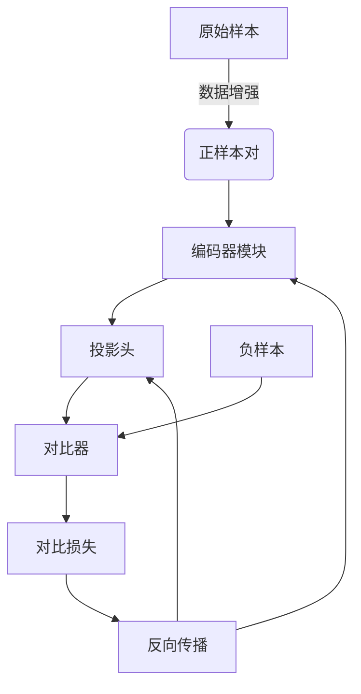

# 对比学习原理与代码实战案例讲解

## 1.背景介绍

### 1.1 对比学习的概念

对比学习(Contrastive Learning)是一种自监督表示学习(Self-Supervised Representation Learning)的方法,近年来在计算机视觉、自然语言处理等领域取得了卓越的成果。与传统的监督学习不同,对比学习不需要大量的人工标注数据,而是通过对同一个样本进行不同的数据增强(Data Augmentation),从而生成正样本对(Positive Pair)和负样本对(Negative Pair),并最大化正样本对之间的相似性,最小化正负样本对之间的相似性,从而学习到有区分性的表示。

### 1.2 对比学习的重要性

随着深度学习模型在各个领域的广泛应用,对大规模高质量标注数据的需求也越来越高。然而,人工标注数据的过程往往是昂贵且耗时的。对比学习作为一种自监督学习方法,可以利用大量未标注的数据,从而减少对人工标注数据的依赖,极大地降低了模型训练的成本。此外,对比学习学习到的表示往往具有更好的泛化能力,能够捕捉到数据的本质特征,从而提高了模型的性能。

## 2.核心概念与联系

### 2.1 对比学习的核心思想

对比学习的核心思想是通过最大化正样本对之间的相似性,最小化正负样本对之间的相似性,从而学习到有区分性的表示。具体来说,对于一个样本 $x$,我们通过不同的数据增强方式(如裁剪、旋转、高斯噪声等)生成两个视图 $\tilde{x}_1$ 和 $\tilde{x}_2$,它们构成一个正样本对。同时,我们从其他样本中随机采样一些负样本。我们希望正样本对之间的表示相似,而正负样本对之间的表示不相似。

### 2.2 对比损失函数

为了实现上述目标,我们需要设计一个合适的对比损失函数(Contrastive Loss)。常见的对比损失函数有 NT-Xent Loss 和 InfoNCE Loss 等。以 NT-Xent Loss 为例,其公式如下:

$$l(x, \tilde{x}_1, \tilde{x}_2) = -\log \frac{e^{sim(f(x), f(\tilde{x}_1))/\tau}}{e^{sim(f(x), f(\tilde{x}_1))/\tau} + \sum_{n=1}^{N}e^{sim(f(x), f(n))/\tau}}$$

其中,$f(\cdot)$表示编码器(Encoder)函数,用于提取样本的表示;$sim(\cdot, \cdot)$表示相似度函数,通常使用余弦相似度;$\tau$是一个温度超参数,用于控制相似度的尺度;$N$是负样本的数量。

通过最小化该损失函数,我们可以使正样本对之间的相似度最大化,同时使正负样本对之间的相似度最小化。

### 2.3 对比学习框架

一个典型的对比学习框架包括以下几个核心组件:

1. **数据增强模块**: 用于对原始样本进行不同的数据增强操作,生成正样本对。
2. **编码器模块**: 用于提取样本的表示向量。
3. **投影头(Projection Head)**: 将编码器输出的表示向量映射到一个新的embedding空间,以增加表示的区分性。
4. **对比器(Contrastive Module)**: 计算正负样本对之间的相似度,并基于对比损失函数进行优化。

上述组件共同构成了对比学习的核心框架,通过端到端的训练,可以学习到有区分性的表示。



## 3.核心算法原理具体操作步骤

对比学习算法的核心操作步骤如下:

1. **数据准备**: 准备大量未标注的数据集,如图像、文本等。

2. **数据增强**: 对每个样本进行不同的数据增强操作,生成正样本对。常见的数据增强方式包括:
   - 对于图像:裁剪、旋转、高斯噪声、颜色抖动等。
   - 对于文本:掩码、删除、插入、交换等。

3. **编码器前向传播**: 将正样本对输入到编码器模块,获得对应的表示向量。

4. **投影头映射**: 将编码器输出的表示向量通过投影头映射到一个新的embedding空间。

5. **采样负样本**: 从其他样本中随机采样一定数量的负样本。

6. **计算相似度**: 计算正样本对之间的相似度,以及正负样本对之间的相似度,常用余弦相似度。

7. **计算对比损失**: 基于相似度计算对比损失,如NT-Xent Loss或InfoNCE Loss。

8. **反向传播和优化**: 基于对比损失进行反向传播,更新编码器和投影头的参数。

9. **迭代训练**: 重复上述步骤,直到模型收敛。

通过上述操作步骤,对比学习算法可以学习到有区分性的表示,而无需人工标注的监督信号。

## 4.数学模型和公式详细讲解举例说明

在对比学习中,数学模型和公式扮演着至关重要的角色。本节将详细讲解两个核心公式:NT-Xent Loss 和 InfoNCE Loss,并给出具体的例子说明。

### 4.1 NT-Xent Loss

NT-Xent Loss(Normalized Temperature-scaled Cross Entropy Loss)是对比学习中最常用的损失函数之一。它的公式如下:

$$l(x, \tilde{x}_1, \tilde{x}_2) = -\log \frac{e^{sim(f(x), f(\tilde{x}_1))/\tau}}{e^{sim(f(x), f(\tilde{x}_1))/\tau} + \sum_{n=1}^{N}e^{sim(f(x), f(n))/\tau}}$$

其中:

- $x$是原始样本,
- $\tilde{x}_1$和$\tilde{x}_2$是通过数据增强生成的正样本对,
- $f(\cdot)$是编码器函数,用于提取样本的表示向量,
- $sim(\cdot, \cdot)$是相似度函数,通常使用余弦相似度,
- $\tau$是温度超参数,用于控制相似度的尺度,
- $N$是负样本的数量,
- $n$表示负样本。

让我们通过一个具体的例子来理解这个公式:

假设我们有一个图像数据集,包含三张图片$x_1$、$x_2$和$x_3$。我们将$x_1$作为原始样本,通过数据增强生成两个视图$\tilde{x}_1$和$\tilde{x}_2$,它们构成一个正样本对。同时,我们从$x_2$和$x_3$中随机采样一个负样本,假设是$x_2$。

我们将正样本对$(\tilde{x}_1, \tilde{x}_2)$和负样本$x_2$输入到编码器$f(\cdot)$中,得到对应的表示向量$f(\tilde{x}_1)$、$f(\tilde{x}_2)$和$f(x_2)$。

接下来,我们计算正样本对之间的相似度$sim(f(\tilde{x}_1), f(\tilde{x}_2))$,以及正负样本对之间的相似度$sim(f(\tilde{x}_1), f(x_2))$和$sim(f(\tilde{x}_2), f(x_2))$。

最后,我们将这些相似度代入NT-Xent Loss公式中,计算损失值。我们希望正样本对之间的相似度尽可能大,而正负样本对之间的相似度尽可能小,从而最小化损失函数。

通过反向传播和优化,我们可以更新编码器$f(\cdot)$的参数,使其学习到有区分性的表示。

### 4.2 InfoNCE Loss

InfoNCE Loss(Info Noise-Contrastive Estimation Loss)是另一种常用的对比损失函数,它源自于互信息(Mutual Information)的估计。其公式如下:

$$l(x, \tilde{x}_1, \tilde{x}_2) = -\log \frac{e^{sim(f(x), f(\tilde{x}_1))/\tau}}{\sum_{n=1}^{N+1}e^{sim(f(x), f(n))/\tau}}$$

其中符号的含义与NT-Xent Loss相同,不同之处在于分母部分的计算方式。InfoNCE Loss将正样本对也作为分母项之一,而NT-Xent Loss将正样本对单独作为分子项。

InfoNCE Loss可以被视为对NT-Xent Loss的一种近似,它们在实践中表现相当。InfoNCE Loss的优点是计算更加简单高效,而NT-Xent Loss则更加直观易于理解。

无论使用哪种对比损失函数,其核心思想都是最大化正样本对之间的相似度,最小化正负样本对之间的相似度,从而学习到有区分性的表示。

## 5.项目实践:代码实例和详细解释说明

在本节中,我们将通过一个基于PyTorch的代码实例,详细解释对比学习的实现细节。我们将使用CIFAR-10数据集进行实验,并基于ResNet-18骨干网络构建对比学习模型。

### 5.1 导入必要的库

```python
import torch
import torch.nn as nn
import torch.nn.functional as F
from torchvision import datasets, transforms
```

### 5.2 定义数据增强操作

```python
data_augmentation = transforms.Compose([
    transforms.RandomResizedCrop(32),
    transforms.RandomHorizontalFlip(),
    transforms.RandomApply([transforms.ColorJitter(0.4, 0.4, 0.4, 0.1)], p=0.8),
    transforms.RandomGrayscale(p=0.2),
    transforms.ToTensor(),
    transforms.Normalize((0.4914, 0.4822, 0.4465), (0.2023, 0.1994, 0.2010))
])
```

我们定义了一系列数据增强操作,包括随机裁剪、随机水平翻转、随机颜色抖动和随机灰度化等。这些操作将应用于原始图像,生成正样本对。

### 5.3 定义对比学习模型

```python
class ContrastiveModel(nn.Module):
    def __init__(self, base_encoder, proj_dim=128):
        super(ContrastiveModel, self).__init__()
        self.encoder = base_encoder
        self.proj_head = nn.Sequential(
            nn.Linear(base_encoder.fc.in_features, base_encoder.fc.in_features),
            nn.ReLU(),
            nn.Linear(base_encoder.fc.in_features, proj_dim)
        )

    def forward(self, x):
        h = self.encoder(x)
        z = self.proj_head(h)
        return h, z
```

我们定义了一个对比学习模型,它由两个部分组成:

1. **编码器(Encoder)**: 我们使用预训练的ResNet-18作为骨干网络,用于提取图像的表示向量。
2. **投影头(Projection Head)**: 一个简单的两层全连接网络,用于将编码器输出的表示向量映射到一个新的embedding空间,以增加表示的区分性。

在前向传播过程中,我们首先将输入图像通过编码器获得表示向量`h`,然后通过投影头得到新的embedding向量`z`。

### 5.4 计算对比损失

```python
def contrastive_loss(z1, z2, tau=0.1, temp_nearest=0.07):
    z1 = F.normalize(z1, dim=-1)
    z2 = F.normalize(z2, dim=-1)
    
    n = z1.shape[0]
    z = torch.cat((z1, z2), dim=0)
    sim = torch.mm(z, z.T) / tau
    
    sim_i_j = torch.diag(sim, n)
    sim_j_i = torch.diag(sim, -n)
    
    positive_samples = torch.cat((sim_i_j, sim_j_i), dim=0).reshape(2 * n, 1)
    negative_samples = sim - torch.diag(positive_samples.reshape(-1), 0)
    
    labels = torch.zeros(2 * n).to(positive_samples.device)
    logits = torch.cat((positive_samples, negative_samples), dim=1)
    loss = F.cross_entropy(logits / temp_nearest, labels.long())
    
    return loss
```

上面的代码实现了一种改进版的对比损失函数,称为NT-Logistic Loss。它与NT-Xent Loss的思路类似,但使用了更加稳定