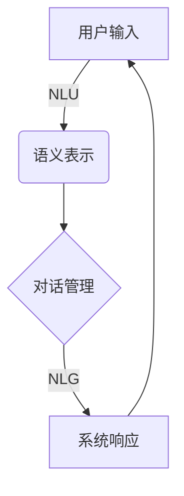

# 对话系统(Chatbots) - 原理与代码实例讲解

## 1.背景介绍

### 1.1 什么是对话系统?

对话系统(Chatbots)是一种人工智能技术,旨在通过自然语言与人类进行交互。它们能够理解人类的输入(文本或语音),并提供相应的响应。对话系统已广泛应用于各个领域,如客户服务、个人助理、教育和娱乐等。

### 1.2 对话系统的发展历程

早期的对话系统主要基于规则和模式匹配,如1966年的ELIZA。随着技术的进步,统计方法(如隐马尔可夫模型)和检索技术被应用于对话系统。近年来,benefiting from大规模数据和计算能力,基于深度学习的端到端对话系统取得了长足进展。

### 1.3 对话系统的挑战

尽管取得了进展,但对话系统仍面临诸多挑战:

- 上下文理解:准确捕捉对话上下文的语义
- 知识获取:融合外部知识以支持多领域对话
- 一致性:生成连贯自然的多轮对话
- 可解释性:提高对话系统决策的透明度

## 2.核心概念与联系

### 2.1 自然语言理解(NLU)

自然语言理解是对话系统的核心组成部分,旨在从人类输入中提取语义信息。主要包括以下任务:

- 词法分析:将输入拆分为词元(token)序列
- 语法分析:确定词元之间的语法关系
- 语义分析:识别实体、意图和情感等语义信息

常用的NLU方法有基于规则的系统、统计模型(如条件随机场)和深度学习模型(如BERT)。

### 2.2 对话管理(DM)

对话管理模块负责跟踪对话状态,并决定系统的下一步行为。主要包括:

- 对话状态跟踪:维护对话上下文和槽位信息
- 对话策略学习:根据当前状态选择最优响应行为
- 自然语言生成(NLG):将系统行为转化为自然语言响应

常用的对话管理框架有基于规则的有限状态机、马尔可夫决策过程和基于深度学习的端到端方法。

### 2.3 核心流程

对话系统的核心流程如下所示:



## 3.核心算法原理具体操作步骤  

### 3.1 自然语言理解算法

#### 3.1.1 词法分析

词法分析的目标是将输入文本拆分为一系列有意义的词元(token)。常用的算法包括:

1. **基于规则的分词**:使用预定义的规则(如正则表达式)对文本进行分词。
2. **统计分词**:利用大规模语料库,基于n-gram统计信息对句子进行分词,如最大熵马尔可夫模型。
3. **神经网络分词**:将分词问题建模为序列标注任务,使用RNN、CNN等神经网络模型进行端到端学习,如Bi-LSTM-CRF。

#### 3.1.2 语法分析

语法分析的目的是确定词元之间的语法关系,构建语法树。常见的语法分析算法有:

1. **基于规则的语法分析**:使用手工设计的上下文无关文法规则对句子进行语法分析。
2. **基于统计的语法分析**:利用大规模语料库,学习语法规则的概率模型,如PCFG(概率上下文无关文法)。
3. **基于深度学习的语法分析**:使用序列到序列模型(如Transformer)直接预测句子的语法树表示。

#### 3.1.3 语义分析

语义分析旨在从句子中提取语义信息,如实体、意图和情感等。主要算法包括:

1. **基于规则的语义分析**:使用手工设计的模式规则对句子进行语义标注。
2. **统计语义分析**:将语义标注建模为序列标注问题,使用CRF、HMM等统计模型进行学习。
3. **基于深度学习的语义分析**:利用大规模标注数据,使用RNN、CNN等神经网络模型进行端到端语义标注,如BERT+CRF。

### 3.2 对话管理算法

#### 3.2.1 对话状态跟踪

对话状态跟踪的目标是维护对话上下文和槽位信息。常见的算法有:

1. **基于规则的有限状态机**:根据手工设计的规则更新对话状态。
2. **统计对话状态跟踪**:将对话状态跟踪建模为序列标注问题,使用CRF、HMM等统计模型进行学习。
3. **基于深度学习的对话状态跟踪**:使用神经网络模型(如LSTM)对对话历史进行编码,捕获上下文信息。

#### 3.2.2 对话策略学习

对话策略学习的目的是根据当前状态选择最优响应行为。主要算法包括:

1. **基于规则的对话策略**:根据手工设计的规则映射状态到行为。
2. **强化学习对话策略**:将对话过程建模为马尔可夫决策过程,使用强化学习算法(如Q-Learning)学习最优策略。
3. **基于深度学习的端到端对话策略**:使用序列到序列模型(如Transformer)直接生成对话响应。

#### 3.2.3 自然语言生成

自然语言生成(NLG)的目标是将系统行为转化为自然语言响应。常用算法有:

1. **基于模板的NLG**:使用预定义的模板填充槽位信息生成响应。
2. **基于统计的NLG**:使用统计语言模型(如n-gram)生成响应。
3. **基于深度学习的NLG**:使用序列到序列模型(如Transformer)进行端到端响应生成。

## 4.数学模型和公式详细讲解举例说明

### 4.1 N-gram语言模型

N-gram语言模型是自然语言处理中广泛使用的统计模型,用于估计一个句子或词序列的概率。对于一个长度为m的句子 $S = w_1, w_2, ..., w_m$,其概率可以表示为:

$$P(S) = P(w_1, w_2, ..., w_m) = \prod_{i=1}^m P(w_i|w_1, ..., w_{i-1})$$

由于计算上述完全条件概率困难,N-gram模型做了马尔可夫假设,即一个词的出现只与前面n-1个词相关:

$$P(w_i|w_1, ..., w_{i-1}) \approx P(w_i|w_{i-n+1}, ..., w_{i-1})$$

因此,句子概率可以近似为:

$$P(S) \approx \prod_{i=1}^m P(w_i|w_{i-n+1}, ..., w_{i-1})$$

其中,n=3时称为三gram模型。N-gram模型的参数可以通过最大似然估计从大规模语料库中学习得到。

### 4.2 条件随机场(CRF)

条件随机场是一种常用的无向无环图模型,广泛应用于序列标注任务,如命名实体识别、词性标注等。

给定输入序列 $X = (x_1, x_2, ..., x_n)$ 和对应的标记序列 $Y = (y_1, y_2, ..., y_n)$,线性链条件随机场定义了 $Y$ 对 $X$ 的条件概率:

$$P(Y|X) = \frac{1}{Z(X)}\exp\left(\sum_{i=1}^n\sum_{j}{\lambda_jt_j(y_{i-1},y_i,X,i)} \right)$$

其中:

- $Z(X)$ 是归一化因子
- $t_j(y_{i-1},y_i,X,i)$ 是特征函数,描述了单个节点和边的特征
- $\lambda_j$ 是对应的权重参数

通过对数线性模型,CRF可以捕获输入序列的丰富特征,并学习全局最优的标记序列。

### 4.3 序列到序列模型

序列到序列模型(Seq2Seq)是一种广泛使用的深度学习架构,适用于机器翻译、对话系统等任务。它由两部分组成:

1. **编码器(Encoder)**: 将输入序列 $X = (x_1, x_2, ..., x_n)$ 编码为向量表示 $c$:

$$h_t = f(x_t, h_{t-1})$$ 
$$c = q(h_1, h_2, ..., h_n)$$

其中 $f$ 和 $q$ 通常使用RNN或Transformer实现。

2. **解码器(Decoder)**: 根据编码向量 $c$ 生成输出序列 $Y = (y_1, y_2, ..., y_m)$:

$$p(y_t|y_1, ..., y_{t-1}, c) = g(y_{t-1}, s_t, c)$$
$$s_t = f(s_{t-1}, y_{t-1}, c)$$

其中 $g$ 通常使用另一个RNN或Transformer实现。

通过端到端训练,Seq2Seq模型可以直接学习输入和输出序列之间的映射关系。

## 5.项目实践:代码实例和详细解释说明

在这一部分,我们将通过一个基于Python的实例项目,演示如何构建一个简单的基于检索的对话系统。

### 5.1 项目概述

我们的目标是构建一个基于规则的问答系统,能够根据用户的自然语言查询从知识库中检索相关的问答对。该系统包括以下主要组件:

1. **语料预处理模块**: 对知识库问答对进行预处理,如分词、去除停用词等。
2. **查询处理模块**: 对用户查询进行相同的预处理,并基于TF-IDF相似度在知识库中检索最匹配的问答对。
3. **响应生成模块**: 将检索到的答案返回给用户。

### 5.2 代码实现

#### 5.2.1 导入所需库

```python
import re
import string
import numpy as np
from collections import Counter
from sklearn.feature_extraction.text import TfidfVectorizer
```

#### 5.2.2 数据预处理函数

```python
def preprocess_text(text):
    # 去除标点符号
    text = re.sub(f'[{re.escape(string.punctuation)}]', '', text)
    # 转为小写
    text = text.lower()
    # 分词
    tokens = text.split()
    return tokens

def load_data(file_path):
    data = []
    with open(file_path, 'r', encoding='utf-8') as f:
        for line in f:
            q, a = line.strip().split('?')
            data.append((preprocess_text(q), preprocess_text(a + '?')))
    return data
```

#### 5.2.3 TF-IDF向量化

```python
def vectorize(data):
    questions = [q for q, a in data]
    answers = [a for q, a in data]
    
    # 计算问题和答案的TF-IDF向量
    tfidf = TfidfVectorizer()
    q_vectors = tfidf.fit_transform(questions)
    a_vectors = tfidf.transform(answers)
    
    return q_vectors, a_vectors, tfidf
```

#### 5.2.4 相似度计算和答案检索

```python
def search(query, q_vectors, a_vectors, tfidf, top_k=1):
    # 向量化查询
    query_vec = tfidf.transform([query])
    
    # 计算查询与问题的余弦相似度
    scores = np.dot(query_vec, q_vectors.T).todense()
    
    # 排序并获取top_k个最相似的问题索引
    top_idx = np.argsort(-scores, axis=1)[:, :top_k].squeeze()
    
    # 返回对应的答案
    answers = [a_vectors[i].toarray()[0] for i in top_idx]
    return answers
```

#### 5.2.5 主函数

```python
def main():
    # 加载数据
    data = load_data('data.txt')
    
    # 向量化
    q_vectors, a_vectors, tfidf = vectorize(data)
    
    while True:
        query = input('请输入您的查询(输入"exit"退出)：')
        if query.lower() == 'exit':
            break
        
        query_tokens = preprocess_text(query)
        answers = search(' '.join(query_tokens), q_vectors, a_vectors, tfidf, top_k=3)
        
        for answer in answers:
            print(' '.join(tfidf.get_feature_names_out()[answer.nonzero()[1]]))

if __name__ == '__main