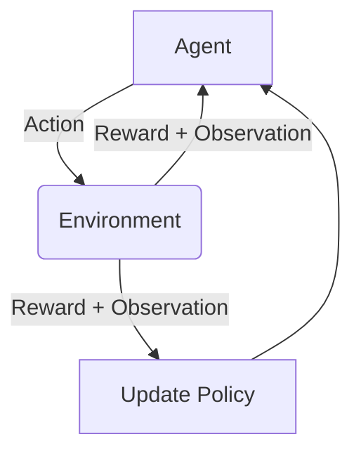

# 强化学习 (Reinforcement Learning) 原理与代码实例讲解

## 1.背景介绍

强化学习是机器学习的一个重要分支,它涉及如何基于环境反馈训练智能体(Agent)以获取最大化的累积奖励。与监督学习和无监督学习不同,强化学习没有提供标记数据集,而是通过与环境的交互来学习。

强化学习的概念源于行为主义心理学,试图通过奖励和惩罚来塑造行为。在过去几十年中,强化学习已成功应用于多个领域,如机器人控制、游戏AI、自然语言处理、计算机系统优化等。

近年来,结合深度神经网络的深度强化学习取得了令人瞩目的成就,如DeepMind的AlphaGo战胜人类顶尖棋手、OpenAI的机器人手臂等。强化学习在解决复杂的决策序列问题方面展现出巨大潜力。

### Mermaid 流程图



## 2.核心概念与联系

强化学习包含四个核心要素:

1. **智能体(Agent)**: 在环境中执行行为的决策实体。
2. **环境(Environment)**: 智能体所处的外部世界,定义了可能的状态和奖励。
3. **状态(State)**: 环境的当前情况。
4. **奖励(Reward)**: 智能体执行行为后从环境获得的反馈,指导智能体优化行为。

智能体与环境之间的交互过程如下:

1. 智能体观察当前环境状态
2. 根据策略,智能体选择执行一个行为
3. 环境根据行为转移到新状态,并返回奖励值
4. 智能体获取奖励值,并更新策略

目标是学习一个最优策略,使智能体在环境中获得最大化的累积奖励。

## 3.核心算法原理具体操作步骤

强化学习算法通常分为三类:基于价值的、基于策略的和Actor-Critic算法。

### 3.1 基于价值的算法

基于价值的算法旨在估计每个状态或状态-行为对的价值函数,然后选择具有最大预期价值的行为。

**Q-Learning**是最经典的基于价值的算法之一。它的核心思想是学习状态-行为对的Q值函数,使用贝尔曼方程进行迭代更新:

$$Q(s_t, a_t) \leftarrow Q(s_t, a_t) + \alpha \big(r_t + \gamma \max_{a'}Q(s_{t+1}, a') - Q(s_t, a_t)\big)$$

其中:
- $\alpha$是学习率
- $\gamma$是折扣因子 
- $r_t$是立即奖励
- $\max_{a'}Q(s_{t+1}, a')$是下一状态的最大Q值

算法步骤:

1. 初始化Q表格,所有Q值设为0或小的常数
2. 对每个episode:
    - 初始化起始状态s
    - 对每个时间步:
        - 选择具有最大Q值的行为a
        - 执行行为a,观察奖励r和新状态s'
        - 更新Q(s,a)使用上述方程
        - s = s'
3. 直到收敛或满足停止条件

### 3.2 基于策略的算法  

基于策略的算法直接学习策略函数,选择每个状态下的最优行为。

**REINFORCE**是一种基于策略梯度的经典算法。它的核心思想是通过梯度上升调整策略参数,最大化期望奖励:

$$\nabla_\theta J(\theta) \approx \frac{1}{N}\sum_{i=1}^{N}\sum_{t=1}^{T}\nabla_\theta\log\pi_\theta(a_t^i|s_t^i)R_t^i$$

其中:
- $\pi_\theta$是参数化的策略 
- $R_t^i$是第i个episode从时间步t开始的折扣累积奖励

算法步骤:

1. 初始化策略参数$\theta$
2. 对每个episode:
    - 生成一个episode的轨迹$\{(s_1, a_1, r_1), (s_2, a_2, r_2), ...\}$
    - 计算每个时间步的累积奖励$R_t$
    - 计算$\nabla_\theta\log\pi_\theta(a_t|s_t)R_t$
    - 使用梯度上升更新$\theta$

### 3.3 Actor-Critic算法

Actor-Critic算法结合了价值函数和策略,通常表现更加稳定和高效。

**Advantage Actor-Critic (A2C)** 是一种流行的Actor-Critic算法。它包含两个模块:

- Actor: 根据状态s输出行为a的概率$\pi(a|s)$
- Critic: 估计每个状态s的值函数$V(s)$

Actor的更新规则类似于REINFORCE,但使用了优势函数(Advantage)来减小方差:

$$\nabla_\theta J(\theta) \approx \frac{1}{N}\sum_{i=1}^{N}\sum_{t=1}^{T}\nabla_\theta\log\pi_\theta(a_t^i|s_t^i)A_t^i$$

其中$A_t^i = R_t^i - V(s_t^i)$是优势函数,表示相对于估计值的实际奖励差异。

Critic则根据时序差分(TD)误差更新值函数:

$$\delta_t = r_t + \gamma V(s_{t+1}) - V(s_t)$$
$$V(s_t) \leftarrow V(s_t) + \alpha\delta_t$$

算法在Actor和Critic之间交替训练,形成一个稳定的策略迭代过程。

## 4.数学模型和公式详细讲解举例说明

强化学习的数学基础是马尔可夫决策过程(MDP),用于形式化描述智能体与环境的交互。

一个MDP由一个5元组$(S, A, P, R, \gamma)$定义:

- $S$是有限状态集合
- $A$是有限行为集合
- $P(s'|s, a)$是状态转移概率,表示从状态s执行行为a转移到状态s'的概率
- $R(s, a)$是奖励函数,表示在状态s执行行为a获得的即时奖励
- $\gamma \in [0, 1)$是折扣因子,用于权衡即时奖励和长期累积奖励

在MDP中,我们定义了价值函数和策略:

- 状态价值函数$V(s)$表示从状态s开始执行策略$\pi$获得的期望累积奖励:

$$V^\pi(s) = \mathbb{E}_\pi\Big[\sum_{t=0}^\infty \gamma^t r_{t+1} | s_0 = s\Big]$$

- 状态-行为价值函数$Q(s, a)$表示从状态s执行行为a,之后遵循策略$\pi$获得的期望累积奖励:

$$Q^\pi(s, a) = \mathbb{E}_\pi\Big[\sum_{t=0}^\infty \gamma^t r_{t+1} | s_0 = s, a_0 = a\Big]$$

- 策略$\pi(a|s)$是智能体在状态s下选择行为a的概率分布

目标是找到一个最优策略$\pi^*$,使得对所有状态s,都有$V^{\pi^*}(s) \geq V^\pi(s)$。

贝尔曼方程给出了价值函数与MDP的递推关系:

$$V^\pi(s) = \sum_{a \in A}\pi(a|s)\Big(R(s, a) + \gamma\sum_{s' \in S}P(s'|s, a)V^\pi(s')\Big)$$
$$Q^\pi(s, a) = R(s, a) + \gamma\sum_{s' \in S}P(s'|s, a)\sum_{a' \in A}\pi(a'|s')Q^\pi(s', a')$$

许多强化学习算法都是基于这些方程进行迭代更新和优化。

作为示例,我们来看一个简单的格子世界,智能体需要从起点到达终点。

```python
import numpy as np

# 定义格子世界
WORLD = np.array([
    [0, 0, 0, 1],
    [0, None, 0, -1],
    [0, 0, 0, 0]
])

# 定义奖励
REWARDS = {
    0: -0.04,  # 空地奖励
    None: -1,  # 障碍物惩罚
    1: 1,      # 终点奖励
    -1: -1     # 陷阱惩罚
}

# 定义状态转移概率
TRANSITION_PROBS = {
    0: {
        0: 0.7,  # 往前
        1: 0.1,  # 往右
        2: 0.1,  # 往后
        3: 0.1   # 往左
    }
}

# 初始化Q表格
Q = {}
for i in range(WORLD.shape[0]):
    for j in range(WORLD.shape[1]):
        Q[(i, j)] = {0: 0, 1: 0, 2: 0, 3: 0}

# Q-Learning算法
for episode in range(1000):
    state = (0, 0)  # 起点
    while state != (0, 3):  # 终点
        next_states = []
        for action in range(4):
            new_state = state
            if action == 0 and state[0] > 0:
                new_state = (state[0] - 1, state[1])
            elif action == 1 and state[1] < WORLD.shape[1] - 1:
                new_state = (state[0], state[1] + 1)
            elif action == 2 and state[0] < WORLD.shape[0] - 1:
                new_state = (state[0] + 1, state[1])
            elif action == 3 and state[1] > 0:
                new_state = (state[0], state[1] - 1)
            if WORLD[new_state] is not None:
                next_states.append((new_state, action))

        if not next_states:
            break

        next_state, action = max(next_states, key=lambda x: Q[x[0]][x[1]])
        reward = REWARDS[WORLD[next_state]]
        Q[state][action] += 0.1 * (reward + 0.9 * max(Q[next_state].values()) - Q[state][action])
        state = next_state

# 打印最优路径
state = (0, 0)
path = [(0, 0)]
while state != (0, 3):
    next_states = []
    for action in range(4):
        new_state = state
        if action == 0 and state[0] > 0:
            new_state = (state[0] - 1, state[1])
        elif action == 1 and state[1] < WORLD.shape[1] - 1:
            new_state = (state[0], state[1] + 1)
        elif action == 2 and state[0] < WORLD.shape[0] - 1:
            new_state = (state[0] + 1, state[1])
        elif action == 3 and state[1] > 0:
            new_state = (state[0], state[1] - 1)
        if WORLD[new_state] is not None:
            next_states.append((new_state, action))

    next_state, action = max(next_states, key=lambda x: Q[x[0]][x[1]])
    path.append(next_state)
    state = next_state

print("最优路径:", path)
```

在这个示例中,我们使用Q-Learning算法训练了一个简单的智能体,找到了从起点到达终点的最优路径。Q表格存储了每个状态-行为对的价值,通过不断更新和选择最大Q值,智能体逐步学习到了最优策略。

## 5.项目实践: 代码实例和详细解释说明

为了更好地理解强化学习算法,我们将使用OpenAI Gym环境实现一个经典的CartPole控制问题。目标是通过适当的力量,使杆子保持直立并使小车在轨道上平衡前进。

我们将使用PyTorch实现一个简单的Deep Q-Network (DQN)算法。DQN使用深度神经网络来估计Q值函数,并通过经验回放和目标网络稳定训练过程。

### 5.1 导入库

```python
import gym
import math
import random
import numpy as np
import matplotlib.pyplot as plt

import torch
import torch.nn as nn
import torch.optim as optim
import torch.nn.functional as F

env = gym.make('CartPole-v1')
```

### 5.2 定义DQN模型

```python
class DQN(nn.Module):
    def __init__(self, state_dim, action_dim):
        super(DQN, self).__init__()
        self.fc1 = nn.Linear(state_dim, 64)
        self.fc2 = nn.Linear(64, action_dim)

    def forward(self, x):
        x = F.relu(self.fc1(x))
        return self.fc2(x)
```

### 5.3 定义Agent

```python
class Agent:
    def __init__(self, state_dim, action_dim):
        self.state_dim