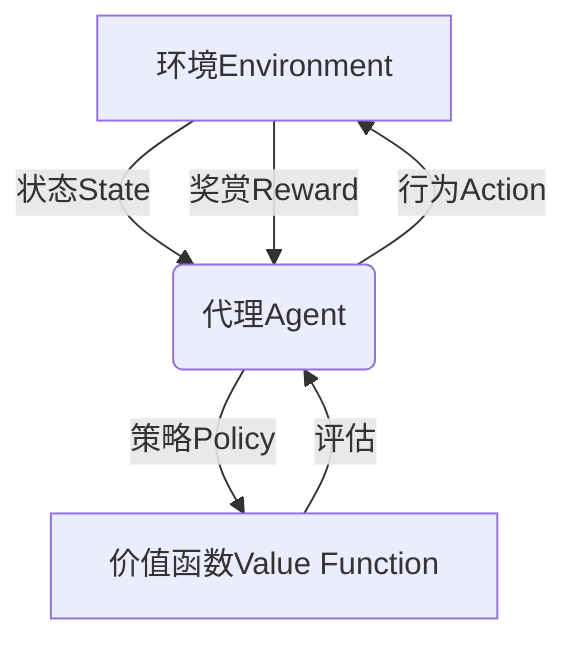

# 强化学习Reinforcement Learning在游戏AI中的应用实例

## 1.背景介绍

### 1.1 游戏AI的重要性

在当今时代,人工智能(AI)已经渗透到我们生活的方方面面,游戏行业也不例外。游戏AI的发展为游戏体验带来了革命性的变化,使得游戏更加富有挑战性、身临其境和互动性。高质量的游戏AI可以创造出更加智能、适应性强的对手,提供更有趣、更具策略性的游戏体验。

### 1.2 传统游戏AI的局限性

传统的游戏AI通常采用硬编码的规则和有限状态机,这使得AI的行为相对僵硬、可预测,难以提供动态、多变的游戏体验。此外,这些系统需要大量的人工设计和调优,开发成本高、效率低下。

### 1.3 强化学习在游戏AI中的应用前景

强化学习(Reinforcement Learning,RL)作为机器学习的一个重要分支,为解决游戏AI问题提供了新的思路。RL系统可以通过与环境的互动来学习,自主获取经验并优化决策,从而创造出更加智能、适应性强的AI行为。近年来,RL在多个经典游戏中取得了突破性的成果,展现了其在游戏AI领域的巨大潜力。

## 2.核心概念与联系

### 2.1 强化学习的核心概念

强化学习是一种基于奖赏机制的学习范式,其核心思想是通过与环境的互动,根据获得的奖赏信号来调整行为策略,从而达到最大化长期累积奖赏的目标。强化学习系统通常由以下几个核心组件构成:

- **环境(Environment)**: 指代理与之交互的外部世界,包括状态和奖赏信号。
- **状态(State)**: 描述环境当前的情况。
- **行为(Action)**: 代理在特定状态下采取的行动。
- **奖赏(Reward)**: 环境对代理行为的反馈,用于评估行为的好坏。
- **策略(Policy)**: 定义了代理在每个状态下应采取的行为。
- **价值函数(Value Function)**: 评估某个状态或状态-行为对在长期内能获得的累积奖赏。

强化学习的目标是找到一个最优策略,使得在遵循该策略时,代理能够获得最大的长期累积奖赏。



### 2.2 强化学习与游戏AI的联系

游戏可以被自然地建模为一个强化学习问题:

- **环境**: 游戏世界及其规则。
- **状态**: 游戏当前的局面,如角色位置、生命值等。
- **行为**: 玩家或AI可执行的操作,如移动、攻击等。
- **奖赏**: 根据游戏目标设计的奖赏机制,如得分、通过关卡等。

通过与游戏环境的互动,强化学习算法可以学习到一个最优策略,指导AI代理在每个游戏状态下采取最佳行为,从而达到最大化游戏得分或通关的目标。

## 3.核心算法原理具体操作步骤

强化学习算法通常分为两大类:基于价值函数(Value-based)和基于策略(Policy-based)。本节将介绍两种经典算法的原理和具体操作步骤。

### 3.1 Q-Learning算法

Q-Learning是一种基于价值函数的强化学习算法,它试图直接估计每个状态-行为对的价值函数Q(s,a),即在当前状态s执行行为a之后,能获得的长期累积奖赏。Q-Learning算法的操作步骤如下:

1. 初始化Q表格,所有Q(s,a)值设为任意值(通常为0)。
2. 对于每个episode(游戏回合):
    a. 初始化当前状态s。
    b. 重复以下步骤,直到达到终止状态:
        i. 根据当前Q值,选择一个行为a(探索策略,如ε-贪婪)。
        ii. 执行行为a,获得奖赏r,转移到新状态s'。
        iii. 更新Q(s,a)值:
            $$Q(s,a) \leftarrow Q(s,a) + \alpha \big[r + \gamma \max_{a'} Q(s',a') - Q(s,a)\big]$$
            其中,α是学习率,γ是折扣因子。
        iv. 将s'设为当前状态s。
3. 重复步骤2,直到收敛(Q值不再显著变化)。

通过不断更新Q表格,Q-Learning算法最终可以学习到一个近似最优的Q函数,从而得到一个近似最优的策略π(s) = argmax_a Q(s,a)。

### 3.2 策略梯度算法(Policy Gradient)

策略梯度算法是一种基于策略的强化学习算法,它直接对策略函数π(a|s)进行参数化,并通过梯度上升的方式优化策略参数,使得期望的累积奖赏最大化。策略梯度算法的操作步骤如下:

1. 初始化策略参数θ。
2. 对于每个episode:
    a. 初始化当前状态s_0。
    b. 生成一个episode的轨迹τ=(s_0,a_0,r_0,s_1,a_1,r_1,...,s_T),其中a_t~π(a_t|s_t;θ)。
    c. 计算该episode的累积奖赏R(τ)。
    d. 更新策略参数θ:
        $$\theta \leftarrow \theta + \alpha \nabla_\theta \log \pi(a_t|s_t;\theta)R(\tau)$$
        其中,α是学习率。
3. 重复步骤2,直到收敛。

通过不断采样轨迹并更新策略参数,策略梯度算法可以直接优化策略函数,使得在遵循该策略时,期望的累积奖赏最大化。

## 4.数学模型和公式详细讲解举例说明

### 4.1 马尔可夫决策过程(Markov Decision Process, MDP)

强化学习问题通常被建模为一个马尔可夫决策过程(MDP),它是一个离散时间的随机控制过程,由以下五元组定义:

$$\langle \mathcal{S}, \mathcal{A}, \mathcal{P}, \mathcal{R}, \gamma \rangle$$

- $\mathcal{S}$是状态集合
- $\mathcal{A}$是行为集合
- $\mathcal{P}$是状态转移概率,其中$\mathcal{P}_{ss'}^a = \mathbb{P}[S_{t+1}=s'|S_t=s,A_t=a]$表示在状态s执行行为a后,转移到状态s'的概率。
- $\mathcal{R}$是奖赏函数,其中$\mathcal{R}_s^a = \mathbb{E}[R_{t+1}|S_t=s,A_t=a]$表示在状态s执行行为a时,期望获得的奖赏。
- $\gamma \in [0,1)$是折扣因子,用于权衡当前奖赏和未来奖赏的重要性。

在MDP中,我们的目标是找到一个最优策略$\pi^*$,使得在遵循该策略时,期望的累积折扣奖赏最大化:

$$\pi^* = \arg\max_\pi \mathbb{E}_\pi \Big[\sum_{t=0}^\infty \gamma^t R_{t+1} \Big]$$

这里的期望是关于状态序列$S_0,S_1,\dots$和奖赏序列$R_1,R_2,\dots$的联合分布。

### 4.2 Q-Learning更新规则的推导

Q-Learning算法的核心是基于Bellman方程,通过迭代更新来估计最优Q函数。我们定义Q函数为:

$$Q^*(s,a) = \mathbb{E}_\pi \Big[\sum_{k=0}^\infty \gamma^k R_{t+k+1} | S_t=s, A_t=a \Big]$$

即在状态s执行行为a之后,按照最优策略π*行动所能获得的期望累积折扣奖赏。根据Bellman方程,Q*(s,a)可以写为:

$$Q^*(s,a) = \mathbb{E}_{s'} \Big[R_t + \gamma \max_{a'} Q^*(s',a') | S_t=s, A_t=a \Big]$$

我们用Q(s,a)来估计Q*(s,a),并在每个时间步更新Q(s,a),使其逐渐逼近Q*(s,a)。更新规则如下:

$$Q(s,a) \leftarrow Q(s,a) + \alpha \Big[R_t + \gamma \max_{a'} Q(s',a') - Q(s,a)\Big]$$

其中,α是学习率,控制了新估计值对旧估计值的影响程度。通过不断更新,Q函数最终会收敛到Q*。

### 4.3 策略梯度算法的数学原理

策略梯度算法的目标是直接优化策略参数θ,使得期望的累积折扣奖赏最大化:

$$J(\theta) = \mathbb{E}_{\pi_\theta} \Big[\sum_{t=0}^\infty \gamma^t R_{t+1} \Big]$$

根据策略梯度定理,我们可以计算J(θ)关于θ的梯度:

$$\nabla_\theta J(\theta) = \mathbb{E}_{\pi_\theta} \Big[\sum_{t=0}^\infty \nabla_\theta \log \pi_\theta(a_t|s_t) Q^{\pi_\theta}(s_t,a_t) \Big]$$

其中,Q^(π_θ)(s_t,a_t)是在策略π_θ下,状态s_t执行行为a_t后的期望累积奖赏。

由于无法精确计算期望,我们通常使用采样估计来近似梯度:

$$\nabla_\theta J(\theta) \approx \frac{1}{N} \sum_{i=1}^N \sum_{t=0}^{T_i} \nabla_\theta \log \pi_\theta(a_t^i|s_t^i) R_t^i$$

其中,N是采样的轨迹数量,T_i是第i条轨迹的长度,R_t^i是第i条轨迹在时间步t获得的累积奖赏。通过梯度上升,我们可以不断更新策略参数θ,使得J(θ)最大化。

### 4.4 探索与利用权衡(Exploration-Exploitation Tradeoff)

在强化学习过程中,代理需要在探索(Exploration)和利用(Exploitation)之间寻求平衡。探索意味着尝试新的行为,以发现潜在的更优策略;而利用则是利用已知的最优行为来获取最大化即时奖赏。过多探索会导致效率低下,而过多利用则可能陷入次优解。

常见的探索策略包括:

- ε-贪婪(ε-greedy):以概率ε随机选择行为(探索),以概率1-ε选择当前最优行为(利用)。
-软max(Softmax):根据Q值的softmax分布采样行为,温度参数控制探索程度。
-噪声注入(Noise Injection):在确定性策略上添加噪声,引入随机性。

探索策略通常会在训练过程中逐渐减小探索量,以确保最终收敛到一个确定的策略。

## 5.项目实践:代码实例和详细解释说明

为了更好地理解强化学习在游戏AI中的应用,我们将通过一个简单的网格世界(GridWorld)游戏示例,实现并可视化Q-Learning算法的训练过程。

### 5.1 游戏环境

我们考虑一个4x4的网格世界,其中有一个起点(绿色)、一个终点(红色)和两个障碍物(黑色方块)。代理的目标是从起点出发,找到一条通往终点的最短路径。

```python
import numpy as np
import matplotlib.pyplot as plt

# 定义网格世界
WORLD = np.array([
    [0, 0, 0, 0],
    [0, -1, 0, 0],
    [0, 0, -1, 0],
    [0, 0, 0, 1]
])

# 起点和终点坐标
START = (0, 0)
GOAL = (3, 3)

# 可执行的行为
ACTIONS = ['up', 'down', 'left', 'right']

# 奖赏
REWARD = {
    0: -0.1,  # 空地
    -1: -1,   # 障碍物
    1: 1      # 终点
}