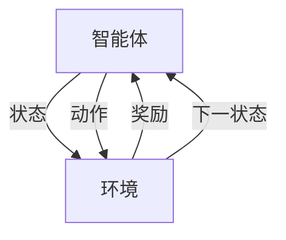

# 强化学习Reinforcement Learning在航空航天领域的应用与挑战

## 1. 背景介绍
### 1.1 航空航天领域的挑战和机遇
#### 1.1.1 航空航天系统的复杂性
#### 1.1.2 自主决策和控制的需求
#### 1.1.3 强化学习在航空航天领域的潜力

### 1.2 强化学习的基本概念
#### 1.2.1 智能体、环境、状态、动作和奖励
#### 1.2.2 探索与利用的平衡
#### 1.2.3 值函数和策略函数

## 2. 核心概念与联系
### 2.1 马尔可夫决策过程(MDP)
#### 2.1.1 MDP的定义和组成元素
#### 2.1.2 MDP在强化学习中的应用
#### 2.1.3 部分可观测马尔可夫决策过程(POMDP)

### 2.2 动态规划与强化学习
#### 2.2.1 动态规划的基本原理
#### 2.2.2 值迭代和策略迭代算法
#### 2.2.3 动态规划与强化学习的异同

### 2.3 蒙特卡洛方法与时序差分学习
#### 2.3.1 蒙特卡洛方法的基本原理
#### 2.3.2 时序差分学习(TD Learning)的基本原理
#### 2.3.3 SARSA和Q-Learning算法

## 3. 核心算法原理具体操作步骤
### 3.1 深度Q网络(DQN)
#### 3.1.1 DQN的基本原理和结构
#### 3.1.2 经验回放(Experience Replay)机制
#### 3.1.3 DQN算法的具体操作步骤

### 3.2 深度确定性策略梯度(DDPG)
#### 3.2.1 DDPG的基本原理和结构
#### 3.2.2 Actor-Critic架构
#### 3.2.3 DDPG算法的具体操作步骤

### 3.3 近端策略优化(PPO)
#### 3.3.1 PPO的基本原理和优势
#### 3.3.2 重要性采样和代理优势估计
#### 3.3.3 PPO算法的具体操作步骤

## 4. 数学模型和公式详细讲解举例说明
### 4.1 贝尔曼方程与最优值函数
#### 4.1.1 贝尔曼方程的推导
#### 4.1.2 最优状态值函数和最优动作值函数
#### 4.1.3 贝尔曼最优方程的应用

### 4.2 策略梯度定理
#### 4.2.1 策略梯度定理的推导
#### 4.2.2 随机策略梯度和确定性策略梯度
#### 4.2.3 策略梯度定理在DDPG和PPO中的应用

### 4.3 蒙特卡洛树搜索(MCTS)
#### 4.3.1 MCTS的基本原理和步骤
#### 4.3.2 上置信区间(UCB)公式
#### 4.3.3 MCTS在AlphaGo中的应用

## 5. 项目实践：代码实例和详细解释说明
### 5.1 基于DQN的自主导航系统
#### 5.1.1 问题描述和环境设置
#### 5.1.2 DQN网络结构和超参数选择
#### 5.1.3 训练过程和结果分析

### 5.2 基于DDPG的航天器姿态控制
#### 5.2.1 问题描述和环境设置
#### 5.2.2 DDPG网络结构和超参数选择
#### 5.2.3 训练过程和结果分析

### 5.3 基于PPO的航空器自主起降
#### 5.3.1 问题描述和环境设置
#### 5.3.2 PPO网络结构和超参数选择
#### 5.3.3 训练过程和结果分析

## 6. 实际应用场景
### 6.1 无人机自主导航与避障
#### 6.1.1 无人机自主导航的挑战
#### 6.1.2 基于强化学习的无人机导航算法
#### 6.1.3 实际应用案例和效果评估

### 6.2 航天器自主对接与维修
#### 6.2.1 航天器自主对接与维修的挑战
#### 6.2.2 基于强化学习的航天器对接与维修算法
#### 6.2.3 实际应用案例和效果评估

### 6.3 空中交通管理与冲突解脱
#### 6.3.1 空中交通管理的挑战
#### 6.3.2 基于强化学习的空中交通管理与冲突解脱算法
#### 6.3.3 实际应用案例和效果评估

## 7. 工具和资源推荐
### 7.1 强化学习框架和库
#### 7.1.1 OpenAI Gym
#### 7.1.2 TensorFlow和Keras
#### 7.1.3 PyTorch

### 7.2 航空航天领域的仿真环境
#### 7.2.1 AirSim
#### 7.2.2 FlightGear
#### 7.2.3 Gazebo

### 7.3 学习资源和社区
#### 7.3.1 强化学习相关的课程和书籍
#### 7.3.2 强化学习研究论文和博客
#### 7.3.3 强化学习社区和论坛

## 8. 总结：未来发展趋势与挑战
### 8.1 强化学习在航空航天领域的发展趋势
#### 8.1.1 多智能体强化学习
#### 8.1.2 元学习与迁移学习
#### 8.1.3 安全与鲁棒性

### 8.2 面临的挑战和潜在解决方案
#### 8.2.1 样本效率和探索效率
#### 8.2.2 奖励函数设计与塑形
#### 8.2.3 仿真到真实环境的迁移

### 8.3 展望未来
#### 8.3.1 强化学习与航空航天领域的深度融合
#### 8.3.2 自主智能系统的广泛应用
#### 8.3.3 人机协同与智能辅助决策

## 9. 附录：常见问题与解答
### 9.1 强化学习与监督学习、无监督学习的区别
### 9.2 强化学习中的探索与利用如何平衡
### 9.3 如何设计合适的奖励函数
### 9.4 如何处理连续动作空间和高维状态空间
### 9.5 强化学习在实际应用中的局限性和潜在风险

强化学习是一种机器学习范式,旨在通过智能体与环境的交互来学习最优策略。在航空航天领域,强化学习为解决复杂的决策控制问题提供了新的思路和方法。本文将深入探讨强化学习在航空航天领域的应用现状、核心算法原理以及面临的挑战。

马尔可夫决策过程(MDP)是强化学习的理论基础,它由状态空间、动作空间、转移概率和奖励函数组成。智能体通过在环境中采取动作,获得即时奖励,并转移到下一个状态。智能体的目标是最大化长期累积奖励。动态规划可以求解MDP,但在状态空间和动作空间较大时,其计算复杂度较高。

蒙特卡洛方法通过对完整交互序列的采样来估计值函数,而时序差分学习则结合了动态规划和蒙特卡洛方法的优点,通过即时的估计误差来更新值函数。SARSA和Q-Learning是两种经典的时序差分算法。

深度强化学习将深度神经网络引入强化学习,极大地提升了强化学习在高维连续状态空间下的表示和决策能力。深度Q网络(DQN)通过神经网络拟合动作值函数,并引入经验回放机制来提高样本利用效率。深度确定性策略梯度(DDPG)采用Actor-Critic架构,适用于连续动作空间。近端策略优化(PPO)通过重要性采样和代理优势估计,在保证策略更新稳定性的同时提高了训练效率。

在航空航天领域,强化学习已经在自主导航、姿态控制、自主起降等任务中得到了广泛应用。基于DQN的自主导航系统可以实现无人机在复杂环境中的自主避障和路径规划。基于DDPG的航天器姿态控制算法能够在燃料消耗和姿态稳定性之间取得平衡。基于PPO的自主起降算法可以根据实时状态调整飞行参数,实现安全高效的起降。

尽管强化学习在航空航天领域取得了显著进展,但仍面临着样本效率低、奖励函数设计困难、仿真到真实环境迁移等挑战。未来,多智能体强化学习、元学习与迁移学习、安全与鲁棒性等研究方向有望进一步推动强化学习在航空航天领域的应用。

随着强化学习与航空航天领域的深度融合,自主智能系统将在更广泛的场景中得到应用,人机协同与智能辅助决策也将成为未来发展的重要方向。强化学习作为一种通用的智能优化框架,必将在航空航天领域发挥越来越重要的作用,推动航空航天技术的智能化发展。

### 贝尔曼方程与最优值函数

贝尔曼方程是强化学习的核心概念之一,它描述了最优值函数与即时奖励和下一状态最优值函数之间的递归关系。对于状态 $s$ 和动作 $a$,贝尔曼方程可以表示为:

$$
Q^*(s,a) = \mathbb{E}[R_{t+1} + \gamma \max_{a'}Q^*(S_{t+1},a')|S_t=s, A_t=a]
$$

其中, $Q^*(s,a)$ 表示在状态 $s$ 下采取动作 $a$ 的最优动作值函数, $R_{t+1}$ 表示即时奖励, $\gamma$ 是折扣因子, $S_{t+1}$ 是下一个状态。

最优状态值函数 $V^*(s)$ 与最优动作值函数 $Q^*(s,a)$ 的关系可以表示为:

$$
V^*(s) = \max_a Q^*(s,a)
$$

贝尔曼最优方程揭示了最优值函数的性质,为值迭代、策略迭代等算法提供了理论基础。在实际应用中,我们通常使用神经网络来近似最优值函数,并通过优化算法来更新网络参数,从而逐步逼近最优策略。

### 策略梯度定理

策略梯度定理提供了一种直接优化策略函数的方法。对于参数化的策略函数 $\pi_\theta(a|s)$,策略梯度定理表明:

$$
\nabla_\theta J(\theta) = \mathbb{E}_{\tau \sim \pi_\theta}[\sum_{t=0}^T \nabla_\theta \log \pi_\theta(a_t|s_t) Q^{\pi_\theta}(s_t,a_t)]
$$

其中, $J(\theta)$ 是策略 $\pi_\theta$ 的期望累积奖励, $\tau$ 表示轨迹, $Q^{\pi_\theta}(s_t,a_t)$ 是在策略 $\pi_\theta$ 下,状态-动作对 $(s_t,a_t)$ 的动作值函数。

策略梯度定理指出,策略函数的梯度可以通过加权轨迹的对数似然来估计,权重为动作值函数。这为直接优化策略函数提供了理论基础。在实践中,我们通常使用蒙特卡洛方法或时序差分方法来估计动作值函数,并通过随机梯度上升来更新策略函数的参数。

DDPG和PPO都是基于策略梯度定理的算法。DDPG使用确定性策略梯度,通过 Critic 网络估计动作值函数,并用 Actor 网络来参数化确定性策略函数。PPO通过重要性采样和代理优势函数来构建损失函数,在策略更新时引入了约束,以保证策略更新的稳定性。

### 蒙特卡洛树搜索(MCTS)

蒙特卡洛树搜索(MCTS)是一种启发式搜索算法,常用于决策树搜索和博弈问题。MCTS通过随机采样和构建