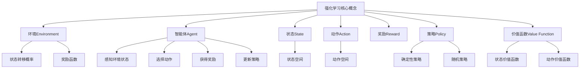

# 强化学习与自适应控制原理与代码实战案例讲解

## 1.背景介绍

### 1.1 什么是强化学习

强化学习(Reinforcement Learning, RL)是机器学习的一个重要分支,它赋予智能体(Agent)在与环境(Environment)交互的过程中,通过试错来学习如何采取最优行为策略以最大化预期累积奖励。与监督学习和无监督学习不同,强化学习没有提供完整的输入-输出数据对,智能体需要通过不断尝试并根据环境反馈来学习最优策略。

### 1.2 强化学习在现实世界中的应用

强化学习已广泛应用于机器人控制、自动驾驶、智能交通系统、游戏AI、资源管理、自动化决策等诸多领域。以AlphaGo战胜人类顶尖棋手为例,它使用深度强化学习算法通过与自身对弈数百万次训练,逐步优化其下棋策略。强化学习的优势在于无需事先标注的训练数据,能够通过与环境交互自主学习,适用于动态复杂的决策问题。

### 1.3 自适应控制与强化学习的关系

自适应控制(Adaptive Control)是一种在线调节控制器参数以适应系统变化的控制理论。强化学习为解决自适应控制问题提供了有效方法,智能体可以通过与控制系统交互来学习最优控制策略,从而实现自适应控制。两者有着内在的理论联系,结合能够产生强大的自适应智能控制系统。

## 2.核心概念与联系  



强化学习的核心概念包括:

1. **环境(Environment)**: 智能体与之交互的外部世界,通常被建模为马尔可夫决策过程(MDP)。环境由状态转移概率和奖励函数组成。

2. **智能体(Agent)**: 能够感知环境状态、选择动作并获得奖励的主体,目标是学习一个最优策略来最大化预期累积奖励。

3. **状态(State)**: 环境的当前状态,通常被表示为状态空间中的一个元素。

4. **动作(Action)**: 智能体在当前状态下可以采取的行为,动作空间定义了所有可能的动作。

5. **奖励(Reward)**: 环境给予智能体的反馈信号,指导智能体朝着正确方向优化策略。

6. **策略(Policy)**: 智能体在每个状态下选择动作的策略映射,可以是确定性的或随机的。

7. **价值函数(Value Function)**: 评估一个状态或状态-动作对在遵循某策略时的预期累积奖励,包括状态价值函数和动作价值函数。

这些概念相互关联,构成了强化学习问题的核心框架。智能体与环境交互,感知状态、选择动作并获得奖励,目的是学习一个最优策略来最大化预期累积奖励。

## 3.核心算法原理具体操作步骤

强化学习算法可分为基于价值函数(Value-based)、基于策略(Policy-based)和Actor-Critic三大类。以Q-Learning为例,介绍其核心算法原理和具体操作步骤。

### 3.1 Q-Learning算法原理

Q-Learning是一种基于价值函数的强化学习算法,通过估计每个状态-动作对的Q值(动作价值函数),从而获得最优策略。算法思想是使用贝尔曼方程作为迭代更新目标,逐步收敛到最优Q值,对应的策略就是最优策略。

Q-Learning的核心是基于以下贝尔曼最优方程:

$$Q^*(s,a) = \mathbb{E}_{s' \sim \mathcal{P}}\left[R(s,a,s') + \gamma \max_{a'} Q^*(s',a')\right]$$

其中:
- $Q^*(s,a)$是状态$s$下采取动作$a$的最优Q值
- $\mathcal{P}$是状态转移概率
- $R(s,a,s')$是从状态$s$采取动作$a$转移到$s'$的奖励
- $\gamma$是折现因子,控制未来奖励的重视程度

算法通过不断更新Q值,使其逼近最优Q值$Q^*$,从而获得最优策略$\pi^*(s) = \arg\max_a Q^*(s,a)$。

### 3.2 Q-Learning算法步骤

1. **初始化**
   - 初始化Q表格$Q(s,a)$,所有状态-动作对的Q值设为任意值(如0)
   - 设置学习率$\alpha$和折现因子$\gamma$

2. **选择动作**
   - 对于当前状态$s_t$,根据$\epsilon$-贪婪策略选择动作$a_t$
     - 以概率$\epsilon$选择随机动作(探索)
     - 以概率$1-\epsilon$选择当前Q值最大的动作(利用)

3. **执行动作并观察**
   - 执行动作$a_t$,获得奖励$r_{t+1}$,转移到新状态$s_{t+1}$

4. **更新Q值**
   - 使用贝尔曼方程更新$Q(s_t,a_t)$:
     $$Q(s_t,a_t) \leftarrow Q(s_t,a_t) + \alpha\left[r_{t+1} + \gamma\max_{a'}Q(s_{t+1},a') - Q(s_t,a_t)\right]$$

5. **重复2-4步骤**
   - 重复选择动作、执行动作、更新Q值的过程,直至收敛或达到终止条件

通过不断探索和利用,Q-Learning算法逐步优化Q值,最终收敛到最优策略。

## 4.数学模型和公式详细讲解举例说明  

### 4.1 马尔可夫决策过程(MDP)

强化学习问题通常被建模为马尔可夫决策过程(Markov Decision Process, MDP),用于描述智能体与环境的交互过程。MDP由以下5元组组成:

$$\langle \mathcal{S}, \mathcal{A}, \mathcal{P}, \mathcal{R}, \gamma \rangle$$

- $\mathcal{S}$是状态空间的集合
- $\mathcal{A}$是动作空间的集合
- $\mathcal{P}$是状态转移概率,定义为$\mathcal{P}_{ss'}^a = \Pr(s_{t+1}=s'|s_t=s,a_t=a)$
- $\mathcal{R}$是奖励函数,定义为$\mathcal{R}_s^a = \mathbb{E}[r_{t+1}|s_t=s,a_t=a]$
- $\gamma \in [0,1)$是折现因子,控制对未来奖励的重视程度

在MDP中,智能体处于状态$s_t$,选择动作$a_t$,然后转移到新状态$s_{t+1}$并获得奖励$r_{t+1}$。目标是找到一个策略$\pi$,使得在遵循该策略时,预期的累积折现奖励最大化:

$$G_t = \sum_{k=0}^{\infty} \gamma^k r_{t+k+1}$$

其中$G_t$是从时间步$t$开始的累积折现奖励。

### 4.2 贝尔曼方程

贝尔曼方程是强化学习中的一个核心概念,用于描述价值函数与奖励和状态转移概率之间的关系。

**状态价值函数(State-Value Function)**的贝尔曼方程为:

$$V^{\pi}(s) = \mathbb{E}_{\pi}\left[G_t|s_t=s\right] = \mathbb{E}_{\pi}\left[r_{t+1} + \gamma V^{\pi}(s_{t+1})|s_t=s\right]$$

**动作价值函数(Action-Value Function)**的贝尔曼方程为:

$$Q^{\pi}(s,a) = \mathbb{E}_{\pi}\left[G_t|s_t=s,a_t=a\right] = \mathbb{E}_{\pi}\left[r_{t+1} + \gamma Q^{\pi}(s_{t+1},a_{t+1})|s_t=s,a_t=a\right]$$

其中$\pi$是策略,表示在状态$s$下采取动作$a$的概率。

贝尔曼方程揭示了价值函数与即时奖励和未来状态价值之间的递归关系,为许多强化学习算法奠定了理论基础。

**示例:**
假设一个简单的网格世界,智能体可以在四个方向(上下左右)移动,目标是从起点到达终点。每移动一步,奖励为-1;到达终点,奖励为0。如果采用折现因子$\gamma=1$,则起点$(0,0)$的状态价值函数为:

$$V^{\pi}(0,0) = -1 + V^{\pi}(0,1)$$

因为从$(0,0)$移动到$(0,1)$的奖励为-1,且之后的累积奖励就是$(0,1)$的状态价值函数。通过解此方程组,可以求出每个状态的价值函数,进而得到最优策略。

### 4.3 时序差分目标

时序差分(Temporal Difference, TD)是强化学习中的一种预测技术,用于估计价值函数。TD目标是基于蒙特卡罗目标和动态规划的混合,结合了两者的优点。

TD目标的基本思想是,利用时间步$t+1$时的实际观测值,来更新时间步$t$时的估计值。对于状态价值函数,TD目标为:

$$G_{t:t+n} = r_{t+1} + \gamma r_{t+2} + \cdots + \gamma^{n-1}r_{t+n} + \gamma^n V(s_{t+n})$$

对于动作价值函数,TD目标为:

$$G_{t:t+n} = r_{t+1} + \gamma r_{t+2} + \cdots + \gamma^{n-1}r_{t+n} + \gamma^n Q(s_{t+n}, a_{t+n})$$

其中$n$是时间步长,当$n=1$时,称为TD(0);当$n=\infty$时,TD目标就等于蒙特卡罗目标。

TD目标被广泛应用于基于价值函数的强化学习算法中,如Q-Learning、Sarsa等,用于更新价值函数估计。

## 5.项目实践:代码实例和详细解释说明

以下是使用Python实现一个简单的Q-Learning算法,用于解决一个网格世界(GridWorld)问题。

### 5.1 问题描述

在一个4x4的网格世界中,智能体的目标是从起点(0,0)到达终点(3,3)。每移动一步,奖励为-1;到达终点,奖励为0。智能体可以在四个方向(上下左右)移动,但不能越过边界。我们使用Q-Learning算法训练智能体找到从起点到终点的最短路径。

### 5.2 代码实现

```python
import numpy as np

# 网格世界的大小
GRID_SIZE = 4

# 定义动作
ACTIONS = ['U', 'D', 'L', 'R']  # 上下左右

# 定义奖励
REWARDS = np.full((GRID_SIZE, GRID_SIZE), -1.0)
REWARDS[3, 3] = 0  # 终点奖励为0

# 初始化Q表格
Q = np.zeros((GRID_SIZE, GRID_SIZE, len(ACTIONS)))

# 设置超参数
ALPHA = 0.1  # 学习率
GAMMA = 0.9  # 折现因子
EPSILON = 0.1  # 探索率

# 定义状态转移函数
def get_next_state(state, action):
    row, col = state
    if action == 'U':
        next_state = (max(row - 1, 0), col)
    elif action == 'D':
        next_state = (min(row + 1, GRID_SIZE - 1), col)
    elif action == 'L':
        next_state = (row, max(col - 1, 0))
    else:
        next_state = (row, min(col + 1, GRID_SIZE - 1))
    return next_state

# 定义epsilon-