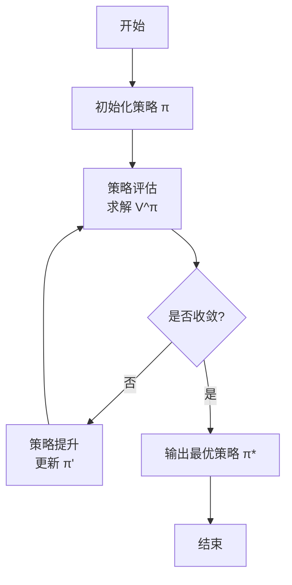
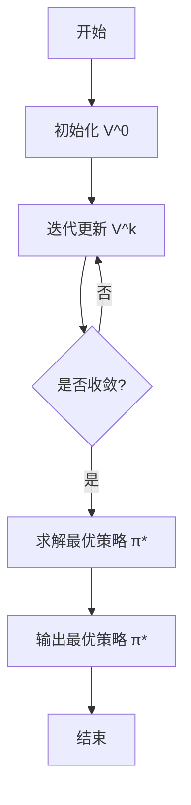

# 强化学习：策略迭代与价值迭代

## 1.背景介绍

强化学习是机器学习的一个重要分支,它研究如何基于环境反馈来学习决策策略,以获得最大化的累积奖励。与监督学习不同,强化学习没有给定的输入-输出样本对,而是通过与环境交互来学习。强化学习广泛应用于游戏、机器人控制、自动驾驶等领域。

策略迭代和价值迭代是强化学习中两种核心算法,用于求解马尔可夫决策过程(MDP)。马尔可夫决策过程是一种数学模型,描述了在不确定环境中进行顺序决策的问题。

## 2.核心概念与联系

### 2.1 马尔可夫决策过程(MDP)

马尔可夫决策过程由以下几个要素组成:

- 状态集合 $\mathcal{S}$
- 动作集合 $\mathcal{A}$
- 转移概率 $\mathcal{P}_{ss'}^a = \Pr(S_{t+1}=s'|S_t=s, A_t=a)$
- 奖励函数 $\mathcal{R}_s^a = \mathbb{E}[R_{t+1}|S_t=s, A_t=a]$
- 折扣因子 $\gamma \in [0, 1)$

目标是找到一个最优策略 $\pi^*$,使得在该策略下的期望累积奖励最大化:

$$\pi^* = \arg\max_\pi \mathbb{E}_\pi\left[\sum_{t=0}^\infty \gamma^t R_{t+1}\right]$$

### 2.2 价值函数

价值函数表示在给定状态或状态-动作对下,按照某个策略 $\pi$ 执行后可获得的期望累积奖励。

状态价值函数:
$$V^\pi(s) = \mathbb{E}_\pi\left[\sum_{t=0}^\infty \gamma^t R_{t+1}|S_0=s\right]$$

动作-状态价值函数(Q函数):
$$Q^\pi(s, a) = \mathbb{E}_\pi\left[\sum_{t=0}^\infty \gamma^t R_{t+1}|S_0=s, A_0=a\right]$$

### 2.3 最优价值函数

最优价值函数表示在最优策略 $\pi^*$ 下的价值函数:

$$V^*(s) = \max_\pi V^\pi(s)$$
$$Q^*(s, a) = \max_\pi Q^\pi(s, a)$$

## 3.核心算法原理具体操作步骤

### 3.1 策略迭代

策略迭代算法包含两个步骤:策略评估和策略提升。

1. **策略评估**

给定一个策略 $\pi$,求解该策略下的价值函数 $V^\pi$。这可以通过求解下面的贝尔曼方程来实现:

$$V^\pi(s) = \sum_{a\in\mathcal{A}}\pi(a|s)\left(\mathcal{R}_s^a + \gamma\sum_{s'\in\mathcal{S}}\mathcal{P}_{ss'}^a V^\pi(s')\right)$$

通过迭代更新直到收敛。

2. **策略提升**

基于评估得到的 $V^\pi$,对策略 $\pi$ 进行改进,得到一个新的更优的策略 $\pi'$:

$$\pi'(s) = \arg\max_a \left(\mathcal{R}_s^a + \gamma\sum_{s'\in\mathcal{S}}\mathcal{P}_{ss'}^a V^\pi(s')\right)$$

重复上述两个步骤,直到策略收敛到最优策略 $\pi^*$。

策略迭代算法流程图:



### 3.2 价值迭代

价值迭代算法直接求解最优价值函数 $V^*$,从而得到最优策略 $\pi^*$。

算法步骤如下:

1. 初始化 $V^0$ 为任意值函数
2. 迭代更新 $V^{k+1}$ 直到收敛:

$$V^{k+1}(s) = \max_a \left(\mathcal{R}_s^a + \gamma\sum_{s'\in\mathcal{S}}\mathcal{P}_{ss'}^a V^k(s')\right)$$

3. 得到最优价值函数 $V^* = \lim_{k\rightarrow\infty} V^k$
4. 从 $V^*$ 导出最优策略:

$$\pi^*(s) = \arg\max_a \left(\mathcal{R}_s^a + \gamma\sum_{s'\in\mathcal{S}}\mathcal{P}_{ss'}^a V^*(s')\right)$$

价值迭代算法流程图:



## 4.数学模型和公式详细讲解举例说明

### 4.1 贝尔曼方程

贝尔曼方程是强化学习中的一个核心方程,描述了状态价值函数或动作-状态价值函数与即时奖励和未来奖励之间的关系。

**状态价值函数的贝尔曼方程**:

$$V^\pi(s) = \sum_{a\in\mathcal{A}}\pi(a|s)\left(\mathcal{R}_s^a + \gamma\sum_{s'\in\mathcal{S}}\mathcal{P}_{ss'}^a V^\pi(s')\right)$$

其中:

- $V^\pi(s)$ 表示在策略 $\pi$ 下,状态 $s$ 的价值函数
- $\pi(a|s)$ 表示在状态 $s$ 下,策略 $\pi$ 选择动作 $a$ 的概率
- $\mathcal{R}_s^a$ 表示在状态 $s$ 执行动作 $a$ 后获得的即时奖励
- $\gamma$ 是折扣因子,用于权衡即时奖励和未来奖励的重要性
- $\mathcal{P}_{ss'}^a$ 表示在状态 $s$ 执行动作 $a$ 后,转移到状态 $s'$ 的概率
- $V^\pi(s')$ 表示在策略 $\pi$ 下,状态 $s'$ 的价值函数

**动作-状态价值函数的贝尔曼方程**:

$$Q^\pi(s, a) = \mathcal{R}_s^a + \gamma\sum_{s'\in\mathcal{S}}\mathcal{P}_{ss'}^a \sum_{a'\in\mathcal{A}}\pi(a'|s')Q^\pi(s', a')$$

其中:

- $Q^\pi(s, a)$ 表示在策略 $\pi$ 下,状态 $s$ 执行动作 $a$ 的动作-状态价值函数
- 其他符号含义与状态价值函数的贝尔曼方程相同

**示例**

考虑一个简单的网格世界,机器人需要从起点移动到终点。每一步移动都会获得-1的奖励,到达终点后获得+10的奖励。我们可以使用价值迭代算法求解最优策略。

1. 初始化 $V^0(s) = 0$ 对于所有状态 $s$
2. 迭代更新 $V^{k+1}(s)$:

$$V^{k+1}(s) = \max_a \left(-1 + \gamma\sum_{s'\in\mathcal{S}}\mathcal{P}_{ss'}^a V^k(s')\right)$$

其中 $\mathcal{P}_{ss'}^a$ 表示从状态 $s$ 执行动作 $a$ 后,转移到状态 $s'$ 的概率。

3. 当 $V^{k+1}$ 与 $V^k$ 足够接近时,算法收敛。
4. 从最优价值函数 $V^*$ 导出最优策略 $\pi^*$:

$$\pi^*(s) = \arg\max_a \left(-1 + \gamma\sum_{s'\in\mathcal{S}}\mathcal{P}_{ss'}^a V^*(s')\right)$$

通过这种方式,我们可以得到机器人从起点到终点的最优路径。

### 4.2 Q-Learning

Q-Learning 是一种基于价值迭代的强化学习算法,它直接学习动作-状态价值函数 $Q(s, a)$,而不需要先学习策略 $\pi$。

Q-Learning 的更新规则如下:

$$Q(s_t, a_t) \leftarrow Q(s_t, a_t) + \alpha\left[r_t + \gamma\max_{a'}Q(s_{t+1}, a') - Q(s_t, a_t)\right]$$

其中:

- $s_t$ 和 $a_t$ 分别表示时刻 $t$ 的状态和动作
- $r_t$ 表示执行动作 $a_t$ 后获得的即时奖励
- $\alpha$ 是学习率,控制着更新的步长
- $\gamma$ 是折扣因子,权衡即时奖励和未来奖励的重要性
- $\max_{a'}Q(s_{t+1}, a')$ 表示在状态 $s_{t+1}$ 下,执行任意动作可获得的最大动作-状态价值函数

Q-Learning 算法流程图:

```mermaid
graph TD
    A[初始化 Q(s, a)]
    A --> B[观测初始状态 s]
    B --> C[选择动作 a]
    C --> D[执行动作 a, 获得奖励 r, 观测新状态 s']
    D --> E[更新 Q(s, a)]
    E --> F{是否终止?}
    F -->|否| B
    F -->|是| G[输出最终 Q 函数]
    G --> H[结束]
```

Q-Learning 算法的优点是无需知道环境的转移概率,可以通过与环境交互来直接学习最优策略。它广泛应用于强化学习领域,如游戏AI、机器人控制等。

## 5.项目实践:代码实例和详细解释说明

以下是一个使用 Python 实现的简单网格世界示例,演示了如何使用 Q-Learning 算法求解最优策略。

```python
import numpy as np

# 定义网格世界
GRID = np.array([
    [0, 0, 0, 1],
    [0, None, 0, -1],
    [0, 0, 0, 0]
])

# 定义动作
ACTIONS = ['left', 'right', 'up', 'down']

# 定义奖励
REWARDS = {
    0: -1,  # 空白格子
    1: 10,  # 终点
    -1: -10 # 障碍物
}

# 定义 Q-Learning 参数
ALPHA = 0.1  # 学习率
GAMMA = 0.9  # 折扣因子
EPSILON = 0.1  # 探索概率

# 初始化 Q 函数
Q = {}
for i in range(GRID.shape[0]):
    for j in range(GRID.shape[1]):
        if GRID[i, j] is not None:
            Q[(i, j)] = {action: 0 for action in ACTIONS}

# 定义可执行动作函数
def get_valid_actions(state):
    i, j = state
    valid_actions = []
    if i > 0 and GRID[i-1, j] is not None:
        valid_actions.append('up')
    if i < GRID.shape[0]-1 and GRID[i+1, j] is not None:
        valid_actions.append('down')
    if j > 0 and GRID[i, j-1] is not None:
        valid_actions.append('left')
    if j < GRID.shape[1]-1 and GRID[i, j+1] is not None:
        valid_actions.append('right')
    return valid_actions

# 定义状态转移函数
def get_next_state(state, action):
    i, j = state
    if action == 'up':
        return i-1, j
    elif action == 'down':
        return i+1, j
    elif action == 'left':
        return i, j-1
    else:
        return i, j+1

# 定义 Q-Learning 算法
def q_learning(num_episodes):
    for episode in range(num_episodes):
        # 初始化状态
        state = (0, 0)
        
        while True:
            # 选择动作
            valid_actions = get_valid_actions(state)
            if np.random.uniform() < EPSILON:
                action = np.random.choice(valid_actions)
            else:
                action_values = [Q[state][a] for a in valid_actions]
                action = valid_actions[np.argmax(action_values)]
            
            # 执行动作
            next_state = get_next_state(state, action)
            reward = REWARDS[GRID[