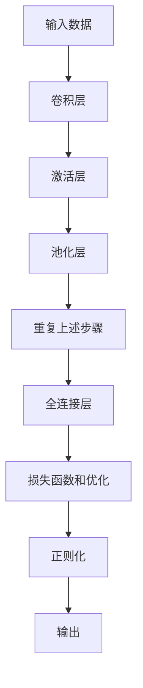

# 总结：CNN学习之路，永无止境

## 1.背景介绍

卷积神经网络(Convolutional Neural Networks, CNN)是深度学习领域中最成功和最广泛应用的技术之一。自从AlexNet在2012年的ImageNet竞赛中大放异彩以来,CNN在计算机视觉、自然语言处理、语音识别等各个领域都取得了巨大的成功。CNN的核心思想是利用卷积运算来提取输入数据的局部特征,并通过多层网络逐步提取更加抽象和复杂的特征表示。这种特征提取方式能够很好地捕捉输入数据的空间和时间结构信息,因此在处理图像、视频、语音等高维数据时表现出色。

## 2.核心概念与联系

### 2.1 卷积运算

卷积运算是CNN的核心操作,它通过在输入数据上滑动一个小窗口(卷积核)来提取局部特征。卷积核是一个小的权重矩阵,它与输入数据的局部区域进行元素级乘积运算,然后求和得到一个新的特征映射。通过在整个输入数据上滑动卷积核,可以获得一个新的特征映射,这个特征映射捕捉了输入数据在空间上的局部模式。

卷积运算的优点包括:

1. 参数共享:同一个卷积核在整个输入数据上滑动,大大减少了需要学习的参数数量,从而降低了模型的复杂度和过拟合风险。
2. 等变性:卷积核在输入数据上的滑动操作保持了输入数据的平移不变性,这对于处理图像和语音数据非常重要。

### 2.2 池化层

池化层通常跟随在卷积层之后,其作用是对卷积层的输出进行下采样,减小特征映射的维度。最常用的池化方法是最大池化,它从输入特征映射中选取一个小窗口内的最大值作为输出。池化层能够进一步提取输入数据的不变特征,同时减少了计算量和过拟合风险。

### 2.3 全连接层

CNN的最后几层通常是全连接层,它们将前面卷积层和池化层提取的高级特征映射展平,并将其输入到一个传统的神经网络中进行分类或回归任务。全连接层的每个神经元都与前一层的所有神经元相连,因此它们能够捕捉到输入数据的全局特征。

### 2.4 激活函数

激活函数在CNN的各个层中都扮演着重要的角色,它们引入了非线性,使得网络能够学习复杂的映射关系。常用的激活函数包括ReLU、Sigmoid、Tanh等。

### 2.5 正则化

为了防止过拟合,CNN通常采用了一些正则化技术,如L1/L2正则化、Dropout、BatchNormalization等。这些技术能够增强模型的泛化能力,提高模型在未见数据上的表现。

### 2.6 损失函数和优化算法

CNN的训练过程是一个优化问题,需要最小化一个损失函数(如交叉熵损失、均方误差等)。常用的优化算法包括随机梯度下降、动量优化、AdaGrad、RMSProp、Adam等。选择合适的损失函数和优化算法对于CNN的训练效果至关重要。

## 3.核心算法原理具体操作步骤

CNN的核心算法原理可以概括为以下几个步骤:

1. **卷积层**:输入数据(如图像)通过一个或多个卷积层,提取局部特征。每个卷积层包含多个卷积核,每个卷积核在输入数据上滑动,执行元素级乘积和求和操作,生成一个新的特征映射。卷积层保留了输入数据的空间结构信息。

2. **激活层**:卷积层的输出通过一个非线性激活函数(如ReLU)进行处理,引入非线性,增强网络的表达能力。

3. **池化层**:激活层的输出通过一个池化层进行下采样,减小特征映射的维度,提取更加鲁棒的特征表示。常用的池化方法是最大池化。

4. **重复上述步骤**:通过重复卷积层、激活层和池化层的操作,CNN能够逐层提取输入数据的更加抽象和复杂的特征表示。

5. **全连接层**:CNN的最后几层通常是全连接层,将前面卷积层和池化层提取的高级特征映射展平,输入到一个传统的神经网络中进行分类或回归任务。

6. **损失函数和优化**:CNN的训练过程是一个优化问题,需要最小化一个损失函数(如交叉熵损失、均方误差等)。常用的优化算法包括随机梯度下降、动量优化、AdaGrad、RMSProp、Adam等。

7. **正则化**:为了防止过拟合,CNN通常采用了一些正则化技术,如L1/L2正则化、Dropout、BatchNormalization等,增强模型的泛化能力。

下面是CNN的基本流程图:



## 4.数学模型和公式详细讲解举例说明

### 4.1 卷积运算

卷积运算是CNN的核心操作,它通过在输入数据上滑动一个小窗口(卷积核)来提取局部特征。设输入数据为$I$,卷积核为$K$,卷积运算可以表示为:

$$
S(i,j) = (I*K)(i,j) = \sum_{m}\sum_{n}I(i+m,j+n)K(m,n)
$$

其中,$(i,j)$是输出特征映射$S$的位置,$(m,n)$是卷积核$K$的位置。卷积运算是在输入数据$I$上滑动卷积核$K$,对每个位置进行元素级乘积和求和,得到输出特征映射$S$。

通常,卷积运算还会引入一些超参数,如步长(stride)和填充(padding)。步长控制卷积核在输入数据上滑动的步长,填充则是在输入数据的边缘添加零值,以保持输出特征映射的维度不变。

### 4.2 池化层

池化层通常跟随在卷积层之后,其作用是对卷积层的输出进行下采样,减小特征映射的维度。最常用的池化方法是最大池化,它从输入特征映射中选取一个小窗口内的最大值作为输出。

设输入特征映射为$X$,池化窗口大小为$f\times f$,步长为$s$,则最大池化运算可以表示为:

$$
y_{i,j} = \max_{m=0,\dots,f-1 \\ n=0,\dots,f-1} X_{i\times s+m,j\times s+n}
$$

其中,$(i,j)$是输出特征映射$y$的位置,$(m,n)$是池化窗口在输入特征映射$X$上的位置。最大池化操作在输入特征映射$X$上滑动一个$f\times f$的窗口,选取窗口内的最大值作为输出特征映射$y$的对应位置的值。

### 4.3 全连接层

全连接层将前面卷积层和池化层提取的高级特征映射展平,并将其输入到一个传统的神经网络中进行分类或回归任务。设输入为$x$,权重矩阵为$W$,偏置为$b$,则全连接层的输出可以表示为:

$$
y = f(W^Tx + b)
$$

其中,$f$是激活函数,如ReLU、Sigmoid等。全连接层的每个神经元都与前一层的所有神经元相连,因此它们能够捕捉到输入数据的全局特征。

### 4.4 损失函数和优化

CNN的训练过程是一个优化问题,需要最小化一个损失函数。常用的损失函数包括:

- 交叉熵损失(对于分类任务):
  $$
  L = -\frac{1}{N}\sum_{i=1}^{N}\sum_{j=1}^{M}y_{ij}\log(\hat{y}_{ij})
  $$
  其中,$N$是样本数量,$M$是类别数量,$y$是真实标签,$\hat{y}$是预测概率。

- 均方误差(对于回归任务):
  $$
  L = \frac{1}{N}\sum_{i=1}^{N}(y_i - \hat{y}_i)^2
  $$
  其中,$N$是样本数量,$y$是真实值,$\hat{y}$是预测值。

常用的优化算法包括随机梯度下降、动量优化、AdaGrad、RMSProp、Adam等。这些优化算法通过计算损失函数相对于网络权重的梯度,并沿着梯度的反方向更新权重,从而最小化损失函数。

## 5.项目实践:代码实例和详细解释说明

下面是一个使用PyTorch实现的简单CNN模型,用于对MNIST手写数字数据集进行分类。

```python
import torch
import torch.nn as nn
import torch.nn.functional as F

# 定义CNN模型
class CNN(nn.Module):
    def __init__(self):
        super(CNN, self).__init__()
        self.conv1 = nn.Conv2d(1, 32, 3, 1)  # 输入通道数为1,输出通道数为32,卷积核大小为3x3,步长为1
        self.conv2 = nn.Conv2d(32, 64, 3, 1) # 输入通道数为32,输出通道数为64,卷积核大小为3x3,步长为1
        self.dropout1 = nn.Dropout2d(0.25)  # 随机失活,防止过拟合
        self.dropout2 = nn.Dropout2d(0.5)
        self.fc1 = nn.Linear(9216, 128)      # 全连接层,输入维度为9216,输出维度为128
        self.fc2 = nn.Linear(128, 10)        # 全连接层,输入维度为128,输出维度为10(对应MNIST数据集的10个类别)

    def forward(self, x):
        x = self.conv1(x)       # 第一个卷积层
        x = F.relu(x)           # ReLU激活函数
        x = self.conv2(x)       # 第二个卷积层
        x = F.relu(x)           # ReLU激活函数
        x = F.max_pool2d(x, 2)  # 最大池化,窗口大小为2x2
        x = self.dropout1(x)    # 随机失活,防止过拟合
        x = torch.flatten(x, 1) # 将特征映射展平
        x = self.fc1(x)         # 第一个全连接层
        x = F.relu(x)           # ReLU激活函数
        x = self.dropout2(x)    # 随机失活,防止过拟合
        x = self.fc2(x)         # 第二个全连接层,输出维度为10(对应MNIST数据集的10个类别)
        output = F.log_softmax(x, dim=1) # 计算log_softmax,用于交叉熵损失
        return output
```

代码解释:

1. 定义一个CNN模型类`CNN`,继承自`nn.Module`。
2. 在`__init__`方法中定义网络的层次结构:
   - `self.conv1`和`self.conv2`是两个卷积层,分别输出32和64个特征映射。
   - `self.dropout1`和`self.dropout2`是两个随机失活层,用于防止过拟合。
   - `self.fc1`和`self.fc2`是两个全连接层,分别输出128和10个维度(对应MNIST数据集的10个类别)。
3. `forward`方法定义了CNN的前向传播过程:
   - 输入数据`x`首先通过第一个卷积层`self.conv1`,然后应用ReLU激活函数。
   - 然后通过第二个卷积层`self.conv2`,再应用ReLU激活函数。
   - 接着进行最大池化操作`F.max_pool2d`,窗口大小为2x2。
   - 随机失活`self.dropout1`,防止过拟合。
   - 将特征映射展平`torch.flatten`。
   - 通过第一个全连接层`self.fc1`,应用ReLU激活函数。
   - 随机失活`self.dropout2`,防止过拟合。
   - 通过第二个全连接层`self.fc2`,输出维度为10(对应MNIST数据集的10个类别)。
   - 最后计算log_softmax,用于交叉熵损失`F.log_softmax`{"msg_type":"generate_answer_finish","data":"","from_module":null,"from_unit":null}