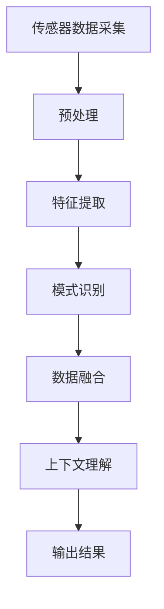

# 感知 (Perception)

## 1.背景介绍

感知是指获取和解释来自各种感官的信息,从而理解和认识周围环境的过程。在人工智能领域,感知是一个关键的基础模块,为更高级的任务提供必要的输入数据。例如,计算机视觉系统需要从图像或视频中感知物体、场景和动作;语音识别系统需要从音频信号中感知语音和语义内容;机器人需要感知其周围环境以进行导航和操作。

感知任务通常涉及复杂的模式识别和信号处理技术,需要处理来自多种传感器的大量原始数据,并从中提取出有用的特征和模式。这些特征和模式随后被用于对象识别、跟踪、分类等高级任务。因此,感知是人工智能系统与现实世界交互的关键接口。

## 2.核心概念与联系 

感知涉及以下几个核心概念:

### 2.1 传感器

传感器是获取环境信息的硬件设备,如相机、麦克风、激光雷达等。不同类型的传感器能够检测不同的物理量,如光、声音、距离等。传感器的性能直接影响感知系统的质量。

### 2.2 特征提取

特征提取是从原始传感器数据中提取出对于后续任务有用的特征或模式的过程。常用的特征提取方法包括边缘检测、角点检测、频谱分析等。有效的特征提取对于提高系统性能至关重要。

### 2.3 模式识别

模式识别是根据提取的特征对输入数据进行分类或识别的过程。常用的模式识别算法包括支持向量机、决策树、神经网络等。模式识别的准确性直接影响感知系统的输出质量。

### 2.4 数据融合

数据融合是将来自多个传感器的数据进行整合,以提高感知的鲁棒性和准确性。数据融合可以发生在特征级别或决策级别,需要解决不同传感器之间的时空一致性问题。

### 2.5 上下文理解

上下文理解是利用先验知识和场景信息来辅助感知过程的理解和决策。例如,利用物体之间的空间关系、运动模式等上下文信息,可以提高目标检测和跟踪的准确性。

这些核心概念相互关联,共同构建了感知系统的基础框架。数据由传感器获取,经过特征提取和模式识别,融合不同传感器的信息,并利用上下文知识进行理解和决策,最终输出感知结果。

## 3.核心算法原理具体操作步骤

感知系统通常包含以下几个主要步骤:



### 3.1 传感器数据采集

该步骤从各种传感器(如相机、麦克风、激光雷达等)获取原始数据,如图像、音频、点云等。数据采集的质量直接影响后续处理的效果。

### 3.2 预处理

预处理步骤对原始数据进行处理,以提高后续算法的效率和鲁棒性。常见的预处理操作包括去噪、校正、插值、配准等。

### 3.3 特征提取

特征提取是从预处理后的数据中提取出对于后续任务有用的特征或模式。常用的特征提取算法包括:

- 图像处理中的边缘检测、角点检测、HOG、SIFT等
- 语音处理中的MFCC、LPC等
- 点云处理中的法向量估计、曲率计算等

有效的特征提取对于提高系统性能至关重要。

### 3.4 模式识别

模式识别步骤根据提取的特征对输入数据进行分类或识别。常用的模式识别算法包括:

- 监督学习算法:支持向量机、决策树、随机森林等
- 非监督学习算法:聚类算法如K-Means、高斯混合模型等
- 深度学习算法:卷积神经网络、递归神经网络等

模式识别的准确性直接影响感知系统的输出质量。

### 3.5 数据融合

数据融合是将来自多个传感器的数据进行整合,以提高感知的鲁棒性和准确性。常见的数据融合方法包括:

- 特征级融合:在特征提取阶段对不同传感器的特征进行融合
- 决策级融合:在模式识别阶段对不同传感器的结果进行融合

数据融合需要解决不同传感器之间的时空一致性、噪声、故障等问题。

### 3.6 上下文理解

上下文理解利用先验知识和场景信息来辅助感知过程的理解和决策。例如:

- 利用物体之间的空间关系、运动模式等上下文信息,提高目标检测和跟踪的准确性
- 利用语义信息和常识知识,提高语音识别和自然语言理解的性能

上下文理解可以通过规则系统、概率图模型或深度学习模型来实现。

### 3.7 输出结果

最后一步是根据上下文理解的结果,输出感知系统的最终结果,如目标的类别、位置、运动状态等。输出结果的表示形式取决于具体的应用场景。

整个过程是一个反馈循环,输出结果可以被用于优化传感器参数、特征提取算法等,以不断提高系统的性能。

## 4.数学模型和公式详细讲解举例说明

在感知系统中,数学模型和公式扮演着重要的角色,用于表示和处理传感器数据、特征、模式等。下面将详细介绍一些常用的数学模型和公式。

### 4.1 图像处理

在计算机视觉领域,图像被表示为二维矩阵,每个元素对应图像中的一个像素。常用的图像处理操作包括:

**1. 图像滤波**

图像滤波是去除图像噪声、增强特征的常用操作,通常使用卷积核对图像进行卷积运算:

$$
g(x,y) = \sum_{i=-a}^{a}\sum_{j=-b}^{b}f(x+i,y+j)w(i,j)
$$

其中 $f(x,y)$ 是原始图像, $g(x,y)$ 是滤波后的图像, $w(i,j)$ 是卷积核的权重系数。

**2. 边缘检测**

边缘检测是提取图像中物体轮廓的重要步骤,常用的算子有Sobel、Prewitt、Canny等。以Sobel算子为例:

$$
G_x = \begin{bmatrix}
-1 & 0 & 1\\
-2 & 0 & 2\\
-1 & 0 & 1
\end{bmatrix} * A
\quad
G_y = \begin{bmatrix}
1 & 2 & 1\\
0 & 0 & 0\\
-1 & -2 & -1
\end{bmatrix} * A
$$

其中 $G_x$ 和 $G_y$ 分别是水平和垂直方向的梯度幅值, $A$ 是原始图像。边缘强度和方向可由 $G = \sqrt{G_x^2 + G_y^2}$ 和 $\theta = \tan^{-1}(G_y / G_x)$ 计算得到。

**3. 特征描述子**

特征描述子用于描述图像局部区域的特征,是物体识别和匹配的基础。著名的SIFT描述子基于图像梯度的统计量:

$$
\begin{aligned}
f_m(x,y) &= \sum_{i,j} w(i,j)I(x+i,y+j) \\
f_\theta(x,y) &= \sum_{i,j} w(i,j)\tan^{-1}\left(\frac{I(x+i,y+j+1) - I(x+i,y+j-1)}{I(x+i+1,y+j) - I(x+i-1,y+j)}\right)
\end{aligned}
$$

其中 $f_m$ 和 $f_\theta$ 分别表示梯度幅值和方向, $w(i,j)$ 是高斯权重函数, $I(x,y)$ 是像素灰度值。SIFT描述子由这些统计量构成高维特征向量。

### 4.2 语音处理

语音信号通常被表示为一维时间序列,常用的特征提取方法包括:

**1. 梅尔频率倒谱系数(MFCC)**

MFCC是语音识别中最常用的特征,它模拟了人耳对声音的感知方式:

$$
\begin{aligned}
X(k) &= \sum_{n=0}^{N-1}x(n)e^{-j\frac{2\pi kn}{N}},\quad k=0,1,\ldots,N-1\\
S(m) &= \sum_{k=0}^{N-1}\left|X(k)\right|^2H_m(k),\quad m=0,1,\ldots,M-1\\
c_n &= \sum_{m=0}^{M-1}S(m)\log\cos\left[\frac{n(m-0.5)}{M}\pi\right],\quad n=0,1,\ldots,L-1
\end{aligned}
$$

其中 $x(n)$ 是语音时域信号, $X(k)$ 是它的傅里叶变换, $H_m(k)$ 是三角滤波器组, $S(m)$ 是滤波后的梅尔频率谱, $c_n$ 是最终的MFCC系数。

**2. 线性预测系数(LPC)**

LPC是基于线性预测模型的语音编码方法,常用于语音合成:

$$
\begin{aligned}
x(n) &\approx \sum_{k=1}^{p}a_kx(n-k) + u(n)\\
E &= \sum_{n=p+1}^{N}\left[x(n) - \sum_{k=1}^{p}a_kx(n-k)\right]^2
\end{aligned}
$$

其中 $x(n)$ 是语音信号, $a_k$ 是线性预测系数, $u(n)$ 是预测误差, $E$ 是能量函数。通过最小化 $E$ 可以求解出最优的 $a_k$ 系数。

### 4.3 点云处理

点云是三维空间中一组无序的点集合,常用于表示物体的几何形状。处理点云数据的常用算法包括:

**1. 法向量估计**

法向量是描述点云局部几何结构的重要特征,可以用于表面重构、配准等任务。常用的估计方法是基于邻域的拟合:

$$
\begin{aligned}
\mathbf{n}_p &= \arg\min_{\mathbf{n}} \sum_{q \in \mathcal{N}(p)} \left\|\left(\mathbf{q} - \mathbf{p}\right)^T\mathbf{n}\right\|^2\\
&= \arg\min_{\mathbf{n}} \mathbf{n}^T \left(\sum_{q \in \mathcal{N}(p)} \left(\mathbf{q} - \mathbf{p}\right)\left(\mathbf{q} - \mathbf{p}\right)^T\right) \mathbf{n}
\end{aligned}
$$

其中 $\mathbf{p}$ 是待估计点, $\mathcal{N}(p)$ 是它的邻域点集, $\mathbf{n}_p$ 是估计的法向量,可以通过求解最小二乘问题得到。

**2. 曲率估计**

曲率是另一种描述点云局部几何性质的重要特征,可用于分割、识别等任务。曲率的计算通常基于邻域点的拟合:

$$
C(p) = \frac{\lambda_0}{\lambda_0 + \lambda_1 + \lambda_2}
$$

其中 $\lambda_0 \leq \lambda_1 \leq \lambda_2$ 是拟合二次曲面的特征值,反映了点云在该点处的曲率变化。

这些数学模型和公式为感知系统提供了理论基础和计算工具,使得复杂的感知任务能够被量化和优化。在实际应用中,还需要结合具体的场景和任务,选择合适的模型和算法。

## 5.项目实践:代码实例和详细解释说明

为了更好地理解感知系统的实现,这里将提供一些代码示例,并对其进行详细解释。

### 5.1 图像处理实例

以下是使用Python和OpenCV库实现图像边缘检测的代码示例:

```python
import cv2
import numpy as np

# 读取图像
img = cv2.imread('example.jpg')

# 转换为