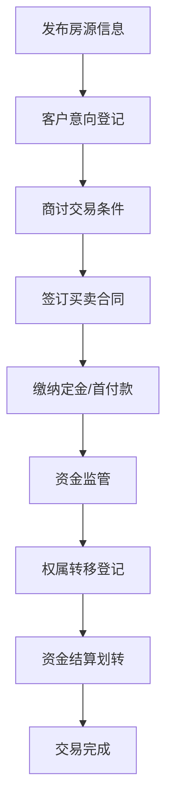

# 房管局房屋交易管理系统详细设计与具体代码实现

## 1. 背景介绍  
### 1.1 房屋交易管理系统的重要性
在现代社会中,房地产行业是国民经济的重要组成部分,房屋交易管理工作直接关系到人民群众切身利益和社会的和谐稳定。传统的房屋交易管理工作大多采用人工作业的方式,效率低下,差错率高,已经无法满足日益增长的房屋交易量和管理需求。因此,开发一套功能完善、性能优越的房屋交易管理系统是十分必要且迫切的。

### 1.2 系统建设目标
房管局房屋交易管理系统旨在实现房屋交易全流程的信息化、自动化管理,提高房管部门的工作效率和服务水平。系统应具备房源信息发布、意向登记、合同网签、资金监管、产权登记等功能,做到数据共享、业务协同、流程优化,为房地产交易提供一站式服务。同时,系统还要满足安全性、可靠性、可扩展性等非功能性需求。

## 2. 核心概念与关联
### 2.1 房屋信息管理 
- 房屋基本信息:位置、面积、户型、楼层、建筑年代等
- 房屋权属信息:产权人、共有情况、抵押/查封/限制等
- 房屋状态管理:在售、已售、交易中、暂不可售等

### 2.2 客户信息管理
- 客户基本信息:姓名、证件号、联系方式等 
- 客户类型:买方、卖方
- 客户意向管理:意向房源、意向价格、置业顾问等

### 2.3 合同管理
- 合同模板管理:定金合同、买卖合同等
- 合同填写:根据交易信息自动填充合同要素
- 合同网签:在线填写和签署电子合同
- 合同审核:自动合规性检查,人工复核

### 2.4 资金监管
- 资金账户管理:开设、变更、注销监管账户
- 资金存管:交易资金由银行进行第三方监管
- 资金结算:待房屋过户和权证办理完成后,资金划转至卖方账户

### 2.5 产权登记  
- 权属转移登记:房屋买卖双方到房管局办理过户手续
- 交易信息推送:将房屋交易信息推送给相关部门,如税务、公安等
- 电子证照生成:为买方生成新的不动产权证明

以下是房屋交易业务流程的 Mermaid 流程图:


## 3. 核心算法原理与操作步骤
### 3.1 身份认证算法
系统采用HMAC(Hash-based Message Authentication Code)算法对用户身份进行认证。具体步骤如下:
1. 发送方使用约定的密钥和哈希算法(如SHA256)对原始消息进行运算,得到哈希值
2. 发送方将原始消息和哈希值一同发送给接收方 
3. 接收方使用相同的密钥和哈希算法对接收到的原始消息进行运算,得到另一个哈希值
4. 接收方比对两个哈希值,如果一致则说明消息未被篡改,身份验证通过;否则验证失败

HMAC算法可有效防止中间人攻击,保障系统通信安全。

### 3.2 数据加密算法
为保护敏感数据如身份证号、银行账号等,系统使用AES(Advanced Encryption Standard)算法对数据进行加密存储。
1. 生成一个安全的对称密钥
2. 使用AES算法的CBC(Cipher Block Chaining)模式对明文进行加密,得到密文
3. 将密文存入数据库
4. 读取数据时,使用相同的密钥对密文解密,得到原始明文数据

AES是一种高效安全的块加密算法,密钥长度可以是128/192/256位,能够很好地保护数据的机密性。

### 3.3 电子合同签名算法
房屋买卖合同采用电子签名的形式,使用RSA(Rivest-Shamir-Adleman)非对称加密算法进行签名。
1. 签名方使用自己的私钥对合同内容的哈希值进行加密,得到数字签名
2. 签名方将合同内容和数字签名一同发送给验签方
3. 验签方使用签名方的公钥对数字签名进行解密,得到哈希值A
4. 验签方对收到的合同内容进行哈希运算,得到哈希值B
5. 比对哈希值A和B,如果一致,则签名有效;否则签名无效

RSA签名算法基于大整数因数分解的数学难题,私钥加密、公钥解密,保证了签名的不可抵赖性。

## 4. 数学模型与公式详解
### 4.1 房屋价格估算模型
对于没有明确标价的房源,系统可根据其属性特征估算出一个合理的价格区间,为交易提供参考。采用多元线性回归模型:
$$
P = a_0 + a_1x_1 + a_2x_2 + ... + a_nx_n
$$
其中,$P$为估算价格,$x_i$为房屋的各项属性值(如面积、楼层、房龄等),$a_i$为各属性的权重系数。通过对大量历史交易数据进行训练,得到回归系数。
例如,通过分析发现房屋总价与面积、楼层呈正相关,与房龄呈负相关,得到模型:
$$
P = 100 + 1.2 \times 面积 + 0.5 \times 楼层 - 0.8 \times 房龄
$$
某房屋面积100平米,楼层12层,房龄5年,则其估算价格为:
$$
P = 100 + 1.2 \times 100 + 0.5 \times 12 - 0.8 \times 5 = 242 (万元)
$$

### 4.2 贷款利息计算公式
很多购房者需要通过银行贷款来支付房款,系统需要提供贷款利息的计算功能。等额本息还款方式下的月供计算公式为:
$$
每月月供 = \frac{贷款本金 \times 月利率 \times (1+月利率)^{还款月数}}{(1+月利率)^{还款月数} - 1}
$$
例如,贷款100万元,年利率4.9%,贷款期限20年,则:
$$
月利率 = 年利率 \div 12 = 4.9\% \div 12 = 0.408\% \\
还款月数 = 贷款期限 \times 12 = 20 \times 12 = 240 \\
每月月供 = \frac{1000000 \times 0.00408 \times (1+0.00408)^{240}}{(1+0.00408)^{240} - 1} = 6027.64 (元)
$$
贷款利息 = 月供 × 还款月数 - 贷款本金 
           = 6027.64 × 240 - 1000000
           = 446633.6 (元)

### 4.3 资金结算模型
房款结算需要考虑卖方的尾款和买方的按揭贷款,计算公式为:
$$
卖方应收 = 房屋总价 - 已付定金 - 买方贷款金额 \\
买方应付 = 房屋总价 - 已付定金 - 贷款金额
$$
例如,房屋总价200万,买方已付定金20万,贷款150万,则:
$$
卖方应收 = 200 - 20 - 150 = 30 (万元) \\
买方应付 = 200 - 20 - 150 = 30 (万元)
$$

## 5. 项目实践:代码实例与讲解
下面以登录认证、房源信息录入、合同签署等功能为例,给出核心代码实现。

### 5.1 登录认证
使用Spring Security框架进行身份认证:
```java
@Configuration
@EnableWebSecurity
public class SecurityConfig extends WebSecurityConfigurerAdapter {
    
    @Override
    protected void configure(HttpSecurity http) throws Exception {
        http
            .authorizeRequests()
                .antMatchers("/admin/**").hasRole("ADMIN")
                .antMatchers("/user/**").hasRole("USER")
                .anyRequest().authenticated()
            .and()
            .formLogin()
                .loginPage("/login")
                .defaultSuccessUrl("/")
                .permitAll()
            .and()
            .logout()
                .logoutUrl("/logout")
                .logoutSuccessUrl("/login")
                .permitAll();
    }
    
    @Autowired
    public void configureGlobal(AuthenticationManagerBuilder auth) throws Exception {
        auth
            .inMemoryAuthentication()
            .withUser("admin").password("123456").roles("ADMIN")
            .and()
            .withUser("user").password("123456").roles("USER");
    }
}
```
以上配置限定了/admin/** URL需要ADMIN角色才能访问,/user/** URL需要USER角色才能访问。未登录用户访问受保护页面会自动跳转到登录页。

### 5.2 房源信息管理
房源信息包括基本信息、图片、户型等,采用MongoDB进行存储,定义实体类如下:
```java
@Document(collection="house")
public class House {
    @Id
    private String id;
    private String title;
    private String description;
    private int area;
    private String[] images;
    private Housetype type;
    // 省略getter/setter
}

public enum Housetype {
    ONE_ROOM, TWO_ROOM, THREE_ROOM, FOUR_ROOM, OTHER
}
```
对房源信息的CRUD操作:
```java
public interface HouseRepository extends MongoRepository<House, String> {
    List<House> findByArea(int area);
}

@Service
public class HouseService {
    
    @Autowired
    private HouseRepository houseRepo;
    
    public List<House> findAll() {
        return houseRepo.findAll();
    }
    
    public House add(House house) {
        return houseRepo.save(house);
    }
    
    public House findOne(String id) {
        return houseRepo.findOne(id);
    }
    
    public void delete(String id) {
        houseRepo.delete(id);
    }
}
```
### 5.3 电子合同签署
合同文本采用Word格式模板,使用POI库根据交易信息动态生成合同内容:
```java
public class ContractGenerator {
    
    public void generate(Map<String, String> params, String templatePath, String outputPath) {
        XWPFDocument doc = new XWPFDocument(new FileInputStream(templatePath));
        // 替换模板中的${key}变量
        doc.getParagraphs().forEach(p -> {
            p.getRuns().forEach(r -> {
                String text = r.text();
                for (Map.Entry<String, String> entry : params) {
                    text = text.replace("${" + entry.getKey() + "}", entry.getValue());
                }
                r.setText(text, 0);
            });
        });
        // 保存到输出文件
        doc.write(new FileOutputStream(outputPath));
    }
}
```
使用itext-sign对PDF合同文件进行电子签名:
```java
public class ContractSigner {
    
    public void sign(String src, String dest, Certificate[] chain, PrivateKey pk) throws GeneralSecurityException, IOException, DocumentException {
        // 创建签名对象
        PdfReader reader = new PdfReader(src);
        FileOutputStream os = new FileOutputStream(dest);
        PdfStamper stamper = PdfStamper.createSignature(reader, os, '\0');
        PdfSignatureAppearance appearance = stamper.getSignatureAppearance();
        appearance.setReason("房屋买卖合同");
        appearance.setLocation("XX市房管局");
        // 设置签名位置
        appearance.setVisibleSignature(new Rectangle(100, 100, 200, 130), 1, "Contract");
        // 摘要算法
        ExternalDigest digest = new BouncyCastleDigest();
        // 签名算法
        ExternalSignature signature = new PrivateKeySignature(pk, "SHA-256", "BC");
        // 调用itext签名方法
        MakeSignature.signDetached(appearance, digest, signature, chain, null, null, null, 0, CryptoStandard.CMS);
    }
}
```
## 6. 实际应用场景
房管局房屋交易管理系统在房地产交易各环节中均有广泛应用:

- **房源发布**:房屋中介或个人可在系统中发布房源信息,包括文字描述、图片、视频等,吸引意向客户
- **客户搜索匹配**:购房者可根据自己的需求在系统中搜索房源,系统也可根据客户意向主动推荐匹配的房源
-