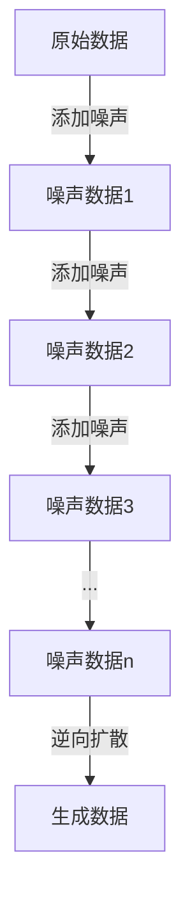
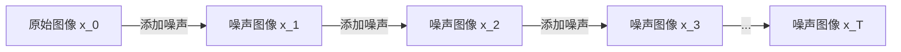

# 扩散模型的老照片修复与着色应用

## 1. 背景介绍

### 1.1 老照片的意义和挑战

老照片是珍贵的记忆载体,承载着无数个人和家庭的点点滴滴。然而,随着时间的流逝,老照片往往会出现各种各样的损坏,如褪色、划痕、污渍等,这不仅影响了照片的观赏性,也可能导致珍贵的记忆永远失传。因此,如何修复和保护老照片,成为了一个亟待解决的问题。

传统的老照片修复方法通常依赖于人工操作,需要耗费大量的时间和精力。而且,由于人工操作的主观性,修复效果参差不齐,难以保证一致性。此外,老照片的着色也是一个巨大的挑战,需要专业的技能和经验。

### 1.2 人工智能在老照片修复中的应用

近年来,人工智能技术的飞速发展为老照片修复带来了新的契机。特别是深度学习算法的出现,使得计算机能够自动学习图像特征,从而实现高质量的图像修复和着色。其中,扩散模型(Diffusion Model)作为一种新兴的深度生成模型,在老照片修复和着色领域展现出了巨大的潜力。

扩散模型通过学习图像的潜在分布,能够生成高质量、多样化的图像输出。相比于其他生成模型,扩散模型具有更好的样本质量和更强的生成能力,因此在老照片修复和着色任务中表现出色。

本文将详细介绍扩散模型在老照片修复和着色领域的应用,包括核心概念、算法原理、数学模型、实践案例、应用场景等,旨在为读者提供全面的理解和实践指导。

## 2. 核心概念与联系

### 2.1 扩散模型的核心思想

扩散模型(Diffusion Model)是一种基于马尔可夫链的生成模型,它通过学习数据的潜在分布,逐步从噪声中"反向扩散"出目标数据。这种思路与传统的生成模型不同,后者通常是直接从低维潜在空间生成高维数据。

扩散模型的核心思想是将数据生成过程视为一个逆向扩散(Reverse Diffusion)的过程。具体来说,模型首先将原始数据(如图像)添加噪声,形成一系列越来越"模糊"的数据副本。然后,模型学习如何从这些"模糊"的数据中逆向推导出原始数据。

这种思路的优势在于,扩散模型能够更好地捕捉数据的细节和结构信息,从而生成更高质量的输出。同时,由于扩散过程是可逆的,因此模型也可以用于数据修复和增强等任务。



### 2.2 扩散模型与其他生成模型的关系

扩散模型与其他常见的生成模型,如变分自编码器(VAE)、生成对抗网络(GAN)等,有着一定的联系和区别。

- 变分自编码器(VAE)是一种基于概率模型的生成模型,它通过学习数据的潜在分布,从低维潜在空间生成高维数据。与扩散模型相比,VAE的生成质量通常较低,且容易出现模糊和失真的现象。

- 生成对抗网络(GAN)是另一种常见的生成模型,它由一个生成器和一个判别器组成,通过对抗训练的方式学习数据分布。GAN可以生成高质量的图像,但训练过程较为不稳定,且存在模式崩溃等问题。

相比之下,扩散模型具有以下优势:

1. 生成质量高:扩散模型能够生成高分辨率、细节丰富的图像,质量超过了VAE和早期GAN模型。

2. 训练稳定:扩散模型的训练过程相对稳定,不存在GAN中的模式崩溃问题。

3. 任务通用:除了图像生成,扩散模型还可以应用于图像修复、超分辨率重建等多种任务。

4. 理论基础扎实:扩散模型建立在马尔可夫链的理论基础之上,具有较好的解释性和可解释性。

因此,扩散模型被认为是一种极具潜力的新型生成模型,在老照片修复和着色等领域展现出了广阔的应用前景。

## 3. 核心算法原理具体操作步骤

### 3.1 扩散过程

扩散模型的核心算法包括两个主要过程:扩散过程(Diffusion Process)和反向扩散过程(Reverse Diffusion Process)。

扩散过程的目标是将原始数据(如图像)转换为纯噪声数据,这个过程可以通过添加高斯噪声来实现。具体来说,扩散过程包括以下步骤:

1. 初始化一个噪声图像 $x_T$,通常为纯高斯噪声。

2. 从时间步 $T$ 到 $0$,逐步生成一系列中间噪声图像 $x_{T-1}, x_{T-2}, \dots, x_0$,其中 $x_0$ 为原始图像。每个时间步的操作如下:

   $$ x_{t-1} = \sqrt{1 - \beta_t} x_t + \sqrt{\beta_t} \epsilon_t, \quad \epsilon_t \sim \mathcal{N}(0, I) $$

   其中 $\beta_t$ 是一个预定义的扩散系数,控制了每个时间步添加的噪声量。$\epsilon_t$ 是一个随机高斯噪声向量。

通过上述过程,原始图像 $x_0$ 被逐步"扩散"为纯噪声图像 $x_T$。这个过程是可逆的,因此我们可以通过学习反向扩散过程来从噪声中重建原始图像。



### 3.2 反向扩散过程

反向扩散过程的目标是从噪声图像 $x_T$ 逐步重建出原始图像 $x_0$。这个过程需要一个神经网络模型来学习,模型的输入是当前时间步的噪声图像 $x_t$ 和时间步 $t$,输出是预测的噪声 $\epsilon_\theta(x_t, t)$。

具体来说,反向扩散过程包括以下步骤:

1. 初始化噪声图像 $x_T$。

2. 从时间步 $T$ 到 $0$,逐步生成一系列中间图像估计值 $\hat{x}_{T-1}, \hat{x}_{T-2}, \dots, \hat{x}_0$,其中 $\hat{x}_0$ 是原始图像的估计值。每个时间步的操作如下:

   $$ \hat{x}_{t-1} = \frac{1}{\sqrt{1 - \beta_t}} \left(x_t - \frac{\beta_t}{\sqrt{1 - \bar{\beta}_t}} \epsilon_\theta(x_t, t)\right) + \sigma_t \epsilon_{t+1} $$

   其中 $\epsilon_\theta(x_t, t)$ 是神经网络模型预测的噪声,用于从 $x_t$ 中去除噪声。$\sigma_t$ 是一个预定义的方差参数,用于控制每个时间步添加的新噪声量。

通过上述过程,模型可以从纯噪声图像 $x_T$ 逐步重建出原始图像 $\hat{x}_0$ 的估计值。

```mermaid
graph RL
    A[噪声图像 x_T] -->|去噪声| B[图像估计 x_{T-1}]
    B -->|去噪声| C[图像估计 x_{T-2}]
    C -->|去噪声| D[图像估计 x_{T-3}]
    D -->|...| E[图像估计 x_0]
```

### 3.3 训练过程

扩散模型的训练过程包括两个主要步骤:

1. **扩散过程**:从原始图像数据集中采样一批图像,通过扩散过程生成对应的噪声图像数据。

2. **反向扩散过程**:使用生成的噪声图像数据和对应的时间步作为输入,训练神经网络模型预测噪声,从而实现从噪声到原始图像的反向扩散过程。

具体来说,训练过程可以描述如下:

1. 从原始图像数据集 $\mathcal{X}$ 中采样一批图像 $x_0^{(i)}$。

2. 对每个图像 $x_0^{(i)}$,执行扩散过程以生成对应的噪声图像 $x_t^{(i)}$ 和时间步 $t$。

3. 将噪声图像 $x_t^{(i)}$ 和时间步 $t$ 作为输入,神经网络模型预测噪声 $\epsilon_\theta(x_t^{(i)}, t)$。

4. 计算预测噪声 $\epsilon_\theta(x_t^{(i)}, t)$ 和真实噪声 $\epsilon_t^{(i)}$ 之间的损失函数,例如均方误差:

   $$ \mathcal{L} = \frac{1}{N} \sum_{i=1}^N \left\|\epsilon_\theta(x_t^{(i)}, t) - \epsilon_t^{(i)}\right\|_2^2 $$

5. 使用优化算法(如Adam)更新神经网络模型的参数,最小化损失函数。

6. 重复步骤 1-5,直到模型收敛。

通过上述训练过程,神经网络模型可以学习从噪声图像中去除噪声,并逐步重建出原始图像。训练完成后,模型可以应用于老照片修复和着色等任务。

## 4. 数学模型和公式详细讲解举例说明

### 4.1 扩散过程的数学模型

扩散过程的数学模型可以用马尔可夫链来描述。设 $x_0$ 为原始图像,我们定义一个马尔可夫链 $\{x_t\}_{t=0}^T$,其中 $x_T$ 是纯噪声图像。马尔可夫链的转移概率如下:

$$ q(x_t \mid x_{t-1}) = \mathcal{N}(x_t; \sqrt{1 - \beta_t} x_{t-1}, \beta_t I) $$

其中 $\beta_t$ 是预定义的扩散系数,控制了每个时间步添加的噪声量。$\mathcal{N}(\mu, \Sigma)$ 表示均值为 $\mu$,协方差矩阵为 $\Sigma$ 的高斯分布。

根据马尔可夫链的性质,我们可以得到从 $x_0$ 到 $x_t$ 的联合概率分布:

$$ q(x_t \mid x_0) = \mathcal{N}(x_t; \sqrt{\bar{\alpha}_t} x_0, (1 - \bar{\alpha}_t) I) $$

其中 $\bar{\alpha}_t = \prod_{i=1}^t (1 - \beta_i)$ 是一个缩放系数。

上述公式描述了扩散过程中,原始图像 $x_0$ 如何逐步"扩散"为噪声图像 $x_t$。通过学习这个过程的逆过程,我们可以从噪声图像中重建出原始图像。

### 4.2 反向扩散过程的数学模型

反向扩散过程的目标是从噪声图像 $x_t$ 中重建出原始图像 $x_0$。根据贝叶斯公式,我们可以得到 $x_0$ 的后验概率分布:

$$ q(x_0 \mid x_t) = \frac{q(x_t \mid x_0) q(x_0)}{q(x_t)} $$

其中 $q(x_t \mid x_0)$ 是已知的扩散过程的概率分布,而 $q(x_0)$ 和 $q(x_t)$ 是未知的先验分布。

为了简化计算,我们可以做出以下假设:

1. $q(x_0)$ 服从标准高