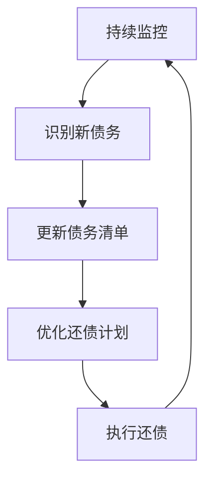

# 技术债务评估:识别并量化技术债务

## 1.背景介绍

随着软件系统的不断演进和新需求的持续加入,代码库往往会逐渐变得混乱和复杂。这种情况通常被称为"技术债务"(Technical Debt)。技术债务是指为了加快软件开发速度而做出的一些权衡和妥协,导致代码质量降低、可维护性变差、未来需要额外的工作来修复这些问题。

技术债务的存在会给软件开发带来诸多隐患,如果不及时识别和解决,将会导致代码库变得越来越糟糕,最终使得新功能的开发和Bug修复变得越来越困难。因此,及时评估和量化技术债务,制定合理的还债计划,对于保证软件系统的可维护性和可扩展性至关重要。

## 2.核心概念与联系

### 2.1 什么是技术债务?

技术债务(Technical Debt)这个概念最早由Ward Cunningham在1992年提出,用来比喻为了加快开发速度而做出的一些妥协,导致代码质量降低,未来需要额外的工作来修复这些问题。

技术债务包括以下几个方面:

- **代码层面**:低质量的代码实现、糟糕的代码结构、缺乏测试用例等
- **架构层面**:架构设计不合理、技术选型失当等
- **文档层面**:文档缺失或者质量低下
- **流程层面**:开发流程不规范、缺乏代码审查等

### 2.2 技术债务的类型

技术债务可以分为以下几种类型:

1. **无意识债务**(Inadvertent Debt):由于开发人员的经验不足或者对技术栈不熟悉而造成的债务
2. **策略性债务**(Strategic Debt):为了加快开发速度或者先上线而有意识地做出的妥协
3. **遗留债务**(Inherited Debt):从旧系统或者第三方库中继承的技术债务
4. **文档债务**(Documentation Debt):文档缺失或者质量低下导致的债务
5. **测试债务**(Test Debt):缺乏足够的测试用例覆盖导致的债务

### 2.3 技术债务的影响

技术债务会对软件系统带来诸多负面影响:

- **增加维护成本**:代码质量低下会导致修复Bug和添加新功能的工作变得更加困难
- **降低开发效率**:复杂的代码结构会使得开发人员理解成本增加,从而降低开发效率
- **引入更多Bug**:低质量的代码更容易引入新的Bug
- **削弱团队士气**:糟糕的代码会给开发人员带来沮丧感,影响团队士气
- **限制系统扩展性**:架构设计不合理会限制系统的可扩展性,无法满足未来需求

## 3.核心算法原理具体操作步骤

评估和量化技术债务的核心步骤包括:

1. **识别技术债务**
2. **量化技术债务**
3. **制定还债计划**
4. **持续监控和优化**

### 3.1 识别技术债务

识别技术债务是评估的第一步,主要包括以下几个方面:

#### 3.1.1 代码质量分析

通过静态代码分析工具(如SonarQube)对代码进行扫描,识别出代码中存在的潜在问题,如代码复杂度过高、重复代码、潜在Bug等。

#### 3.1.2 架构评审

由架构师对系统的整体架构设计进行评审,识别出架构层面的问题,如模块耦合度过高、技术选型不当等。

#### 3.1.3 代码审查

通过代码审查的方式,由团队成员相互Review代码,发现代码中的潜在问题。代码审查不仅可以发现问题,还可以提高团队的代码质量意识。

#### 3.1.4 测试覆盖率分析

通过测试覆盖率报告,分析代码的测试覆盖情况,发现缺乏测试用例覆盖的模块,这些模块存在较高的测试债务风险。

#### 3.1.5 开发人员反馈

开发人员在日常工作中会直接感受到技术债务带来的阻力,他们的反馈也是识别技术债务的重要渠道。

### 3.2 量化技术债务

在识别出技术债务之后,需要对债务进行量化,以便评估其影响程度,并制定合理的还债计划。量化技术债务的常用方法包括:

#### 3.2.1 债务估算模型

债务估算模型(如SQALE、CRAP等)通过对代码质量指标赋予不同的权重,计算出一个综合得分,用于评估技术债务的严重程度。

#### 3.2.2 修复工作量估算

对于已识别出的技术债务项目,可以由开发人员根据经验对修复所需的工作量进行估算,作为量化技术债务的依据。

#### 3.2.3 风险评估

除了工作量之外,还需要评估技术债务带来的风险程度,如对系统的影响、对未来迭代的影响等,将风险程度量化为一个分数。

#### 3.2.4 价值评估

有些技术债务虽然存在,但对系统的影响较小,修复的价值也不高。因此需要对技术债务的价值进行评估,作为是否需要优先修复的参考。

经过以上步骤,就可以得到每个技术债务项目的工作量估算、风险评分和价值评分,进而对债务进行优先级排序。

### 3.3 制定还债计划

在量化完技术债务之后,接下来需要制定一个合理的还债计划,规划如何分阶段、分优先级地逐步消除技术债务。制定还债计划需要考虑以下几个因素:

#### 3.3.1 团队能力

还债计划的执行需要消耗团队的开发资源,因此需要根据团队的实际能力来制定合理的计划进度。

#### 3.3.2 业务优先级

一些核心业务模块的技术债务需要优先解决,而非核心模块的债务可以暂时放缓进度。

#### 3.3.3 风险评估

高风险的技术债务需要优先解决,以避免对系统造成严重影响。

#### 3.3.4 成本收益分析

还债计划的制定需要权衡还债的成本和收益,对于价值较低的技术债务,可以暂不解决。

#### 3.3.5 持续集成

将还债工作融入到持续集成的流程中,使其成为日常工作的一部分,而不是一次性的大规模重构。

### 3.4 持续监控和优化

技术债务的评估和还债不是一次性的工作,需要持续进行监控和优化,形成一个闭环的过程:

- **持续监控**:通过代码质量检查、架构评审等手段,持续监控系统中新产生的技术债务
- **识别新债务**:发现新的技术债务项目
- **更新债务清单**:将新发现的债务项目加入到技术债务清单中
- **优化还债计划**:根据新的债务清单,优化还债计划的优先级和进度安排
- **执行还债**:按照优化后的计划执行还债工作
- **持续迭代**:形成一个闭环,持续进行监控、识别、优化和执行

## 4.数学模型和公式详细讲解举例说明

在量化技术债务的过程中,可以借助一些数学模型和公式,对债务进行更精确的评估。

### 4.1 技术债务比率(Technical Debt Ratio)

技术债务比率(Technical Debt Ratio, TDR)是衡量一个代码库中技术债务程度的重要指标,其计算公式如下:

$$
TDR = \frac{修复技术债务所需工作量}{添加新功能所需工作量}
$$

TDR的取值范围为[0, +∞)。当TDR越高,说明代码库中的技术债务程度越严重,需要投入更多的工作去修复债务,而不是添加新功能。

通常情况下,当TDR超过1时,就说明技术债务已经到了一个需要优先解决的程度。但具体的阈值需要根据项目的实际情况来确定。

例如,对于一个代码库,经过评估发现:

- 修复所有技术债务需要800个工作日
- 添加一个新功能平均需要100个工作日

那么该代码库的TDR为:

$$
TDR = \frac{800}{100} = 8
$$

这个值非常高,说明该代码库的技术债务程度已经到了一个无法忽视的地步,需要制定还债计划,优先解决技术债务问题。

### 4.2 技术债务利息(Technical Debt Interest)

除了需要偿还本金(修复技术债务所需的工作量)之外,技术债务还会持续产生"利息",即由于债务存在而导致的额外工作量。技术债务利息的计算公式如下:

$$
I = P \times r
$$

其中:

- $I$表示技术债务利息,即由于债务存在而导致的额外工作量
- $P$表示技术债务本金,即修复债务所需的工作量
- $r$表示利率,即单位时间内额外工作量占债务本金的比例

利率$r$的取值通常在0.1~0.5之间,具体值需要根据项目的实际情况评估得出。

例如,对于一个技术债务本金为1000个工作日的项目,假设其利率为0.2,那么每年需要支付的利息为:

$$
I = 1000 \times 0.2 = 200 (工作日)
$$

也就是说,即使不去还债,仅仅是技术债务的存在,每年就需要额外消耗200个工作日,用于修复由债务引起的各种问题。

通过计算技术债务利息,可以更清晰地看到债务对项目的长期影响,从而有助于权衡是否需要优先还债。

### 4.3 技术债务矩阵模型

除了上述两个较为简单的模型之外,也有一些更加复杂的技术债务量化模型,例如技术债务矩阵模型(Technical Debt Matrix Model)。

该模型将技术债务划分为不同的类型,并为每种类型赋予不同的权重系数,最终通过矩阵运算得出一个综合评分,用于评估技术债务的严重程度。

设有$n$种技术债务类型,权重系数向量为$\vec{w} = (w_1, w_2, \cdots, w_n)$,其中$\sum_{i=1}^n w_i = 1$。

对于每个代码单元(如一个类、一个模块),可以计算出它在每种债务类型下的债务量$\vec{d} = (d_1, d_2, \cdots, d_n)$。

那么该代码单元的技术债务综合评分就可以通过矩阵运算计算得出:

$$
\text{技术债务评分} = \vec{w} \cdot \vec{d}^T = \sum_{i=1}^n w_i d_i
$$

通过这种方式,可以更全面地量化不同类型的技术债务,并根据权重系数的设置,突出重点关注的债务类型。

例如,可以将技术债务划分为以下6种类型:

- 代码复杂度债务
- 代码规范债务
- 架构债务
- 测试债务
- 文档债务
- 安全债务

并为每种类型赋予不同的权重系数,如(0.3, 0.2, 0.2, 0.15, 0.1, 0.05)。

那么对于一个给定的代码单元,如果其各类型债务量为(80, 60, 40, 20, 10, 5),那么它的技术债务综合评分就是:

$$
\begin{aligned}
\text{技术债务评分} &= 0.3 \times 80 + 0.2 \times 60 + 0.2 \times 40 + 0.15 \times 20 + 0.1 \times 10 + 0.05 \times 5 \\
&= 24 + 12 + 8 + 3 + 1 + 0.25 \\
&= 48.25
\end{aligned}
$$

通过这种方式,可以更精确地量化和比较不同代码单元的技术债务程度,为制定还债计划提供依据。

## 