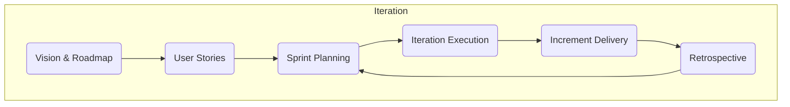

# 敏捷开发与快速迭代原理与代码实战案例讲解

## 1.背景介绍

在当今快节奏的软件开发环境中,敏捷开发方法论已成为软件工程领域的主流实践。传统的瀑布式开发模式由于缺乏灵活性和迭代,无法满足快速变化的市场需求和用户期望。敏捷开发强调小步快跑、增量交付、客户协作和响应变化,使得软件开发过程更加高效、灵活和可控。

快速迭代是敏捷开发的核心理念之一,通过将软件开发过程分解为多个短周期的迭代,每个迭代都交付可工作的增量软件。这种方式有助于控制风险、提高软件质量、加强客户参与并及时获取反馈,从而更好地适应需求变化。

### 1.1 敏捷宣言与原则

2001年,一群经验丰富的软件开发人员共同发布了"敏捷软件开发宣言",阐述了敏捷开发的四大核心价值观:

- **个体和互动**高于过程和工具
- **工作软件**高于详尽文档 
- **客户合作**高于合同谈判
- **响应变化**高于遵循计划

基于这些价值观,敏捷方法论衍生出12条支撑性原则,如鼓励可持续开发、拥抱变化需求、定期交付工作软件、保持简单等。这些原则为敏捷实践提供了理论基础。

### 1.2 敏捷开发的优势

相较于传统开发模式,敏捷开发具有以下优势:

- **高效交付**:通过迭代式开发,可快速交付软件,缩短上市时间
- **降低风险**:每个迭代都生成可工作的软件增量,降低项目失败风险
- **提高质量**:持续集成、自动化测试等实践有助于提高软件质量
- **增强协作**:开发团队、客户和利益相关方之间的紧密协作
- **适应变化**:快速响应需求变更,提高客户满意度

## 2.核心概念与联系

敏捷开发涉及多个关键概念,相互关联、环环相扣。

### 2.1 敏捷开发生命周期

敏捷开发生命周期由一系列短周期迭代组成,每个迭代包含规划、分析需求、设计、编码、测试和交付等活动。迭代结束后,可获得一个可工作的软件增量版本。

```mermaid
graph TB
    subgraph Iteration_1
        I1P(Planning) --> I1A(Analysis)
        I1A --> I1D(Design)
        I1D --> I1C(Coding)
        I1C --> I1T(Testing)
        I1T --> I1R(Release)
    end

    subgraph Iteration_2
        I2P(Planning) --> I2A(Analysis)
        I2A --> I2D(Design)
        I2D --> I2C(Coding) 
        I2C --> I2T(Testing)
        I2T --> I2R(Release)
    end

    subgraph Iteration_n
        InP(Planning) --> InA(Analysis)
        InA --> InD(Design)
        InD --> InC(Coding)
        InC --> InT(Testing) 
        InT --> InR(Release)
    end
```



每个迭代都交付一个可工作的软件增量,迭代周期通常为1-4周。随着迭代的推进,软件功能不断完善、质量不断提高。

### 2.2 敏捷实践

敏捷开发方法论包含多种实践和技术,如:

- **用户故事(User Stories)**:描述软件需求的简洁语句
- **冲刺计划(Sprint Planning)**:规划每个迭代要完成的工作
- **每日立会(Daily Standup)**:团队每日15分钟会议,检视进展
- **积压工作(Backlog)**:待完成的用户故事和任务列表
- **燃尽图(Burndown Chart)**:跟踪迭代进度的图表
- **持续集成(CI)**:频繁集成代码,提早发现问题
- **测试驱动开发(TDD)**:先编写测试用例,再编写代码

这些实践有助于提高团队协作效率、确保软件质量、控制开发进度。

### 2.3 敏捷团队组织

敏捷团队通常由多个角色组成,各司其职、紧密协作:

- **产品负责人(Product Owner)**:代表客户,负责整理和优先级用户故事
- **Scrum Master**:促进敏捷过程,解决阻碍,保护团队免受干扰
- **开发团队(Development Team)**:跨职能的小型团队,负责实现产品需求
- **利益相关方(Stakeholders)**:客户、用户、管理者等相关方

团队成员通过频繁的面对面交流、信息共享和反馈机制,保持高度协作和自我管理。

## 3.核心算法原理具体操作步骤

敏捷开发并非一种单一的方法,而是一系列原则和实践的集合体。以下是常见的敏捷开发流程:

### 3.1 产品愿景和路线图制定

首先,产品负责人与利益相关方共同确定产品愿景和高层次目标,并制定产品路线图和发布计划。

### 3.2 用户故事收集和优先级排序  

产品负责人收集用户需求,并将其表述为简洁的用户故事。然后,根据业务价值、风险和优先级,对用户故事进行排序和分组,形成产品积压工作列表(Product Backlog)。

### 3.3 冲刺规划会议

在每个迭代(冲刺)开始时,Scrum Master会组织一次冲刺规划会议。会议分两部分:

1. **目标确定**:开发团队根据产品积压工作列表,选择本次迭代要完成的用户故事,确定冲刺目标。
2. **任务拆分**:将选定的用户故事分解为具体的开发任务,估算工作量并分配给团队成员。

形成冲刺积压工作列表(Sprint Backlog)后,正式开始新一轮迭代。

### 3.4 迭代执行

在迭代过程中,开发团队按计划逐步完成各项任务,包括需求分析、设计、编码和测试等。每天召开15分钟的站立会议,团队成员互相同步工作进展、发现问题并寻求协助。

Scrum Master负责跟踪迭代进度,并通过燃尽图等可视化工具,让团队了解剩余工作量。如果出现阻碍或变更,团队会及时调整优先级和计划。

### 3.5 产品增量交付

迭代结束时,开发团队向产品负责人和利益相关方展示本次迭代的成果,即新增的软件功能增量。利益相关方提供反馈意见,产品负责人根据反馈更新产品积压工作列表,为下一轮迭代做准备。

### 3.6 回顾会议

每个迭代结束后,敏捷团队会召开一次回顾会议,总结经验教训。会议重点包括:

- 本次迭代做得好的地方
- 需要改进的地方
- 遇到的问题及解决方案
- 对流程和实践的改进建议

通过持续改进,团队可以优化工作流程,提高效率。



这种迭代式开发方式贯穿整个软件生命周期,直至产品发布和维护阶段。

## 4.数学模型和公式详细讲解举例说明

敏捷开发中有一些常用的数学模型和公式,用于估算工作量、跟踪进度和评估质量等。

### 4.1 故事点估算

在敏捷开发中,开发团队通常使用"故事点(Story Point)"而非工时来估算用户故事的工作量。故事点是一个相对的、无量纲的估算单位,反映了实现某个用户故事的复杂程度。

通常采用非线性的斐波那契数列(1、2、3、5、8、13......)作为估算的参考值。例如:

- 1点:非常简单的任务
- 2点:一般的任务
- 3点:有一些复杂性
- 5点:相当复杂的任务
- 8点:高度复杂的任务

估算时,团队成员根据过往经验,对用户故事的复杂程度进行评估和打分。

### 4.2 工作量跟踪

在迭代执行过程中,团队需要跟踪剩余工作量的变化情况。常用的方法是绘制**燃尽图(Burndown Chart)**。

燃尽图的纵轴表示剩余工作量(以故事点为单位),横轴表示时间(以天或迭代为单位)。理想情况下,工作量燃尽线应呈现平滑的下降趋势。

设某个迭代的总工作量为W故事点,计划在D天内完成,已经过去了d天,完成了w点工作量,则当前剩余工作量可用如下公式计算:

$$
剩余工作量 = W - \frac{W}{D} \times d
$$

如果实际燃尽线偏离理想线太多,说明工作进度落后,需要采取相应措施(如加班、调整范围等)。

### 4.3 缺陷管理

敏捷团队通常使用**缺陷密度(Defect Density)**指标来评估软件质量。缺陷密度反映了每千行代码中包含的缺陷数量,公式如下:

$$
缺陷密度 = \frac{发现的缺陷总数}{源代码行数(KLOC)} \times 1000
$$

其中,KLOC(Kilo Lines Of Code)表示千行代码。

缺陷密度越低,代表软件质量越高。通过持续测试和缺陷修复,缺陷密度应该呈现下降趋势。团队可以根据历史数据,为新项目设定缺陷密度目标值。

此外,还可以计算**测试覆盖率**等指标,全面评估软件质量。

## 5.项目实践:代码实例和详细解释说明

为了更好地理解敏捷开发实践,我们以一个简单的在线商城项目为例,展示如何应用敏捷开发流程。

### 5.1 确定产品愿景和路线图

产品负责人与利益相关方商讨后,确定了产品愿景:"打造一个简单易用、功能完备的在线商城平台"。

根据愿景,他们规划了如下发布计划:

- V1.0: 实现基本的商品展示、购物车和订单功能
- V1.5: 增加支付、物流跟踪和评论功能
- V2.0: 支持移动端、优化用户体验,增加推荐和营销功能

### 5.2 收集用户故事

产品负责人收集了一些用户故事,并估算了故事点:

- 作为买家,我想浏览商品列表 (3点)
- 作为买家,我想查看商品详情 (2点)
- 作为买家,我想将商品加入购物车 (5点)
- 作为买家,我想从购物车中移除商品 (3点)
- ...

### 5.3 冲刺规划

在第一个迭代的冲刺规划会议上,开发团队选择了以下用户故事:

- 浏览商品列表 (3点)
- 查看商品详情 (2点)

团队将这两个故事分解为具体任务,如:

- 设计商品列表UI界面
- 实现商品列表后端API
- 设计商品详情页UI
- ...

估算总工作量为13点,预计在2周内完成。

### 5.4 代码实现

以下是实现"浏览商品列表"功能的部分代码示例:

**前端(React)**:

```jsx
// ProductList.jsx
import React, { useEffect, useState } from 'react';
import axios from 'axios';

const ProductList = () => {
  const [products, setProducts] = useState([]);

  useEffect(() => {
    const fetchProducts = async () => {
      const res = await axios.get('/api/products');
      setProducts(res.data);
    };
    fetchProducts();
  }, []);

  return (
    <div>
      <h2>Product List</h2>
      <ul>
        {products.map(product => (
          <li key={product.id}>
            <h3>{product.name}</h3>
            <p>{product.description}</p>
            <p>Price: {product.price}</p>
          </li>
        ))}
      </ul>
    </div>
  );
};

export default Product