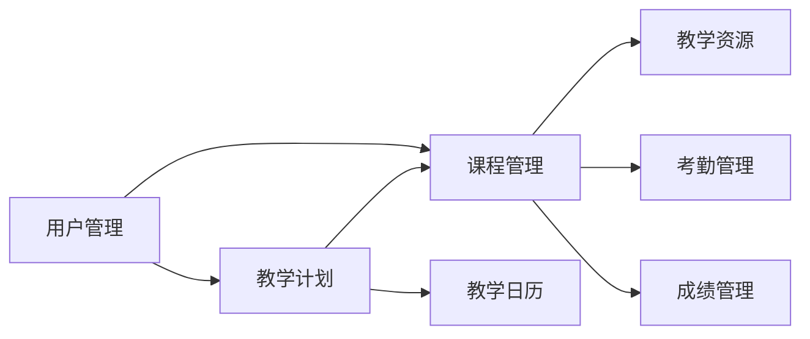

# 教学进度管理系统设计与实现

## 1. 背景介绍

### 1.1 教学进度管理的重要性

在现代教育体系中,教学进度管理是一个至关重要的环节。它直接影响到教学质量和学生的学习效果。良好的教学进度管理可以确保教学内容的有序推进,帮助教师合理安排教学任务,同时也能够帮助学生更好地掌握知识点,提高学习效率。

### 1.2 传统教学进度管理的局限性

传统的教学进度管理主要依赖于教师的经验和手工记录,存在诸多局限性:

1. 效率低下:手工记录和统计教学进度耗时耗力,难以实时掌握教学进展情况。
2. 数据分散:教学进度数据分散在各个教师的记录中,缺乏系统性和连贯性,难以形成全局视角。
3. 缺乏灵活性:传统模式下难以灵活调整教学计划,响应教学过程中的突发情况。
4. 沟通不畅:教师、学生、教务管理人员之间缺乏有效的沟通渠道,影响教学效果。

### 1.3 教学进度管理系统的必要性

为了克服传统教学进度管理的局限性,开发一套功能完善、易于使用的教学进度管理系统势在必行。该系统可以:

1. 提高管理效率:通过信息化手段实现教学进度的自动记录和统计,大幅提升管理效率。
2. 集中数据管理:将教学进度数据集中存储和管理,便于全局把控和决策分析。
3. 灵活调整计划:允许教师根据实际情况动态调整教学计划,提高教学的灵活性和适应性。
4. 加强沟通协作:为教师、学生、教务管理人员提供便捷的沟通渠道,促进协作和信息共享。

## 2. 核心概念与联系

### 2.1 教学计划

教学计划是开展教学活动的基础,它规定了教学的目标、内容、进度、方法和评价等要素。在教学进度管理系统中,教学计划是核心数据之一,其他模块的运作都要以教学计划为依据。

### 2.2 课程管理

课程是教学活动的基本单位。教学进度管理系统需要支持课程的创建、修改、删除等基本操作,并且要与教学计划紧密关联,确保课程按计划有序推进。

### 2.3 教学日历

教学日历直观地展示教学活动的时间安排,是教学进度管理的重要参考。系统应提供可视化的教学日历,方便用户快速了解教学进度和安排。

### 2.4 教学资源

教学资源是指与教学活动相关的各种材料,如教案、课件、习题、案例等。系统应支持教学资源的上传、下载、预览和管理,并与课程关联,方便教师备课和学生复习。

### 2.5 考勤管理

考勤记录是评估学生学习状态和教学效果的重要依据。系统需要提供灵活的考勤管理功能,支持多种考勤方式,并能够生成考勤统计报表。

### 2.6 成绩管理

成绩管理是教学管理的重要组成部分。系统应该提供成绩录入、查询、分析等功能,并支持多种成绩评定方式,如平时成绩、期中考试、期末考试等。

### 2.7 用户管理

教学进度管理系统的用户主要包括教师、学生和教务管理人员。系统需要提供完善的用户管理功能,支持用户的添加、删除、权限设置等操作,确保系统的安全性和可用性。

以上核心概念之间的关系如下图所示:



## 3. 核心算法原理具体操作步骤

### 3.1 教学进度智能预警算法

为了帮助教师及时发现和解决教学进度问题,系统需要提供智能预警功能。具体算法步骤如下:

1. 数据采集:收集教学计划、课程进度、考勤记录等相关数据。
2. 数据清洗:对采集到的数据进行清洗和预处理,剔除无效或异常数据。
3. 进度计算:根据教学计划和实际完成情况,计算每个课程的进度完成率。
4. 阈值设定:根据经验设定进度预警阈值,如完成率低于80%则触发预警。
5. 预警生成:对超出预警阈值的课程生成预警信息,并通知相关教师。
6. 预警处理:教师根据预警信息及时调整教学计划和安排,确保教学进度符合要求。

### 3.2 智能排课算法

智能排课是教学管理的一大难题,需要考虑诸多限制条件。系统可采用启发式算法,如遗传算法,来实现智能排课。具体步骤如下:

1. 数据准备:收集教师、学生、教室、课程等基础数据,并整理成标准格式。
2. 约束定义:定义硬性约束和软性约束,如每位教师每天最多授课4小时为硬性约束,上午安排理论课为软性约束。
3. 初始化种群:随机生成一定数量的初始排课方案,作为遗传算法的初始种群。
4. 适应度评估:根据约束条件,计算每个排课方案的适应度,适应度越高表示方案越优。
5. 选择、交叉和变异:根据适应度选择优良个体,通过交叉和变异操作生成新的排课方案。
6. 终止条件判断:如果达到预设的迭代次数或找到满意的排课方案,则终止算法;否则返回步骤4。

### 3.3 学生学习行为分析算法

通过分析学生的学习行为数据,可以发现学生的学习特点和潜在问题。系统可采用数据挖掘算法,如关联规则挖掘和聚类分析,来实现学习行为分析。具体步骤如下:

1. 数据采集:收集学生的考勤记录、作业完成情况、课堂互动记录等学习行为数据。
2. 数据预处理:对采集到的数据进行清洗、转换和集成,形成结构化的数据集。
3. 关联规则挖掘:使用Apriori等算法,挖掘学生学习行为之间的关联规则,如"经常缺勤的学生,作业完成率也较低"。
4. 聚类分析:使用K-means等算法,将学生划分为不同的群体,如"学习态度积极型"、"学习态度消极型"等。
5. 结果解释:对挖掘出的关联规则和聚类结果进行分析和解释,提炼有价值的洞察和建议。
6. 可视化展示:使用图表等可视化方式,直观地展示分析结果,便于教师和教务管理人员理解和决策。

## 4. 数学模型和公式详细讲解举例说明

### 4.1 教学进度完成率模型

教学进度完成率是衡量教学计划执行情况的重要指标。可以用以下公式来计算:

$$
完成率=\frac{实际完成课时}{计划课时} \times 100\%
$$

例如,某门课程计划总课时为48,目前已完成36课时,则完成率为:

$$
完成率=\frac{36}{48} \times 100\% = 75\%
$$

### 4.2 智能排课的数学模型

智能排课可以用数学模型来描述。假设有 $m$ 个教师、$n$ 个课程、$p$ 个教室和 $q$ 个时间段,定义决策变量 $x_{ijkl}$:

$$
x_{ijkl}=
\begin{cases}
1, & \text{如果教师 $i$ 在时间段 $l$ 于教室 $k$ 讲授课程 $j$} \\
0, & \text{否则}
\end{cases}
$$

则智能排课问题可以表示为一个约束优化问题:

$$
\begin{align*}
\min \quad & f(x) \\
\text{s.t.} \quad & \sum_{i=1}^{m} \sum_{k=1}^{p} x_{ijkl} = 1, \quad \forall j,l \\
& \sum_{j=1}^{n} \sum_{k=1}^{p} x_{ijkl} \leq 1, \quad \forall i,l \\
& \text{其他约束条件} \\
& x_{ijkl} \in \{0,1\}, \quad \forall i,j,k,l
\end{align*}
$$

其中,$f(x)$ 为优化目标函数,可根据实际需求设计。约束条件确保每门课在每个时间段只安排一次,每位教师在每个时间段最多授课一次。

### 4.3 学生聚类分析模型

学生聚类分析可以用K-means算法来实现。假设有 $n$ 个学生,每个学生有 $m$ 个特征,记为 $x_i=(x_{i1},x_{i2},\dots,x_{im})$,目标是将学生划分为 $k$ 个群体。K-means算法的目标函数为:

$$
J=\sum_{j=1}^{k} \sum_{i=1}^{n} w_{ij} \lVert x_i-\mu_j \rVert^2
$$

其中,$w_{ij}$ 表示学生 $i$ 是否属于群体 $j$,$\mu_j$ 为群体 $j$ 的中心点。算法通过迭代优化来最小化目标函数:

1. 随机选择 $k$ 个点作为初始聚类中心 $\mu_1,\mu_2,\dots,\mu_k$。
2. 对每个学生 $i$,计算其到各聚类中心的距离,并将其分配到距离最近的聚类中:

$$
w_{ij}=
\begin{cases}
1, & \text{如果 $j=\arg\min_l \lVert x_i-\mu_l \rVert^2$} \\
0, & \text{否则}
\end{cases}
$$

3. 对每个聚类 $j$,更新其聚类中心:

$$
\mu_j=\frac{\sum_{i=1}^{n} w_{ij} x_i}{\sum_{i=1}^{n} w_{ij}}
$$

4. 重复步骤2和3,直到聚类中心不再变化或达到最大迭代次数。

## 5. 项目实践:代码实例和详细解释说明

下面以Python为例,给出教学进度管理系统的部分代码实现。

### 5.1 教学计划管理模块

```python
class TeachingPlan:
    def __init__(self, id, name, total_hours):
        self.id = id
        self.name = name
        self.total_hours = total_hours
        self.courses = []

    def add_course(self, course):
        self.courses.append(course)

    def remove_course(self, course):
        self.courses.remove(course)

    def get_total_hours(self):
        return self.total_hours

    def get_completed_hours(self):
        completed_hours = 0
        for course in self.courses:
            completed_hours += course.get_completed_hours()
        return completed_hours

    def get_completion_rate(self):
        return self.get_completed_hours() / self.total_hours
```

`TeachingPlan` 类表示一个教学计划,包含计划的基本信息和所包含的课程。`add_course` 和 `remove_course` 方法用于管理课程,`get_total_hours` 和 `get_completed_hours` 方法分别返回计划总课时和已完成课时,`get_completion_rate` 方法计算教学进度完成率。

### 5.2 智能排课模块

```python
import random

class Course:
    def __init__(self, id, name, hours):
        self.id = id
        self.name = name
        self.hours = hours

class Teacher:
    def __init__(self, id, name):
        self.id = id
        self.name = name

class Classroom:
    def __init__(self, id, name, capacity):
        self.id = id
        self.name = name
        self.capacity = capacity

def generate_schedule(courses, teachers, classrooms, days, periods):
    schedule = {}
    for day in range(days):
        for period in range(periods):
            schedule[(day, period)] = None

    def fitness(schedule):
        conflicts = 0
        for day in range(days):
            for period in range(periods):
                if schedule[(day, period)] is None:
                    continue
                course, teacher, classroom = schedule[(day, period)]
                for other_day, other_period in schedule:
                    if