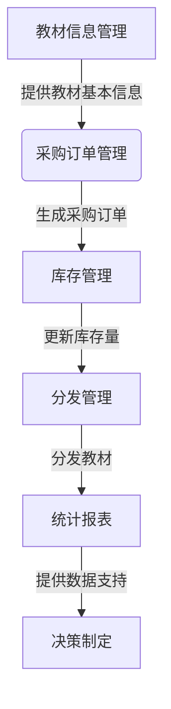

# 教材管理系统详细设计与具体代码实现

## 1.背景介绍

随着教育事业的不断发展,学校教材的采购、分发和管理工作变得日益复杂。为了提高教材管理的效率和准确性,需要一个专门的教材管理系统。该系统旨在简化教材订购、分发和库存管理流程,减轻教职工的工作负担,并确保教材供应的及时性和准确性。

## 2.核心概念与联系

教材管理系统涉及以下几个核心概念:

1. **教材信息管理**: 维护教材的基本信息,包括书名、作者、出版社、价格等,方便查询和管理。

2. **采购订单管理**: 根据教学需求生成采购订单,跟踪订单状态,确保教材及时到货。

3. **库存管理**: 实时监控教材库存量,及时补货,避免教材短缺。

4. **分发管理**: 根据教学安排,将教材准确分发到各个教学班级。

5. **统计报表**: 生成各种统计报表,如采购报表、库存报表等,为决策提供数据支持。

这些核心概念相互关联,共同构建了一个完整的教材管理流程。



## 3.核心算法原理具体操作步骤

### 3.1 教材需求预测算法

为了准确预测教材需求量,系统采用了基于历史数据的时间序列预测算法。具体步骤如下:

1. 收集过去几年的教材采购数据,作为训练集。

2. 对训练集数据进行预处理,包括缺失值处理、异常值处理等。

3. 构建ARIMA(自回归移动平均)模型,该模型适用于具有一定周期性的时间序列数据。

4. 使用训练集对ARIMA模型进行参数估计。

5. 利用估计的ARIMA模型对未来教材需求量进行预测。

6. 将预测结果输出,作为采购订单的参考依据。

该算法通过分析历史数据,捕捉教材需求的周期性和趋势性,从而实现精准预测。

### 3.2 教材分发优化算法

为了优化教材分发路线,减少运输成本,系统采用了蚁群优化算法。具体步骤如下:

1. 构建分发网络模型,将学校各个教学点作为节点,运输路径作为边。

2. 初始化蚂蚁群,随机放置在不同节点。

3. 每只蚂蚁按照一定概率规则选择下一个节点,并留下信息素。

4. 当所有蚂蚁完成一次循环后,计算各条路径的总距离。

5. 更新信息素浓度,加强优质路径的信息素,减弱劣质路径的信息素。

6. 重复步骤3-5,直到达到收敛条件。

7. 输出最优路径作为教材分发方案。

该算法通过模拟蚂蚁觅食行为,找到了最优的分发路线,有效降低了运输成本。

## 4.数学模型和公式详细讲解举例说明

### 4.1 ARIMA模型

ARIMA(AutoRegressive Integrated Moving Average)模型是一种广泛应用于时间序列预测的模型,它由三个部分组成:

- AR(自回归模型): $y_t = \phi_1 y_{t-1} + \phi_2 y_{t-2} + ... + \phi_p y_{t-p} + \epsilon_t$
- I(差分): $\nabla y_t = y_t - y_{t-1}$
- MA(移动平均模型): $y_t = \epsilon_t + \theta_1 \epsilon_{t-1} + \theta_2 \epsilon_{t-2} + ... + \theta_q \epsilon_{t-q}$

其中:
- $y_t$ 表示时间 t 时的观测值
- $\phi_i$ 表示第 i 阶自回归系数
- $\epsilon_t$ 表示时间 t 时的白噪声
- $\theta_i$ 表示第 i 阶移动平均系数
- p 表示自回归阶数
- q 表示移动平均阶数

通过对原始时间序列进行差分运算,可以消除趋势和季节性,从而获得平稳序列。然后,利用自回归和移动平均两部分对平稳序列进行建模,最终获得 ARIMA(p,d,q) 模型,其中 d 表示差分阶数。

例如,对于一个具有明显趋势和季节性的教材需求序列,我们可以构建 ARIMA(1,1,1) 模型进行预测:

$$
\begin{aligned}
\nabla y_t &= y_t - y_{t-1} \\
\nabla y_t &= \phi_1 \nabla y_{t-1} + \epsilon_t + \theta_1 \epsilon_{t-1}
\end{aligned}
$$

该模型通过一阶差分消除趋势,并利用一阶自回归和一阶移动平均对序列进行建模。通过对历史数据进行参数估计,我们可以获得 $\phi_1$ 和 $\theta_1$ 的值,从而预测未来的教材需求量。

### 4.2 蚁群优化算法

蚁群优化算法是一种基于蚂蚁觅食行为的启发式优化算法,常用于解决组合优化问题。在教材分发路线优化中,我们可以将每个教学点视为一个节点,运输路径视为边,构建一个完全图模型。

假设有 n 个节点,每条边的长度为 $d_{ij}$,表示节点 i 和节点 j 之间的距离。我们需要找到一条最短的环路,使得每个节点都被访问一次且仅一次。

在蚁群算法中,每只蚂蚁在移动过程中会留下一定浓度的信息素,信息素浓度越高,该路径被选中的概率就越大。对于蚂蚁 k 从节点 i 移动到节点 j 的概率为:

$$
p_{ij}^k = \begin{cases}
\frac{[\tau_{ij}]^\alpha[\eta_{ij}]^\beta}{\sum\limits_{l \in allowed_k}[\tau_{il}]^\alpha[\eta_{il}]^\beta}, & \text{if } j \in allowed_k\\
0, & \text{otherwise}
\end{cases}
$$

其中:
- $\tau_{ij}$ 表示边 (i,j) 上的信息素浓度
- $\eta_{ij} = 1/d_{ij}$ 表示启发式信息,即边的长度的倒数
- $\alpha$ 和 $\beta$ 分别是信息素重要程度因子和启发式重要程度因子
- $allowed_k$ 表示蚂蚁 k 当前可选择的节点集合

在每一次迭代后,算法会更新信息素浓度,以加强优质路径的吸引力:

$$
\tau_{ij} = (1-\rho)\tau_{ij} + \sum\limits_{k=1}^m \Delta\tau_{ij}^k
$$

其中:
- $\rho$ 表示信息素挥发因子
- $\Delta\tau_{ij}^k$ 表示蚂蚁 k 在边 (i,j) 上留下的信息素增量

通过多次迭代,算法最终会收敛到最优解,即教材分发的最短路线。

## 5.项目实践:代码实例和详细解释说明

以下是教材管理系统的核心代码实现,采用 Python 语言:

### 5.1 教材信息管理模块

```python
class Textbook:
    def __init__(self, title, author, publisher, price):
        self.title = title
        self.author = author
        self.publisher = publisher
        self.price = price

class TextbookManager:
    def __init__(self):
        self.textbooks = []

    def add_textbook(self, textbook):
        self.textbooks.append(textbook)

    def remove_textbook(self, title):
        for textbook in self.textbooks:
            if textbook.title == title:
                self.textbooks.remove(textbook)
                return True
        return False

    def search_textbook(self, title):
        for textbook in self.textbooks:
            if textbook.title == title:
                return textbook
        return None
```

该模块定义了 `Textbook` 类和 `TextbookManager` 类,分别用于管理单个教材信息和整个教材库存。主要功能包括:

- 添加新教材
- 删除现有教材
- 根据书名查询教材信息

### 5.2 采购订单管理模块

```python
class PurchaseOrder:
    def __init__(self, textbook, quantity):
        self.textbook = textbook
        self.quantity = quantity
        self.status = "Pending"

class PurchaseOrderManager:
    def __init__(self):
        self.orders = []

    def create_order(self, textbook, quantity):
        order = PurchaseOrder(textbook, quantity)
        self.orders.append(order)
        return order

    def update_order_status(self, order, status):
        order.status = status

    def get_orders_by_status(self, status):
        return [order for order in self.orders if order.status == status]
```

该模块定义了 `PurchaseOrder` 类和 `PurchaseOrderManager` 类,分别用于管理单个采购订单和整个采购订单流程。主要功能包括:

- 创建新的采购订单
- 更新订单状态
- 根据状态查询订单列表

### 5.3 库存管理模块

```python
class Inventory:
    def __init__(self):
        self.stock = {}

    def add_stock(self, textbook, quantity):
        if textbook in self.stock:
            self.stock[textbook] += quantity
        else:
            self.stock[textbook] = quantity

    def remove_stock(self, textbook, quantity):
        if textbook in self.stock:
            self.stock[textbook] -= quantity
            if self.stock[textbook] <= 0:
                del self.stock[textbook]
            return True
        return False

    def get_stock(self, textbook):
        if textbook in self.stock:
            return self.stock[textbook]
        return 0
```

该模块定义了 `Inventory` 类,用于管理教材库存。主要功能包括:

- 增加库存
- 减少库存
- 查询库存量

### 5.4 分发管理模块

```python
import random

class Distribution:
    def __init__(self, classrooms, inventory):
        self.classrooms = classrooms
        self.inventory = inventory

    def distribute_textbooks(self, textbook, quantities):
        if textbook not in self.inventory.stock:
            return False

        if sum(quantities) > self.inventory.get_stock(textbook):
            return False

        for classroom, quantity in zip(self.classrooms, quantities):
            if self.inventory.remove_stock(textbook, quantity):
                classroom.receive_textbooks(textbook, quantity)
            else:
                # 回滚之前的分发操作
                for c, q in zip(self.classrooms, quantities):
                    c.return_textbooks(textbook, q)
                return False

        return True

class Classroom:
    def __init__(self, name):
        self.name = name
        self.textbooks = {}

    def receive_textbooks(self, textbook, quantity):
        if textbook in self.textbooks:
            self.textbooks[textbook] += quantity
        else:
            self.textbooks[textbook] = quantity

    def return_textbooks(self, textbook, quantity):
        if textbook in self.textbooks:
            self.textbooks[textbook] -= quantity
            if self.textbooks[textbook] <= 0:
                del self.textbooks[textbook]
```

该模块定义了 `Distribution` 类和 `Classroom` 类,分别用于管理教材分发和教学班级。主要功能包括:

- 将教材分发到各个教学班级
- 教学班级接收和归还教材

### 5.5 统计报表模块

```python
from collections import defaultdict

class ReportGenerator:
    def __init__(self, textbook_manager, order_manager, inventory):
        self.textbook_manager = textbook_manager
        self.order_manager = order_manager
        self.inventory = inventory

    def generate_purchase_report(self):
        report = defaultdict(list)
        for order in self.order_manager.orders:
            report[order.textbook.title].append({
                "Quantity": order.quantity,
                "Status": order.status
            })
        return report

    def generate_inventory_report(self):
        report = []
        for textbook, quantity in self.inventory.stock.items():
            report.append({
                "Title": textbook.title,
                "Stock": quantity
            })
        return report
```

该模块定义了 `ReportGenerator` 类,用于生成各种统计报表。主要功能包括:

- 生成采购报表,显示每种教材的采购数量和状态
- 生成库存报表,显示每种教材的库存量

通过上述模块的协同工作,教材管理系统实现了完整的教材采购、分发和库存管理流程。

## 6.实际应用场景

教材管理系