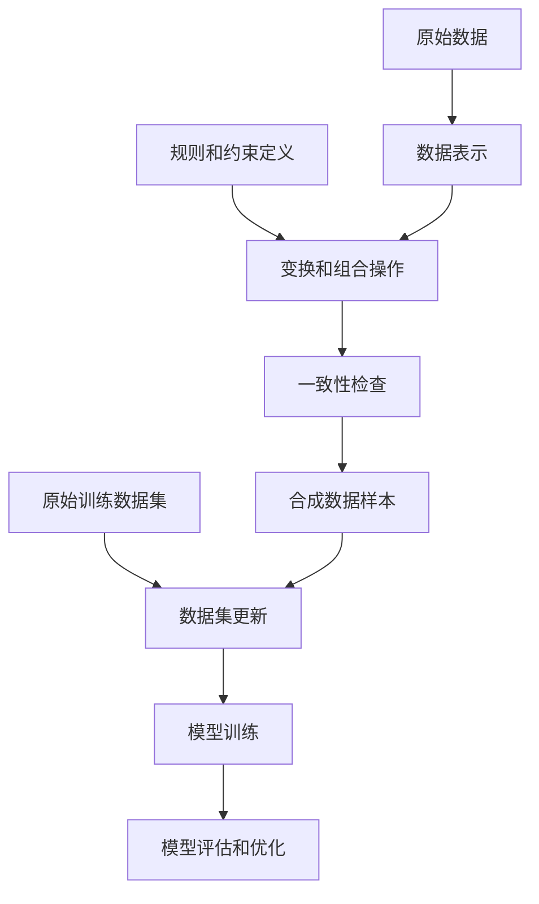

# 数据争论 (Data Argumentation) 原理与代码实例讲解

## 1.背景介绍

在当今的数据驱动时代，机器学习和人工智能技术正在迅速发展。然而，训练高质量的模型需要大量高质量的数据。传统的数据采集和标注方式通常是昂贵且耗时的。为了解决这一问题，数据争论(Data Argumentation)技术应运而生。

数据争论是一种创新的数据增强技术,通过对现有数据进行变换和组合,生成新的合成数据样本,从而扩充训练数据集的规模和多样性。这种方法不仅能够降低数据采集和标注的成本,还能提高模型的泛化能力和鲁棒性。

## 2.核心概念与联系

数据争论的核心思想是模拟人类对数据的理解和推理过程,通过对现有数据进行变换和组合,生成新的合成数据样本。这种变换和组合过程需要遵循一定的规则和约束,以确保生成的数据样本具有合理性和一致性。

数据争论技术与其他数据增强技术(如图像翻转、裁剪等)的区别在于,它不仅仅是对原始数据进行简单的变换,而是通过复杂的规则和约束,模拟人类对数据的理解和推理过程,生成新的合成数据样本。

数据争论技术与传统的数据采集和标注方式相比,具有以下优势:

1. 降低成本:通过对现有数据进行变换和组合,可以大幅降低数据采集和标注的成本。
2. 提高效率:自动化的数据生成过程可以快速扩充训练数据集的规模。
3. 增强多样性:通过对数据进行变换和组合,可以生成更加多样化的数据样本,提高模型的泛化能力。
4. 提高鲁棒性:通过模拟不同的数据变换和组合情况,可以提高模型对噪声和异常数据的鲁棒性。

## 3.核心算法原理具体操作步骤

数据争论技术的核心算法原理可以概括为以下几个步骤:

1. **数据表示**: 将原始数据转换为适当的表示形式,方便后续的变换和组合操作。例如,将文本数据转换为词向量表示。

2. **规则和约束定义**: 定义一系列规则和约束,用于指导数据的变换和组合过程。这些规则和约束需要遵循特定的领域知识和语义约束,以确保生成的数据样本具有合理性和一致性。

3. **变换和组合操作**: 根据定义的规则和约束,对原始数据进行变换和组合操作,生成新的合成数据样本。这些操作可以包括插入、删除、替换、组合等多种形式。

4. **一致性检查**: 对生成的合成数据样本进行一致性检查,确保它们符合预定义的规则和约束。不符合要求的数据样本将被丢弃或进行进一步的修正。

5. **数据集更新**: 将通过一致性检查的合成数据样本添加到原始训练数据集中,形成扩充后的新数据集。

6. **模型训练和评估**: 使用扩充后的新数据集训练机器学习模型,并对模型进行评估和优化。

下面是一个简单的数据争论算法流程图:



## 4.数学模型和公式详细讲解举例说明

数据争论技术中常用的数学模型和公式包括:

1. **语义相似度计算**

在进行数据变换和组合操作时,需要确保生成的数据样本在语义上与原始数据保持一致。因此,计算语义相似度是数据争论中一个关键步骤。

常用的语义相似度计算方法包括:

- 余弦相似度:

$$\text{sim}(x, y) = \frac{x \cdot y}{\|x\| \|y\|}$$

其中 $x$ 和 $y$ 分别表示两个向量,点乘表示向量内积,$ \| \cdot \| $表示向量的范数。

- 编辑距离:

$$\text{edit\_distance}(x, y) = \min\limits_{s \in S(x, y)} \sum\limits_{(i, j) \in s} c(x_i, y_j)$$

其中 $S(x, y)$ 表示将字符串 $x$ 转换为字符串 $y$ 所需的最小编辑操作序列,$ c(x_i, y_j) $表示将字符 $x_i$ 转换为字符 $y_j$ 的代价。

2. **语法和语义约束**

为了确保生成的数据样本具有合理性和一致性,需要定义一系列语法和语义约束。这些约束可以用规则或者概率模型来表示。

例如,在自然语言处理任务中,可以使用上下文无关文法(Context-Free Grammar, CFG)来定义语法约束:

$$
S \rightarrow NP\ VP \\
NP \rightarrow \text{Det}\ N \\
VP \rightarrow V\ NP \\
\cdots
$$

其中 $S$ 表示句子,$ NP $表示名词短语,$ VP $表示动词短语,$ \text{Det} $表示限定词,$ N $表示名词,$ V $表示动词。

对于语义约束,可以使用知识图谱或者预训练语言模型来捕获语义关系和约束。

3. **数据质量评估**

为了评估生成的合成数据样本的质量,可以使用一些指标,如:

- **多样性**: 用于衡量生成数据样本的多样性程度,可以使用熵或者其他多样性指标。

$$H(X) = -\sum\limits_{x \in X} P(x) \log P(x)$$

其中 $X$ 表示数据样本集合,$ P(x) $表示样本 $x$ 的概率分布。

- **一致性**: 用于衡量生成数据样本与原始数据的一致性程度,可以使用语义相似度或者其他一致性指标。

- **有效性**: 用于衡量生成数据样本对模型训练的有效性,可以使用模型在验证集或测试集上的性能指标。

## 5.项目实践:代码实例和详细解释说明

下面是一个使用Python实现的简单数据争论示例,用于对文本数据进行变换和组合:

```python
import re
import random
from nltk.corpus import wordnet

# 定义规则和约束
SYNONYMS_THRESHOLD = 0.8  # 同义词相似度阈值
ANTONYMS_THRESHOLD = 0.2  # 反义词相似度阈值

# 语义相似度计算
def semantic_similarity(word1, word2):
    synsets1 = wordnet.synsets(word1)
    synsets2 = wordnet.synsets(word2)
    
    if not synsets1 or not synsets2:
        return 0.0
    
    max_sim = 0.0
    for syn1 in synsets1:
        for syn2 in synsets2:
            sim = syn1.path_similarity(syn2)
            if sim is not None:
                max_sim = max(max_sim, sim)
    
    return max_sim

# 同义词替换
def synonym_replacement(text, n=1):
    words = text.split()
    new_words = words.copy()
    random_word_indices = random.sample(range(len(words)), n)
    
    for idx in random_word_indices:
        word = words[idx]
        synonyms = [syn.name().split('.')[0] for syn in wordnet.synsets(word)]
        if synonyms:
            synonym = random.choice(synonyms)
            sim = semantic_similarity(word, synonym)
            if sim >= SYNONYMS_THRESHOLD:
                new_words[idx] = synonym
    
    return ' '.join(new_words)

# 反义词替换
def antonym_replacement(text, n=1):
    words = text.split()
    new_words = words.copy()
    random_word_indices = random.sample(range(len(words)), n)
    
    for idx in random_word_indices:
        word = words[idx]
        antonyms = [ant.name().split('.')[0] for syn in wordnet.synsets(word) for ant in syn.lemmas()[0].antonyms()]
        if antonyms:
            antonym = random.choice(antonyms)
            sim = semantic_similarity(word, antonym)
            if sim <= ANTONYMS_THRESHOLD:
                new_words[idx] = antonym
    
    return ' '.join(new_words)

# 数据争论
def data_augmentation(text, n_syn=1, n_ant=1):
    augmented_text = text
    augmented_text = synonym_replacement(augmented_text, n=n_syn)
    augmented_text = antonym_replacement(augmented_text, n=n_ant)
    return augmented_text

# 示例用法
original_text = "The quick brown fox jumps over the lazy dog."
augmented_text = data_augmentation(original_text, n_syn=1, n_ant=1)
print("Original Text:", original_text)
print("Augmented Text:", augmented_text)
```

在这个示例中,我们定义了两个函数 `synonym_replacement` 和 `antonym_replacement`,分别用于同义词替换和反义词替换。这两个函数使用了 NLTK 的 WordNet 语料库来查找单词的同义词和反义词,并根据语义相似度阈值进行替换。

`data_augmentation` 函数将同义词替换和反义词替换结合起来,对原始文本进行变换和组合,生成新的合成数据样本。

在示例用法中,我们对一个简单的句子进行了数据争论,生成了一个新的合成句子。

需要注意的是,这只是一个简单的示例,实际应用中的数据争论过程会更加复杂,需要定义更多的规则和约束,并对生成的数据样本进行更严格的一致性检查。

## 6.实际应用场景

数据争论技术在多个领域都有广泛的应用,包括但不限于:

1. **自然语言处理(NLP)**:在机器翻译、文本分类、情感分析等任务中,可以使用数据争论技术扩充训练数据集,提高模型的性能和泛化能力。

2. **计算机视觉(CV)**:在图像分类、目标检测、语义分割等任务中,可以使用数据争论技术对图像进行变换和组合,生成新的合成图像样本。

3. **语音识别**:在语音识别任务中,可以使用数据争论技术对语音数据进行变换和组合,生成新的合成语音样本,提高模型对噪声和不同发音人的鲁棒性。

4. **医疗健康**:在医疗图像分析、电子病历处理等任务中,可以使用数据争论技术生成合成数据样本,用于模型训练和测试。

5. **金融领域**:在欺诈检测、风险评估等任务中,可以使用数据争论技术生成合成数据样本,模拟各种欺诈和风险情况,提高模型的检测能力。

6. **教育领域**:在自动问答、自动评分等任务中,可以使用数据争论技术生成合成数据样本,用于模型训练和测试。

总的来说,数据争论技术可以应用于任何需要大量高质量数据的机器学习任务,帮助解决数据稀缺和标注成本高的问题。

## 7.工具和资源推荐

以下是一些常用的数据争论工具和资源:

1. **NLP数据争论工具**:
   - **nlpaug**: 一个用于自然语言处理任务的数据争论库,支持多种数据增强技术,如同义词替换、随机插入、随机交换等。
   - **TextAugment**: 一个用于文本数据争论的Python库,支持多种数据增强技术,如同义词替换、反义词替换、随机插入等。

2. **CV数据争论工具**:
   - **Albumentations**: 一个用于计算机视觉任务的数据争论库,支持多种图像增强技术,如旋转、翻转、裁剪等。
   - **imgaug**: 一个用于机器学习任务的图像数据争论库,支持多种图像增强技术,如噪声添加、模糊、弹性变形等。

3. **通用数据争论工具**:
   - **AuGAN**: 一个基于生成对抗网络(GAN)的数据争论工具,可用于生成合成数据样本。
   - **DataAugmentationTool**: 一个通用的数据争论工具,支持多种数据类型和增强技术。

4. **在线资源**:
   - **Kaggle数据争论教程**: Kaggle上