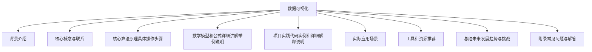

# 数据可视化 原理与代码实例讲解

## 1.背景介绍

在当今数据时代,数据可视化已经成为一种必不可少的技能。随着数据量的激增,如何有效地呈现和传达数据中蕴含的信息变得至关重要。数据可视化不仅能够帮助我们更好地理解数据,还能够发现数据中隐藏的模式和趋势,从而为决策提供有力支持。

数据可视化的应用范围广泛,包括商业智能、科学研究、金融分析、医疗保健等诸多领域。无论是创建交互式仪表板还是生成精美的统计图表,数据可视化都扮演着重要角色。

本文将深入探讨数据可视化的原理和实践,包括核心概念、算法原理、数学模型、代码实现以及实际应用场景。通过全面的讲解和丰富的示例,读者将能够掌握数据可视化的关键技术,并学会如何将数据转化为直观和富有洞见的视觉表现形式。

## 2.核心概念与联系

### 2.1 数据可视化的定义

数据可视化是指将抽象的数据转化为图形或视觉表现形式的过程,旨在帮助人们更好地理解和分析数据。它涉及选择合适的视觉元素(如图表、图形、颜色等)来表示数据,并考虑视觉变量(如位置、大小、形状等)如何映射数据属性。

### 2.2 数据可视化的目标

数据可视化的主要目标包括:

1. **理解数据**: 通过视觉表现形式,人们可以更容易地理解数据的含义和模式。

2. **发现见解**: 数据可视化有助于发现数据中隐藏的趋势、异常值和关联关系。

3. **传达信息**: 视觉表现形式可以更有效地传达数据中蕴含的信息和洞见。

4. **支持决策**: 通过数据可视化,决策者可以获得更好的数据支持,从而做出更明智的决策。

### 2.3 数据可视化的关键要素

有效的数据可视化需要考虑以下关键要素:

1. **数据类型**: 了解数据的类型(如数值、分类、时间序列等)对于选择合适的可视化方式至关重要。

2. **视觉通道**: 合理利用视觉通道(如位置、大小、颜色等)来编码数据属性。

3. **图表类型**: 选择适当的图表类型(如条形图、散点图、热力图等)来呈现数据。

4. **交互性**: 通过交互式功能(如缩放、过滤、链接等)增强数据探索和分析能力。

5. **可读性**: 确保可视化的清晰度和可读性,避免视觉干扰和混淆。

6. **背景知识**: 了解数据背景和上下文信息,以便更好地解释和呈现数据。

### 2.4 数据可视化与其他领域的关系

数据可视化与多个领域密切相关,包括:

1. **数据科学**: 数据可视化是数据科学过程中不可或缺的一部分,用于探索和呈现数据分析结果。

2. **信息设计**: 数据可视化借鉴了信息设计的原则和技巧,以提高可视化的效果和可读性。

3. **人机交互**: 交互式数据可视化需要考虑人机交互设计,以提供良好的用户体验。

4. **认知科学**: 数据可视化需要了解人类如何感知和理解视觉信息,以优化可视化效果。

5. **统计学**: 数据可视化与统计学密切相关,需要了解统计概念和方法来正确呈现数据。

通过融合这些领域的知识和技能,数据可视化可以更好地满足不同领域的需求,提供更有价值的洞见。

## 3.核心算法原理具体操作步骤

数据可视化涉及多种算法和技术,以下是一些核心算法原理和具体操作步骤:

### 3.1 数据预处理

在进行数据可视化之前,通常需要对原始数据进行预处理,包括:

1. **数据清洗**: 处理缺失值、异常值和重复数据。
2. **数据转换**: 将数据转换为适合可视化的格式,如长格式或宽格式。
3. **数据缩放**: 将数据缩放到适当的范围,以便于可视化。
4. **数据聚合**: 对数据进行聚合或汇总,以简化可视化过程。

### 3.2 布局算法

布局算法用于确定可视化元素在画布上的位置和排列方式,常见的布局算法包括:

1. **力导向布局**: 通过模拟物理力的作用,将节点排列在合适的位置。
2. **树状布局**: 用于可视化层次结构数据,如树形图和树状图。
3. **环形布局**: 将节点排列在一个或多个同心环上。
4. **网格布局**: 将元素排列在规则的网格中。

### 3.3 颜色映射

颜色映射算法用于将数据值映射到合适的颜色,常见的算法包括:

1. **线性颜色映射**: 将数据值线性映射到颜色范围。
2. **分段颜色映射**: 将数据值映射到不同的颜色区段。
3. **发散颜色映射**: 用于表示正负值或偏离中心值的数据。
4. **分类颜色映射**: 为不同的类别分配不同的颜色。

### 3.4 标记映射

标记映射算法用于将数据值映射到不同的形状、大小或其他视觉属性,常见的算法包括:

1. **形状映射**: 将不同的数据类别映射到不同的形状。
2. **大小映射**: 将数据值映射到不同的大小或半径。
3. **透明度映射**: 将数据值映射到不同的透明度。
4. **纹理映射**: 将数据值映射到不同的纹理或图案。

### 3.5 交互技术

交互式数据可视化需要实现各种交互技术,以增强用户的探索和分析能力,常见的交互技术包括:

1. **缩放和平移**: 允许用户放大、缩小和平移可视化视图。
2. **过滤和选择**: 允许用户过滤或选择感兴趣的数据子集。
3. **工具提示**: 在鼠标悬停时显示额外的数据信息。
4. **链接和刷新**: 将多个可视化视图相互链接,以支持协同分析。

### 3.6 渲染技术

渲染技术用于将可视化元素绘制到屏幕或其他输出设备上,常见的渲染技术包括:

1. **矢量图形渲染**: 使用矢量图形库(如SVG)绘制可视化元素。
2. **Canvas渲染**: 使用HTML5 Canvas元素进行渲染,适合大量数据的可视化。
3. **WebGL渲染**: 利用GPU加速的WebGL技术进行高性能渲染。
4. **服务器端渲染**: 在服务器端生成静态图像,然后在客户端显示。

通过组合和应用这些核心算法和技术,我们可以创建出各种类型的数据可视化,从简单的统计图表到复杂的交互式仪表板。

## 4.数学模型和公式详细讲解举例说明

数据可视化中涉及多种数学模型和公式,以下是一些常见的模型和公式,以及它们在数据可视化中的应用:

### 4.1 统计模型

统计模型用于描述和分析数据的分布和关系,在数据可视化中扮演着重要角色。

#### 4.1.1 正态分布

正态分布(高斯分布)是一种常见的连续概率分布,它的概率密度函数如下:

$$
f(x) = \frac{1}{\sqrt{2\pi\sigma^2}} e^{-\frac{(x-\mu)^2}{2\sigma^2}}
$$

其中,μ是均值,σ是标准差。正态分布在数据可视化中广泛应用,例如绘制误差区域、显示置信区间等。

#### 4.1.2 线性回归

线性回归是一种常用的统计模型,用于描述两个或多个变量之间的线性关系。线性回归模型的一般形式如下:

$$
y = \beta_0 + \beta_1x_1 + \beta_2x_2 + \cdots + \beta_nx_n + \epsilon
$$

其中,y是因变量,x_i是自变量,β_i是回归系数,ε是误差项。线性回归在数据可视化中常用于绘制趋势线、预测值等。

### 4.2 几何模型

几何模型用于描述和操作几何形状,在数据可视化中应用广泛。

#### 4.2.1 贝塞尔曲线

贝塞尔曲线是一种参数曲线,常用于绘制平滑的曲线和曲面。二次贝塞尔曲线的方程如下:

$$
B(t) = (1-t)^2P_0 + 2t(1-t)P_1 + t^2P_2, \quad t \in [0, 1]
$$

其中,P_0、P_1和P_2是控制点。贝塞尔曲线在数据可视化中常用于绘制平滑的线条和曲线,如面积图、径向图等。

#### 4.2.2 仿射变换

仿射变换是一种线性变换,用于描述几何形状的平移、旋转、缩放和错切操作。二维仿射变换矩阵如下:

$$
\begin{bmatrix}
x' \\
y'
\end{bmatrix}
=
\begin{bmatrix}
a & c & e \\
b & d & f
\end{bmatrix}
\begin{bmatrix}
x \\
y \\
1
\end{bmatrix}
$$

仿射变换在数据可视化中常用于调整可视化元素的位置、大小和方向,以满足不同的布局需求。

### 4.3 颜色模型

颜色模型用于描述和操作颜色,在数据可视化中扮演着重要角色。

#### 4.3.1 RGB颜色模型

RGB颜色模型是一种加色模型,通过混合红(R)、绿(G)和蓝(B)三种颜色来表示其他颜色。RGB颜色值通常使用三个介于0到255之间的整数表示,如(255, 0, 0)表示纯红色。

#### 4.3.2 HSL颜色模型

HSL颜色模型是一种基于人类视觉感知的颜色模型,包括色相(H)、饱和度(S)和亮度(L)三个分量。HSL颜色值通常使用一个介于0到360之间的度数表示色相,以及两个介于0到1之间的小数表示饱和度和亮度。

颜色模型在数据可视化中用于映射数据值到合适的颜色,以增强可视化效果和传达信息。

### 4.4 插值和平滑

插值和平滑技术用于估计或平滑数据点之间的值,在数据可视化中常用于生成平滑的曲线或曲面。

#### 4.4.1 线性插值

线性插值是一种简单的插值方法,通过连接相邻数据点来估计中间值。对于两个相邻点(x_0, y_0)和(x_1, y_1),线性插值公式如下:

$$
y = y_0 + \frac{y_1 - y_0}{x_1 - x_0}(x - x_0)
$$

线性插值在数据可视化中常用于绘制折线图和阶梯图。

#### 4.4.2 三次样条插值

三次样条插值是一种平滑插值方法,通过构建由三次多项式段组成的连续曲线来拟合数据点。三次样条插值可以保证曲线在数据点处具有连续的一阶和二阶导数,从而产生平滑的曲线。

三次样条插值在数据可视化中常用于绘制平滑的曲线,