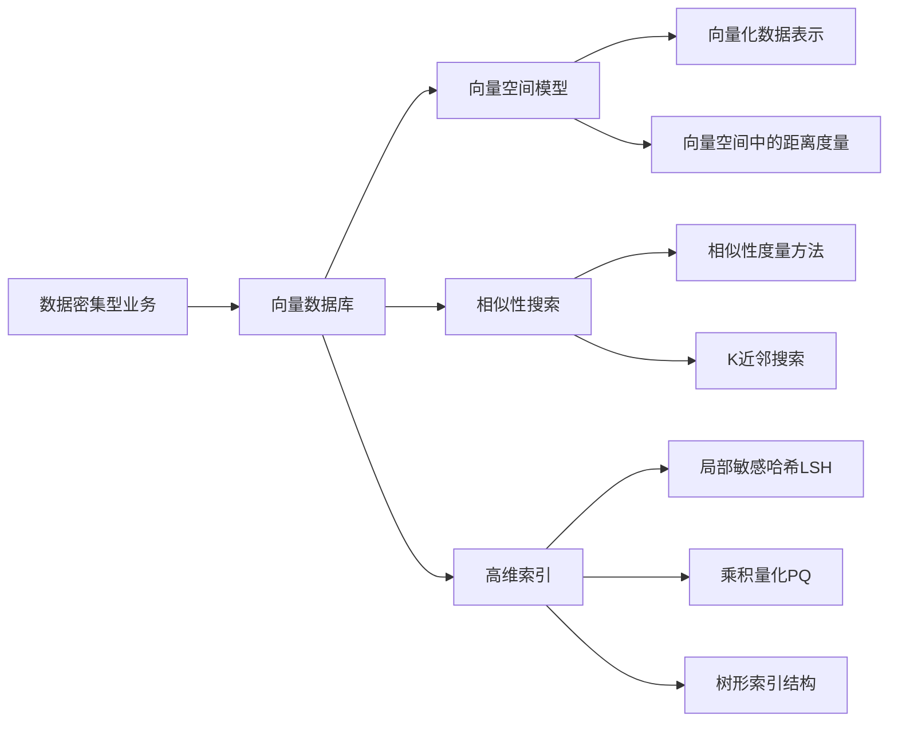

# 数据密集型业务中向量数据库的优势

## 1. 背景介绍
### 1.1 数据密集型业务的特点
#### 1.1.1 数据量大
#### 1.1.2 数据维度高
#### 1.1.3 数据更新频繁
### 1.2 传统数据库的局限性
#### 1.2.1 存储和检索效率低
#### 1.2.2 难以处理高维数据
#### 1.2.3 缺乏灵活的相似性搜索能力
### 1.3 向量数据库的兴起
#### 1.3.1 向量化数据表示
#### 1.3.2 高效的相似性搜索
#### 1.3.3 灵活的数据存储和检索

## 2. 核心概念与联系
### 2.1 向量空间模型
#### 2.1.1 向量化数据表示
#### 2.1.2 向量空间中的距离度量
#### 2.1.3 向量空间模型的优势
### 2.2 相似性搜索
#### 2.2.1 相似性度量方法
#### 2.2.2 K近邻搜索
#### 2.2.3 相似性搜索的应用场景
### 2.3 高维索引
#### 2.3.1 高维数据的挑战
#### 2.3.2 常见的高维索引方法
#### 2.3.3 高维索引的性能优化

## 3. 核心算法原理具体操作步骤
### 3.1 局部敏感哈希(LSH)
#### 3.1.1 LSH的基本原理
#### 3.1.2 LSH的哈希函数选择
#### 3.1.3 LSH的查询过程
### 3.2 乘积量化(PQ)
#### 3.2.1 PQ的基本原理
#### 3.2.2 PQ的编码和量化过程
#### 3.2.3 PQ的查询过程
### 3.3 树形索引结构
#### 3.3.1 KD树
#### 3.3.2 R树
#### 3.3.3 VP树

## 4. 数学模型和公式详细讲解举例说明
### 4.1 向量空间模型的数学表示
#### 4.1.1 向量化数据表示的数学定义
#### 4.1.2 向量空间中的距离度量公式
### 4.2 相似性度量的数学模型
#### 4.2.1 欧氏距离
#### 4.2.2 余弦相似度
#### 4.2.3 Jaccard相似度
### 4.3 高维索引算法的数学基础
#### 4.3.1 局部敏感哈希的数学原理
#### 4.3.2 乘积量化的数学原理
#### 4.3.3 树形索引结构的数学基础

## 5. 项目实践：代码实例和详细解释说明
### 5.1 使用Faiss构建向量数据库
#### 5.1.1 Faiss简介
#### 5.1.2 Faiss的安装和配置
#### 5.1.3 使用Faiss构建和查询向量索引
### 5.2 使用Annoy构建向量数据库
#### 5.2.1 Annoy简介 
#### 5.2.2 Annoy的安装和配置
#### 5.2.3 使用Annoy构建和查询向量索引
### 5.3 使用Milvus构建向量数据库
#### 5.3.1 Milvus简介
#### 5.3.2 Milvus的安装和配置
#### 5.3.3 使用Milvus构建和查询向量索引

## 6. 实际应用场景
### 6.1 推荐系统
#### 6.1.1 基于向量相似性的商品推荐
#### 6.1.2 基于向量相似性的用户推荐
### 6.2 图像搜索
#### 6.2.1 基于向量相似性的图像检索
#### 6.2.2 基于向量相似性的图像去重
### 6.3 自然语言处理
#### 6.3.1 基于向量相似性的文本搜索
#### 6.3.2 基于向量相似性的文本聚类

## 7. 工具和资源推荐
### 7.1 开源向量数据库
#### 7.1.1 Faiss
#### 7.1.2 Annoy
#### 7.1.3 Milvus
### 7.2 向量化工具
#### 7.2.1 Word2Vec
#### 7.2.2 GloVe
#### 7.2.3 BERT
### 7.3 相关学习资源
#### 7.3.1 论文和研究文献
#### 7.3.2 在线课程和教程
#### 7.3.3 开源项目和示例代码

## 8. 总结：未来发展趋势与挑战
### 8.1 向量数据库的发展趋势
#### 8.1.1 更高效的索引和查询算法
#### 8.1.2 更灵活的数据模型和查询语言
#### 8.1.3 更广泛的应用场景和集成方案
### 8.2 向量数据库面临的挑战
#### 8.2.1 高维数据的存储和计算效率
#### 8.2.2 数据隐私和安全问题
#### 8.2.3 向量化表示的可解释性和可靠性
### 8.3 未来研究方向和机遇
#### 8.3.1 向量数据库与深度学习的结合
#### 8.3.2 分布式和云原生的向量数据库
#### 8.3.3 多模态数据的向量化表示和检索

## 9. 附录：常见问题与解答
### 9.1 向量数据库与传统数据库的区别是什么？
### 9.2 如何选择合适的向量化方法和相似性度量？
### 9.3 向量数据库的性能优化有哪些技巧？
### 9.4 如何平衡向量数据库的存储和计算成本？
### 9.5 向量数据库在实际项目中的最佳实践是什么？

在当今数据密集型业务的背景下，传统的关系型数据库面临着存储和检索效率低、难以处理高维数据、缺乏灵活的相似性搜索能力等局限性。为了应对这些挑战，向量数据库应运而生，成为了处理高维数据和相似性搜索的有力工具。

向量数据库的核心在于将数据表示为高维向量，并利用向量空间模型来度量数据之间的相似性。通过将数据映射到向量空间中，我们可以使用各种距离度量方法，如欧氏距离、余弦相似度等，来计算数据点之间的相似性。这为相似性搜索和推荐系统等应用提供了基础。

为了实现高效的相似性搜索，向量数据库采用了多种高维索引技术，如局部敏感哈希(LSH)、乘积量化(PQ)和树形索引结构等。这些索引方法通过对高维向量进行哈希、量化或划分，大大提高了搜索效率，使得在海量高维数据中进行实时的相似性查询成为可能。

在实践中，我们可以使用Faiss、Annoy、Milvus等开源向量数据库来构建高效的相似性搜索引擎。这些工具提供了丰富的API和配置选项，使得开发者能够轻松地将向量数据库集成到自己的应用中。同时，Word2Vec、GloVe、BERT等向量化工具也为数据的向量化表示提供了强大的支持。

向量数据库在推荐系统、图像搜索、自然语言处理等领域有着广泛的应用前景。通过利用向量相似性，我们可以实现基于内容的商品推荐、用户推荐、图像检索、文本搜索等功能，为用户提供更加精准和个性化的服务。

展望未来，向量数据库的发展趋势包括更高效的索引和查询算法、更灵活的数据模型和查询语言、更广泛的应用场景和集成方案等。同时，向量数据库也面临着高维数据存储和计算效率、数据隐私和安全、向量化表示的可解释性和可靠性等挑战。未来的研究方向可以探索向量数据库与深度学习的结合、分布式和云原生的向量数据库、多模态数据的向量化表示和检索等。

总之，向量数据库为数据密集型业务提供了一种高效、灵活、可扩展的数据管理和检索方案。通过采用向量空间模型、相似性搜索和高维索引技术，向量数据库突破了传统数据库的局限性，为处理高维数据和相似性搜索开辟了新的道路。随着向量数据库技术的不断发展和成熟，我们有理由相信它将在未来的数据密集型应用中扮演越来越重要的角色。

作者：禅与计算机程序设计艺术 / Zen and the Art of Computer Programming