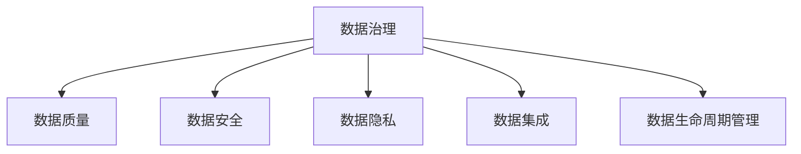

## 1.背景介绍

在当前数据驱动的时代，数据治理已经成为企业的核心竞争力之一。数据治理不仅关乎数据的质量，同时也关乎企业的决策效率和业务发展。然而，数据治理的实施并非一蹴而就，需要企业进行持续的优化和提升。因此，数据治理成熟度评估就显得尤为重要。本文将从理论到实践，为你揭示数据治理成熟度评估的诊断与优化之路。

## 2.核心概念与联系

数据治理成熟度评估，是对一个组织在数据治理方面的能力进行评估的过程。它包括数据质量、数据安全、数据隐私、数据集成、数据生命周期管理等多个维度。通过数据治理成熟度评估，企业可以了解自身在数据治理方面的优势和劣势，从而制定更加精准的优化策略。



## 3.核心算法原理具体操作步骤

数据治理成熟度评估的核心步骤包括：

1. 定义评估维度：根据企业的业务需求和数据治理的目标，确定评估维度。
2. 设定评估标准：对每个评估维度设定具体的评估标准，作为评估的依据。
3. 数据收集：收集与评估维度相关的数据，包括企业的数据治理策略、数据质量报告、数据安全记录等。
4. 数据分析：对收集的数据进行分析，得出每个维度的评估结果。
5. 结果汇总：将所有维度的评估结果汇总，得出企业的数据治理成熟度评估结果。
6. 制定优化策略：根据评估结果，制定数据治理的优化策略。


## 4.数学模型和公式详细讲解举例说明

在数据治理成熟度评估中，我们通常会使用加权平均法来计算每个维度的评估结果。设维度$i$的评估标准有$n$个，评估结果为$x_{ij}(j=1,2,...,n)$，权重为$w_{ij}$，则维度$i$的评估结果为：

$$
S_i = \frac{\sum_{j=1}^{n}w_{ij}x_{ij}}{\sum_{j=1}^{n}w_{ij}}
$$

例如，对于数据质量这一维度，我们设定了三个评估标准：数据准确性、数据完整性和数据一致性，它们的权重分别为0.4、0.3、0.3，评估结果分别为85、90、80，则数据质量的评估结果为：

$$
S_{\text{数据质量}} = \frac{0.4\times85 + 0.3\times90 + 0.3\times80}{0.4 + 0.3 + 0.3} = 85.5
$$

## 5.项目实践：代码实例和详细解释说明

以下是一个使用Python进行数据治理成熟度评估的简单示例：

```python
# 定义评估维度和权重
dimensions = {
    "data_quality": {"weight": 0.4, "score": 85},
    "data_security": {"weight": 0.3, "score": 90},
    "data_privacy": {"weight": 0.3, "score": 80},
}

# 计算总评估结果
total_score = sum([v["weight"] * v["score"] for v in dimensions.values()]) / sum([v["weight"] for v in dimensions.values()])

print(f"数据治理成熟度评估结果为：{total_score}")
```

## 6.实际应用场景

数据治理成熟度评估在许多场景中都有应用，例如：

- 大型企业：通过数据治理成熟度评估，大型企业可以了解自身在数据治理方面的优势和劣势，从而制定更加精准的优化策略。
- 咨询公司：咨询公司可以为客户提供数据治理成熟度评估服务，帮助客户改进数据治理策略。
- 政府机构：政府机构可以使用数据治理成熟度评估来监督企业的数据治理工作，保障数据的安全和公平使用。

## 7.工具和资源推荐

以下是一些关于数据治理成熟度评估的工具和资源推荐：

- 工具：IBM InfoSphere、Informatica Data Governance、Collibra Data Governance Center等。
- 资源：《数据治理实战》、《数据治理：理论与实践》等书籍，以及Gartner、Forrester等咨询公司的报告。

## 8.总结：未来发展趋势与挑战

随着数据的重要性日益凸显，数据治理成熟度评估将越来越受到企业的重视。未来，数据治理成熟度评估可能会更加精细化，考虑更多的评估维度和标准。同时，随着大数据、人工智能等技术的发展，数据治理成熟度评估也将面临新的挑战，例如如何评估机器学习模型的可解释性、如何保障数据的隐私等。

## 9.附录：常见问题与解答

1. 问：数据治理成熟度评估的目的是什么？
答：数据治理成熟度评估的目的是了解企业在数据治理方面的优势和劣势，从而制定更加精准的优化策略。

2. 问：如何进行数据治理成熟度评估？
答：数据治理成熟度评估的核心步骤包括定义评估维度、设定评估标准、数据收集、数据分析、结果汇总和制定优化策略。

3. 问：数据治理成熟度评估有哪些挑战？
答：数据治理成熟度评估面临的挑战包括如何更精细化地进行评估，如何应对大数据、人工智能等技术的发展等。

作者：禅与计算机程序设计艺术 / Zen and the Art of Computer Programming