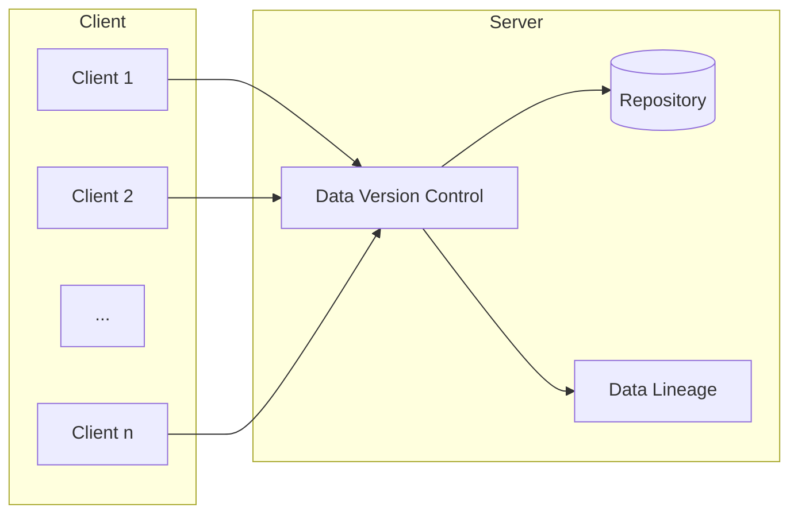

# 数据版本管理与数据谱系原理与代码实战案例讲解

## 1.背景介绍

### 1.1 数据的重要性

在当今数据驱动的世界中,数据无疑成为了企业和组织最宝贵的资产之一。无论是金融、医疗、制造业还是科研领域,准确、高质量的数据对于做出正确的业务决策、推动创新以及实现可持续发展都至关重要。然而,随着数据量的不断增长和数据类型的多样化,有效管理和跟踪数据的变化历史变得前所未有的复杂和具有挑战性。

### 1.2 数据版本管理的需求

数据版本管理(Data Version Control,DVC)的概念源于软件开发领域中的版本控制系统,旨在跟踪和管理数据的变更历史。通过数据版本管理,我们可以:

1. 跟踪数据的变更历史,了解数据在不同时间点的状态。
2. 比较不同版本之间的差异,识别数据的变化。
3. 在需要时回滚到之前的数据版本。
4. 协作管理数据,避免数据冲突和数据丢失。
5. 审计数据的变更过程,确保数据的可追溯性和可解释性。

### 1.3 数据谱系的重要性

与数据版本管理密切相关的是数据谱系(Data Lineage)的概念。数据谱系描述了数据从创建到最终使用的完整生命周期,包括数据的来源、转换过程、依赖关系等信息。通过数据谱系,我们可以:

1. 了解数据的来源和衍生过程,增强对数据的信任度。
2. 追踪数据的流向,识别潜在的数据质量问题。
3. 支持数据治理和合规性,满足法规和政策要求。
4. 提高数据可解释性,促进数据驱动决策的透明度。

综上所述,数据版本管理和数据谱系为确保数据质量、提高数据可靠性、支持数据治理和促进数据驱动决策奠定了基础。

## 2.核心概念与联系

### 2.1 数据版本管理的核心概念

1. **数据快照(Data Snapshot)**: 捕获数据在特定时间点的状态,类似于软件版本控制中的代码提交。
2. **数据版本(Data Version)**: 由一个或多个数据快照组成,代表数据在某个阶段的状态。
3. **数据分支(Data Branch)**: 允许从主线数据版本创建独立的开发分支,用于实验或并行开发。
4. **数据合并(Data Merge)**: 将不同分支的数据变更合并到主线版本中。
5. **数据冲突(Data Conflict)**: 当多个数据版本对同一数据进行修改时,可能会发生冲突,需要手动解决。

### 2.2 数据谱系的核心概念

1. **数据源(Data Source)**: 数据的原始来源,如数据库、文件、API等。
2. **数据转换(Data Transformation)**: 对原始数据进行清洗、过滤、聚合等操作,生成新的数据集。
3. **数据依赖(Data Dependency)**: 描述数据之间的关系,如一个数据集是由哪些其他数据集衍生而来。
4. **数据流(Data Flow)**: 描述数据从源头到最终使用的完整路径。
5. **数据质量(Data Quality)**: 评估数据的准确性、完整性、一致性等指标。

### 2.3 数据版本管理与数据谱系的联系

数据版本管理和数据谱系密切相关,相互补充:

1. 数据版本管理记录了数据的变更历史,而数据谱系描述了数据的来源和衍生过程。
2. 数据谱系为数据版本管理提供了背景信息,有助于理解数据变更的原因和影响。
3. 数据版本管理为数据谱系提供了版本信息,使得数据谱系能够跟踪数据在不同版本之间的变化。
4. 结合使用数据版本管理和数据谱系,可以实现端到端的数据可追溯性和可解释性。

## 3.核心算法原理具体操作步骤

### 3.1 数据快照算法

数据快照算法是数据版本管理的核心,用于捕获数据在特定时间点的状态。常见的数据快照算法包括:

1. **完全复制(Full Copy)**: 每次创建快照时,完整复制整个数据集。优点是简单直观,缺点是存储开销较大。
2. **增量快照(Incremental Snapshot)**: 只存储与上一个快照相比发生变化的数据块。优点是节省存储空间,缺点是需要额外的元数据来跟踪变化。
3. **重复数据删除(Deduplication)**: 通过哈希算法识别重复的数据块,只存储一份,从而节省存储空间。

无论采用哪种算法,都需要记录数据快照的元数据,如创建时间、作者、注释等,以支持版本管理和数据追溯。

### 3.2 数据版本管理算法

基于数据快照,数据版本管理算法提供了创建版本、分支合并等功能:

1. **创建版本(Create Version)**: 将一组相关的数据快照组合成一个新版本。
2. **创建分支(Create Branch)**: 从现有版本创建一个新的独立分支,用于并行开发或实验。
3. **合并分支(Merge Branch)**: 将分支上的变更合并回主线版本。
4. **解决冲突(Resolve Conflict)**: 当合并过程中发生数据冲突时,需要手动或自动解决冲突。

这些算法通常采用类似于Git等版本控制系统的策略,如三向合并(Three-Way Merge)等。

### 3.3 数据谱系算法

数据谱系算法旨在自动捕获数据的来源、转换过程和依赖关系:

1. **数据源发现(Data Source Discovery)**: 自动识别数据的来源,如数据库、文件系统等。
2. **数据转换捕获(Data Transformation Capture)**: 记录对数据进行的各种转换操作,如SQL查询、Python代码等。
3. **数据依赖分析(Data Dependency Analysis)**: 分析数据之间的依赖关系,构建数据依赖图。
4. **数据流构建(Data Flow Construction)**: 根据数据源、转换和依赖关系,重构数据从源头到最终使用的完整流程。
5. **数据质量评估(Data Quality Assessment)**: 基于数据谱系信息,评估数据的质量指标,如完整性、一致性等。

这些算法通常采用代码插桩(Code Instrumentation)、元数据捕获(Metadata Capture)等技术来实现。

## 4.数学模型和公式详细讲解举例说明

在数据版本管理和数据谱系领域,有一些常用的数学模型和公式,可以帮助我们更好地理解和优化相关算法。

### 4.1 数据相似度计算

在合并数据版本或识别数据冲突时,需要计算不同数据版本之间的相似度。常用的相似度度量包括:

1. **编辑距离(Edit Distance)**: 计算将一个字符串转换为另一个字符串所需的最小编辑操作数(插入、删除、替换)。

$$
EditDistance(s_1, s_2) = \min\limits_{ops}(\#\text{operations to convert }s_1\text{ to }s_2)
$$

2. **Jaccard相似系数(Jaccard Similarity Coefficient)**: 计算两个集合的交集与并集的比值,常用于评估两个数据集的相似度。

$$
JaccardSimilarity(A, B) = \frac{|A \cap B|}{|A \cup B|}
$$

3. **余弦相似度(Cosine Similarity)**: 计算两个向量之间的夹角余弦值,常用于文本相似度计算。

$$
CosineSimilarity(\vec{a}, \vec{b}) = \frac{\vec{a} \cdot \vec{b}}{||\vec{a}|| \times ||\vec{b}||}
$$

通过选择合适的相似度度量,我们可以更准确地识别数据的变化,从而提高版本管理和冲突解决的效率。

### 4.2 数据压缩和去重

为了节省存储空间,数据版本管理系统通常采用数据压缩和去重技术。常用的压缩算法包括:

1. **熵编码(Entropy Encoding)**: 根据数据的统计特性,为常见模式分配更短的编码,从而实现压缩。常用算法包括霍夫曼编码(Huffman Coding)和算术编码(Arithmetic Coding)。

2. **字典编码(Dictionary Encoding)**: 将重复出现的数据模式替换为更短的代码,从而实现压缩。常用算法包括LZW算法和deflate算法。

3. **重复数据删除(Deduplication)**: 通过哈希算法识别重复的数据块,只存储一份,从而节省存储空间。常用算法包括Rabin-Karp算法和Rsync算法。

通过合理选择和组合这些算法,我们可以有效地减小数据版本管理系统的存储开销。

### 4.3 数据依赖分析

在数据谱系中,数据依赖分析是一个关键步骤。常用的数据依赖分析模型包括:

1. **函数依赖(Functional Dependency)**: 描述一个属性集合的值如何唯一确定另一个属性集合的值。常用于关系数据库中的范式设计和数据规范化。

$$
X \rightarrow Y
$$

2. **多值依赖(Multivalued Dependency)**: 描述两个属性集合之间的依赖关系,常用于关系数据库中的垂直分割和视图设计。

$$
X \rightarrow\rightarrow Y
$$

3. **Join依赖(Join Dependency)**: 描述一个关系如何可以被分解为两个或多个投影关系的连接,常用于关系数据库中的无损分解。

$$
R = R_1 \bowtie R_2 \bowtie \cdots \bowtie R_n
$$

通过建模和分析数据依赖关系,我们可以更好地理解数据的结构和语义,从而优化数据存储和查询性能。

## 5.项目实践:代码实例和详细解释说明

为了更好地理解数据版本管理和数据谱系的原理和实现,我们将通过一个实际项目案例来进行代码级别的讲解和实践。

### 5.1 项目概述

在本项目中,我们将构建一个简单的数据版本管理系统,支持以下功能:

1. 创建数据快照
2. 创建数据版本
3. 创建数据分支
4. 合并数据分支
5. 解决数据冲突
6. 查看数据谱系

我们将使用Python作为编程语言,并借助一些开源库和工具来加速开发。

### 5.2 系统架构

我们的数据版本管理系统采用客户端-服务器架构,如下所示:



- **客户端(Client)**: 用户通过客户端与服务器进行交互,执行数据版本管理和查询数据谱系等操作。
- **服务器(Server)**: 包含以下核心组件:
  - **数据仓库(Repository)**: 存储数据快照和版本信息。
  - **数据版本控制(Data Version Control)**: 实现数据快照、版本管理、分支合并等功能。
  - **数据谱系(Data Lineage)**: 捕获数据的来源、转换和依赖关系,构建数据谱系视图。

### 5.3 核心代码实现

#### 5.3.1 数据快照

我们使用`dvc.api.open`函数来创建数据快照:

```python
import dvc.api

# 创建数据快照
with dvc.api.open(
    'data.csv',
    repo='path/to/repo',
    rev=None,  # 指定版本,None表示最新版本
    mode='r',  # 读取模式
) as data:
    # 处理数据
    ...

# 保存数据快照
data.persist()
```

`dvc.api.open`函数会自动计算数据的哈希值,并将其作为快照的标识符。如果数据已经存在于仓库中,则直接返回;否则,将创建一个新的快照。

#### 5.3.2 数据版本管