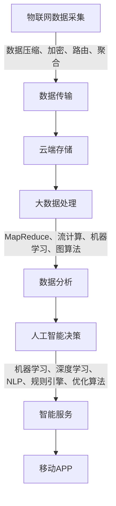

# 智慧社区APP应用设计与实现

## 1.背景介绍

随着城市化进程的加快和人口的不断增长,社区建设和管理面临着诸多挑战。传统的社区管理模式已经无法满足居民日益增长的需求,迫切需要一种创新的解决方案来提高社区服务水平、优化资源配置、增强社区凝聚力。在这种背景下,智慧社区应用程序(APP)应运而生。

智慧社区APP是一种基于移动互联网技术的创新社区管理和服务平台,旨在利用现代信息技术手段来实现社区资源的高效整合、社区服务的智能化和居民生活的数字化。它将物联网、云计算、大数据、人工智能等先进技术与社区管理和服务相结合,为居民提供全方位的智能化服务,促进社区的可持续发展。

## 2.核心概念与联系

智慧社区APP的核心概念包括以下几个方面:

### 2.1 物联网(IoT)

物联网是智慧社区APP的基础设施,它通过各种传感器和设备收集社区内的实时数据,如环境数据、能源消耗数据、安全监控数据等。这些数据将被传输到云端进行存储和处理,为社区管理和服务决策提供依据。

### 2.2 云计算

云计算为智慧社区APP提供了强大的计算和存储能力,使其能够处理大量的数据和复杂的计算任务。通过云计算技术,社区数据可以安全地存储在云端,并且可以根据需求动态调配计算资源,实现高效、弹性的计算和存储。

### 2.3 大数据

智慧社区APP需要处理来自物联网设备、社区服务系统和其他数据源的海量数据。大数据技术可以对这些数据进行收集、存储、处理和分析,从中发现有价值的信息和模式,为社区管理和服务决策提供支持。

### 2.4 人工智能(AI)

人工智能技术在智慧社区APP中发挥着重要作用。例如,机器学习算法可以对社区数据进行建模和预测,为社区管理和服务提供智能化决策支持。自然语言处理技术可以实现智能语音交互,提高用户体验。计算机视觉技术可以用于安全监控和人员识别等场景。

### 2.5 移动互联网

移动互联网技术是智慧社区APP的载体,它使居民可以通过手机或平板电脑等移动设备随时随地访问社区服务。移动APP不仅提供了便捷的服务入口,还可以实现基于位置的个性化服务,提高服务的针对性和效率。

上述核心概念相互关联、相互依赖,共同构建了智慧社区APP的技术架构。物联网提供数据源,云计算提供计算和存储能力,大数据技术对数据进行处理和分析,人工智能赋予系统智能化决策能力,移动互联网则是系统与用户交互的界面。这些技术的有机结合,使智慧社区APP成为一个高度智能化、高效集成的综合性社区服务平台。

## 3.核心算法原理具体操作步骤 

智慧社区APP的核心算法主要包括以下几个方面:

### 3.1 物联网数据采集与传输算法

物联网数据采集与传输算法负责从各种传感器和设备中采集实时数据,并将这些数据安全、高效地传输到云端进行存储和处理。常用的算法包括:

1. **数据压缩算法**: 由于物联网设备传输的数据量很大,因此需要对数据进行压缩,以减小传输带宽和存储空间的占用。常用的压缩算法有霍夫曼编码、LZW编码等。

2. **数据加密算法**: 为了保护数据的安全性和隐私性,需要对传输的数据进行加密。常用的加密算法有AES、RSA等。

3. **数据路由算法**: 在物联网环境中,数据需要经过多个节点传输,因此需要高效的路由算法来确定数据的传输路径,避免拥塞和延迟。常用的路由算法有AODV、DSR等。

4. **数据聚合算法**: 为了减少冗余数据的传输,可以在边缘节点对数据进行聚合,只传输聚合后的数据。常用的聚合算法有基于簇的聚合算法、基于模型的聚合算法等。

### 3.2 大数据处理算法

智慧社区APP需要处理来自各种数据源的海量数据,因此需要高效的大数据处理算法。常用的算法包括:

1. **MapReduce算法**: MapReduce是一种分布式计算模型,可以对大规模数据集进行并行处理。它将计算任务分为两个阶段:Map阶段对数据进行过滤和转换,Reduce阶段对中间结果进行汇总和计算。

2. **流计算算法**: 针对连续不断产生的数据流,需要使用流计算算法进行实时处理。常用的流计算算法有Spark Streaming、Flink等。

3. **机器学习算法**: 通过机器学习算法,可以从历史数据中发现隐藏的模式和规律,并对未来数据进行预测和决策。常用的机器学习算法有决策树、支持向量机、神经网络等。

4. **图算法**: 许多社区数据具有图结构,如社交网络、交通网络等。图算法可以高效地处理这些数据,发现重要的模式和规律。常用的图算法有PageRank、社区发现算法等。

### 3.3 人工智能算法

人工智能算法赋予智慧社区APP智能化决策和交互能力,主要包括以下几个方面:

1. **机器学习算法**: 机器学习算法可以从历史数据中自动学习模型,并对未来数据进行预测和决策。常用的算法有决策树、支持向量机、神经网络等。

2. **深度学习算法**: 深度学习是机器学习的一个分支,它通过构建深层神经网络模型,可以自动从原始数据中提取高级特征,在计算机视觉、自然语言处理等领域表现出色。常用的深度学习算法有卷积神经网络、递归神经网络等。

3. **自然语言处理算法**: 自然语言处理算法可以实现人机语音交互,提高用户体验。常用的算法有语音识别、语义理解、对话管理等。

4. **规则引擎算法**: 规则引擎算法根据预定义的规则对输入数据进行推理和决策,常用于智能决策系统中。

5. **优化算法**: 优化算法用于求解复杂的优化问题,如资源调度、路径规划等。常用的优化算法有遗传算法、蚁群算法等。

上述算法通常会组合使用,共同构建智慧社区APP的智能化决策和服务系统。

## 4.数学模型和公式详细讲解举例说明

在智慧社区APP的设计和实现过程中,需要使用多种数学模型和公式来描述和求解各种问题。以下是一些常见的数学模型和公式:

### 4.1 聚类算法

聚类算法是一种无监督学习算法,它可以根据数据的相似性将数据划分为多个簇。在智慧社区APP中,聚类算法可以用于居民分群、社区划分等场景。常用的聚类算法包括K-Means算法、层次聚类算法等。

K-Means算法的目标是将n个数据点划分为k个簇,使得簇内数据点之间的平方距离之和最小。算法的迭代过程如下:

1. 随机选择k个初始质心
2. 计算每个数据点与各个质心的距离,将数据点划分到距离最近的簇
3. 重新计算每个簇的质心
4. 重复步骤2和3,直到质心不再变化

K-Means算法的目标函数可以表示为:

$$J = \sum_{i=1}^{k}\sum_{x \in C_i}\left \| x - \mu_i \right \|^2$$

其中,$C_i$表示第i个簇,$\mu_i$表示第i个簇的质心。

### 4.2 协同过滤算法

协同过滤算法是一种基于用户行为数据的推荐算法,它可以根据用户的历史偏好预测用户对新项目的偏好程度。在智慧社区APP中,协同过滤算法可以用于个性化推荐服务。

常用的协同过滤算法包括基于用户的协同过滤和基于项目的协同过滤。基于用户的协同过滤算法的核心思想是:如果两个用户在过去有相似的偏好,那么他们在未来也可能有相似的偏好。基于项目的协同过滤算法则是基于项目之间的相似性进行推荐。

基于用户的协同过滤算法可以使用余弦相似度来衡量两个用户之间的相似性:

$$sim(u,v) = \frac{\sum_{i \in I_{uv}}(r_{ui} - \overline{r_u})(r_{vi} - \overline{r_v})}{\sqrt{\sum_{i \in I_{uv}}(r_{ui} - \overline{r_u})^2}\sqrt{\sum_{i \in I_{uv}}(r_{vi} - \overline{r_v})^2}}$$

其中,$r_{ui}$表示用户u对项目i的评分,$\overline{r_u}$表示用户u的平均评分,$I_{uv}$表示用户u和v都评分过的项目集合。

### 4.3 图算法

许多社区数据具有图结构,如社交网络、交通网络等。图算法可以高效地处理这些数据,发现重要的模式和规律。在智慧社区APP中,图算法可以用于社交网络分析、路径规划等场景。

常用的图算法包括最短路径算法、最小生成树算法、PageRank算法等。

**最短路径算法**

最短路径算法用于在加权图中找到两个节点之间的最短路径。常用的算法有Dijkstra算法和Floyd算法。

Dijkstra算法是一种单源最短路径算法,它可以求解从一个源节点到所有其他节点的最短路径。算法的基本思想是:从源节点开始,逐步扩展到其他节点,并维护一个距离数组,记录从源节点到每个节点的当前最短距离。

**PageRank算法**

PageRank算法是一种用于计算网页重要性的算法,它也可以应用于社交网络中节点重要性的计算。PageRank算法的基本思想是:一个节点的重要性不仅取决于它被其他节点链接的次数,还取决于链接它的节点的重要性。

PageRank算法可以表示为以下迭代公式:

$$PR(p_i) = (1 - d) + d \sum_{p_j \in B(p_i)}\frac{PR(p_j)}{L(p_j)}$$

其中,$PR(p_i)$表示页面$p_i$的PageRank值,$B(p_i)$表示链接到$p_i$的页面集合,$L(p_j)$表示页面$p_j$的出链接数,$d$是一个阻尼系数,通常取值0.85。

### 4.4 优化算法

在智慧社区APP中,经常需要解决各种优化问题,如资源调度、路径规划等。优化算法可以用于求解这些问题,找到最优或近似最优的解。常用的优化算法包括遗传算法、蚁群算法等。

**遗传算法**

遗传算法是一种基于生物进化过程的优化算法,它通过模拟自然选择和遗传机制,逐代产生更好的解。

遗传算法的基本步骤如下:

1. 初始化种群
2. 计算每个个体的适应度
3. 根据适应度进行选择,保留适应度高的个体
4. 对选择的个体进行交叉和变异,产生新的个体
5. 重复步骤2-4,直到满足终止条件

在遗传算法中,通常使用二进