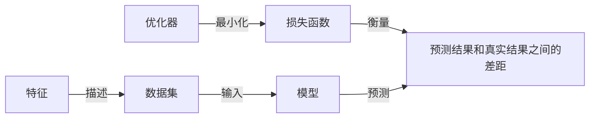

## 1.背景介绍

机器学习是人工智能的一个重要分支，它的目标是通过编程让计算机从数据中学习。这种学习可以是监督的、非监督的、半监督的或者强化的。机器学习已经在各个领域取得了显著的成果，包括计算机视觉、自然语言处理、推荐系统等等。

## 2.核心概念与联系

在机器学习中，有几个核心的概念：

- 数据集（Dataset）：这是我们用来训练和测试机器学习模型的数据。数据集通常被分为训练集、验证集和测试集。
- 特征（Feature）：这是描述数据的属性，可以是数值的、类别的或者二元的。
- 模型（Model）：这是我们用来从数据中学习的算法。模型的选择取决于我们的任务和数据。
- 损失函数（Loss Function）：这是我们用来衡量模型预测结果和真实结果之间差距的函数。
- 优化器（Optimizer）：这是我们用来改进模型的方法，通常是通过最小化损失函数来实现。

这些概念之间的关系可以通过下面的 Mermaid 流程图来展示：



## 3.核心算法原理具体操作步骤

接下来，我们将以线性回归（Linear Regression）为例，详细介绍机器学习的核心算法原理和具体操作步骤。

线性回归是一种简单的机器学习模型，它试图学习一个线性函数来预测一个连续值。线性回归的目标是找到一条直线，使得所有数据点到这条直线的距离（即残差）的平方和最小。

线性回归的具体操作步骤如下：

1. 初始化模型参数：我们需要初始化线性函数的参数，包括斜率和截距。
2. 计算预测值：我们使用当前的模型参数和特征计算预测值。
3. 计算损失：我们使用损失函数来计算预测值和真实值之间的差距。
4. 更新模型参数：我们使用优化器来更新模型参数，以便减小损失。
5. 重复步骤2-4，直到模型参数收敛或者达到预设的迭代次数。

## 4.数学模型和公式详细讲解举例说明

线性回归的数学模型可以表示为：

$$
y = wx + b
$$

其中，$y$ 是预测值，$x$ 是特征，$w$ 是斜率，$b$ 是截距。

线性回归的损失函数是平方损失函数，可以表示为：

$$
L = \frac{1}{n} \sum_{i=1}^{n} (y_i - \hat{y_i})^2
$$

其中，$y_i$ 是第 $i$ 个样本的真实值，$\hat{y_i}$ 是第 $i$ 个样本的预测值，$n$ 是样本数量。

我们使用梯度下降法作为优化器，来更新模型参数。梯度下降法的更新公式为：

$$
w = w - \alpha \frac{\partial L}{\partial w}
$$

$$
b = b - \alpha \frac{\partial L}{\partial b}
$$

其中，$\alpha$ 是学习率，$\frac{\partial L}{\partial w}$ 和 $\frac{\partial L}{\partial b}$ 分别是损失函数 $L$ 对 $w$ 和 $b$ 的偏导数。

## 5.项目实践：代码实例和详细解释说明

下面，我们将使用 Python 的 scikit-learn 库来实现线性回归。

首先，我们需要导入所需的库：

```python
import numpy as np
from sklearn.model_selection import train_test_split
from sklearn.linear_model import LinearRegression
from sklearn.metrics import mean_squared_error
```

然后，我们生成一些模拟数据，并分割为训练集和测试集：

```python
np.random.seed(0)
X = np.random.rand(100, 1)
y = 2 + 3 * X + np.random.rand(100, 1)
X_train, X_test, y_train, y_test = train_test_split(X, y, test_size=0.2, random_state=0)
```

接着，我们创建一个线性回归模型，并用训练集来训练它：

```python
model = LinearRegression()
model.fit(X_train, y_train)
```

最后，我们用测试集来评估模型的性能：

```python
y_pred = model.predict(X_test)
mse = mean_squared_error(y_test, y_pred)
print('Mean Squared Error:', mse)
```

这个代码实例展示了如何使用 scikit-learn 来实现线性回归。我们首先生成了一些模拟数据，然后创建了一个线性回归模型，并用训练集来训练它。最后，我们用测试集来评估模型的性能，通过计算预测值和真实值之间的均方误差。

## 6.实际应用场景

机器学习已经被广泛应用在各个领域，包括：

- 计算机视觉：机器学习可以用来识别图像中的对象、人脸和手写体等。
- 自然语言处理：机器学习可以用来理解和生成人类的语言，例如机器翻译、情感分析和语音识别等。
- 推荐系统：机器学习可以用来预测用户的喜好和行为，以提供个性化的推荐。
- 金融：机器学习可以用来预测股票价格、信用评分和欺诈检测等。

## 7.工具和资源推荐

如果你对机器学习感兴趣，下面的工具和资源可能会对你有所帮助：

- Python：这是一种广泛用于机器学习的编程语言，它有很多强大的库，如 numpy、pandas、matplotlib、scikit-learn 和 tensorflow 等。
- Jupyter Notebook：这是一个可以编写和执行 Python 代码的交互式环境，非常适合数据分析和机器学习。
- Coursera：这是一个在线学习平台，有很多关于机器学习的课程，如 Andrew Ng 的《Machine Learning》和《Deep Learning Specialization》。

## 8.总结：未来发展趋势与挑战

机器学习是一个快速发展的领域，它的未来发展趋势包括：

- 深度学习：这是一种模仿人脑工作机制的机器学习方法，已经在图像识别、语音识别和自然语言处理等领域取得了显著的成果。
- 自动机器学习（AutoML）：这是一种自动化的机器学习方法，目标是减少人工参与，使得机器学习更加易用。
- 解释性机器学习：这是一个关注如何解释和理解机器学习模型的领域，目标是提高模型的可解释性和透明度。

然而，机器学习也面临着一些挑战，包括：

- 数据质量：机器学习的性能很大程度上依赖于数据的质量，如何获取和清洗高质量的数据是一个重要的问题。
- 模型泛化：如何让模型在新的、未见过的数据上表现得良好，是一个关键的问题。
- 安全性和隐私：如何保护模型的安全性和用户的隐私，是一个重要的问题。

## 9.附录：常见问题与解答

1. 问：线性回归适用于哪些问题？
   
   答：线性回归适用于预测连续值的问题，例如预测房价、股票价格等。

2. 问：如何选择合适的机器学习模型？
   
   答：选择机器学习模型需要考虑很多因素，包括问题的性质、数据的特性、模型的复杂度、计算资源等。

3. 问：如何评估机器学习模型的性能？
   
   答：评估机器学习模型的性能通常需要分割数据集为训练集和测试集，用训练集来训练模型，用测试集来评估模型的性能。常用的评估指标包括准确率、精确率、召回率、F1 分数、AUC 等。

作者：禅与计算机程序设计艺术 / Zen and the Art of Computer Programming