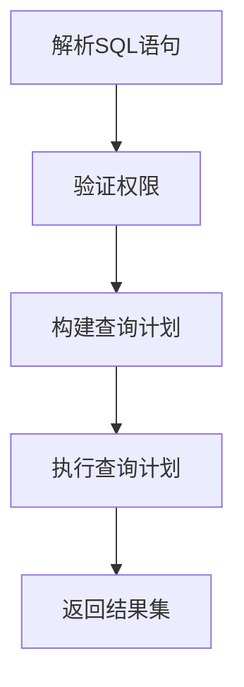

# 查询数据：SELECT语句详解

## 1.背景介绍

在关系数据库管理系统(RDBMS)中,SELECT语句是最常用和最重要的SQL语句之一。它用于从一个或多个表中检索数据。无论是简单的查询还是复杂的查询,SELECT语句都是实现数据查询的核心工具。

数据查询是数据库应用程序中不可或缺的一部分。无论是构建报表、数据分析、商业智能(BI)系统,还是简单的数据浏览,都需要高效、灵活地查询数据。因此,掌握SELECT语句的用法对于数据库开发人员和数据分析师来说是必须的。

## 2.核心概念与联系

SELECT语句的核心概念包括:

### 2.1 投影(Projection)

投影是指选择要检索的列或属性。在SELECT语句中,我们可以指定要检索的一个或多个列。

### 2.2 选择(Selection)

选择是指根据指定的条件从表中选择满足条件的行。WHERE子句用于指定选择条件。

### 2.3 连接(Join)

连接是指将来自多个表的行组合在一起。根据不同的连接类型(内连接、外连接等),可以获取不同的结果集。

### 2.4 排序(Ordering)

排序是指根据一个或多个列对结果集进行排序。ORDER BY子句用于指定排序条件。

### 2.5 分组(Grouping)

分组是指根据一个或多个列的值对结果集进行分组。GROUP BY子句用于指定分组条件,通常与聚合函数(如SUM、AVG等)一起使用。

### 2.6 聚合(Aggregation)

聚合是指对一组值应用聚合函数(如SUM、AVG、COUNT等)来计算汇总值。

这些核心概念相互关联,共同构成了SELECT语句的强大功能。掌握了这些概念,就能够灵活地构建各种复杂查询。

## 3.核心算法原理具体操作步骤 

SELECT语句的执行过程遵循一定的算法原理和操作步骤,可以概括为以下几个阶段:



### 3.1 解析SQL语句

数据库管理系统首先需要解析SQL语句,将其转换为内部的查询树表示。这个过程包括词法分析、语法分析和语义分析等步骤。

### 3.2 验证权限

在执行查询之前,系统需要验证用户是否具有访问相关表和视图的权限。如果用户没有足够的权限,查询将被拒绝执行。

### 3.3 构建查询计划

查询优化器根据查询树、统计信息和代价模型,生成一个或多个查询计划。查询计划描述了如何高效地执行查询。

### 3.4 执行查询计划

执行引擎根据选定的查询计划执行查询操作,包括扫描表、执行连接、应用过滤条件等。这个过程可能涉及磁盘I/O、缓存访问等操作。

### 3.5 返回结果集

最后,执行引擎将查询结果返回给客户端应用程序。结果集可能需要进一步处理,如排序、分页等。

整个过程由数据库管理系统自动完成,对于用户来说是透明的。但是,了解这些原理和步骤有助于编写高效的SQL查询。

## 4.数学模型和公式详细讲解举例说明

在SQL查询中,一些数学模型和公式也被广泛应用,用于描述查询的代价模型、统计信息等。下面是一些常见的数学模型和公式:

### 4.1 选择率(Selectivity)

选择率是指满足给定条件的行数占总行数的比例。选择率用于估计查询的代价,对于查询优化非常重要。

选择率的计算公式如下:

$$
选择率 = \frac{满足条件的行数}{总行数}
$$

例如,如果一个表有1000行,其中200行满足条件`age > 30`,那么该条件的选择率就是0.2。

### 4.2 基数估计(Cardinality Estimation)

基数估计是指估计一个中间结果集的大小(行数)。准确的基数估计对于选择最优查询计划至关重要。

基数估计通常基于选择率和已知的表或中间结果集的大小进行计算。例如,对于连接操作,可以使用以下公式估计结果集的基数:

$$
结果基数 = 左输入基数 \times 右输入基数 \times 选择率
$$

### 4.3 代价模型(Cost Model)

代价模型用于估计执行查询所需的代价,通常包括CPU代价和I/O代价。查询优化器根据代价模型选择最优的查询计划。

代价模型通常是一个复杂的数学模型,需要考虑多个因素,如基数估计、索引使用情况、统计信息等。以下是一个简化的CPU代价模型公式:

$$
CPU代价 = N_{rows} \times C_{cpu}
$$

其中,`N_{rows}`是需要处理的行数,`C_{cpu}`是每行的CPU代价常数。

### 4.4 直方图(Histogram)

直方图是一种描述数据分布的统计信息,被广泛用于查询优化。直方图将数据值划分为一些桶(bucket),并记录每个桶中值的数量。

直方图可以帮助更准确地估计选择率。例如,对于条件`age > 30`,如果直方图显示大部分值都集中在20~40之间,那么该条件的选择率就会比较高。

## 5.项目实践:代码实例和详细解释说明

为了更好地理解SELECT语句的使用,我们将通过一些实际的代码示例来演示不同的查询场景。

假设我们有一个名为`employees`的表,其结构如下:

```sql
CREATE TABLE employees (
    id INT PRIMARY KEY,
    name VARCHAR(50),
    department VARCHAR(50),
    salary DECIMAL(10,2),
    hire_date DATE
);
```

### 5.1 简单查询

```sql
SELECT name, department, salary
FROM employees;
```

这个查询将返回`employees`表中所有员工的姓名、部门和薪资。它演示了投影(projection)的概念。

### 5.2 带条件的查询

```sql
SELECT name, department, salary
FROM employees
WHERE department = 'Sales' AND salary > 50000;
```

这个查询将返回销售部门中薪资超过50000的员工信息。它演示了选择(selection)的概念,使用WHERE子句来过滤结果集。

### 5.3 排序查询

```sql
SELECT name, department, salary
FROM employees
ORDER BY salary DESC;
```

这个查询将返回所有员工信息,并按照薪资从高到低进行排序。它演示了排序(ordering)的概念,使用ORDER BY子句指定排序条件。

### 5.4 聚合查询

```sql
SELECT department, AVG(salary) AS avg_salary
FROM employees
GROUP BY department;
```

这个查询将计算每个部门的平均薪资。它演示了分组(grouping)和聚合(aggregation)的概念,使用GROUP BY子句进行分组,并使用AVG聚合函数计算平均值。

### 5.5 连接查询

```sql
SELECT e.name, e.salary, d.department_name
FROM employees e
JOIN departments d ON e.department = d.department_id;
```

这个查询将返回每个员工的姓名、薪资和所属部门名称。它演示了连接(join)的概念,使用JOIN子句将`employees`表和`departments`表进行连接。

通过这些示例,你应该能够更好地理解SELECT语句的各种用法,并开始构建自己的查询。

## 6.实际应用场景

SELECT语句在各种数据库应用中都有广泛的应用,下面是一些典型的场景:

### 6.1 报表和数据分析

在商业智能(BI)系统和数据分析应用中,SELECT语句被广泛用于构建各种报表和数据可视化。通过连接多个表、应用过滤条件、执行聚合计算等操作,可以从海量数据中提取有价值的信息。

### 6.2 数据浏览和查询

在数据库管理工具和应用程序中,SELECT语句常被用于浏览和查询数据。开发人员和数据库管理员可以使用SELECT语句检查表中的数据,验证数据完整性,或者进行临时查询和数据探索。

### 6.3 数据抽取(ETL)

在数据抽取、转换和加载(ETL)过程中,SELECT语句用于从源系统中提取所需的数据。通过连接多个表、应用复杂的过滤条件,可以准确地提取符合要求的数据子集。

### 6.4 数据库应用程序

在基于数据库的应用程序中,SELECT语句是实现各种业务逻辑的核心。无论是检索用户信息、查询订单详情,还是实现复杂的业务规则,SELECT语句都扮演着重要的角色。

### 6.5 数据库维护

在数据库维护和优化过程中,SELECT语句也发挥着重要作用。数据库管理员可以使用SELECT语句检查索引使用情况、查询统计信息,或者识别数据热点,从而优化数据库的性能。

## 7.工具和资源推荐

为了更好地掌握SELECT语句,以下是一些推荐的工具和资源:

### 7.1 数据库管理工具

- MySQL Workbench
- SQL Server Management Studio
- Oracle SQL Developer
- pgAdmin (PostgreSQL)
- DBeaver (跨数据库平台)

这些工具提供了方便的SQL编辑器和查询执行环境,可以帮助你编写、测试和优化SQL查询。

### 7.2 在线练习平台

- LeetCode
- HackerRank
- SQLZoo
- SQLBolt

这些在线平台提供了大量的SQL练习题,涵盖不同难度和场景,非常适合初学者和有经验的开发人员练习和提高SQL技能。

### 7.3 书籍和教程

- 《SQL查询的艺术》(Caleb Curry)
- 《SQL反模式》(Mikhail Tsennykh)
- 《SQL性能优化》(Markus Winand)
- 《SQL教程》(W3Schools)

这些书籍和教程深入探讨了SQL查询的原理、最佳实践和性能优化技巧,对于提高SQL技能非常有帮助。

### 7.4 社区和论坛

- Stack Overflow
- Database Administrators Stack Exchange
- Reddit's /r/SQL

在这些社区和论坛中,你可以与其他开发人员和数据库专家交流,分享经验,解决疑难问题。

利用这些工具和资源,相信你一定能够掌握SELECT语句的精髓,成为SQL查询的高手。

## 8.总结:未来发展趋势与挑战

SQL作为关系数据库查询语言,已经存在了几十年,并且在未来的很长一段时间内仍将扮演重要角色。然而,随着数据量和复杂性的不断增加,SQL查询也面临着一些新的挑战和发展趋势。

### 8.1 大数据和分布式查询

随着大数据时代的到来,传统的单机关系数据库已经无法满足海量数据的存储和查询需求。因此,分布式查询引擎和SQL-on-Hadoop解决方案(如Apache Spark SQL、Presto、Impala等)应运而生,用于在大规模集群上高效执行SQL查询。

### 8.2 流式查询和实时分析

在物联网、金融交易等领域,数据是持续不断地产生和流动的。传统的批量查询已经无法满足实时分析的需求。因此,流式查询引擎(如Apache Flink SQL、ksqlDB等)被设计用于对实时数据流进行持续查询和分析。

### 8.3 机器学习和AI集成

随着机器学习和人工智能技术的发展,将其与SQL查询相结合也成为一个新的趋势。例如,可以在SQL查询中嵌入机器学习模型,实现智能预测和推理。这种集成有助于简化机器学习模型的部署和应用。

### 8.4 查询优化和自动化

随着查询复杂性的增加,手动优化查询变得越来越困难。因此,自动查询优化和自动索引管理等技术将变得越来越重要。智能查询优化器可以自动选择最佳的执行计划,而无需人工干预。

### 8.5 安全性和隐私保护

在处理敏感数据时,数据安全性和隐私保护是一个重大挑战。未来的SQL查询需要支持更强大的安全和隐私保护功能,如数据掩码、加密查询