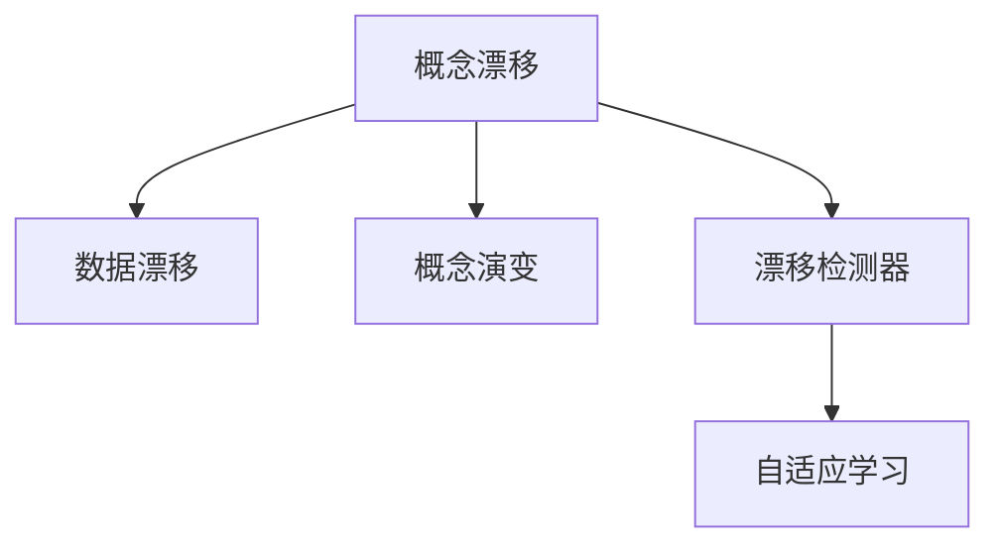

# 概念漂移与数据变化检测原理与代码实战案例讲解

## 1.背景介绍

在机器学习和数据挖掘领域,训练数据和测试数据的分布差异是一个普遍存在的问题。这种差异通常被称为"概念漂移"(Concept Drift)或"数据变化"(Data Shift)。概念漂移会导致模型性能下降,因为模型是在一个分布上训练的,但在另一个分布上进行预测。因此,检测和适应概念漂移对于保持模型的性能至关重要。

概念漂移在许多实际应用中都会出现,例如:

- 垃圾邮件过滤:随着时间的推移,垃圾邮件发送者会改变他们的策略,导致垃圾邮件的特征发生变化。
- 客户行为预测:客户的偏好和行为模式可能会随时间而变化,例如由于季节性趋势或社会潮流。  
- 工业生产:生产设备的磨损和老化可能导致传感器读数的变化。

因此,开发有效的概念漂移检测方法,并设计能够适应变化的机器学习模型,对于许多实际应用都是至关重要的。

### 1.1 概念漂移的类型

概念漂移可以分为几种类型:

1. 突变漂移(Sudden Drift):数据分布突然发生变化,例如由于传感器故障或系统更改。

2. 渐变漂移(Gradual Drift):数据分布缓慢地随时间变化,例如由于设备磨损或季节性趋势。

3. 反复漂移(Recurring Drift):数据分布在先前见过的状态之间切换,例如由于季节性效应。 

4. 增量漂移(Incremental Drift):数据分布缓慢地演变为先前未见过的状态。

不同类型的概念漂移需要不同的检测和适应策略。

### 1.2 概念漂移的挑战

概念漂移给机器学习模型带来了几个挑战:

1. 检测漂移:及时准确地检测出概念漂移是一个挑战,特别是对于缓慢的渐变漂移。

2. 适应漂移:一旦检测到漂移,模型需要快速适应新的数据分布,同时避免灾难性遗忘。

3. 资源限制:在资源有限(如内存或计算)的情况下适应漂移可能是一个挑战。

4. 验证困难:由于真实世界中的ground truth通常是不可用的,因此很难评估漂移适应的有效性。

本文将深入探讨概念漂移检测的原理和方法,并通过代码实战案例演示如何在实践中应对这些挑战。

## 2.核心概念与联系

在深入探讨概念漂移检测方法之前,我们首先需要了解一些核心概念及其相互联系。

### 2.1 概念漂移(Concept Drift)

概念漂移是指数据生成过程的变化,导致输入数据的分布发生变化。形式化地,如果在时间t的输入数据为 $X_t$,输出为 $y_t$,那么概念漂移意味着联合分布 $P_t(X,y)$ 随时间变化。

### 2.2 数据漂移(Data Drift) 

数据漂移是指输入数据分布 $P_t(X)$ 的变化,而条件分布 $P_t(y|X)$ 保持不变。数据漂移是概念漂移的一种特殊情况。

### 2.3 概念演变(Concept Evolution)

概念演变是指输出空间的变化,例如引入新的类别。这与概念漂移不同,因为后者假设输出空间是固定的。

### 2.4 漂移检测器(Drift Detector)

漂移检测器是一种算法,用于检测数据流中是否发生了概念漂移。常见的漂移检测器包括DDM,EDDM,Page-Hinkley等。

### 2.5 自适应学习(Adaptive Learning)

自适应学习是一种机器学习范式,其中模型能够适应数据分布的变化。这通常涉及在检测到漂移时更新模型。

### 2.6 核心概念之间的联系

下图展示了这些核心概念之间的联系:

概念漂移是一个总括性的概念,包括数据漂移和概念演变两种特殊情况。漂移检测器用于检测概念漂移,并触发自适应学习过程以适应变化。

理解这些核心概念之间的联系对于设计有效的概念漂移检测和适应策略至关重要。

## 3.核心算法原理具体操作步骤

概念漂移检测的核心算法可以分为两大类:基于错误率的方法和基于数据分布的方法。下面我们详细介绍几种常见算法的原理和操作步骤。

### 3.1 DDM(Drift Detection Method)

DDM是一种基于错误率的漂移检测方法,由João Gama等人在2004年提出。其基本思想是监测学习器的错误率,当错误率显著增加时,就认为发生了概念漂移。

DDM的具体操作步骤如下:

1. 初始化错误率 $p_i$ 和标准差 $s_i$。

2. 对于每个新的样本 $(x_i, y_i)$:
   - 用当前模型 $f$ 预测 $\hat{y}_i = f(x_i)$
   - 更新错误率:
     $$ p_i = p_{i-1} + (L(\hat{y}_i, y_i) - p_{i-1})/i $$
     其中 $L$ 是0-1损失函数。
   - 更新标准差:
     $$ s_i = \sqrt{p_i(1-p_i)/i} $$
   - 如果 $p_i + s_i \geq p_{min} + 2 * s_{min}$,则发出漂移警告
   - 如果 $p_i + s_i \geq p_{min} + 3 * s_{min}$,则发出漂移确认,并重置模型

其中 $p_{min}$ 和 $s_{min}$ 是之前错误率和标准差的最小值。

### 3.2 EDDM(Early Drift Detection Method)

EDDM是DDM的一个改进版本,旨在更早地检测出渐变漂移。其基本思想是监测两个错误之间的距离,而不是错误率本身。

EDDM的具体操作步骤如下:

1. 初始化距离 $D_i$ 和标准差 $s_i$。

2. 对于每个新的样本 $(x_i, y_i)$:
   - 用当前模型 $f$ 预测 $\hat{y}_i = f(x_i)$
   - 如果 $\hat{y}_i \neq y_i$,则更新距离:
     $$ D_i = i - i_{last} $$
     其中 $i_{last}$ 是上一个错误的位置。
   - 更新平均距离:
     $$ \bar{D}_i = \bar{D}_{i-1} + (D_i - \bar{D}_{i-1})/n $$
     其中 $n$ 是错误的数量。
   - 更新标准差:
     $$ s_i = \sqrt{\frac{1}{n-1}\sum_{j=1}^n (D_j - \bar{D}_i)^2} $$
   - 如果 $D_i < \alpha * \bar{D}_i - 2 * s_i$,则发出漂移警告
   - 如果 $D_i < \alpha * \bar{D}_i - 3 * s_i$,则发出漂移确认,并重置模型

其中 $\alpha$ 是一个控制灵敏度的超参数,通常取0.95。

### 3.3 Page-Hinkley Test

Page-Hinkley Test是一种基于累积变量的漂移检测方法,最初用于检测信号处理中的变化点。其基本思想是维护一个累积变量,当其显著偏离均值时,就认为发生了变化。

Page-Hinkley Test的具体操作步骤如下:

1. 初始化累积变量 $U_t = 0$,均值估计 $\bar{x}_t = 0$,样本数 $n = 0$。

2. 对于每个新的样本 $x_t$:
   - 更新样本数: $n = n + 1$
   - 更新均值估计: 
     $$ \bar{x}_t = \bar{x}_{t-1} + (x_t - \bar{x}_{t-1})/n $$
   - 计算偏差:
     $$ \delta_t = x_t - \bar{x}_{t-1} - \theta $$
     其中 $\theta$ 是一个容忍度参数。
   - 更新累积变量:
     $$ U_t = max(0, U_{t-1} + \delta_t) $$
   - 计算变化检测阈值:
     $$ \lambda_t = \sigma \sqrt{n} $$
     其中 $\sigma$ 是数据的标准差。
   - 如果 $U_t > \lambda_t$,则发出变化警告,并重置 $U_t = 0$。

Page-Hinkley Test可以用于检测机器学习模型的错误率或预测残差的变化,从而实现概念漂移检测。

### 3.4 基于数据分布的方法

除了基于错误率的方法,还有一类方法直接比较数据分布的变化。这些方法通常使用统计检验或距离度量来比较不同时间窗口内的数据分布。

常见的数据分布比较方法包括:

- Kolmogorov-Smirnov检验:比较两个经验分布函数的最大差异。
- Wilcoxon秩和检验:比较两个分布的位置参数是否相同。
- Kullback-Leibler散度:度量两个概率分布之间的差异。
- Maximum Mean Discrepancy:用再生核希尔伯特空间中的距离来度量分布差异。

这些方法的具体操作步骤涉及统计学和概率论的知识,限于篇幅这里不再详述。感兴趣的读者可以参考相关文献。

## 4.数学模型和公式详细讲解举例说明

这一节我们将详细讲解几个常用的概念漂移检测算法中的数学模型和公式,并给出具体的例子说明。

### 4.1 DDM中的错误率模型

在DDM算法中,错误率 $p_i$ 被建模为一个二项分布 $B(i, p)$ 的样本均值,其中 $i$ 是样本数, $p$ 是真实的错误率。根据中心极限定理,当样本数 $i$ 较大时,样本均值 $p_i$ 近似服从正态分布:

$$ p_i \sim N(p, \sqrt{p(1-p)/i}) $$

因此,我们可以使用 $p_i$ 的标准差 $s_i = \sqrt{p_i(1-p_i)/i}$ 来构建置信区间。当新的 $p_i$ 超出先前最小值 $p_{min}$ 两个或三个标准差时,就认为发生了概念漂移。

举例说明:假设在第1000个样本时,错误率 $p_{1000} = 0.1$,则标准差 $s_{1000} = \sqrt{0.1(1-0.1)/1000} \approx 0.009$。如果在第1500个样本时,错误率 $p_{1500} = 0.2$,则新的标准差 $s_{1500} \approx 0.010$。此时, $p_{1500} + s_{1500} \approx 0.210 > 0.1 + 3*0.009$,因此DDM会发出漂移确认信号。

### 4.2 EDDM中的距离模型

在EDDM算法中,关键是两个错误之间的距离 $D_i$。直观地,如果概念漂移发生,错误会变得更加频繁,因此 $D_i$ 会减小。EDDM使用 $D_i$ 的均值 $\bar{D}_i$ 和标准差 $s_i$ 来构建置信区间:

$$ [\alpha * \bar{D}_i - 3*s_i, \alpha * \bar{D}_i + 3*s_i] $$

其中 $\alpha$ 是一个控制灵敏度的超参数,通常取0.95。当新的 $D_i$ 小于置信下界时,就认为发生了概念漂移。

举例说明:假设前10个错误的位置分别为 $[100, 250, 320, 450, 500, 650, 700, 800, 950, 1000]$,则对应的距离序列为 $[100, 150, 70, 130, 50, 150, 50, 100, 150, 50]