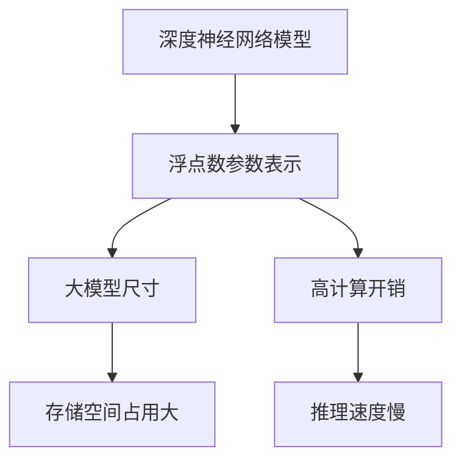
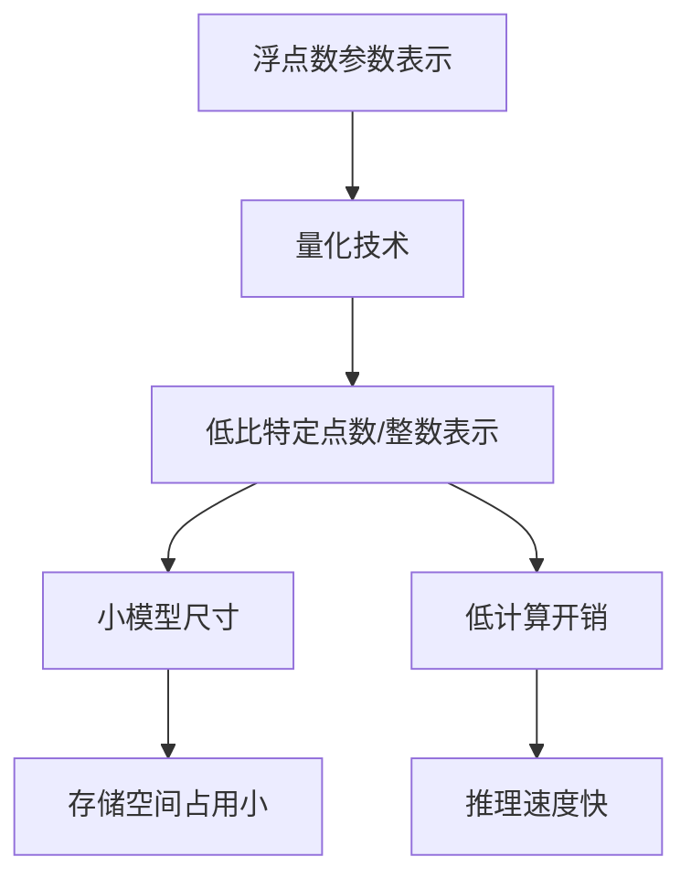
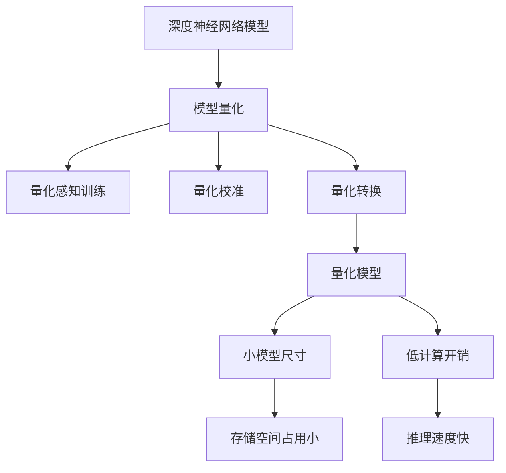

# 模型量化在游戏AI中的应用

## 1.背景介绍

### 1.1 游戏AI的重要性

在当今游戏行业中,人工智能(AI)已经成为一个不可或缺的关键技术。游戏AI不仅为玩家提供了富有挑战性和身临其境的游戏体验,还大大提高了游戏的可玩性和娱乐性。无论是实时策略游戏(RTS)、角色扮演游戏(RPG)还是第一人称射击游戏(FPS),AI系统都扮演着至关重要的角色,赋予非玩家角色(NPC)智能行为,增强游戏的互动性和真实感。

### 1.2 游戏AI的挑战

然而,在移动设备和嵌入式系统等资源受限环境中,实现高性能的游戏AI却面临着巨大的挑战。这些系统通常具有有限的计算能力、内存和电池寿命,因此需要高度优化的AI算法来满足实时性和能效要求。传统的AI模型往往体积庞大、计算量巨大,无法直接部署在资源受限设备上。

### 1.3 模型量化的重要性

为了解决这一难题,模型量化(Model Quantization)技术应运而生。模型量化是一种将深度神经网络中的浮点数参数量化为低比特整数值的技术,旨在减小模型的存储占用并提高推理效率,同时最大限度地保持模型精度。通过模型量化,我们可以极大地压缩AI模型的大小,降低计算和内存需求,从而使其能够高效运行在移动设备和嵌入式系统等资源受限环境中。

在游戏AI领域,模型量化技术可以为游戏开发者带来诸多好处,例如提高游戏的流畅性、延长电池续航时间,并为更复杂和智能化的AI系统在资源受限设备上的实现铺平道路。本文将深入探讨模型量化在游戏AI中的应用,介绍其核心概念、算法原理、实现方法,并分享实际应用场景和最佳实践。

## 2.核心概念与联系

在深入讨论模型量化在游戏AI中的应用之前,我们需要先了解一些核心概念及其相互关系。

### 2.1 深度神经网络

深度神经网络(Deep Neural Network,DNN)是当前人工智能领域的核心技术之一。它是一种由多层神经元组成的复杂数学模型,能够从大量数据中自动学习特征表示和模式,并对新的输入数据进行预测或决策。深度神经网络已被广泛应用于计算机视觉、自然语言处理、决策系统等各种AI任务中,也是构建游戏AI系统的关键组成部分。

### 2.2 浮点数表示

在传统的深度神经网络中,网络参数(如权重和偏置)通常使用32位或64位的浮点数进行表示和存储。浮点数能够提供高精度的数值表示,但也带来了较大的存储和计算开销。例如,一个典型的图像分类模型可能包含数百万个参数,占用数百兆字节的存储空间。

### 2.3 量化技术

为了解决浮点数表示带来的问题,量化技术(Quantization)应运而生。量化是将浮点数参数映射到一组有限的离散值的过程,通常使用较低比特宽度的定点数或整数来表示。例如,我们可以将32位浮点数量化为8位整数,从而将模型大小减小4倍。

量化技术可以极大地减小深度神经网络模型的存储占用,同时也能降低计算复杂度,提高推理速度。然而,量化过程会引入一定程度的数值近似,可能导致模型精度下降。因此,量化算法需要在模型压缩率和精度损失之间寻求平衡。

### 2.4 模型量化

模型量化(Model Quantization)是指将深度神经网络中的浮点数参数量化为低比特定点数或整数的过程。它结合了量化技术和深度学习模型,旨在减小模型的存储占用并提高推理效率,同时最大限度地保持模型精度。

模型量化技术通常包括以下几个关键步骤:

1. **量化感知训练(Quantization-Aware Training)**: 在模型训练过程中,模拟量化过程并对量化误差进行反向传播,使模型在训练时就能适应量化操作。
2. **量化校准(Quantization Calibration)**: 使用校准数据集来确定合适的量化参数,如量化比例因子和零点。
3. **量化转换(Quantization Conversion)**: 将浮点数参数转换为低比特定点数或整数表示。

通过模型量化,我们可以显著减小深度神经网络模型的存储占用,降低计算和内存需求,从而使其能够高效运行在移动设备和嵌入式系统等资源受限环境中。同时,量化感知训练和量化校准等技术也能最大限度地保持模型精度,确保量化后的模型性能不会显著下降。

### 2.5 游戏AI与模型量化的联系

在游戏AI领域,深度神经网络被广泛用于各种任务,如计算机视觉、路径规划、决策制定等。然而,游戏通常需要在资源受限的移动设备或游戏主机上运行,因此传统的大型浮点数模型难以满足实时性和能效要求。

模型量化技术为解决这一难题提供了有力的支持。通过将游戏AI模型量化为低比特表示,我们可以极大地减小模型尺寸,降低计算和内存开销,从而使复杂的AI系统能够高效运行在资源受限环境中。同时,量化感知训练和量化校准等技术也能确保量化后的模型精度不会显著下降,保持AI系统的智能决策和行为生成能力。

因此,模型量化在游戏AI领域具有广阔的应用前景,它不仅能提高游戏的流畅性和续航时间,还为更智能化的AI系统在移动设备和游戏主机上的实现铺平了道路。

## 3.核心算法原理具体操作步骤

在上一节中,我们介绍了模型量化的核心概念和与游戏AI的联系。现在,让我们深入探讨模型量化的核心算法原理和具体操作步骤。

### 3.1 量化感知训练

量化感知训练(Quantization-Aware Training)是模型量化过程中的一个关键步骤。它的目标是在模型训练过程中,模拟量化过程并对量化误差进行反向传播,使模型在训练时就能适应量化操作,从而最大限度地保持量化后的模型精度。

具体操作步骤如下:

1. **插入模拟量化节点**: 在深度神经网络的前向传播路径中,插入模拟量化节点(Fake Quantization Node)。这些节点会对输入的浮点数张量进行模拟量化操作,产生量化后的张量。
2. **计算量化误差**: 在反向传播过程中,计算模拟量化节点引入的量化误差,并将其作为损失函数的一部分进行反向传播。
3. **更新模型参数**: 根据量化误差计算的梯度,使用优化器(如SGD或Adam)更新模型参数,使模型逐渐适应量化操作。

通过量化感知训练,模型在训练过程中就能学习到量化操作带来的影响,从而在量化后能够保持较高的精度。同时,量化感知训练也能避免模型在量化后出现性能崩溃的情况。

### 3.2 量化校准

量化校准(Quantization Calibration)是确定合适的量化参数的过程,这些参数包括量化比例因子(Scale Factor)和零点(Zero Point)。合适的量化参数对于保持量化后模型的精度至关重要。

量化校准的具体操作步骤如下:

1. **准备校准数据集**: 选择一个与实际应用场景相似的数据集,用于量化校准。这个数据集应该能够很好地覆盖输入数据的分布范围。
2. **前向传播采样**: 使用校准数据集对模型进行前向传播,收集每一层的激活值(Activation)分布。
3. **计算量化参数**: 根据每一层激活值的分布,计算合适的量化比例因子和零点。常用的方法包括最小化量化误差的最小二乘法(Least-Squares)和基于分位数的方法。
4. **量化模型**: 使用计算得到的量化参数,对模型进行量化转换。

通过量化校准,我们可以获得最佳的量化参数,从而在量化后的模型中实现较高的精度。同时,量化校准也能确保量化后的模型不会出现数值溢出或下溢的问题。

### 3.3 量化转换

量化转换(Quantization Conversion)是将浮点数模型参数转换为低比特定点数或整数表示的过程。这是模型量化的最后一步,也是实现模型压缩和加速的关键步骤。

量化转换的具体操作步骤如下:

1. **选择量化格式**: 根据目标硬件平台和精度要求,选择合适的量化格式,如8位整数(int8)、16位定点数(float16)等。
2. **应用量化参数**: 使用量化校准得到的量化比例因子和零点,将浮点数参数量化为选定的量化格式。
3. **量化计算核心**: 根据目标硬件平台,优化量化后的计算核心(如矩阵乘法、卷积等),以提高推理性能。
4. **量化模型存储**: 将量化后的模型参数和计算核心存储为高效的二进制格式,以便于部署和加载。

通过量化转换,我们可以将庞大的浮点数模型压缩为占用空间更小、计算效率更高的量化模型,从而满足资源受限环境的需求。同时,优化的量化计算核心也能进一步提升推理性能。

### 3.4 总结

模型量化的核心算法原理包括量化感知训练、量化校准和量化转换三个关键步骤。量化感知训练使模型在训练时就能适应量化操作,从而最大限度地保持量化后的模型精度。量化校准则确定了合适的量化参数,避免了数值溢出或下溢的问题。最后,量化转换将浮点数模型参数转换为低比特定点数或整数表示,实现了模型的压缩和加速。

通过这三个步骤,我们可以将庞大的深度神经网络模型量化为高效的低比特表示,同时保持较高的模型精度。这为游戏AI系统在资源受限环境中的高效部署和运行奠定了坚实的基础。

## 4.数学模型和公式详细讲解举例说明

在上一节中,我们介绍了模型量化的核心算法原理和具体操作步骤。现在,让我们深入探讨量化过程中涉及的数学模型和公式,并通过具体示例来加深理解。

### 4.1 量化函数

量化函数(Quantization Function)是将浮点数值映射到有限的离散值集合的关键函数。它定义了量化过程中的数值近似方式,直接影响量化后模型的精度和性能。

最常用的量化函数是对称量化(Symmetric Quantization),其数学表达式如下:

$$
Q(x) = \begin{cases}
\lfloor\frac{x}{s}\rceil \times s, & \text{if } \lfloor\frac{x