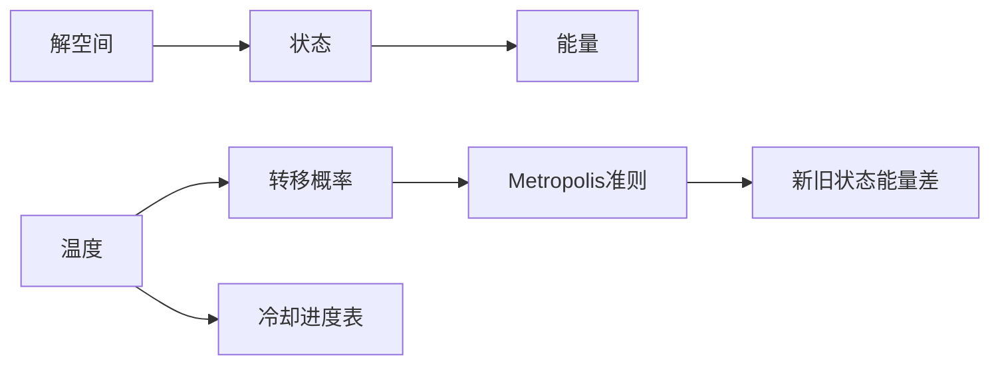

# 模拟退火算法(Simulated Annealing) - 原理与代码实例讲解

## 1.背景介绍
### 1.1 优化问题与启发式算法
在计算机科学和运筹学领域,优化问题是一类非常重要和常见的问题。它要求在给定约束条件下,寻找一个或多个目标函数的最优解。许多实际问题,如生产调度、旅行商问题(TSP)、图着色、电路板布线等都可以抽象为优化问题。

为了高效地解决优化问题,学者们提出了许多启发式算法,如遗传算法、蚁群算法、粒子群算法等。这些算法从自然界的某些现象中获得灵感,模拟这些现象的机理,从而在解空间中寻找最优解。模拟退火算法就是其中一种简单而有效的启发式算法。

### 1.2 模拟退火算法的历史
模拟退火算法(Simulated Annealing,简称SA)最早由Metropolis等人于1953年提出,用于模拟固体退火过程。1983年,Kirkpatrick等人将其引入组合优化领域,成为求解优化问题的一种重要方法。

SA算法的灵感来源于固体退火过程。将固体加热至足够高温,再让其徐徐冷却,最终在低温下各个分子按照能量最小的方式排列,从而得到完美的晶体结构。这个过程中,高温时分子随机移动,温度下降时分子逐渐趋于有序。SA算法模拟了这一过程在解空间中寻优的特点。

### 1.3 模拟退火算法的优缺点
SA算法具有概念简单、适用性广、易于实现等优点。它对初值不敏感,具有一定的"跳出"局部最优的能力,从而更有可能找到全局最优解。同时,SA算法也有一些缺点,如算法参数难以确定,迭代次数多,收敛速度慢等。

## 2.核心概念与联系
### 2.1 解空间与目标函数
对于一个优化问题,由所有可行解组成的集合称为解空间。在解空间中,每个解都对应一个目标函数值,表征该解的优劣程度。优化问题就是要在解空间中找到目标函数最大或最小的解。

### 2.2 状态与能量
SA算法将每个解看作一个状态,状态的好坏用能量来衡量,能量越低状态越好。能量一般就对应于目标函数值。算法从一个初始状态出发,不断迭代,产生新状态,最终收敛到能量最低的状态。

### 2.3 温度与冷却进度表
SA算法引入了温度的概念,用于控制算法的迭代过程。温度从高到低逐渐降低,模拟固体的冷却过程。温度越高,算法越倾向于接受能量差的新状态,从而跳出局部最优。随着温度降低,算法逐渐只接受能量更低的状态,最终稳定在全局最优解上。

冷却进度表决定了温度随迭代次数的下降方式,是SA算法的关键参数之一。常见的冷却进度表有指数型、对数型、幂函数型等。

### 2.4 转移概率与Metropolis准则
在每次迭代中,SA算法从当前状态产生一个新状态。如果新状态能量更低,则必然接受;否则,以一定概率接受。这个概率遵循Metropolis准则:

$P=\exp(-\Delta E/(kT))$

其中,$\Delta E$为新旧状态能量之差,$k$为Boltzmann常数,$T$为当前温度。可见,温度越高,$\Delta E$越大,接受概率越大。这就是SA算法跳出局部最优的机制。

下图展示了SA算法中各个核心概念之间的联系:



## 3.核心算法原理具体操作步骤
### 3.1 算法流程
SA算法的基本流程如下:

1. 初始化:选择初始状态$s_0$,设定初始温度$T_0$,最大迭代次数$L$。
2. 迭代:在当前温度$T$下,进行$L$次状态转移尝试:
   a. 从当前状态$s$出发,产生新状态$s'$。
   b. 计算能量差$\Delta E=E(s')-E(s)$。
   c. 若$\Delta E<0$,接受$s'$作为新状态;否则,以$P=\exp(-\Delta E/(kT))$的概率接受$s'$。
3. 冷却:根据冷却进度表,降低温度$T$。
4. 终止:如果满足终止条件(如温度低于阈值,能量变化小于阈值等),则输出当前状态作为最优解;否则,回到第2步。

### 3.2 关键步骤详解
#### 3.2.1 初始化
初始状态$s_0$可以随机选取,也可以用其他简单算法得到一个较好的可行解作为起点。初始温度$T_0$要足够高,使得绝大多数新状态都能被接受。一般可取$T_0=-\Delta E_{\max}/\ln P_0$,其中$\Delta E_{\max}$为可能的最大能量差,$P_0$为初始接受概率(如0.8)。

#### 3.2.2 产生新状态
新状态的产生方式取决于具体问题。对于排列组合类问题,可以随机交换两个元素;对于函数优化问题,可以在当前解附近随机取点;对于图论问题,可以增删边或节点。新状态要易于计算能量值。

#### 3.2.3 接受准则
Metropolis准则控制了新状态的接受概率。当$\Delta E<0$时必然接受,这保证了算法向着更优的方向前进;当$\Delta E>0$时,以一定概率接受,这使得算法有机会跳出局部最优。概率大小取决于$\Delta E$和$T$,$\Delta E$越大,$T$越低,接受概率越小。

在编程实现中,可以用rand()函数生成一个[0,1]之间的随机数$r$,若$r<\exp(-\Delta E/(kT))$,则接受新状态。

#### 3.2.4 冷却方案
冷却进度表决定了温度$T$随迭代次数$n$的下降方式。常见的冷却方案有:

- 指数冷却:$T(n)=T_0 \cdot \alpha^n$,其中$\alpha$为冷却系数,一般取0.8~0.99。
- 对数冷却:$T(n)=T_0/\log(1+n)$。
- 幂函数冷却:$T(n)=T_0/(1+n)^{\beta}$,其中$\beta$为常数。

不同的冷却方案会影响算法的收敛速度和解的质量。一般来说,温度下降得太快,算法容易陷入局部最优;温度下降得太慢,算法收敛速度会很慢。需要根据具体问题选择合适的冷却方案和参数。

#### 3.2.5 终止条件
常见的终止条件有:

- 温度低于某个阈值(如$10^{-6}$)。
- 连续若干次迭代都没有接受新状态。
- 目标函数值变化小于某个阈值。
- 达到预设的最大迭代次数。

可以根据问题的特点选择一个或多个终止条件。

## 4.数学模型和公式详细讲解举例说明
### 4.1 基本数学模型
设解空间为$S$,目标函数为$f(s)$,则组合优化问题可以表示为:

$$
\min_{s \in S} f(s)
$$

SA算法引入了状态转移概率矩阵$P(T)=[p_{ij}(T)]$,其中$p_{ij}(T)$表示在温度$T$下,从状态$i$转移到状态$j$的概率:

$$
p_{ij}(T)=\begin{cases}
1, & f(j) \leq f(i) \\
\exp\left(-\frac{f(j)-f(i)}{T}\right), & f(j) > f(i)
\end{cases}
$$

可以证明,当$T$趋于0时,$P(T)$收敛到全局最优解。

### 4.2 冷却进度表的数学表示
前面提到了几种常见的冷却进度表,这里给出它们的数学表达式。

设初始温度为$T_0$,第$n$次迭代的温度为$T(n)$,则:

- 指数冷却:
  
$$T(n)=T_0 \cdot \alpha^n, \quad 0<\alpha<1$$

- 对数冷却:

$$T(n)=\frac{T_0}{\log(1+n)}$$

- 幂函数冷却:

$$T(n)=\frac{T_0}{(1+n)^{\beta}}, \quad \beta>0$$

不同的冷却方案会导致不同的收敛速度。一般来说,指数冷却收敛最快,对数冷却最慢,幂函数冷却介于二者之间。但收敛速度快并不意味着解的质量好,需要权衡速度和质量。

### 4.3 收敛性分析
SA算法的收敛性可以用非齐次Markov链来分析。设$\{X_n\}$为SA算法在温度$T(n)$下的状态序列,则$\{X_n\}$是一个非齐次Markov链,其转移概率矩阵为$P(T(n))$。

Geman和Geman证明了,如果冷却进度表满足:

$$
\sum_{n=1}^{\infty} \exp\left(-\frac{\Delta E_{\min}}{T(n)}\right)=\infty
$$

其中$\Delta E_{\min}$为所有可能的状态转移中能量差的最小值,则$\{X_n\}$以概率1收敛到全局最优解。

上述三种冷却进度表都满足这个条件。但在实际应用中,由于迭代次数有限,算法通常在接近最优解时终止,而不是严格收敛到最优解。

### 4.4 举例说明
下面以旅行商问题(TSP)为例,说明SA算法的数学建模过程。

TSP可以定义为:给定$n$个城市和它们之间的距离矩阵$D=[d_{ij}]$,找到一条最短的闭合路径,使得每个城市都被访问一次。

设$s=(s_1,s_2,\cdots,s_n)$为一条路径,其中$s_i$表示第$i$个被访问的城市,则TSP的目标函数可以写为:

$$
f(s)=\sum_{i=1}^{n-1} d_{s_i,s_{i+1}}+d_{s_n,s_1}
$$

在SA算法中,状态$s$对应一条路径,能量$E(s)$对应路径长度$f(s)$。产生新状态的一种常用方法是随机选择两个城市,交换它们在路径中的位置。

假设当前状态为$s=(1,2,3,4,5)$,随机选择城市2和4,交换后得到新状态$s'=(1,4,3,2,5)$。计算能量差:

$$\Delta E=E(s')-E(s)=f(s')-f(s)=(d_{14}+d_{43}+d_{32}+d_{25})-(d_{12}+d_{23}+d_{34}+d_{45})$$

然后根据Metropolis准则,以$\exp(-\Delta E/T)$的概率接受$s'$作为新状态。

重复上述过程,直到满足终止条件,输出当前状态作为最优解。

## 5.项目实践：代码实例和详细解释说明
下面用Python实现SA算法,以TSP为例。

```python
import numpy as np
import matplotlib.pyplot as plt

# 生成城市坐标
def generate_cities(n, seed=None):
    if seed:
        np.random.seed(seed)
    return np.random.rand(n, 2)

# 计算路径长度
def path_length(path, cities):
    length = 0
    for i in range(len(path)):
        length += np.linalg.norm(cities[path[i]] - cities[path[(i+1)%len(path)]])
    return length

# 模拟退火算法
def simulated_annealing(cities, T0, alpha, L, max_iter):
    n = len(cities)
    path = np.arange(n)
    np.random.shuffle(path)
    best_path = path.copy()
    best_length = path_length(path, cities)
    
    T = T0
    for iter in range(max_iter):
        for i in range(