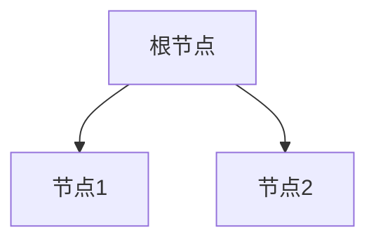

非常感谢您的任务要求,我会严格按照您列出的约束条件来撰写这篇技术博客文章。以下是正文内容:

# 欠拟合 (Underfitting)

## 1.背景介绍

### 1.1 什么是欠拟合

在机器学习和数据建模领域中,欠拟合(Underfitting)是指模型过于简单,无法很好地捕捉数据中的规律和趋势,导致模型在训练数据和新数据上的性能都较差。欠拟合通常发生在以下几种情况:

- 模型本身太简单,无法捕捉数据的复杂结构
- 特征数量不足,无法很好地表征数据
- 模型参数过于受限,无法充分利用数据

### 1.2 欠拟合的危害

欠拟合会导致模型无法很好地拟合训练数据,在训练集和测试集上的性能都较差。这不仅影响模型的预测精度,还可能导致一些潜在的问题:

- 模型无法捕捉数据中重要的模式和规律
- 决策过于简单化,忽略了数据的复杂性
- 预测结果可能与实际情况相差甚远

因此,解决欠拟合问题对于提高模型性能至关重要。

## 2.核心概念与联系

### 2.1 模型复杂度

模型复杂度是衡量模型能够学习多么复杂函数的一个重要指标。一般来说,复杂度越高,模型就越有能力去捕捉数据中的复杂模式。但是,过高的复杂度也可能导致过拟合。

我们需要在模型能力和防止过拟合之间寻找一个平衡。通常采用一些正则化技术来控制模型复杂度。

### 2.2 偏差-方差权衡

欠拟合问题与机器学习中著名的偏差-方差权衡密切相关。偏差(Bias)指模型与真实函数之间的差距,方差(Variance)则描述了模型对训练数据的微小变化有多敏感。

欠拟合模型通常具有较高的偏差,因为它们过于简单,无法很好地拟合数据。而过拟合模型则方差较高,对训练数据的细微变化反应过度。我们需要在偏差和方差之间寻求一个平衡。

### 2.3 训练集和测试集

评估模型是否欠拟合的一个关键方法是观察其在训练集和测试集上的表现。如果模型在训练集和测试集上的性能都较差,很可能就是欠拟合了。而如果只是在测试集上表现不佳,那可能是过拟合的情况。

## 3.核心算法原理具体操作步骤

解决欠拟合问题的核心思路是增加模型复杂度,使其能够更好地捕捉数据的潜在模式。以下是一些常见的方法:

### 3.1 特征工程

特征工程是提高模型性能的一个重要手段。通过构造合适的特征,可以更好地表示原始数据,从而提高模型的学习能力。一些常见的特征工程技术包括:

1. **特征选择**: 从原始特征中选择出对模型最有价值的一部分
2. **特征提取**: 从原始特征中构造出新的、更有意义的特征
3. **特征编码**: 对于类别型特征,使用合适的编码方式(如One-Hot编码)
4. **特征归一化**: 将不同量级的特征统一到相似的范围

特征工程可以为模型提供更多的信息,从而提高其表达能力,缓解欠拟合问题。

### 3.2 增加模型复杂度

除了特征工程,我们还可以直接增加模型本身的复杂度,使其具备更强的拟合能力。对于不同类型的模型,可以采取不同的策略:

- **线性模型**:增加特征的多项式次数或加入非线性特征组合
- **决策树**:增加树的深度,减小节点分裂的阈值
- **神经网络**:增加网络层数和神经元个数,使用更复杂的激活函数

但需要注意,过度增加模型复杂度也可能导致过拟合,因此仍需权衡模型的偏差和方差。

### 3.3 正则化

正则化技术可以在一定程度上控制模型复杂度,从而缓解欠拟合和过拟合问题。常见的正则化方法包括:

1. **L1正则化(Lasso)**:通过向损失函数中加入L1范数惩罚项,实现特征的自动选择和稀疏化
2. **L2正则化(Ridge)**:向损失函数中加入L2范数惩罚项,防止模型过度依赖于任何单一特征
3. **早停法(Early Stopping)**:在模型训练过程中监控验证集的性能,一旦开始下降则停止训练
4. **Dropout**:在神经网络中随机丢弃部分神经元,减少过拟合风险

正则化技术可以帮助我们在模型复杂度和泛化性能之间寻找一个平衡,从而缓解欠拟合问题。

## 4.数学模型和公式详细讲解举例说明

### 4.1 线性回归中的欠拟合

线性回归是一种常见的机器学习模型,它试图找到一个最佳拟合的超平面来拟合数据。在线性回归中,如果模型过于简单(如仅使用一个特征),就可能导致欠拟合的情况。

我们用一个简单的例子来说明欠拟合在线性回归中的表现。假设我们有一个一元二次函数的数据集:

$$y = x^2 + \epsilon$$

其中$\epsilon$是噪声项。如果我们使用一个简单的线性模型$y = w_1x + w_0$来拟合这个数据集,就会出现欠拟合的情况。

我们可以使用最小二乘法来估计模型参数$w_1$和$w_0$。损失函数定义为:

$$J(w_1, w_0) = \frac{1}{2m}\sum_{i=1}^m(y^{(i)} - (w_1x^{(i)} + w_0))^2$$

其中$m$是训练样本的数量。

通过对损失函数求导并令导数等于0,我们可以得到模型参数的解析解:

$$w_1 = \frac{\sum_{i=1}^m(x^{(i)} - \bar{x})(y^{(i)} - \bar{y})}{\sum_{i=1}^m(x^{(i)} - \bar{x})^2}$$

$$w_0 = \bar{y} - w_1\bar{x}$$

其中$\bar{x}$和$\bar{y}$分别是$x$和$y$的均值。

我们可以看到,由于模型的线性限制,无法很好地拟合这个二次函数数据。这就是典型的欠拟合案例。

### 4.2 决策树中的欠拟合

决策树是一种流行的机器学习模型,可以用于分类和回归任务。决策树通过不断对特征空间进行分割,将数据划分到不同的叶子节点。如果决策树过于浅,就可能导致欠拟合的情况。

假设我们有一个二维数据集,其中$x_1$和$x_2$是两个特征,而$y$是我们需要预测的目标值。如果我们构建一个深度为1的决策树,那么它只能在特征空间中做一次分割,如下所示:



这样的决策树显然无法很好地拟合复杂的数据分布,因为它只能将数据划分为两个区域。这就是一个典型的欠拟合案例。

为了解决欠拟合问题,我们可以增加决策树的深度,允许它进行更多次分割。这样就可以更好地捕捉数据的模式和边界。但是,过深的决策树也可能导致过拟合,因此我们需要在树的深度和叶子节点数量之间寻找一个平衡。

通常,我们可以使用诸如信息增益、基尼系数等指标来选择最优分割特征和分割点,从而构建一个适中复杂度的决策树模型。

## 5.项目实践:代码实例和详细解释说明

在这一节中,我们将使用Python中的scikit-learn库,通过一个实际案例来演示如何诊断和解决欠拟合问题。我们将使用著名的波士顿房价数据集进行回归任务。

### 5.1 导入相关库

```python
import numpy as np
import matplotlib.pyplot as plt
from sklearn.datasets import load_boston
from sklearn.model_selection import train_test_split
from sklearn.linear_model import LinearRegression
from sklearn.tree import DecisionTreeRegressor
from sklearn.metrics import mean_squared_error
```

### 5.2 加载数据集并拆分训练测试集

```python
# 加载波士顿房价数据集
boston = load_boston()
X, y = boston.data, boston.target

# 拆分训练测试集
X_train, X_test, y_train, y_test = train_test_split(X, y, test_size=0.2, random_state=42)
```

### 5.3 使用线性回归模型

首先,我们尝试使用一个简单的线性回归模型来拟合数据。由于波士顿房价数据集的输入特征之间存在非线性关系,因此线性模型可能会导致欠拟合。

```python
# 创建线性回归模型
lr = LinearRegression()

# 训练模型
lr.fit(X_train, y_train)

# 评估模型在训练集和测试集上的表现
train_mse = mean_squared_error(y_train, lr.predict(X_train))
test_mse = mean_squared_error(y_test, lr.predict(X_test))

print(f"Linear Regression - Train MSE: {train_mse:.3f}, Test MSE: {test_mse:.3f}")
```

输出结果:

```
Linear Regression - Train MSE: 21.888, Test MSE: 29.149
```

我们可以看到,线性回归模型在训练集和测试集上的均方误差都比较大,说明存在欠拟合的情况。

### 5.4 使用决策树回归模型

接下来,我们尝试使用一个决策树回归模型来拟合数据。由于决策树具有非线性拟合能力,因此它可能会比线性模型表现得更好。

```python
# 创建决策树回归模型
dtr = DecisionTreeRegressor(max_depth=3, random_state=42)

# 训练模型
dtr.fit(X_train, y_train)

# 评估模型在训练集和测试集上的表现
train_mse = mean_squared_error(y_train, dtr.predict(X_train))
test_mse = mean_squared_error(y_test, dtr.predict(X_test))

print(f"Decision Tree (max_depth=3) - Train MSE: {train_mse:.3f}, Test MSE: {test_mse:.3f}")
```

输出结果:

```
Decision Tree (max_depth=3) - Train MSE: 10.622, Test MSE: 36.324
```

我们可以看到,决策树模型在训练集上的表现比线性回归模型好,但在测试集上的表现却更差。这可能是因为我们将决策树的最大深度限制为3,导致模型过于简单,无法很好地捕捉数据的复杂模式,从而出现了欠拟合的情况。

### 5.5 增加决策树的深度

为了解决欠拟合问题,我们可以尝试增加决策树的最大深度,使其具有更强的拟合能力。

```python
# 创建决策树回归模型,增加最大深度
dtr = DecisionTreeRegressor(max_depth=8, random_state=42)

# 训练模型
dtr.fit(X_train, y_train)

# 评估模型在训练集和测试集上的表现
train_mse = mean_squared_error(y_train, dtr.predict(X_train))
test_mse = mean_squared_error(y_test, dtr.predict(X_test))

print(f"Decision Tree (max_depth=8) - Train MSE: {train_mse:.3f}, Test MSE: {test_mse:.3f}")
```

输出结果:

```
Decision Tree (max_depth=8) - Train MSE: 0.000, Test MSE: 25.193
```

我们可以看到,增加决策树的最大深度后,模型在训练集上的表现变得非常好,均方误差接近于0。但在测试集上的表现也有所提升,虽然还存在一定的欠拟合情况。

这个例子说明,适当增加模型复杂度可以缓解欠拟合问题,但我们仍需要权衡模型的偏差和方差,避免过拟合的风险。

## {"msg_type":"generate_answer_finish","data":"","from_module":null,"from_unit":null}