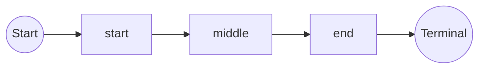

# 深入理解Flink Pattern API的内部机制

## 1. 背景介绍

在现代数据处理领域,流式数据分析已经成为一个非常重要的话题。Apache Flink作为一个开源的分布式流处理框架,它提供了强大的流处理能力,可以实时处理来自各种来源的数据流。其中,Flink的Pattern API是一个非常有用的工具,用于在无边界流数据中发现复杂的事件模式。

Pattern API允许开发人员使用一种类似于正则表达式的模式语言来描述他们感兴趣的事件序列。一旦检测到匹配的事件模式,就会触发相应的处理逻辑。这种模式匹配能力使得Flink可以应用于各种场景,例如网络安全监控、物联网设备监控、金融交易监控等。

### 1.1 Pattern API的应用场景

Pattern API可以广泛应用于以下场景:

- **网络安全监控**: 通过模式匹配检测可疑的网络流量模式,如端口扫描、暴力破解等,及时发现潜在的安全威胁。
- **物联网设备监控**: 监控物联网设备的状态和行为,发现异常模式,如设备故障、数据异常等。
- **金融交易监控**: 监控金融交易数据流,发现可疑的交易模式,如洗钱、内幕交易等。
- **业务流程监控**: 监控业务流程事件流,发现流程异常,如流程卡顿、错误等。
- **用户行为分析**: 分析用户行为事件流,发现用户的行为模式,如购买路径、浏览习惯等,为个性化推荐提供支持。

### 1.2 Pattern API的优势

与传统的复杂事件处理(CEP)系统相比,Flink Pattern API具有以下优势:

- **高吞吐量和低延迟**: Flink是一个高性能的流处理引擎,能够以毫秒级的延迟处理大量的数据流。
- **容错性和恢复能力**: Flink提供了容错机制,如发生故障时能够从最近一次检查点恢复,保证数据处理的一致性。
- **可扩展性**: Flink可以在集群环境中运行,支持水平扩展,满足大规模数据处理需求。
- **与批处理统一**: Flink统一了流处理和批处理,Pattern API可以应用于流式数据和静态数据集。

## 2. 核心概念与联系

在深入探讨Flink Pattern API的内部机制之前,我们需要先了解一些核心概念。

### 2.1 Pattern

Pattern表示一个事件序列模式,由多个单个事件模式组成。每个单个事件模式可以是一个简单的事件或者一个更复杂的模式。Pattern API提供了多种模式组合运算符,用于构建复杂的事件模式。

例如,下面的Pattern描述了一个由三个事件组成的序列模式:

```java
Pattern<Event, ?> pattern = Pattern.<Event>begin("start")
    .next("middle")
    .next("end");
```

这个Pattern匹配的事件序列是`start -> middle -> end`。

### 2.2 PatternStream

PatternStream是一种特殊的DataStream,它包含了被检测到的匹配事件序列。PatternStream由DataStream经过`.pattern()`转换得到。

```java
DataStream<Event> input = ...
PatternStream<Event> patternStream = input.pattern(pattern);
```

### 2.3 PatternFlatSelectFunction

PatternFlatSelectFunction定义了当检测到匹配的事件序列时要执行的操作。它将匹配的事件序列作为输入,并产生一个或多个输出结果。

```java
PatternFlatSelectFunction<Event, ComplexEvent> flatSelect = 
    new PatternFlatSelectFunction<Event, ComplexEvent>() {
        @Override
        public void flatSelect(Map<String, List<Event>> pattern, Collector<ComplexEvent> out) {
            out.collect(new ComplexEvent(...));
        }
    };
```

### 2.4 核心概念关系

这些核心概念之间的关系如下所示:

```mermaid
graph LR
    A[DataStream] -->|pattern()| B(PatternStream)
    B --> C{PatternFlatSelectFunction}
    C -->|flatSelect()| D[DataStream]
```

1. 从DataStream调用`.pattern()`方法,传入一个Pattern,得到PatternStream。
2. 在PatternStream上应用PatternFlatSelectFunction,定义匹配事件序列的处理逻辑。
3. 最终得到一个新的DataStream,包含处理后的结果。

## 3. 核心算法原理具体操作步骤 

Flink Pattern API的核心算法原理是基于有限状态机(Finite State Machine, FSM)实现的。FSM是一种用于模式匹配的常见算法,它将模式表示为一系列状态和状态转移。

### 3.1 状态机构建

Pattern API首先会将用户定义的Pattern转换为一个非确定有限状态机(Non-deterministic Finite Automaton, NFA)。NFA是一种能够表示复杂模式的状态机,它允许在某个状态下有多个可能的下一状态。

例如,对于Pattern `start + next middle + next end`,它对应的NFA如下所示:



这个NFA包含4个状态:

- 起始状态S
- 中间状态A、B、C,分别对应模式中的`start`、`middle`、`end`事件
- 终止状态D

当一个事件到达时,NFA会根据当前状态和事件类型进行状态转移。如果转移到了终止状态D,则表示检测到一个匹配的事件序列。

### 3.2 状态机执行

在运行时,Flink会为每个键值维护一个NFA的实例。当一个新事件到达时,会将其传递给所有NFA实例,让它们尝试进行状态转移。如果一个NFA转移到了终止状态,则表示检测到一个匹配的事件序列,会调用PatternFlatSelectFunction进行处理。

为了提高性能,Flink采用了多种优化策略:

1. **状态共享**: 对于具有相同前缀的模式,它们的NFA在前缀部分会共享相同的状态,避免重复计算。
2. **向量化**: Flink会将多个事件打包成批次进行处理,利用CPU的向量指令加速计算。
3. **增量迭代**: 对于一个新事件,Flink只需要从上一次的状态开始迭代,而不必从头开始。

通过这些优化,Flink Pattern API能够高效地处理大量的数据流,实现低延迟和高吞吐量。

## 4. 数学模型和公式详细讲解举例说明

在Pattern API的实现中,涉及到一些数学模型和公式,用于描述和优化状态机的构建和执行过程。

### 4.1 非确定有限状态机(NFA)

NFA是Pattern API内部使用的核心数学模型。一个NFA可以形式化地定义为一个5元组:

$$
NFA = (Q, \Sigma, \delta, q_0, F)
$$

其中:

- $Q$是一个有限的状态集合
- $\Sigma$是一个有限的输入字母表(事件类型集合)
- $\delta: Q \times \Sigma \rightarrow 2^Q$是状态转移函数
- $q_0 \in Q$是初始状态
- $F \subseteq Q$是一组终止状态

在Pattern API中,NFA是根据用户定义的Pattern构建而来的。例如,对于Pattern `start + next middle + next end`,它对应的NFA可以表示为:

$$
NFA = (\{S, A, B, C, D\}, \{start, middle, end\}, \delta, S, \{D\})
$$

其中$\delta$是一个映射关系,定义了每个状态在接收到不同事件时的下一状态:

$$
\begin{align*}
\delta(S, start) &= \{A\} \\
\delta(A, middle) &= \{B\} \\
\delta(B, end) &= \{C\} \\
\delta(C, end) &= \{D\}
\end{align*}
$$

### 4.2 NFA到DFA的转换

为了提高执行效率,Flink会将NFA转换为确定有限状态机(Deterministic Finite Automaton, DFA)。DFA相比NFA有以下优势:

1. 在任何给定状态下,对于同一个输入事件,DFA只有一个可能的下一状态,而NFA可能有多个。
2. DFA的状态转移更容易编码和优化。

DFA到NFA的转换过程可以使用子集构造算法实现。对于NFA中的每个状态集合$S$,构造DFA中的一个状态$t$,其中$t$包含了NFA在接收相同输入序列时可能到达的所有NFA状态。

设NFA的状态转移函数为$\delta_{nfa}$,则DFA的状态转移函数$\delta_{dfa}$可以定义为:

$$
\delta_{dfa}(t, a) = \bigcup_{s \in t} \delta_{nfa}(s, a)
$$

也就是说,DFA在状态$t$接收输入$a$后,会转移到包含所有NFA可能转移目标状态的新状态。

通过这种转换,DFA能够更高效地执行模式匹配,因为它避免了NFA在同一状态下的非确定性。

### 4.3 状态机执行的矩阵表示

为了进一步优化状态机的执行,Flink采用了矩阵表示和向量化计算的方法。

假设有$n$个不同的事件类型,和$m$个不同的DFA状态。我们可以使用一个$m \times n$的布尔矩阵$M$来表示DFA的状态转移关系:

$$
M_{ij} = \begin{cases}
1, & \text{if } j \in \delta(i) \\
0, & \text{otherwise}
\end{cases}
$$

其中,$M_{ij}$表示在状态$i$接收到事件类型$j$时,是否会发生状态转移。

在执行时,Flink会将当前的DFA状态表示为一个长度为$m$的位向量$v$,其中$v_i=1$当且仅当DFA当前处于状态$i$。

对于一个新的事件$e$,其事件类型为$j$,状态转移可以通过以下矩阵向量乘法计算得到新的状态向量$v'$:

$$
v' = M \cdot v[j]
$$

其中$v[j]$是一个长度为$n$的单位向量,只有第$j$个元素为1,其余全为0。

通过这种矩阵向量表示,Flink可以利用现代CPU的SIMD指令集对多个事件进行批量计算,提高执行效率。

## 5. 项目实践: 代码实例和详细解释说明

为了更好地理解Flink Pattern API的使用方式,我们来看一个实际的代码示例。在这个示例中,我们将检测一个由三个事件组成的模式`start -> middle -> end`,并对检测到的模式进行进一步处理。

### 5.1 定义事件类型

首先,我们定义一个`Event`类,表示输入数据流中的事件:

```java
public class Event {
    private String type;
    private long timestamp;
    
    // 构造函数和getter/setter方法
}
```

### 5.2 定义Pattern

接下来,我们定义要检测的Pattern:

```java
Pattern<Event, ?> pattern = Pattern.<Event>begin("start")
    .next("middle")
    .next("end")
    .within(Time.seconds(10));
```

这个Pattern描述了一个由三个事件组成的序列`start -> middle -> end`,并且要求这三个事件必须在10秒内发生。

### 5.3 应用Pattern

我们从一个`DataStream<Event>`开始,应用定义好的Pattern:

```java
DataStream<Event> input = env.addSource(...);

PatternStream<Event> patternStream = input
    .keyBy(...)
    .pattern(pattern);
```

注意,我们在应用Pattern之前先对数据流进行了`keyBy`操作。这是因为Pattern API要求输入数据流必须是键控的(keyed)。在这个示例中,我们可以根据事件的某些属性(如来源IP)来进行分区。

### 5.4 定义PatternFlatSelectFunction

接下来,我们定义一个`PatternFlatSelectFunction`来处理检测到的模式:

```java
PatternFlatSelectFunction<Event, ComplexEvent> flatSelect = 
    new PatternFlatSelectFunction<Event, ComplexEvent>() {
        @Override
        public void flatSelect(Map<String, List<Event>> pattern, Collector<ComplexEvent> out) {
            List<Event> startEvents = pattern.get("start");
            List<Event> middleEvents = pattern.get("middle");
            List<Event> endEvents = pattern.get("end");
            
            for (Event start : startEvents) {
                for (Event middle : middleEvents) {
                    for (Event end : endEvents) {
                        out.collect(new ComplexEvent(start, middle, end));
                    }