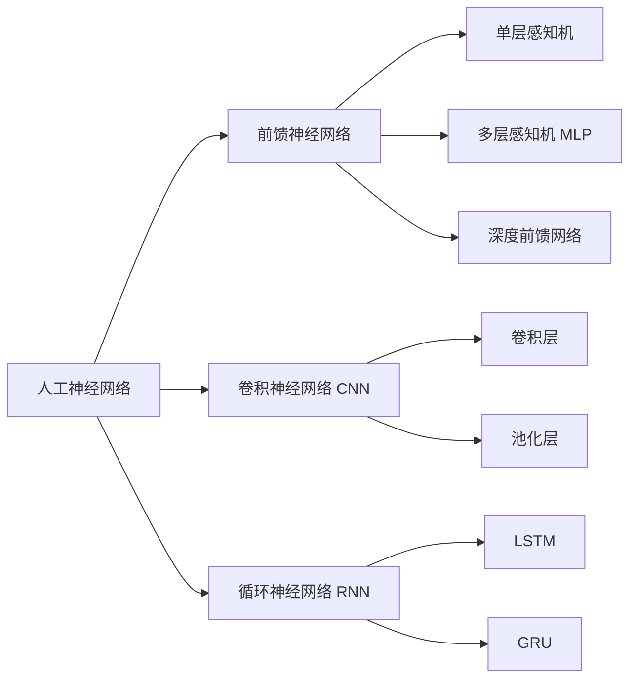

# 深度学习(Deep Learning) - 原理与代码实例讲解

## 1. 背景介绍
### 1.1 人工智能与机器学习的发展历程
#### 1.1.1 人工智能的起源与发展
#### 1.1.2 机器学习的兴起
#### 1.1.3 深度学习的崛起

### 1.2 深度学习的定义与特点  
#### 1.2.1 深度学习的定义
#### 1.2.2 深度学习与传统机器学习的区别
#### 1.2.3 深度学习的优势与局限性

### 1.3 深度学习的应用领域
#### 1.3.1 计算机视觉
#### 1.3.2 自然语言处理
#### 1.3.3 语音识别
#### 1.3.4 其他应用领域

## 2. 核心概念与联系
### 2.1 人工神经网络
#### 2.1.1 神经元模型
#### 2.1.2 激活函数
#### 2.1.3 网络结构

### 2.2 前馈神经网络
#### 2.2.1 单层感知机
#### 2.2.2 多层感知机(MLP)
#### 2.2.3 深度前馈网络

### 2.3 卷积神经网络(CNN)
#### 2.3.1 卷积层
#### 2.3.2 池化层  
#### 2.3.3 CNN的典型结构

### 2.4 循环神经网络(RNN)
#### 2.4.1 RNN的基本结构
#### 2.4.2 长短期记忆网络(LSTM) 
#### 2.4.3 门控循环单元(GRU)

### 2.5 深度学习中的关键概念
#### 2.5.1 损失函数
#### 2.5.2 优化算法
#### 2.5.3 正则化技术
#### 2.5.4 超参数调优



## 3. 核心算法原理具体操作步骤
### 3.1 反向传播算法(Backpropagation)
#### 3.1.1 算法原理
#### 3.1.2 具体步骤
#### 3.1.3 梯度消失与梯度爆炸问题

### 3.2 随机梯度下降(SGD)
#### 3.2.1 批量梯度下降
#### 3.2.2 随机梯度下降
#### 3.2.3 小批量梯度下降  

### 3.3 优化算法
#### 3.3.1 动量(Momentum)
#### 3.3.2 自适应学习率(AdaGrad, RMSProp)
#### 3.3.3 Adam优化器

### 3.4 正则化技术
#### 3.4.1 L1和L2正则化
#### 3.4.2 Dropout
#### 3.4.3 早停法(Early Stopping)

## 4. 数学模型和公式详细讲解举例说明
### 4.1 神经元模型与激活函数
#### 4.1.1 感知机模型
$$ f(x) = \begin{cases} 1 & \text{if } w \cdot x + b > 0 \\ 0 & \text{otherwise} \end{cases} $$

#### 4.1.2 Sigmoid激活函数
$$ \sigma(x) = \frac{1}{1+e^{-x}} $$

#### 4.1.3 ReLU激活函数  
$$ f(x) = \max(0, x) $$

### 4.2 损失函数
#### 4.2.1 均方误差(MSE)
$$ J(\theta) = \frac{1}{2m} \sum_{i=1}^m (h_\theta(x^{(i)}) - y^{(i)})^2 $$

#### 4.2.2 交叉熵损失(Cross-entropy)
$$ J(\theta) = -\frac{1}{m} \sum_{i=1}^m [y^{(i)} \log h_\theta(x^{(i)}) + (1-y^{(i)}) \log (1-h_\theta(x^{(i)}))] $$

### 4.3 反向传播算法推导
#### 4.3.1 单层感知机的反向传播
#### 4.3.2 多层感知机的反向传播
$$ \delta^{(l)} = ((\theta^{(l)})^T \delta^{(l+1)}) \odot \sigma'(z^{(l)}) $$

### 4.4 正则化技术的数学表示
#### 4.4.1 L1正则化
$$ J(\theta) = J(\theta) + \lambda \sum_{i=1}^n |\theta_i| $$

#### 4.4.2 L2正则化
$$ J(\theta) = J(\theta) + \frac{\lambda}{2} \sum_{i=1}^n \theta_i^2 $$

## 5. 项目实践：代码实例和详细解释说明
### 5.1 基于Keras的手写数字识别
#### 5.1.1 数据集介绍(MNIST)
#### 5.1.2 模型构建
```python
model = Sequential()
model.add(Conv2D(32, kernel_size=(3, 3), activation='relu', input_shape=input_shape))
model.add(Conv2D(64, (3, 3), activation='relu'))
model.add(MaxPooling2D(pool_size=(2, 2)))
model.add(Dropout(0.25))
model.add(Flatten())
model.add(Dense(128, activation='relu'))
model.add(Dropout(0.5))
model.add(Dense(num_classes, activation='softmax'))
```
#### 5.1.3 模型训练与评估
```python
model.compile(loss=keras.losses.categorical_crossentropy,
              optimizer=keras.optimizers.Adadelta(),
              metrics=['accuracy'])

model.fit(x_train, y_train,
          batch_size=batch_size,
          epochs=epochs,
          verbose=1,
          validation_data=(x_test, y_test))
```

### 5.2 基于PyTorch的情感分类
#### 5.2.1 数据集介绍(IMDB)
#### 5.2.2 模型构建
```python
class LSTMModel(nn.Module):
    def __init__(self, vocab_size, embed_dim, hidden_dim, output_dim, n_layers, bidirectional, dropout):
        super().__init__()
        self.embedding = nn.Embedding(vocab_size, embed_dim)
        self.lstm = nn.LSTM(embed_dim, hidden_dim, num_layers=n_layers, bidirectional=bidirectional, dropout=dropout)
        self.fc = nn.Linear(hidden_dim*2, output_dim)
        self.dropout = nn.Dropout(dropout)
        
    def forward(self, text):
        embedded = self.dropout(self.embedding(text))
        output, (hidden, cell) = self.lstm(embedded)
        hidden = self.dropout(torch.cat((hidden[-2,:,:], hidden[-1,:,:]), dim=1))
        return self.fc(hidden)
```
#### 5.2.3 模型训练与评估
```python
criterion = nn.BCEWithLogitsLoss()
optimizer = optim.Adam(model.parameters())

for epoch in range(num_epochs):
    for batch in train_iterator:
        optimizer.zero_grad()
        predictions = model(batch.text).squeeze(1)
        loss = criterion(predictions, batch.label)
        loss.backward()
        optimizer.step()
```

## 6. 实际应用场景
### 6.1 图像分类
#### 6.1.1 应用背景
#### 6.1.2 技术实现
#### 6.1.3 应用案例

### 6.2 目标检测
#### 6.2.1 应用背景  
#### 6.2.2 技术实现
#### 6.2.3 应用案例

### 6.3 语音识别
#### 6.3.1 应用背景
#### 6.3.2 技术实现  
#### 6.3.3 应用案例

### 6.4 自然语言处理
#### 6.4.1 应用背景
#### 6.4.2 技术实现
#### 6.4.3 应用案例

## 7. 工具和资源推荐
### 7.1 深度学习框架
#### 7.1.1 TensorFlow
#### 7.1.2 PyTorch
#### 7.1.3 Keras

### 7.2 GPU加速库
#### 7.2.1 CUDA
#### 7.2.2 cuDNN

### 7.3 数据集资源
#### 7.3.1 ImageNet
#### 7.3.2 COCO
#### 7.3.3 WordNet
#### 7.3.4 Penn Treebank

### 7.4 预训练模型
#### 7.4.1 VGG
#### 7.4.2 ResNet
#### 7.4.3 BERT
#### 7.4.4 GPT

## 8. 总结：未来发展趋势与挑战
### 8.1 深度学习的发展趋势
#### 8.1.1 模型的轻量化
#### 8.1.2 自监督学习
#### 8.1.3 跨模态学习
#### 8.1.4 图神经网络

### 8.2 深度学习面临的挑战
#### 8.2.1 可解释性
#### 8.2.2 数据隐私与安全
#### 8.2.3 模型的鲁棒性
#### 8.2.4 计算资源需求

### 8.3 深度学习的未来展望
#### 8.3.1 人工智能的普及应用
#### 8.3.2 人机协作
#### 8.3.3 通用人工智能的可能性

## 9. 附录：常见问题与解答
### 9.1 如何选择合适的激活函数？
### 9.2 如何解决过拟合问题？
### 9.3 如何加速模型的训练过程？
### 9.4 如何处理不平衡数据集？
### 9.5 如何进行超参数调优？

深度学习作为人工智能领域的一个重要分支，在近年来取得了飞速的发展。它通过构建多层次的神经网络模型，实现了对复杂数据的高效表示和学习。深度学习的出现，极大地推动了计算机视觉、自然语言处理、语音识别等领域的进步，使得许多曾经被认为难以解决的问题得到了有效的解决方案。

本文从背景介绍出发，系统地阐述了深度学习的核心概念和关键技术。我们详细讲解了人工神经网络的基本原理，包括前馈神经网络、卷积神经网络和循环神经网络等经典模型。同时，我们还深入探讨了深度学习中的关键算法，如反向传播算法、随机梯度下降等优化方法，以及正则化技术等防止过拟合的策略。

在理论基础之上，我们进一步通过代码实例，演示了如何利用深度学习框架如Keras和PyTorch，构建和训练深度学习模型，并将其应用于手写数字识别、情感分类等实际任务中。这些代码案例可以帮助读者更直观地理解深度学习的实现过程，提供了宝贵的实践参考。

此外，我们还总结了深度学习在图像分类、目标检测、语音识别、自然语言处理等领域的应用情况，展示了深度学习技术的强大威力和广阔前景。同时，我们也梳理了深度学习相关的工具和资源，包括主流的深度学习框架、GPU加速库、常用数据集和预训练模型等，为读者提供了全面的参考信息。

展望未来，深度学习技术仍将持续快速发展。模型的轻量化、自监督学习、跨模态学习、图神经网络等新兴方向，有望进一步拓展深度学习的应用边界。然而，深度学习也面临着可解释性差、对数据和计算资源要求高等挑战。这需要研究者们继续攻坚克难，推动深度学习技术的不断进步。

总之，深度学习是人工智能的核心驱动力，它为我们认识世界、改变世界提供了全新的思路和方法。相信通过产学研各界的共同努力，深度学习必将在更广阔的领域释放出巨大的潜力，为人类社会的发展做出更大的贡献。

作者：禅与计算机程序设计艺术 / Zen and the Art of Computer Programming