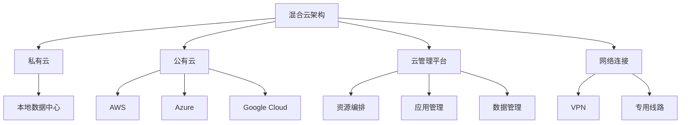
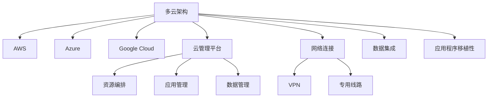

# 混合云与多云部署原理与代码实战案例讲解

## 1.背景介绍

随着云计算技术的不断发展和企业对灵活性、可扩展性和成本优化的需求日益增长,混合云和多云部署模式逐渐成为主流趋势。混合云是指将传统的本地数据中心与公有云服务相结合的部署模式,而多云则是指在多个不同的云服务提供商之间分布部署应用和数据。

企业采用混合云和多云架构的主要原因包括:

1. **灵活性和敏捷性**: 混合云和多云架构允许企业根据业务需求灵活地选择最佳的云服务提供商和部署模式,快速响应市场变化。

2. **成本优化**: 通过在私有云和公有云之间合理分配工作负载,企业可以优化资源利用率,降低总体运营成本。

3. **数据主权和合规性**: 某些行业或地区对数据存储和处理有严格的合规性要求,混合云和多云架构可以帮助企业满足这些要求。

4. **业务连续性和灾难恢复**: 通过在多个云服务提供商之间分布部署关键应用和数据,企业可以提高系统的可用性和容错能力。

5. **避免供应商锁定**: 采用多云策略可以防止企业被单一云服务提供商所锁定,从而获得更大的谈判能力和灵活性。

然而,混合云和多云部署也带来了一些挑战,如数据和应用程序集成、治理和安全性管理、云资源管理和成本控制等。因此,企业需要采用合适的架构、工具和最佳实践来解决这些挑战。

## 2.核心概念与联系

### 2.1 混合云

混合云是指将传统的本地数据中心(私有云)与公有云服务相结合的部署模式。在这种架构中,企业可以根据业务需求和安全性、合规性等要求,将不同的工作负载分配到本地数据中心或公有云上运行。

混合云架构通常包括以下几个核心组件:

- **私有云**: 企业内部的数据中心,由企业自己管理和维护。
- **公有云**: 由云服务提供商(如AWS、Azure、Google Cloud)提供的云资源。
- **云管理平台**: 用于管理和编排跨私有云和公有云的资源、应用程序和数据。
- **网络连接**: 通过高速、安全的网络连接(如VPN、专用线路)将私有云和公有云连接起来。

混合云架构的优势在于,企业可以根据需求灵活地选择将工作负载部署在私有云或公有云上,从而实现成本优化、提高灵活性和满足合规性要求。

### 2.2 多云

多云是指在多个不同的云服务提供商之间分布部署应用程序和数据的策略。与单一云服务提供商相比,多云架构可以带来更高的灵活性、可用性和成本优化。

多云架构通常包括以下几个核心组件:

- **多个公有云**: 来自不同云服务提供商(如AWS、Azure、Google Cloud)的公有云资源。
- **云管理平台**: 用于管理和编排跨多个公有云的资源、应用程序和数据。
- **网络连接**: 通过高速、安全的网络连接(如VPN、专用线路)将多个公有云连接起来。
- **数据集成**: 实现跨多个云环境的数据集成和同步。
- **应用程序移植性**: 确保应用程序可以在不同的云环境之间无缝迁移。

多云架构的优势在于,企业可以根据需求选择最佳的云服务提供商,避免被单一供应商所锁定。同时,通过在多个云环境之间分布部署关键应用程序和数据,可以提高系统的可用性和容错能力。

### 2.3 混合云与多云的联系

混合云和多云是密切相关的概念,它们都旨在为企业提供更加灵活、可扩展和成本优化的IT基础设施。

- 混合云架构通常是多云架构的基础,因为它将私有云与一个或多个公有云结合在一起。
- 多云架构可以建立在混合云架构之上,将应用程序和数据分布在多个不同的公有云服务提供商之间。
- 两者都需要统一的云管理平台,用于管理和编排跨多个云环境的资源、应用程序和数据。
- 数据集成和应用程序移植性是两者都需要解决的关键挑战。

因此,混合云和多云部署模式并不是相互排斥的,而是可以相互补充和结合使用的。企业可以根据自身的业务需求和IT战略,选择合适的混合云和多云架构,以实现最佳的灵活性、可扩展性和成本优化。

## 3.核心算法原理具体操作步骤

在混合云和多云环境中,实现资源编排、应用程序部署和数据管理等关键功能需要一些核心算法和原理。以下是一些常见的算法原理和具体操作步骤:

### 3.1 资源调度算法

资源调度算法用于在多个云环境之间合理分配和调度计算、存储和网络资源,以满足应用程序的需求并优化资源利用率。常见的资源调度算法包括:

1. **基于约束的调度算法**:根据资源约束条件(如CPU、内存、存储等)选择合适的云资源。
2. **基于成本优化的调度算法**:根据资源成本和应用程序需求,选择成本最优的云资源。
3. **基于负载均衡的调度算法**:将工作负载均匀分布到多个云资源上,以提高系统的可扩展性和可用性。

资源调度算法的具体操作步骤如下:

1. 收集应用程序的资源需求信息,包括CPU、内存、存储、网络带宽等。
2. 收集各个云环境的资源信息,包括可用资源、资源成本、性能指标等。
3. 根据预定义的调度策略(如成本优化、负载均衡等),选择合适的云资源。
4. 将应用程序部署到选定的云资源上。
5. 持续监控资源利用情况,根据需要进行资源扩缩容或迁移。

### 3.2 应用程序部署算法

应用程序部署算法用于在混合云和多云环境中自动化地部署和管理应用程序。常见的应用程序部署算法包括:

1. **基于容器的部署算法**:利用容器技术(如Docker、Kubernetes)实现应用程序的快速部署和扩缩容。
2. **基于微服务的部署算法**:将应用程序拆分为多个微服务,并在不同的云环境中部署和管理这些微服务。
3. **基于蓝绿部署的算法**:通过创建两个相同的环境(蓝环境和绿环境),实现无缝的应用程序升级和回滚。

应用程序部署算法的具体操作步骤如下:

1. 收集应用程序的部署需求,包括运行环境、依赖关系、配置参数等。
2. 准备应用程序的部署包,包括代码、配置文件、依赖库等。
3. 根据预定义的部署策略(如蓝绿部署、滚动升级等),选择合适的云资源。
4. 在选定的云资源上部署应用程序,包括创建容器或虚拟机、配置网络和存储等。
5. 验证应用程序的正确运行,并进行必要的测试和监控。
6. 根据需要进行应用程序的扩缩容、升级或回滚操作。

### 3.3 数据管理算法

在混合云和多云环境中,数据管理是一个关键挑战。常见的数据管理算法包括:

1. **数据复制算法**:将数据复制到多个云环境中,以提高数据的可用性和容错能力。
2. **数据分片算法**:将数据分割成多个分片,并分布式存储在不同的云环境中。
3. **数据迁移算法**:在不同的云环境之间安全地迁移数据,同时保证数据的一致性和完整性。

数据管理算法的具体操作步骤如下:

1. 收集数据的存储需求,包括数据量、访问模式、安全性和合规性要求等。
2. 选择合适的数据存储方案,如关系型数据库、NoSQL数据库、对象存储等。
3. 根据预定义的数据管理策略(如数据复制、分片或迁移),在不同的云环境中部署和配置数据存储组件。
4. 实现数据的复制、分片或迁移操作,确保数据的一致性和完整性。
5. 监控数据存储的性能和可用性,根据需要进行扩缩容或迁移操作。
6. 实现数据的备份和恢复机制,以防止数据丢失或损坏。

## 4.数学模型和公式详细讲解举例说明

在混合云和多云环境中,数学模型和公式可以用于优化资源调度、应用程序部署和数据管理等关键任务。以下是一些常见的数学模型和公式:

### 4.1 资源调度优化模型

资源调度优化模型旨在最小化资源成本或最大化资源利用率,同时满足应用程序的资源需求和服务质量约束。

假设有 $n$ 个应用程序需要部署,每个应用程序 $i$ 需要 $r_i$ 个CPU核心、$m_i$ 个GB内存和 $s_i$ 个GB存储空间。另外,有 $k$ 个云环境可供选择,每个云环境 $j$ 提供 $C_j$ 个CPU核心、$M_j$ 个GB内存和 $S_j$ 个GB存储空间,成本分别为 $c_j^{CPU}$、$c_j^{mem}$ 和 $c_j^{stor}$。

我们可以定义以下整数线性规划模型:

$$
\begin{aligned}
\text{minimize} \quad & \sum_{j=1}^k \left(c_j^{CPU} \sum_{i=1}^n x_{ij}r_i + c_j^{mem} \sum_{i=1}^n x_{ij}m_i + c_j^{stor} \sum_{i=1}^n x_{ij}s_i\right) \\
\text{subject to} \quad & \sum_{j=1}^k x_{ij} = 1, \quad \forall i \in \{1, \ldots, n\} \\
& \sum_{i=1}^n x_{ij}r_i \leq C_j, \quad \forall j \in \{1, \ldots, k\} \\
& \sum_{i=1}^n x_{ij}m_i \leq M_j, \quad \forall j \in \{1, \ldots, k\} \\
& \sum_{i=1}^n x_{ij}s_i \leq S_j, \quad \forall j \in \{1, \ldots, k\} \\
& x_{ij} \in \{0, 1\}, \quad \forall i \in \{1, \ldots, n\}, \forall j \in \{1, \ldots, k\}
\end{aligned}
$$

其中,决策变量 $x_{ij}$ 表示应用程序 $i$ 是否部署在云环境 $j$ 上(1表示部署,0表示不部署)。目标函数是最小化总成本,约束条件包括:

1. 每个应用程序只能部署在一个云环境中。
2. 每个云环境的CPU、内存和存储资源使用量不能超过其容量。

通过求解上述整数线性规划模型,我们可以得到最优的资源调度方案,从而实现成本最小化或资源利用率最大化。

###